# 第 1 章：为什么具身智能不是“机器人 + 大模型”

本章是全书的起点。它不急着教你安装 ROS2，也不急着让你训练一个策略模型，而是先回答一个更基础的问题：当我们说“转向具身智能”时，到底应该转向什么？

很多工程师第一次接触具身智能，会自然地把它理解成下面这个公式：

```text
具身智能 = 机器人硬件 + 大语言模型
```

这个理解有一定直觉基础，但如果把它当成工程路线，就会很危险。因为真正让机器人完成任务的，不是机器人能不能“聊天”，而是它能不能在真实物理环境中观察、判断、行动、反馈、纠错，并在失败之后形成下一轮数据改进。

本书的核心目标不是带你追逐一个宏大的概念，而是让你从一个可控的小任务开始，建立完整的数据闭环能力：任务定义、数据采集、策略训练、评测、失败回收和场景扩展。你最终要形成的能力，不是“知道很多具身智能名词”，而是能把一个机器人任务拆成可采集、可训练、可评测、可迭代的工程系统。

本章会先纠正常见误解，再建立全书的主线项目：`robot-learning-shelf-demo`。这个项目从一个桌面小盒子抓取任务开始，逐步扩展到商品扶正和简易货架理货任务。

---

## 1. 本章要解决的问题

本章要解决五个问题。

第一，为什么具身智能不是简单的“机器人 + 大模型”？

第二，传统机器人、自动驾驶、LLM Agent 和具身智能到底有什么区别？

第三，为什么 VLA，也就是 Vision-Language-Action 模型，重点不是语言本身，而是从视觉、语言、状态到动作的映射？

第四，为什么家务机器人虽然长期空间很大，但不适合作为普通工程师的第一个切入任务？为什么理货、仓储、工厂辅助和移动操作机器人更适合作为学习与职业转型入口？

第五，本书为什么选择“桌面/货架理货机器人模仿学习闭环 Demo”作为主线项目？

这几个问题看似偏认知，但它们直接决定后面 90 天的学习路径。如果一开始把方向理解错，后续就很容易陷入两类误区：一种是只看论文和大模型发布，觉得自己做不了；另一种是只做机械臂小 demo，忽略数据、评测和失败回收，最后无法形成可迁移的工程能力。

本书要避免这两种极端。我们既不假装可以在个人条件下复现 GR00T、Gemini Robotics、π0 这类大模型，也不满足于写几个机械臂脚本然后录一段成功视频。我们要做的是更适合个人工程师的中间路线：围绕一个小任务，把机器人学习最重要的数据闭环跑通。

---

## 2. 为什么这个问题重要

如果你来自自动驾驶感知、泊车感知、视觉算法、点云处理或 AI 工程背景，你很可能已经具备一部分进入具身智能的能力。比如，你可能熟悉图像、点云、目标检测、BEV、时序数据、标注、评测、corner case、数据回灌和模型迭代。这些经验并不会因为领域变化而失效。

但是，机器人学习又有几个明显不同点。

自动驾驶系统主要在开放道路或停车场中行动，车辆是一个大型移动平台，输出通常是轨迹、控制量或规划结果。机器人学习尤其是机械臂和移动操作任务，则更强调近距离接触、末端执行器、抓取、放置、碰撞、物体姿态、夹爪状态、坐标系转换以及执行过程中的细粒度失败。

在自动驾驶里，一帧感知错误可能影响规划，但车辆通常不会直接“抓住”世界中的某个物体。在机器人里，策略的一个小动作误差，可能导致夹爪碰到盒子边缘、物体滑落、放置位置偏移、任务中断。也就是说，机器人学习的问题不是只在屏幕上判断对不对，而是必须让动作在物理世界中闭环。

这也是“机器人 + 大模型”这个公式的问题所在。大模型可以理解指令，可以规划高层步骤，可以解释失败，也可以调用工具。但如果没有可靠的 observation、action、state、policy、episode、evaluation 和 failure recovery，机器人依然无法稳定完成任务。

换句话说，大模型可以是具身智能系统中的一个重要模块，但不是整个系统本身。

我们可以把具身智能的工程问题压缩成一句话：

> 机器人是否能在特定环境中，根据观察和任务目标，持续产生可执行动作，并通过评测和失败回收不断改进？

这个问题里面至少包含六层内容：

1. 任务是否定义清楚；
2. 观察数据是否足够；
3. 动作空间是否合理；
4. 策略是否能从数据中学习；
5. 评测是否能反映真实任务能力；
6. 失败样本是否能被回收成下一轮训练数据。

这六层内容，正是本书后续 20 章的主线。

---

## 3. 核心概念

### 3.1 具身智能：不是“会说话的机器人”

具身智能，英文通常称为 Embodied AI。它强调智能体不是只在文本、图片或虚拟环境中推理，而是要拥有一个身体，能通过传感器感知环境，通过执行器改变环境，并在交互中完成任务。

这里的“身体”不一定是人形机器人。它可以是机械臂、移动底盘、夹爪、吸盘、轮式机器人、仓储机器人，也可以是带机械臂的移动操作平台。关键不是外形像不像人，而是系统是否需要在物理环境中闭环行动。

因此，具身智能至少包含三类能力：

- 感知能力：看到或感知环境中的物体、空间、状态和变化；
- 行动能力：把任务目标转化为连续或离散动作；
- 闭环能力：根据执行结果持续调整，并从失败中改进。

如果一个系统只能理解自然语言，但不能可靠地产生动作，它更接近 LLM Agent 或 VLM 系统，而不是完整的具身智能系统。如果一个系统只能执行固定轨迹，但不能根据环境变化调整，它更接近传统自动化设备，而不是机器人学习系统。

### 3.2 传统机器人：强工程、强约束、弱泛化

传统机器人并不落后。工厂里的机械臂、流水线分拣设备、AGV、AMR、焊接机器人、喷涂机器人，很多都非常成熟、稳定、可靠。它们的优势是任务边界清晰、环境可控、动作可规划、成本可估算。

但传统机器人的典型前提是：

- 物体种类有限；
- 工位位置固定；
- 光照、姿态、夹具、轨迹经过工程设计；
- 异常情况可以通过规则穷举；
- 评测标准明确。

这种系统在工业场景中很有效，但迁移到家庭、开放货架、杂乱桌面、混合物体时会遇到困难。原因不是传统机器人“不智能”，而是开放环境中的变化太多，规则工程很难覆盖所有情况。

本书不会贬低传统机器人。相反，你会看到，传统机器人的控制、坐标系、运动规划、状态机和安全边界，是机器人学习落地的基础。真正有价值的路线，不是用学习方法替代一切，而是理解什么时候用规则，什么时候用学习，什么时候需要人类遥操作数据。

### 3.3 LLM Agent：擅长信息任务，不等于擅长物理动作

LLM Agent 可以读取网页、调用工具、写代码、总结邮件、规划任务。这类系统的核心环境通常是数字空间：文本、API、数据库、文件、浏览器、代码仓库。

它们的 action 通常是：

- 调用一个工具；
- 发出一条命令；
- 生成一段文本；
- 修改一个文件；
- 查询一个网页；
- 调用一个 API。

这些 action 的执行结果通常可以被系统较快观测到，并且错误成本相对可控。比如代码运行失败，可以读报错；网页抓取失败，可以重试；文件写错了，可以回滚。

机器人 action 则不同。机器人动作会改变真实世界。夹爪闭合过早可能夹空，末端位姿偏 2 厘米可能撞到盒子，放置高度过低可能压坏物体，动作速度过快可能带来安全风险。机器人系统的错误不是只存在日志里，而是发生在物理世界中。

因此，LLM Agent 的经验可以借鉴，但不能直接替代机器人学习系统。具身智能需要更严格的时间同步、状态记录、动作约束、评测协议和安全边界。

### 3.4 VLA：重点是 Action，不是聊天

VLA 是 Vision-Language-Action 的缩写，即视觉-语言-动作模型。它和 VLM 的关键区别在于，VLM 通常输出文本，而 VLA 要输出动作。

一个 VLM 面对图片和问题，可能回答：

```text
桌面上有一个红色盒子，它在画面左侧。
```

一个 VLA 面对图像、任务指令和机器人状态，应该输出类似这样的动作信息：

```text
将末端执行器移动到盒子上方 5 厘米，调整夹爪姿态，下降，闭合夹爪，抬起，移动到收纳盒上方，打开夹爪。
```

在真实系统中，这些动作可能不是自然语言，而是关节角、末端位姿、末端增量、夹爪开合状态或一段 action chunk。也就是说，VLA 的核心不是“会不会描述画面”，而是能不能把观察和任务目标映射到机器人可执行动作。

这对工程师提出了一个非常实际的问题：你必须知道 action 是什么。它是关节空间动作，还是末端位姿动作？是绝对位姿，还是相对增量？频率是多少？是否包含夹爪？是否包含停止信号？是否可以被控制器安全执行？

如果这些问题没有定义清楚，再强的模型也无法训练出稳定策略。

### 3.5 数据闭环：比单次 demo 更重要

很多机器人视频看起来很惊艳，但工程上真正重要的问题不是“这一次成功了吗”，而是：

- 成功率是多少？
- 在什么物体上成功？
- 在什么光照下失败？
- 失败发生在抓取前、接触瞬间、移动过程中还是放置阶段？
- 失败能否被分类？
- 下一轮应该补采什么数据？
- 策略更新后是否真的提升？

这就是数据闭环思维。

本书会反复强调：机器人学习不是训练一次模型就结束，而是围绕任务不断循环。

```text
定义任务 → 采集数据 → 训练策略 → 展开评测 → 失败分析 → 补采数据 → 再训练
```

这套思维和自动驾驶非常接近。自动驾驶不会因为某个 demo 能跑一圈就认为系统可用，而是要看大量场景、corner case、回归评测和真实接管率。机器人学习同样不能只看一个成功视频，而要看 episode 质量、rollout 成功率和 failure taxonomy。

---

## 4. 概念图 / 流程图 / 架构图

### 4.1 传统机器人与机器人学习系统对比

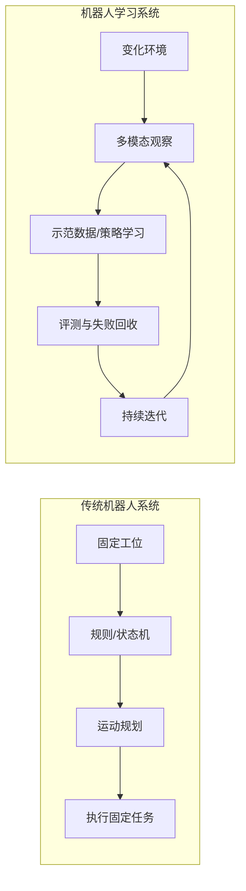

这张图不是说传统机器人简单，也不是说机器人学习一定更高级。它表达的是两者的工程假设不同。传统机器人倾向于通过工程约束降低环境复杂度；机器人学习则试图从数据中学习对变化环境的适应能力。

在真实项目中，两者经常混合使用。比如本书后面会先实现规则式 pick-and-place expert，用它帮助我们理解任务流程、动作结构和失败类型；之后再进入遥操作数据采集和 ACT baseline 训练。规则不是学习的敌人，规则是构建学习系统的重要脚手架。

### 4.2 具身智能系统结构

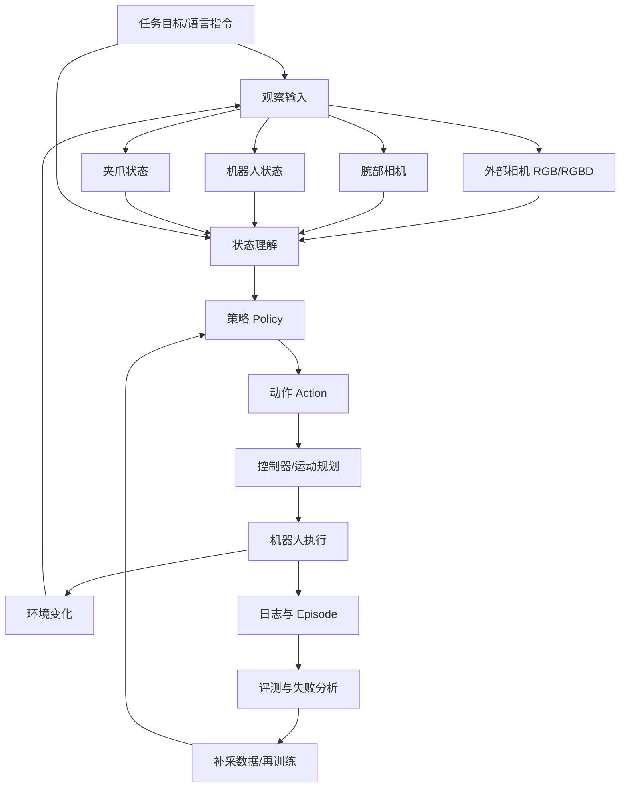

这张图是全书的核心图之一。它说明具身智能系统不是一个单独模型，而是一条从观察到动作、从执行到数据、从失败到再训练的闭环链路。

你可以把大模型放在其中的某些位置：例如理解语言指令、生成高层计划、解释失败原因、辅助标注数据、帮助写代码或生成实验报告。但机器人能不能完成任务，最终取决于 action 是否能在真实环境中执行，并且失败是否能被系统性回收。

### 4.3 本书主线项目路线图

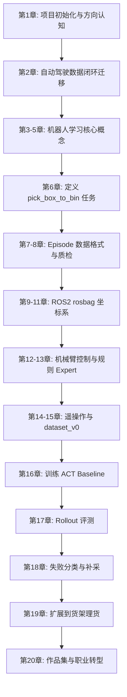

这条路线刻意从小任务开始。第一个完整任务不是“整理房间”，也不是“通用家务机器人”，而是：

```text
桌面小盒子抓取并放入收纳盒
```

这个任务足够小，但并不幼稚。它已经包含机器人学习的关键要素：物体识别、空间关系、抓取、夹爪控制、移动、放置、成功判断、失败分类、数据采集和评测。

---

## 5. 工程化理解

### 5.1 不要从“宏大任务”开始

很多人进入具身智能时，会被“家务机器人”吸引。比如：让机器人整理房间、叠衣服、洗碗、擦桌子、收拾玩具、倒垃圾。这些任务确实代表了长期方向，但不适合作为第一阶段学习任务。

原因在于，家务任务通常有以下特点：

- 环境极度开放；
- 物体种类多；
- 姿态变化大；
- 任务目标模糊；
- 成功标准难定义；
- 接触过程复杂；
- 失败类型多且难复现；
- 对硬件安全和可靠性要求高。

例如，“把房间整理好”看起来是一句话，但工程上它至少包含：识别哪些东西不在原位、判断哪些物体可以抓、规划移动路径、避开障碍、选择抓取方式、确定归置位置、执行放置、检查结果、处理失败。每一步都可以拆出一个复杂研究问题。

如果第一天就把目标定成“整理房间”，很容易陷入不可执行状态。你不知道该采什么数据，不知道如何定义 episode，不知道如何评测，也不知道失败后该补采什么。

工程学习最重要的原则是：先把任务边界缩小到可以闭环。

### 5.2 为什么理货、仓储、工厂辅助更现实

和家庭环境相比，理货、仓储和工厂辅助场景有几个明显优势。

第一，环境更可控。货架、桌面、料框、工位的位置通常比较固定，可以通过相机、标定、夹具和流程设计降低复杂度。

第二，任务更容易拆分。比如理货可以拆成缺货检测、商品扶正、商品取放、标签识别、异常上报。每个子任务都可以被定义、采集和评测。

第三，成功标准更清楚。商品是否扶正、是否放到指定区域、是否从 A 点移动到 B 点，通常比“房间是否整理好”更容易判断。

第四，职业迁移价值更直接。对自动驾驶感知工程师来说，货架、仓储和工厂辅助任务中的视觉、空间、检测、跟踪、数据闭环和评测方法，更容易与已有经验连接。

第五，商业落地路径更现实。家庭机器人需要面对成本、可靠性、安全、售后和用户预期等复杂问题。工业和半结构化场景虽然也难，但更容易通过限定边界形成阶段性价值。

因此，本书的路线是：从桌面任务开始，逐步走向货架理货，而不是直接做通用家务机器人。

### 5.3 小任务、小数据、小模型、小闭环

本书反复强调四个“小”：

```text
小任务、小数据、小模型、小闭环
```

小任务，是指任务边界要清楚。比如“把桌面上的小盒子放入收纳盒”比“整理桌面”更适合第一阶段。

小数据，是指先用几十条、几百条 episode 理解数据结构、质量问题和训练流程，而不是一开始幻想百万级机器人数据。

小模型，是指先训练行为克隆、ACT baseline 或轻量策略模型，理解 observation 到 action 的映射，而不是一开始追求通用 VLA 大模型。

小闭环，是指先完成一轮完整迭代：采集、训练、评测、失败分析、补采。即使任务很小，只要闭环完整，价值就很高。

这四个“小”不是降低目标，而是让你真正进入工程状态。很多人学习新方向时，最大的问题不是目标不够大，而是目标大到无法执行。

### 5.4 自动驾驶经验如何迁移

如果你有自动驾驶或泊车感知经验，可以从以下角度理解机器人学习。

| 自动驾驶/泊车系统 | 机器人学习系统 | 迁移关系 |
|---|---|---|
| log | episode | 都是一次任务或场景过程的数据记录 |
| camera/lidar | RGB/RGBD/wrist camera | 都是 observation 来源 |
| ego state | robot state | 都描述智能体自身状态 |
| planning/control | action/policy | 都需要输出可执行动作 |
| corner case | failure case | 都是系统改进的关键样本 |
| replay/eval | rollout/evaluation | 都需要评测协议而不是只看单例 |
| data mining | failure mining | 都要从失败中挖掘下一轮数据 |
| model iteration | policy iteration | 都是数据驱动迭代 |

这张表是下一章的入口。你会发现，机器人学习并不是完全陌生的领域。真正需要补齐的是：机械臂、末端执行器、接触任务、坐标系、遥操作数据、动作空间和策略训练。

---

## 6. 主线项目中的位置

本章在主线项目中承担两个作用。

第一，确定项目方向。

项目名称固定为：

```text
robot-learning-shelf-demo
```

项目目标是：

> 构建一个“桌面/货架理货机器人模仿学习闭环 Demo”。

项目不是为了展示一个单次成功视频，而是为了完整呈现机器人学习数据闭环。

第二，初始化项目骨架。

本章会新增第一个文件：

```text
robot-learning-shelf-demo/README.md
```

README 不是形式文件，而是项目合同。它要写清楚项目目标、任务版本、学习路线、目录结构和阶段性产出。后续每一章新增的代码、配置、数据和报告，都应该能回到 README 中找到位置。

### 6.1 三个任务版本

主线项目分为三个任务版本。

| 版本 | 任务 | 目标 | 本书完成程度 |
|---|---|---|---|
| v1 | 桌面小盒子抓取并放入收纳盒 | 跑通任务定义、数据格式、规则控制、数据采集、ACT 训练、评测、失败分析 | 必须完整完成 |
| v2 | 商品扶正任务 | 引入接触任务、失败类型、策略泛化 | 作为扩展任务展开 |
| v3 | 简易货架取放任务 | 靠近真实理货机器人，引入货架结构、遮挡、物体变化、任务扩展 | 作为高级扩展和职业连接 |

v1 是全书最重要的任务。不要因为它看起来小就轻视它。只要 v1 能完整闭环，你就已经掌握了进入机器人学习的关键方法。

v2 和 v3 则用于连接更真实的理货场景。它们不一定在本书中完成全部训练和部署，但会帮助你理解从桌面 demo 走向现实任务时需要增加哪些能力。

### 6.2 本章之后项目应该长什么样

本章结束后，你的项目目录至少应该是：

```text
robot-learning-shelf-demo/
  README.md
```

为了给后续章节预留位置，我们也会创建一批空目录：

```text
robot-learning-shelf-demo/
  docs/
  configs/
  scripts/
  ros2_ws/
  notebooks/
  datasets/
  reports/
  videos/
```

这些目录不会在本章填满，但它们代表了一个完整机器人学习项目的基本边界。

---

## 7. 示例

### 7.1 示例一：为什么“把房间整理好”不是一个好任务定义

假设你给机器人一个指令：

```text
把房间整理好。
```

从人的角度看，这句话很自然。但从机器人学习角度看，它几乎不可直接训练。

首先，什么叫“整理好”？是地面没有杂物，还是桌面没有杂物？衣服要叠起来，还是放进篮子？书要放在书架，还是叠在桌角？不同家庭、不同人、不同房间的标准都不同。

其次，任务边界不清楚。机器人是否需要打开柜门？是否需要识别个人物品？是否需要移动易碎品？是否需要处理垃圾？是否需要判断哪些东西不能碰？

再次，成功标准不清楚。训练策略时，你需要给 episode 标注 success 或 failure。如果“整理好”没有明确标准，就很难判断一条 episode 是否成功。

最后，失败回收困难。假设机器人没有整理好，你要补采什么数据？是补采抓袜子的数据，还是补采开抽屉的数据？是补采导航数据，还是补采物体分类数据？如果任务不能拆解，失败就无法转化成下一轮数据。

因此，“把房间整理好”应该被拆成多个可执行小任务。例如：

| 原始任务 | 可执行子任务 |
|---|---|
| 整理房间 | 检测地面可抓取杂物 |
| 整理房间 | 将玩具放入玩具箱 |
| 整理房间 | 将衣物放入脏衣篮 |
| 整理房间 | 将桌面杯子移动到托盘 |
| 整理房间 | 将书本推齐到桌面一侧 |

这就是本书后面会不断训练的能力：把模糊任务变成可采集、可训练、可评测的小任务。

### 7.2 示例二：将“理货”拆成机器人任务

“理货”同样是一个大词。对人来说，理货可能包括检查货架、补货、扶正商品、清理异物、整理标签、盘点库存。对机器人来说，我们必须继续拆分。

可以拆成以下任务：

| 理货子任务 | 机器人学习角度 |
|---|---|
| 缺货检测 | 视觉检测货架空位或商品数量不足 |
| 商品扶正 | 判断倾斜商品姿态，执行推/扶动作 |
| 商品取放 | 从料框取商品，放到货架目标位置 |
| 标签识别 | 读取货架标签或商品类别信息 |
| 异常上报 | 将无法处理的情况交给人类 |

本书主线项目选择其中最适合入门的路径：先从桌面抓取放置开始，再扩展到商品扶正，最后讨论货架取放。

为什么不直接做完整理货机器人？因为完整理货机器人涉及移动底盘、导航、货架定位、物体识别、抓取、补货策略、人机协作和安全规范。对于 90 天学习计划来说，直接做全系统不现实。

但是，如果你能把桌面小盒子任务做成一个完整数据闭环，你就已经具备了迁移到理货任务的核心方法。

### 7.3 示例三：聊天机器人回答问题与机器人执行动作的差异

看一个简单对比。

用户问聊天机器人：

```text
桌面上的红色盒子在哪里？
```

模型可以回答：

```text
红色盒子在桌面左侧，靠近收纳盒。
```

这是一个视觉语言问答问题。输出是文本。

如果机器人要执行任务：

```text
把红色盒子放进收纳盒。
```

系统需要的不只是文本描述，而是完整动作过程：

1. 确定红色盒子在相机坐标系中的位置；
2. 将目标位置转换到机器人坐标系；
3. 判断当前夹爪是否打开；
4. 移动到预抓取位姿；
5. 下降到抓取高度；
6. 闭合夹爪；
7. 判断是否抓住；
8. 抬起物体；
9. 移动到收纳盒上方；
10. 打开夹爪；
11. 判断物体是否落入收纳盒；
12. 记录 episode 和结果。

同样一句话，在聊天系统中主要是理解问题，在机器人系统中则是观察、坐标、控制、策略、执行和评测的组合。

这就是为什么本书不会把重点放在“机器人能不能听懂人话”，而是放在“机器人任务如何被定义成数据闭环”。

---

## 8. 练习代码

本章的练习代码用于初始化主线项目目录，并生成 README 初稿。你可以把下面代码保存为临时脚本，例如：

```text
init_robot_learning_shelf_demo.py
```

这个脚本不属于最终项目必须保留的核心脚本，它只是用于创建项目初始结构。后续正式进入主线项目后，核心脚本会从 `scripts/01_generate_synthetic_episode.py` 开始。

### 8.1 初始化项目目录与 README

```python
from pathlib import Path
from textwrap import dedent


def ensure_dir(path: Path) -> None:
    """Create a directory if it does not exist."""
    path.mkdir(parents=True, exist_ok=True)


def write_text_if_missing(path: Path, content: str) -> None:
    """Write a text file only when the file does not already exist."""
    if path.exists():
        print(f"Skip existing file: {path}")
        return
    path.write_text(content, encoding="utf-8")
    print(f"Create file: {path}")


def build_readme() -> str:
    """Return the initial README content for robot-learning-shelf-demo."""
    return dedent(
        """
        # robot-learning-shelf-demo

        本项目是《从自动驾驶感知到具身智能：90 天构建机器人学习数据闭环》的主线工程项目。

        项目目标不是复现通用机器人基础模型，而是围绕一个可控的桌面/货架理货任务，完整跑通机器人学习数据闭环：

        ```text
        任务定义 → 数据采集 → 数据格式 → 策略训练 → 展开评测 → 失败分析 → 补采数据 → 再训练
        ```

        ## 1. 项目目标

        构建一个“桌面/货架理货机器人模仿学习闭环 Demo”。

        本项目从一个最小任务开始：

        ```text
        v1: 桌面小盒子抓取并放入收纳盒
        ```

        在完成 v1 的任务定义、episode 数据格式、规则 expert、遥操作数据采集、ACT baseline 训练、rollout 评测和失败回收之后，再扩展到：

        ```text
        v2: 商品扶正任务
        v3: 简易货架取放任务
        ```

        ## 2. 为什么选择这个任务

        桌面小盒子抓取任务足够小，便于在仿真或低成本硬件上实现；同时它又包含机器人学习的关键问题：

        - observation：相机图像、机器人状态、夹爪状态；
        - action：末端位姿、关节角、夹爪开合；
        - episode：一次完整任务执行过程；
        - policy：从观察到动作的映射；
        - rollout：使用策略进行展开评测；
        - failure taxonomy：抓取失败、放置失败、碰撞、空抓、滑落等失败分类；
        - data closed loop：根据失败补采数据并再训练。

        ## 3. 任务版本

        | 版本 | 任务 | 目标 |
        |---|---|---|
        | v1 | 桌面小盒子抓取并放入收纳盒 | 跑通完整数据闭环 |
        | v2 | 商品扶正任务 | 引入接触任务和策略泛化 |
        | v3 | 简易货架取放任务 | 接近真实理货机器人场景 |

        ## 4. 项目目录

        ```text
        robot-learning-shelf-demo/
          README.md
          docs/
          configs/
          scripts/
          ros2_ws/
          notebooks/
          datasets/
          reports/
          videos/
        ```

        后续章节会逐步补齐这些目录中的文件。

        ## 5. 当前阶段

        当前阶段：项目初始化。

        本阶段只需要完成两件事：

        1. 明确项目目标和任务版本；
        2. 创建项目目录和 README。

        下一阶段将从自动驾驶数据闭环迁移到机器人数据闭环，并生成第一条模拟 episode。
        """
    ).strip() + "\n"


def main() -> None:
    project_root = Path("robot-learning-shelf-demo")

    directories = [
        project_root,
        project_root / "docs",
        project_root / "configs",
        project_root / "scripts",
        project_root / "ros2_ws",
        project_root / "notebooks",
        project_root / "datasets",
        project_root / "reports",
        project_root / "videos",
    ]

    for directory in directories:
        ensure_dir(directory)

    write_text_if_missing(project_root / "README.md", build_readme())

    print("Project initialized successfully.")


if __name__ == "__main__":
    main()
```

### 8.2 如何运行

将代码保存为：

```text
init_robot_learning_shelf_demo.py
```

然后在命令行运行：

```bash
python init_robot_learning_shelf_demo.py
```

运行后，你应该看到类似输出：

```text
Create file: robot-learning-shelf-demo/README.md
Project initialized successfully.
```

如果你重复运行脚本，已有 README 不会被覆盖。这样做是为了避免你后续手动修改 README 后被初始化脚本误覆盖。

---

## 9. 代码解释

这段代码解决的是项目初始化问题。它不是机器人算法代码，但它很重要，因为一个长期项目必须先有清晰边界。

### 9.1 输入是什么

脚本没有外部输入。它默认在当前目录下创建：

```text
robot-learning-shelf-demo/
```

如果你希望创建到其他位置，可以修改：

```python
project_root = Path("robot-learning-shelf-demo")
```

### 9.2 输出是什么

脚本输出一个项目目录和一个 README 文件：

```text
robot-learning-shelf-demo/
  README.md
  docs/
  configs/
  scripts/
  ros2_ws/
  notebooks/
  datasets/
  reports/
  videos/
```

其中，`README.md` 是本章的核心产出。它会在项目一开始就固定住项目目标，防止后续学习发散。

### 9.3 为什么要先写 README

很多工程项目失败，并不是因为第一段代码写错，而是因为项目目标一直不清楚。

在机器人学习中，这个问题更明显。你可能今天想做机械臂抓取，明天想做 VLA，后天想做家务机器人，大后天又想接 ROS2 仿真。每个方向都重要，但如果没有主线，最后会变成知识碎片。

README 的作用就是把项目变成一个“工程合同”。它至少要回答：

- 项目叫什么；
- 要解决什么任务；
- 当前阶段做到哪里；
- 后续目录如何组织；
- 哪些能力是必须完成的；
- 哪些能力只是扩展方向。

后续章节中，每次新增代码和文档，我们都要问：它是否服务于 README 中定义的主线项目？如果不能服务，就暂时不要加入。

### 9.4 为什么本章不直接写训练代码

因为训练代码依赖很多前置定义。你还没有定义 observation、state、action、episode，也没有定义任务起止条件、成功标准和数据格式。现在直接训练模型，只会制造混乱。

机器人学习项目的顺序应该是：

```text
先定义任务，再定义数据；
先生成数据，再训练策略；
先有评测协议，再讨论模型好坏；
先能分析失败，再谈持续迭代。
```

这也是本书的组织顺序。

---

## 10. 常见错误

### 10.1 错误一：把具身智能理解成“给机器人接一个 ChatGPT”

大模型可以让机器人更好地理解语言、规划任务和解释失败，但机器人执行动作需要更底层的数据结构和控制系统。没有 observation、action、state、policy 和 evaluation，大模型只是一个语言接口。

正确理解是：大模型可以成为具身智能系统的一部分，但具身智能工程的核心仍然是物理交互闭环。

### 10.2 错误二：一开始就追求通用家务机器人

家务机器人是长期方向，但作为入门项目太大。它涉及开放环境、多物体、多任务、移动导航、复杂接触、安全和用户体验。如果第一阶段目标过大，就很难形成闭环。

正确做法是：先选择一个小任务，把数据闭环跑通，再逐步扩展任务复杂度。

### 10.3 错误三：只看成功视频，不看评测协议

机器人 demo 很容易通过挑选成功案例看起来不错。但工程上要问的是：成功率是多少？失败类型是什么？评测次数够不够？物体变化是否覆盖？光照变化是否覆盖？失败样本是否进入下一轮数据？

正确做法是：从第一天开始就建立评测意识。即使本章还没有写评测代码，也要在 README 中明确最终要做 rollout evaluation 和 failure analysis。

### 10.4 错误四：过早陷入模型名词

ACT、Diffusion Policy、VLA、Open X-Embodiment、GR00T、π0 都值得学习，但如果你还不知道自己的 action space 是什么，模型名词并不能帮你完成任务。

正确做法是：先理解任务、数据和动作，再学习模型。模型是策略学习的一部分，不是项目的全部。

### 10.5 错误五：忽略传统机器人基础

有些人一接触机器人学习，就觉得规则、控制、状态机、运动规划都不重要。这是错误的。真实机器人系统必须处理安全边界、速度限制、碰撞检查、坐标系、夹爪状态和异常恢复。

正确做法是：把传统机器人能力当作机器人学习的工程底座。后续我们会先实现规则式 expert，再进入模仿学习。

### 10.6 错误六：没有项目目录和长期产出意识

如果所有实验都散落在临时脚本里，最后很难形成作品集。职业转型需要可展示的项目，而不是零散截图。

正确做法是：从第一章开始就维护统一项目目录。README、docs、configs、scripts、datasets、reports 都是作品集的一部分。

---

## 11. 本章练习

### 练习 1：基础练习

用自己的话解释：为什么具身智能不是“机器人 + 大模型”？

要求至少包含以下关键词：

- observation；
- action；
- policy；
- episode；
- evaluation；
- failure recovery。

不要只写“因为机器人需要行动”。你需要说明：行动为什么必须被数据化、被评测、被失败回收。

### 练习 2：任务拆解练习

将下面这个模糊任务拆成 5 个可执行小任务：

```text
整理桌面。
```

每个小任务要满足三个条件：

1. 有明确起点；
2. 有明确终点；
3. 能判断成功或失败。

示例格式：

```text
任务：将桌面上的小盒子放入收纳盒
起点：小盒子在桌面任意指定区域，收纳盒在桌面右侧
终点：小盒子完全落入收纳盒内部
成功标准：盒子没有掉落，夹爪已松开，机器人回到安全位姿
```

### 练习 3：工程练习

运行本章的初始化脚本，创建：

```text
robot-learning-shelf-demo/
```

然后打开 `README.md`，根据自己的学习目标补充一段：

```markdown
## 我的学习目标

我希望通过本项目获得哪些能力：

1. ...
2. ...
3. ...
```

这段内容不需要提交给任何人，但它能帮助你明确为什么要做这个项目。

### 练习 4：迁移思考练习

如果你有自动驾驶、视觉算法或感知工程背景，请写下 5 个可以迁移到机器人学习中的能力。

可以参考以下方向：

- 数据采集；
- 数据标注；
- corner case 分析；
- 目标检测；
- 空间理解；
- 模型评测；
- 工程部署；
- 可视化工具；
- 日志分析。

同时写下 3 个需要补齐的新能力，比如 ROS2、机械臂控制、坐标系、遥操作或模仿学习。

### 练习 5：进阶练习

在 README 中新增一个“风险与边界”小节，写清楚本项目暂时不做什么。

例如：

```markdown
## 风险与边界

本项目第一阶段不追求：

1. 复现通用 VLA 大模型；
2. 实现完整家务机器人；
3. 处理所有未知物体；
4. 在没有评测协议的情况下只展示成功视频。
```

这个练习非常重要。能说清楚“不做什么”，是工程项目能够推进的前提。

---

## 12. 本章产出

完成本章后，你应该得到以下产出。

### 12.1 认知产出

你应该理解：

- 具身智能不是“机器人 + 大模型”的简单叠加；
- VLA 的关键在于从视觉、语言、状态映射到动作；
- 机器人学习的核心是数据闭环，而不是单次 demo；
- 家务机器人是长期方向，理货、仓储、工厂辅助更适合作为工程切入点；
- 小任务、小数据、小模型、小闭环，是个人工程师进入具身智能的合理路线。

### 12.2 工程产出

你应该创建：

```text
robot-learning-shelf-demo/
  README.md
  docs/
  configs/
  scripts/
  ros2_ws/
  notebooks/
  datasets/
  reports/
  videos/
```

其中，本章实际新增的核心文件是：

```text
robot-learning-shelf-demo/README.md
```

### 12.3 文档产出

你的 README 至少应该包含：

- 项目目标；
- 任务版本 v1/v2/v3；
- 项目目录；
- 当前阶段；
- 后续路线；
- 可选的个人学习目标；
- 可选的风险与边界。

---

## 13. 小结

本章完成了全书最重要的方向校准。

我们没有把具身智能理解成“机器人 + 大模型”，而是把它理解成一个围绕物理动作展开的数据闭环系统。这个系统需要观察环境、理解任务、产生动作、执行动作、记录过程、评测结果，并从失败中产生下一轮数据。

我们也没有从通用家务机器人这种宏大目标开始，而是选择了一个更适合个人工程师学习和作品集建设的主线项目：`robot-learning-shelf-demo`。这个项目从 v1 桌面小盒子抓取并放入收纳盒开始，逐步扩展到 v2 商品扶正和 v3 简易货架取放。

本章的工程产出虽然只有 README 和项目目录，但它为后续所有章节建立了边界。接下来，每一章都会围绕这个项目推进：新增数据结构、配置文件、脚本、ROS2 节点、训练流程、评测协议和失败分析报告。

下一章我们会进入一个对自动驾驶感知工程师非常关键的问题：

> 自动驾驶中的数据闭环、log、corner case、评测和回灌，如何迁移到机器人学习中的 episode、failure case、rollout evaluation 和数据补采？

从下一章开始，主线项目会生成第一条模拟机器人 episode。届时，抽象的“数据闭环”会开始落到具体文件和字段上。

---

# 第 2 章：从自动驾驶数据闭环迁移到机器人数据闭环

第 1 章解决了一个方向性问题：具身智能不是“机器人 + 大模型”，而是一个围绕任务、数据、策略、评测和失败回收展开的工程闭环。到了第 2 章，我们要把这个判断再往前推一步：如果你本来就是自动驾驶感知、泊车感知、视觉算法或数据闭环方向的工程师，你是不是要从零开始进入机器人学习？

我的判断是：**不是从零开始，而是从“迁移开始”。**

自动驾驶和机器人学习表面上看差别很大。一个面对道路、车道线、目标车和规划控制，另一个面对机械臂、夹爪、桌面物体和抓取放置。但如果把这两个系统放到工程视角里看，你会发现它们共享同一种更底层的方法论：

```text
采集真实执行数据 → 找到失败与难例 → 设计数据表达 → 训练模型 → 建立评测协议 → 回收失败样本 → 进入下一轮迭代
```

换句话说，自动驾驶和机器人学习都不是“单次模型训练问题”，而是“数据闭环系统问题”。

本章的任务，就是把这种迁移关系讲清楚。你不仅要看到两者的相似处，也要准确看到差异处。只有这样，你才不会一边低估自己的已有能力，一边又忽略进入机器人领域必须补上的新能力。

---

## 1. 本章要解决的问题

本章重点解决以下六个问题：

1. 自动驾驶中的 log、scene、corner case、回放评测，与机器人学习中的 episode、failure case、rollout、补采数据之间到底是什么关系？
2. 自动驾驶的 camera / lidar / ego state / control command，如何映射到机器人学习里的 RGB / RGBD / robot state / action？
3. 自动驾驶感知工程师已经具备哪些可迁移优势？
4. 自动驾驶工程师转向机器人学习时，最容易忽略哪些新问题？
5. 为什么“数据闭环”是两个领域共有的底层工程方法？
6. 如何在主线项目 `robot-learning-shelf-demo` 中迈出第一个可执行步骤，而不是只停留在概念理解？

本章结束后，读者应该形成一个非常明确的判断：**你过去在自动驾驶里积累的经验不会消失，而是需要重新投影到机器人任务中。**

---

## 2. 为什么这个问题重要

很多工程师一提到机器人学习，会立即想到机械臂控制、夹爪接触、ROS2、MoveIt2、VLA、模仿学习和遥操作，然后自然得出一个心理结论：

> 这是一套完全不同的东西，我大概要从头学起。

这个结论只对了一半。

确实，机器人学习有不少新的知识点：末端执行器、抓取接触、眼在手上相机、坐标系、机器人状态、示范采集、动作空间设计、展开评测等。但如果因此忽略你已经掌握的工程能力，就会产生两个问题。

第一，你会低估自己的迁移速度。一个做过自动驾驶数据闭环的人，通常已经熟悉以下工作：

- 如何从真实系统采集日志；
- 如何从大规模日志中寻找失败样本；
- 如何定义数据字段和标注格式；
- 如何建设评测指标和回归集；
- 如何做模型迭代与版本比较；
- 如何理解“单次 demo 成功”和“系统能力提升”之间的差异。

这些能力恰恰是机器人学习最需要的。机器人领域真正稀缺的，不只是“会调机械臂”，而是能把任务组织成数据闭环的人。

第二，如果你只看到相似处，又会误判机器人学习的难点。自动驾驶里的车是一个整体平台，控制和动力学边界相对稳定；机器人则经常处理近距离交互、接触瞬间、物体遮挡、抓取失败、目标滑落、相机外参变化、末端微小误差等问题。一个 2 厘米的位置误差，可能在自动驾驶里只是轨迹偏一点，在机器人里却足以导致完全抓空。

所以，本章重要，不是因为它在讲“迁移故事”，而是因为它在建立一种**正确的迁移姿势**：

- 看到你已有的能力；
- 补足你没有的能力；
- 以数据闭环为共同底层，把自动驾驶经验重构为机器人学习能力。

---

## 3. 核心概念

### 3.1 自动驾驶数据闭环回顾

自动驾驶系统之所以会建立起成熟的数据闭环，是因为道路场景高度复杂，算法不可能靠一次建模就覆盖所有情况。典型流程通常包括：

1. **数据采集**：从车端采集相机、雷达、定位、车辆状态、控制命令和环境上下文日志；
2. **场景挖掘**：从大量日志中发现感兴趣场景，如泊车失败、误检、漏检、狭窄车位、光照异常等；
3. **标注 / 分析**：对关键片段做标注、复盘和问题归因；
4. **模型训练**：使用筛选后的数据训练感知、预测或规划模块；
5. **仿真 / 回放评测**：在回放集、回归集或仿真环境中比较新旧版本；
6. **失败回收**：把新失败重新送回场景池，推动下一轮迭代。

这里最重要的，不是某个具体模块，而是“失败样本如何进入下一轮训练”这一点。没有这一点，所谓闭环就只是一次性离线训练。

### 3.2 机器人学习数据闭环

机器人学习的数据闭环，在形式上与自动驾驶极其相似，但对象会发生变化。一个较为典型的机器人学习闭环是：

1. **任务定义**：明确目标、起始条件、成功标准、失败标准和可执行边界；
2. **示范采集**：通过遥操作、脚本 expert、仿真器或人机协作采集 episode；
3. **数据质检**：检查时间同步、字段完整性、夹爪状态、视觉帧可用性和标签一致性；
4. **策略训练**：使用行为克隆、ACT 或其他模仿学习方法训练 policy；
5. **展开评测**：让 policy 在真实环境或仿真环境中 rollout，统计成功率和失败阶段；
6. **失败分类**：将失败分为抓取失败、定位失败、接近失败、放置偏移、目标丢失等；
7. **补采数据**：针对失败簇补充示范数据，再进入下一轮训练。

两者最大的共同点是：**都必须把真实执行中的失败样本结构化地收回来。**

### 3.3 log 与 episode

自动驾驶工程师最容易建立迁移感的一个概念映射，就是 `log` 和 `episode`。

- 在自动驾驶中，log 通常表示某段连续行驶过程中采集到的多模态日志，它可能很长，也可能包含多个事件。
- 在机器人学习中，episode 表示一次完整任务执行过程，从任务开始到成功结束或失败终止。

如果把自动驾驶的“一个关键片段”抽出来看，它在数据组织方式上就很像一个机器人 episode：

- 都有时间顺序；
- 都包含传感器数据；
- 都包含系统状态；
- 都包含控制 / 动作；
- 都可以打成功 / 失败 / 原因标签。

区别在于，自动驾驶 log 往往是“大系统连续运行日志”，而 episode 更强调“单个任务闭环单元”。

### 3.4 corner case 与 failure case

自动驾驶里常说 corner case，机器人学习里更常说 failure case 或 failure episode。

二者关系非常接近，但使用场景略有不同。

- **corner case** 往往强调稀有、极端、长尾场景，可能是对感知、预测、规划不利的复杂情况；
- **failure case** 更强调当前 policy 或系统在某个任务执行中的失败实例。

在机器人任务中，我们往往不是先讨论“极端性”，而是先讨论“失败发生在什么环节”。例如：

- 视觉识别正常，但接近轨迹不对；
- 接近轨迹正常，但夹爪关闭时没有夹稳；
- 抓起来了，但在移动过程中滑落；
- 成功移动到收纳盒上方，但释放时盒子掉在边缘外。

这些都属于 failure case。随着数据积累增多，我们再进一步区分哪些 failure case 是常见失败，哪些是具有代表性的“机器人 corner case”。

### 3.5 vehicle state 与 robot state

自动驾驶里，vehicle state 常包括速度、加速度、方向盘角度、车体姿态、位置信息和控制状态。机器人里，robot state 则经常包括：

- 关节角；
- 关节速度；
- 末端执行器位姿；
- 夹爪开合状态；
- 末端是否持物；
- 当前任务阶段；
- 安全状态与控制模式。

二者本质相同：都是描述“系统此刻自身处于什么状态”。

但机器人的一个特殊点在于，**状态与任务完成之间的几何关系往往更直接、更精细。** 比如，末端执行器和目标物体之间相差 1–2 厘米，可能就决定了下一步是成功抓取还是完全抓空。因此机器人状态不仅是“有状态”，而且经常要以更高的精度参与策略学习与评测。

### 3.6 control command 与 robot action

自动驾驶中，系统的输出可能是轨迹点、转向角、油门、制动等控制命令。机器人学习中，policy 输出的则是 action，例如：

- 关节角目标；
- 关节速度；
- 末端绝对位姿；
- 末端位姿增量；
- 夹爪开合命令；
- action chunk。

你可以把 robot action 理解为机器人领域的“控制输出表达”。

不过机器人 action 的设计比很多工程师想象中更关键。因为 action 不是一个随手填写的字段，而是后面训练 policy 的目标空间。action 设计不合理，往往会直接导致学习困难、执行不稳定或控制器无法安全落地。

### 3.7 自动驾驶工程师的优势与短板

自动驾驶感知工程师通常具备以下优势：

1. **数据闭环意识**：知道真实系统必须靠迭代提升；
2. **场景与错误分析能力**：习惯做 failure review；
3. **评测意识**：习惯建立指标与回归集；
4. **多模态感知基础**：懂视觉、点云、几何和时序；
5. **工程化能力**：能处理日志、脚本、配置和批处理。

但也有典型短板：

1. 对机械臂、夹爪和抓取接触没有直觉；
2. 对 ROS2、topic、tf、rosbag 的组织方式不熟；
3. 对“任务定义”不够敏感，容易直接跳到模型；
4. 对 action 的设计与控制器约束理解不足；
5. 对示范采集和遥操作工作量预期不足。

这也解释了为什么本书要先从“小任务、小数据、小闭环”开始。

---

## 4. 概念图 / 流程图 / 架构图

### 4.1 图 2-1 自动驾驶数据闭环与机器人学习数据闭环对比


这张图把两个领域的共同结构直接摆在了一起。左侧是自动驾驶数据闭环，右侧是机器人学习数据闭环，中间则是几个关键概念映射：

- `log → episode`
- `corner case → failure case`
- `vehicle state → robot state`
- `control command → robot action`

你应该从中看到的，不是“两个领域长得像”，而是“两个领域用的是同一种迭代逻辑”。

### 4.2 图 2-2 自动驾驶工程师迁移到机器人学习工程师的能力路径


这张图把“已有能力”和“待补能力”拆开了。很多人转型失败，不是因为能力不够，而是因为两边没有分开看：要么把自己想得太弱，要么把新领域想得太简单。

### 4.3 Mermaid 图：两个闭环的共性流程

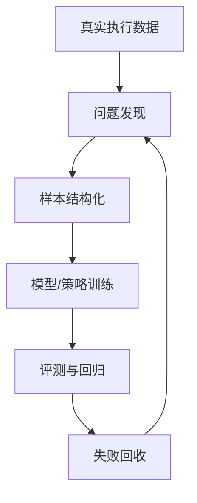

这是一张更抽象的图。它把自动驾驶和机器人学习都压缩到“真实执行—失败回收—再训练”这一条共同主线上。

### 4.4 Mermaid 图：自动驾驶对象到机器人对象的映射

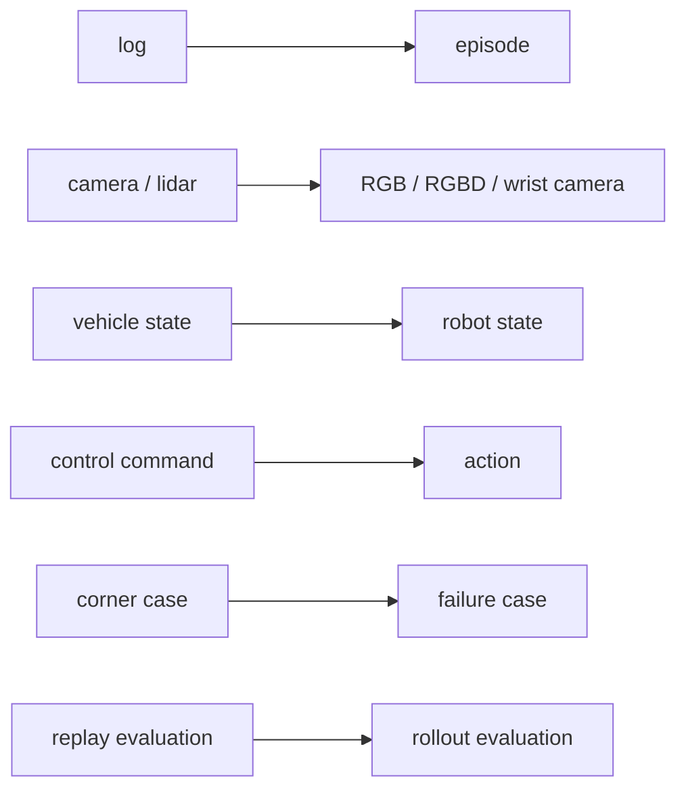

这张图可以视为本章最重要的“词汇翻译表”。后面很多章节，都会默认你已经理解这层映射。

---

## 5. 工程化理解

### 5.1 自动驾驶闭环为什么能迁移

自动驾驶的价值，不仅在于你见过很多模型，还在于你见过“模型不够”的真实样子。你知道：

- 离线指标好看，不代表上车表现稳定；
- 某次 demo 成功，不代表边界条件被覆盖；
- 没有失败回收，系统几乎不会稳定进化；
- 没有回归评测，版本升级可能是随机波动。

这些判断完全可以迁移到机器人学习里。一个机械臂 demo 成功 5 次，不代表 policy 可靠；一组示范数据训练出能抓几个盒子的策略，不代表扩展到新盒子、新光照、新摆放位置时还行。机器人学习同样需要：

- 定义标准任务集；
- 统计 rollout 成功率；
- 分类失败阶段；
- 找到失败簇；
- 针对失败补采数据；
- 比较新旧策略版本。

### 5.2 自动驾驶闭环为什么不能原样照搬

尽管底层方法共通，但机器人学习不能直接照搬自动驾驶流程，原因至少有四个。

**第一，任务粒度不同。** 自动驾驶是连续、长时程的开放任务；机器人学习往往是短时程、边界清晰的任务单元。你更需要先定义单个 episode，再讨论大规模扩展。

**第二，状态与动作更精细。** 自动驾驶里的感知误差通常通过后续规划和控制在一定程度上被吸收，而机器人抓取任务对末端相对位置极其敏感。action 的定义和执行器能力必须提前考虑。

**第三，数据采集方式不同。** 自动驾驶大量依赖车端自然采集，机器人学习则经常需要遥操作、人类示范、脚本 expert 或受控实验采集。

**第四，失败的物理成本不同。** 自动驾驶失败很危险，但很多感知调试发生在日志回放里；机器人策略的很多问题会在真机接触阶段立刻显现，因此必须更重视控制边界、安全速度和失败终止条件。

### 5.3 对主线项目的具体启发

在 `robot-learning-shelf-demo` 中，我们不是一上来就采集真实遥操作数据，而是先生成一条**模拟 synthetic episode**。这一步非常重要，因为它等价于自动驾驶项目中的“先把日志格式和评测输入定义清楚”。

你可以把这理解为：

- 在开始大规模数据采集前，先把数据接口想明白；
- 在真正训练策略前，先把 episode 结构打通；
- 在接入 ROS2 之前，先用纯 Python 验证文件组织方式。

这与自动驾驶里先定义 log schema、标注字段、评测接口，再进入大规模数据工程，是完全一致的工程思路。

---

## 6. 主线项目中的位置

本章在主线项目中的位置非常明确：**它负责把“迁移认知”落到第一条可用 episode 数据上。**

本章新增的项目文件为：

```text
robot-learning-shelf-demo/
  scripts/
    01_generate_synthetic_episode.py
  datasets/
    dataset_v0_sample/
      episode_0001/
        meta.json
        states.jsonl
        actions.jsonl
```

这一步的目标不是追求逼真的机器人行为，而是让整个项目第一次拥有“像机器人学习数据那样组织的数据单元”。

本章完成后，项目能力推进到：

1. 已经有了一个任务 `pick_box_to_bin`；
2. 已经有了一条 synthetic episode；
3. 已经有了 `meta / state / action` 三类核心文件；
4. 第 3 章可以在这个基础上继续讲 observation、state、action、policy、episode 的精确定义。

---

## 7. 示例

### 7.1 示例 1：一次泊车失败如何变成 corner case

假设你在泊车系统中发现一个失败案例：车辆在逆光环境下识别不到地锁，导致路径规划保守甚至停止。一个典型的自动驾驶闭环做法是：

1. 从整段 log 中截取关键片段；
2. 标记失败发生的时间段；
3. 检查感知输出、定位、车辆状态和控制行为；
4. 将该片段加入回归集或难例池；
5. 针对类似场景补充样本后重训；
6. 对新版本进行回放评测。

你会发现，这里面真正有价值的不是“失败了一次”，而是“失败如何被转化为数据资产”。

### 7.2 示例 2：一次抓取失败如何变成 failure case

现在把场景换成桌面抓盒子任务。机器人看到盒子后移动到上方，下降，关闭夹爪，但没有夹稳，盒子在抬起瞬间滑落。

对应的 failure case 处理流程可能是：

1. 保存本次 episode 的视觉帧、状态与动作；
2. 标记失败阶段为 `grasp_failure`；
3. 记录失败原因候选，如“夹爪宽度不匹配”或“接近高度不合理”；
4. 汇总一批类似 failure episode；
5. 针对该失败簇补采示范数据；
6. 使用补采后的数据再训练 policy。

对比一下你会发现：自动驾驶里的 corner case mining，和机器人里的 failure mining，本质是一回事。

### 7.3 示例 3：自动驾驶 log 与机器人 episode 的字段对比

| 自动驾驶字段 | 机器人字段 | 含义说明 |
|---|---|---|
| log_id | episode_id | 一个连续数据单元的唯一标识 |
| camera_frames | rgb_frames | 视觉输入 |
| lidar_frames | depth / point cloud（可选） | 深度或几何输入 |
| ego_state | robot_state | 系统自身状态 |
| control_cmd | action | 控制输出 |
| route / mission | instruction / task_name | 任务目标 |
| event_tag | success / failure label | 结果标签 |
| scenario_tag | phase / failure_reason | 过程与失败阶段标签 |
| replay_eval | rollout_eval | 离线或在线评测 |
| hard_case_pool | failure_pool | 失败样本池 |

请注意，这张表不是说字段名必须完全对应，而是帮助你在脑中建立一个“工程角色映射”。

---

## 8. 练习代码

本章的练习代码目标是：**用纯 Python 生成一条模拟机器人 episode。**

文件路径：`robot-learning-shelf-demo/scripts/01_generate_synthetic_episode.py`

```python
from __future__ import annotations

from dataclasses import asdict, dataclass
from pathlib import Path
import json
from typing import Any


@dataclass
class EpisodeMeta:
    episode_id: str
    task_name: str
    instruction: str
    success: bool
    num_steps: int
    control_mode: str
    observation_modalities: list[str]
    action_definition: str
    notes: str


@dataclass
class StateRecord:
    t: int
    timestamp: float
    ee_pose_xyzrpy: list[float]
    gripper_open: bool
    object_pose_xyz: list[float]
    bin_pose_xyz: list[float]
    phase: str


@dataclass
class ActionRecord:
    t: int
    timestamp: float
    delta_ee_xyzrpy: list[float]
    gripper_delta: float
    comment: str


def write_json(path: Path, data: Any) -> None:
    path.parent.mkdir(parents=True, exist_ok=True)
    with path.open("w", encoding="utf-8") as f:
        json.dump(data, f, ensure_ascii=False, indent=2)


def write_jsonl(path: Path, rows: list[dict[str, Any]]) -> None:
    path.parent.mkdir(parents=True, exist_ok=True)
    with path.open("w", encoding="utf-8") as f:
        for row in rows:
            f.write(json.dumps(row, ensure_ascii=False) + "\n")


def build_synthetic_episode() -> tuple[EpisodeMeta, list[StateRecord], list[ActionRecord]]:
    meta = EpisodeMeta(
        episode_id="episode_0001",
        task_name="pick_box_to_bin",
        instruction="Pick up the small box and place it into the bin.",
        success=True,
        num_steps=7,
        control_mode="delta_end_effector_pose_with_gripper",
        observation_modalities=["top_rgb", "robot_state"],
        action_definition="[dx, dy, dz, droll, dpitch, dyaw, gripper_delta]",
        notes="Synthetic data for chapter 2.",
    )

    states = [
        StateRecord(0, 0.00, [0.30, -0.10, 0.25, 3.14, 0.0, 0.0], True, [0.42, 0.05, 0.02], [0.62, -0.08, 0.04], "reset"),
        StateRecord(1, 0.10, [0.30, -0.10, 0.25, 3.14, 0.0, 0.0], True, [0.42, 0.05, 0.02], [0.62, -0.08, 0.04], "observe"),
        StateRecord(2, 0.20, [0.42, 0.05, 0.18, 3.14, 0.0, 0.0], True, [0.42, 0.05, 0.02], [0.62, -0.08, 0.04], "pre_grasp"),
        StateRecord(3, 0.30, [0.42, 0.05, 0.05, 3.14, 0.0, 0.0], True, [0.42, 0.05, 0.02], [0.62, -0.08, 0.04], "approach"),
        StateRecord(4, 0.40, [0.42, 0.05, 0.05, 3.14, 0.0, 0.0], False, [0.42, 0.05, 0.05], [0.62, -0.08, 0.04], "grasp"),
        StateRecord(5, 0.50, [0.62, -0.08, 0.18, 3.14, 0.0, 0.0], False, [0.62, -0.08, 0.18], [0.62, -0.08, 0.04], "transfer"),
        StateRecord(6, 0.60, [0.62, -0.08, 0.10, 3.14, 0.0, 0.0], True, [0.62, -0.08, 0.04], [0.62, -0.08, 0.04], "release"),
    ]

    actions = [
        ActionRecord(0, 0.00, [0.0, 0.0, 0.0, 0.0, 0.0, 0.0], 0.0, "Episode start"),
        ActionRecord(1, 0.10, [0.0, 0.0, 0.0, 0.0, 0.0, 0.0], 0.0, "Keep observing"),
        ActionRecord(2, 0.20, [0.12, 0.15, -0.07, 0.0, 0.0, 0.0], 0.0, "Move above the box"),
        ActionRecord(3, 0.30, [0.0, 0.0, -0.13, 0.0, 0.0, 0.0], 0.0, "Move down"),
        ActionRecord(4, 0.40, [0.0, 0.0, 0.0, 0.0, 0.0, 0.0], -1.0, "Close gripper"),
        ActionRecord(5, 0.50, [0.20, -0.13, 0.13, 0.0, 0.0, 0.0], 0.0, "Move to the bin"),
        ActionRecord(6, 0.60, [0.0, 0.0, -0.08, 0.0, 0.0, 0.0], +1.0, "Open gripper and release"),
    ]
    return meta, states, actions
```

建议运行方式：

```bash
cd robot-learning-shelf-demo
python scripts/01_generate_synthetic_episode.py
```

运行后，你应该得到：

```text
datasets/dataset_v0_sample/episode_0001/
  meta.json
  states.jsonl
  actions.jsonl
```

---

## 9. 代码解释

这段代码解决的问题是：**先不依赖 ROS2 和真实硬件，模拟出一条结构清晰的 episode 数据。**

### 9.1 输入是什么

严格来说，这段脚本没有外部输入。它在内部构造了一条固定示例任务 `pick_box_to_bin` 的 synthetic episode。

### 9.2 输出是什么

输出是三个文件：

1. `meta.json`：保存任务级元信息；
2. `states.jsonl`：按时间步保存状态；
3. `actions.jsonl`：按时间步保存动作。

### 9.3 为什么不用一开始就上真实数据

因为此时我们最需要先对齐的是**数据结构**，而不是硬件真实性。只要数据结构没有理清，后面即便接了 ROS2 或真机，也只会让问题更乱。

### 9.4 如何接入主线项目

这条 synthetic episode 会在第 3 章被继续使用：

- 第 3 章会基于它解释 `observation / state / action / policy / episode`；
- 第 3 章会新增 `02_visualize_episode.py`，对这条 episode 做加载和可视化；
- 第 6–8 章会进一步把它演化成更规范的数据格式与任务定义。

---

## 10. 常见错误

### 错误 1：把“迁移”理解成“字段改名”

很多人以为只要把 log 改成 episode，把 control 改成 action，就完成迁移了。其实不是。真正要迁移的是：

- 失败驱动的数据思维；
- 评测驱动的工程习惯；
- 从执行系统中回收数据的能力。

### 错误 2：高估模型，低估任务定义

自动驾驶转到机器人时，很容易被模仿学习和 VLA 吸引，直接把注意力放在训练上。但在机器人学习里，任务定义、动作空间设计和 episode 切分往往比模型名字更先决定上限。

### 错误 3：忽略动作的物理含义

自动驾驶里的控制命令与底盘执行之间通常已有成熟控制层；而在机器人里，action 设计会直接影响控制器是否可执行。一个动作字段看起来对，但不意味着机械臂能稳定执行。

### 错误 4：把单次成功当成能力建立

无论是自动驾驶还是机器人，工程能力都不是“能演示一次”，而是“能稳定迭代”。如果没有 failure case 回收机制，你只是做出了一次 demo，不是建立了闭环。

---

## 11. 本章练习

### 练习 1：基础练习

请用你自己的语言解释以下映射：

- `log → episode`
- `corner case → failure case`
- `vehicle state → robot state`
- `control command → robot action`

要求每一条都结合一个具体例子说明。

### 练习 2：工程练习

在 `01_generate_synthetic_episode.py` 中新增字段 `failure_reason`，并让它在成功 episode 中为 `null`，在失败 episode 中可以取值 `grasp_failure`、`target_lost`、`drop_during_transfer` 等。

### 练习 3：进阶练习

把当前的成功 episode 改造为一个失败 episode，例如让 `gripper_open=False` 之后物体仍然没有被抬起，并在 `meta.json` 中标记 `success=False`。

### 练习 4：思考练习

如果将当前桌面抓盒子任务迁移到货架理货任务，自动驾驶里的哪些能力会更有帮助？哪些地方会暴露明显短板？请至少写出 5 条判断。

### 练习 5：表格练习

自己补充一个“自动驾驶与机器人学习对象映射表”，要求不少于 10 条映射关系，并说明每条映射在工程上有什么意义。

---

## 12. 本章产出

本章应当产出以下内容：

1. 对自动驾驶数据闭环与机器人数据闭环的系统理解；
2. 一份可复用的对象映射表；
3. 主线项目中的第一个 synthetic episode；
4. 一个可运行的脚本 `scripts/01_generate_synthetic_episode.py`；
5. 为第 3 章概念体系铺好的数据基础。

---

## 13. 小结

本章最核心的判断可以归纳为三句话。

第一，自动驾驶与机器人学习并不是两个完全割裂的领域。它们在数据闭环层面有非常强的同构性。

第二，自动驾驶工程师真正可迁移的，不只是视觉和感知能力，更重要的是失败回收、评测设计和数据闭环意识。

第三，这种迁移不是简单换一套术语，而是把过去的数据工程经验，重新组织到机器人任务、episode、action 和 failure case 上。

如果说第 1 章解决的是“为什么要这样学”，那么本章解决的是“你凭什么可以学得更快”。

下一章，我们将在这条 synthetic episode 的基础上，正式进入机器人学习最小概念体系：`Observation`、`State`、`Action`、`Policy` 与 `Episode`。到那时，你会看到，本章建立的迁移映射，会如何进一步落到数据字段、时间线和策略接口上。

---

# 第 3 章：Observation、Action、State、Policy 与 Episode

从这一章开始，我们正式进入机器人学习的最小知识体系。

如果说第 2 章回答的是“自动驾驶经验如何迁移到机器人”，那么第 3 章回答的就是另一个更基础的问题：**机器人学习到底在处理什么对象？**

很多初学者读机器人学习论文时，会不断碰到这些词：`observation`、`state`、`action`、`policy`、`trajectory`、`episode`、`rollout`。如果这些词没有在脑中建立稳定含义，后面的任务定义、数据格式、模仿学习训练和评测就会全部变成“看起来懂了，但一动手就乱”。

所以，本章非常关键。它不是词汇背诵章，而是后续所有工程实践的地基。

本章依然围绕主线任务 `pick_box_to_bin` 展开。你将看到：

- 一次桌面抓盒子任务，从时间上如何构成一个 episode；
- observation 和 state 到底有什么区别；
- action 应该怎么设计，为什么不能随便定义；
- policy 在系统中处于什么位置；
- 为什么 episode 的起点、终点和标签，会直接影响后续训练质量。

---

## 1. 本章要解决的问题

本章要解决以下七个问题：

1. `Observation` 和 `State` 有什么区别？为什么很多初学者会把它们混为一谈？
2. `Action` 有哪些常见形式？在机械臂任务里为什么经常使用“末端位姿增量 + 夹爪开合”？
3. `Policy` 到底是什么？为什么说它是从 observation（或 state）到 action 的映射？
4. `Trajectory`、`Episode` 和 `Rollout` 有什么联系和区别？
5. 为什么 episode 不只是“多条数据拼起来”，而是“一次完整任务执行过程”？
6. 在主线任务 `pick_box_to_bin` 中，上述概念分别落在哪些字段上？
7. 为什么 episode 的切分、时间戳和 success / failure label 会影响训练质量？

---

## 2. 为什么这个问题重要

在机器人学习里，很多问题最终都会回到这几个对象上。

比如，当你说“我想训练一个 ACT baseline”，本质上你是在说：

- 我要准备怎样的 observation？
- 我要输出怎样的 action？
- 我要不要显式输入 robot state？
- 我的 episode 怎么切分？
- rollout 成功与否怎么定义？

当你说“这个策略效果不好”，你其实可能在面对以下几种完全不同的问题：

- observation 信息不够；
- state 表达不合理；
- action 定义过难或不可执行；
- episode 切分混乱；
- success / failure 标注不稳定；
- policy 并没有学到正确映射。

所以，这一章不是为了“理解论文术语”，而是为了让你在后面的工程实践中能精确判断问题属于哪一层。

---

## 3. 核心概念

### 3.1 Observation：观测

`Observation` 是机器人在某个时间步通过传感器获得的信息。它通常是策略在决策时最直接看到的输入。

在主线任务 `pick_box_to_bin` 中，observation 可以包括：

- 桌面顶视 RGB 图像；
- 深度图（如果有 RGBD）；
- 腕部相机图像（如果有眼在手上相机）；
- 当前时间戳；
- 有时还会包含已经预处理好的视觉特征。

注意，observation 不等于“世界真相”。它只是当前系统看到的东西，因此可能受到遮挡、光照、噪声、视角变化和同步误差影响。也正因为如此，机器人学习天生带有**部分可观测性**。

### 3.2 State：状态

`State` 描述的是当前环境与机器人配置的一种表示。它既可能来自传感器原始读数的整理，也可能来自系统内部可直接获得的真值信息。

在真实机器人里，常见 state 包括：

- 关节角；
- 关节速度；
- 末端执行器位姿；
- 夹爪开合状态；
- 当前控制模式；
- 任务阶段标签；
- 是否持物。

在仿真环境里，state 还可能包含物体的精确位姿、接触状态和场景真值。也就是说，**state 往往比 observation 更“干净”、更结构化**。

因此，一个简单但非常重要的区分是：

- observation 更像“我看到了什么”；
- state 更像“系统当前处于什么配置”。

很多策略会同时使用 observation 与 state，因为视觉告诉模型“环境长什么样”，而机器人状态告诉模型“自己现在在哪、手里是什么姿态”。

### 3.3 Action：动作

`Action` 是策略在时间步 `t` 输出的控制指令。它定义了机器人接下来要做什么。

在机械臂任务中，action 有几种常见表达方式：

1. **关节角目标**：直接输出各关节目标值；
2. **关节速度 / 力矩**：更底层的控制；
3. **末端绝对位姿**：输出期望的末端位姿；
4. **末端位姿增量**：输出相对当前位姿的位移与旋转增量；
5. **夹爪开合命令**：通常与前面的动作一起组成完整 action；
6. **Action Chunk**：一次预测未来多个动作步。

对于初学者来说，“末端位姿增量 + 夹爪开合”往往是最容易理解、最适合小型 pick-and-place 任务的 action 定义。因为：

- 它比直接输出关节角更贴近任务语义；
- 它更容易跨不同机械臂迁移；
- 它便于与人类示范数据对应；
- 它能把策略输出和控制器解耦。

### 3.4 Policy：策略

`Policy` 是从 observation（或 observation + state）到 action 的映射函数。它回答的问题是：

> 在当前观测和状态下，下一步应该做什么动作？

在行为克隆里，policy 往往通过监督学习从示范数据中学出来；在 ACT 中，policy 还会学习动作块；在更复杂的机器人系统里，policy 也可能包含高层与低层的层次结构。

你可以先把 policy 理解为一个“学动作的函数”，但一定要记住：它不是孤立存在的。policy 的意义由它的输入和输出定义。如果 observation 不对、action 不合理，那么 policy 再复杂也无法学对。

### 3.5 Trajectory、Episode 与 Rollout

这三个词经常一起出现，但含义并不完全相同。

#### Trajectory：轨迹

trajectory 强调的是一段按时间组织的状态—动作序列。它更偏“序列结构”的概念。

#### Episode：回合

episode 强调的是一次完整任务执行过程。它有明确起点和终点，并且通常对应一次成功或失败的结果。

#### Rollout：展开评测

rollout 强调的是“让当前 policy 真正跑起来”。它通常用于评测阶段，表示把 policy 部署到环境中，从起点执行到终点，统计成功与失败。

一个简单理解是：

- 你采集到的数据可以组织成 trajectory；
- 一次完整任务执行通常构成一个 episode；
- 用当前 policy 实际执行一次任务，这就是一次 rollout。

### 3.6 时间戳、标签和 episode 边界

机器人学习不仅关心字段名，更关心字段是否在时间上自洽。

一个高质量 episode 通常至少应满足：

- 每个时间步都能对齐 observation、state 和 action；
- 有清楚的起点与终点；
- 有 success / failure 标签；
- 最好能记录 phase（如 observe、pre_grasp、approach、grasp、transfer、release）；
- 如果失败，最好能记录 failure_reason。

为什么这很重要？因为 episode 边界一旦切得混乱，策略就会学到很多“半截动作”或“无意义过渡”。比如，你把环境重置前的晃动、人工干预阶段或任务结束后的无关动作也放进 episode，模型很可能会学到错误分布。

### 3.7 主线任务中的概念落点

在 `pick_box_to_bin` 中，你可以把各概念落到如下对象：

- **Observation**：桌面 RGB 图像、深度图、时间戳；
- **State**：末端位姿、夹爪状态、物体位置（仿真可得）、阶段标签；
- **Action**：末端增量 `[dx, dy, dz, droll, dpitch, dyaw]` 加上 `gripper_delta`；
- **Policy**：从 observation/state 预测 action 的模型；
- **Episode**：从环境重置开始，到盒子成功放入收纳盒或失败终止为止的全过程；
- **Rollout**：让当前训练好的 policy 在环境中完整执行一次或多次。

---

## 4. 概念图 / 流程图 / 架构图

### 4.1 图 3-1 Observation、State、Action、Policy 与 Episode 的关系


这张图建议你反复看几遍。因为它几乎就是整个机器人学习系统的最小框架：

```text
环境 / 机器人 → 产生 observation 与 state → 输入 policy → 输出 action → 作用回环境
```

而 episode，则是这个闭环从“开始”到“结束”的完整包络。

### 4.2 图 3-2 主线任务 pick_box_to_bin 的 episode 时间线


这张图把一次回合分解成了几个典型阶段：

1. 环境重置；
2. 观察桌面；
3. 移动到目标上方；
4. 下降接近；
5. 夹取；
6. 移动到收纳盒；
7. 释放并结束。

同时，它也提醒你：即便任务失败，这仍然是一个 failure episode，而不是“无效数据”。很多有价值的学习信息，就藏在失败 episode 里。

### 4.3 Mermaid 图：episode 时间步视角

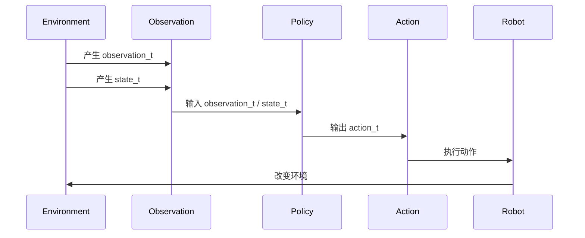

这张图强调的是“一个时间步”内部发生的事情。

### 4.4 Mermaid 图：Episode、Trajectory、Rollout 的关系

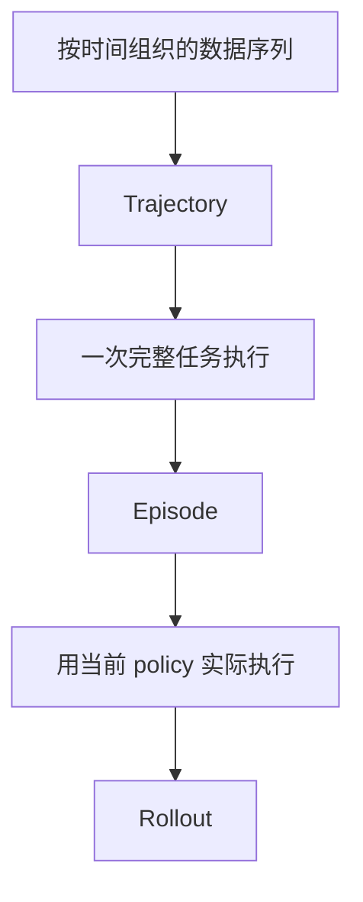

这张图不是严格数学定义，而是帮助初学者建立概念层次。

---

## 5. 工程化理解

### 5.1 为什么 observation 和 state 都重要

有些工程师会问：既然我已经有图像了，为什么还要输入机器人状态？

因为仅靠图像，策略未必能稳定推断出末端执行器精确位姿、夹爪是否闭合、当前处于哪一个动作阶段。尤其在抓取这种近距离任务中，机器人自身状态是非常关键的先验信息。

反过来，只给 state 而不给 observation，也往往不够。因为 state 能告诉你机械臂在哪，却不能告诉你盒子是否还在原位置、收纳盒是否偏了、光照和遮挡是否发生变化。

所以在工程上，一个常见而实用的策略输入形式是：

```text
observation = 视觉输入
state = 机器人内部状态
policy 输入 = observation + state
```

### 5.2 Action 定义为什么是系统上限之一

很多机器人学习实验失败，表面看像是模型学不好，实际上是 action 定义不合理。

例如：

- 直接输出关节角，可能导致迁移到另一台机械臂时几乎不能复用；
- 直接输出绝对位姿，可能对标定误差过于敏感；
- 动作频率定义不合理，可能导致控制器执行不稳定；
- 不单独建模夹爪状态，会让抓取瞬间变得含糊。

因此，action 设计既要服务策略学习，也要服务控制执行。本书主线项目选择“末端增量 + 夹爪开合”，就是为了在可学性与可执行性之间取得一个适合入门的平衡。

### 5.3 Episode 边界为什么会影响训练质量

假设你采集了 100 条示范数据，但这些示范里有些 episode 从机器人还没准备好时就开始记录，有些在任务结束后还包含很多无关动作，有些失败后还被人为补救成成功。这样的数据即使数量不少，训练出来的策略也经常会很不稳定。

因为 policy 学到的是“数据中的时间分布”。如果 episode 的边界和标签不干净，policy 就会在关键阶段做出含糊决策。

这也是为什么工程上常常需要：

- 定义 clear start / end condition；
- 统一 success / failure 判定；
- 保留失败数据但标清失败原因；
- 做 episode 可视化和质检。

这些内容在后面的第 7–8 章会进一步展开。

---

## 6. 主线项目中的位置

本章在主线项目中的作用，是把第 2 章那条 synthetic episode 变成“可理解、可读取、可检查”的数据对象。

本章新增或完善的项目文件：

```text
robot-learning-shelf-demo/
  scripts/
    01_generate_synthetic_episode.py
    02_visualize_episode.py
  notebooks/
    01_episode_structure_exploration.ipynb
```

本章完成后，项目能力推进到：

1. 可以加载已有 episode；
2. 可以打印 episode 摘要；
3. 可以看到 action 随时间的变化；
4. 可以用统一语言描述主线任务中的 observation / state / action / episode。

---

## 7. 示例

### 7.1 示例 1：一次抓盒子放入收纳盒的 episode 时间线

在主线任务中，一次典型成功 episode 可以分成以下阶段：

1. `reset`：环境重置，机器人回到初始位姿；
2. `observe`：读取桌面场景，识别盒子与收纳盒；
3. `pre_grasp`：将末端执行器移动到盒子上方；
4. `approach`：沿 z 轴下降接近物体；
5. `grasp`：关闭夹爪夹住物体；
6. `transfer`：抬起并移动到收纳盒上方；
7. `release`：打开夹爪完成放置。

这些 phase 的存在，不只是为了人读起来方便，它们在后续的数据质检和失败分类中都非常有价值。

### 7.2 示例 2：为什么 action 选择末端增量而不是关节角

假设你采集了人类遥操作演示。人类通常更容易从任务语义上理解“往前一点、往下一点、夹紧、抬起来”，而不是“第 2 关节转到多少度、第 4 关节回到多少度”。

这意味着：

- 末端增量 action 更接近任务空间；
- 它更利于将人类操作与策略学习对齐；
- 也更有利于你后续接入不同型号机械臂。

当然，这并不是说关节角 action 不可用，而是本书主线项目作为入门闭环，更适合从可解释性更强的 action 定义入手。

### 7.3 示例 3：失败 episode 的结构仍然有价值

假设一次 episode 在 `grasp` 阶段失败：夹爪关闭了，但盒子没有被夹起来。这个 episode 仍然有完整价值，因为它告诉你：

- observation 看到了什么；
- 机器人当时的 state 是什么；
- action 是如何执行的；
- 失败发生在哪个 phase；
- 下一轮应该补采怎样的示范数据。

失败 episode 并不是“脏数据”，相反，它经常是 failure taxonomy 最重要的来源。

---

## 8. 练习代码

本章新增脚本：`robot-learning-shelf-demo/scripts/02_visualize_episode.py`

```python
from __future__ import annotations

from dataclasses import dataclass
from pathlib import Path
import argparse
import json
from typing import Any


@dataclass
class EpisodeSummary:
    episode_id: str
    task_name: str
    success: bool
    num_steps: int
    phases: list[str]
    gripper_closed_steps: list[int]


def load_json(path: Path) -> Any:
    with path.open("r", encoding="utf-8") as f:
        return json.load(f)


def load_jsonl(path: Path) -> list[dict[str, Any]]:
    rows: list[dict[str, Any]] = []
    with path.open("r", encoding="utf-8") as f:
        for line in f:
            line = line.strip()
            if line:
                rows.append(json.loads(line))
    return rows


def load_episode(episode_dir: Path) -> tuple[dict[str, Any], list[dict[str, Any]], list[dict[str, Any]]]:
    meta = load_json(episode_dir / "meta.json")
    states = load_jsonl(episode_dir / "states.jsonl")
    actions = load_jsonl(episode_dir / "actions.jsonl")
    return meta, states, actions


def summarize_episode(meta: dict[str, Any], states: list[dict[str, Any]]) -> EpisodeSummary:
    phases = [row["phase"] for row in states]
    gripper_closed_steps = [row["t"] for row in states if not row["gripper_open"]]
    return EpisodeSummary(
        episode_id=meta["episode_id"],
        task_name=meta["task_name"],
        success=meta["success"],
        num_steps=meta["num_steps"],
        phases=phases,
        gripper_closed_steps=gripper_closed_steps,
    )


def print_episode_summary(summary: EpisodeSummary) -> None:
    print("=" * 60)
    print(f"Episode ID : {summary.episode_id}")
    print(f"Task       : {summary.task_name}")
    print(f"Success    : {summary.success}")
    print(f"Num steps  : {summary.num_steps}")
    print(f"Phases     : {' -> '.join(summary.phases)}")
    print(f"Gripper closed at steps: {summary.gripper_closed_steps}")
    print("=" * 60)
```

推荐运行：

```bash
cd robot-learning-shelf-demo
python scripts/02_visualize_episode.py \
  --episode_dir datasets/dataset_v0_sample/episode_0001 \
  --save_plot reports/action_timeline.png
```

如果环境中安装了 `matplotlib`，脚本还会保存 action 时间曲线图；如果没有安装，也至少会打印文本摘要。

---

## 9. 代码解释

### 9.1 这段代码解决什么问题

它解决的是：**如何把一条 episode 读取出来，并转成“人能检查、脚本能分析”的形式。**

### 9.2 输入是什么

输入是 episode 目录，目录中包含：

- `meta.json`
- `states.jsonl`
- `actions.jsonl`

### 9.3 输出是什么

输出主要有两类：

1. 文本摘要：例如 episode 长度、phase 序列、夹爪关闭发生在哪几个时间步；
2. 图形摘要：action 随时间变化的折线图（如果安装 matplotlib）。

### 9.4 为什么这一步重要

因为从这一章开始，episode 已经不再只是“被写到磁盘上的文件”，而变成了一个可以被检查、可视化、分析的工程对象。后面当我们做数据质检时，这一步会非常自然地扩展下去。

---

## 10. 常见错误

### 错误 1：把 observation 和 state 当成同一件事

很多初学者会说：“反正都是输入给模型的，分那么细干嘛？” 但一旦进入工程实践，这种混淆会直接导致数据设计混乱。视觉帧、时间戳、关节角、末端位姿和夹爪状态不应该糊成一个“万能输入字典”而不做区分。

### 错误 2：只谈 policy，不谈 action

很多人刚接触机器人学习，就很想研究模型结构。但如果不先把 action 定义清楚，policy 没有明确学习目标，训练几乎一定会变得模糊。

### 错误 3：把失败 episode 当垃圾数据

实际上，失败 episode 常常是最重要的数据来源之一。真正的问题不是“要不要保留失败数据”，而是“如何给失败数据补上阶段和原因标签”。

### 错误 4：episode 边界混乱

如果 episode 开始点和结束点不一致，有些包含 reset，有些不包含；有些失败后继续人工修复，有些直接终止，那么训练出来的策略很容易学到错误时间分布。

### 错误 5：把 trajectory、episode、rollout 完全混用

在非严格语境里偶尔混用问题不大，但做工程时最好保持清楚：trajectory 更偏序列，episode 更偏完整任务，rollout 更偏评测执行。

---

## 11. 本章练习

### 练习 1：基础练习

请用自己的语言分别解释 `observation`、`state`、`action`、`policy`、`episode`、`rollout`，并以 `pick_box_to_bin` 为例给出对应对象。

### 练习 2：工程练习

扩展 `01_generate_synthetic_episode.py`，为每个 state 增加字段 `holding_object`，表示当前夹爪是否持物。然后修改 `02_visualize_episode.py`，在摘要中打印该字段的时间步变化。

### 练习 3：进阶练习

在 `02_visualize_episode.py` 中增加一个统计：计算动作序列中 `dz` 的累计变化，并据此估计“接近阶段”和“抬升阶段”的时间步范围。

### 练习 4：思考练习

如果给主线任务增加一台 wrist camera，那么 observation 和 state 应该如何变化？哪些数据应该放进 observation，哪些仍应放进 state？

### 练习 5：设计练习

为 `pick_box_to_bin` 设计一个你认为更合理的 action 表达，并说明：

- 为什么这样设计；
- 它的优点是什么；
- 它对控制器和训练会带来什么代价。

---

## 12. 本章产出

本章应产出：

1. 一套清晰的机器人学习最小概念体系；
2. 对主线任务 `pick_box_to_bin` 的数据对象拆解；
3. 一个 episode 加载与摘要脚本 `02_visualize_episode.py`；
4. 一个可继续扩展的 Notebook 占位文件 `01_episode_structure_exploration.ipynb`；
5. 为第 4 章进入模仿学习与行为克隆做好输入输出准备。

---

## 13. 小结

本章你需要真正记住的，不是术语定义本身，而是它们之间的关系。

- observation 是机器人看到的；
- state 是系统所处的配置；
- action 是下一步控制输出；
- policy 是从 observation / state 到 action 的映射；
- episode 是一次完整任务执行过程；
- rollout 是让 policy 真正跑起来做评测。

这些概念一旦在脑中稳定，后面任务定义、数据格式、行为克隆训练和评测协议都会变得顺很多。相反，如果这里混乱，后面每一章都会觉得“看着懂，一做就乱”。

下一章，我们将在这个概念地基上继续前进，进入模仿学习、行为克隆、ACT 与 Diffusion Policy。届时你会看到：策略学习并不是一个抽象大词，而是从本章的 observation / state / action 关系中自然长出来的。

---

# 第 4 章：模仿学习、行为克隆、ACT 与 Diffusion Policy

到了这一章，我们终于开始正面回答一个很多读者最关心的问题：**机器人学习里的“学”，到底是在学什么？**

前两章我们已经建立了两层地基。

第一层地基，是方向地基：具身智能不是“机器人 + 大模型”的口号，而是任务、数据、策略、评测与失败回收构成的工程闭环。

第二层地基，是概念地基：机器人学习中的 observation、state、action、policy 与 episode，到底分别是什么，以及它们在主线项目 `pick_box_to_bin` 中如何落地。

有了这两层地基，今天我们终于可以进入策略学习本身。具体来说，本章要回答四个关键问题：

1. 什么是模仿学习（Imitation Learning）？
2. 什么是行为克隆（Behavior Cloning, BC）？
3. 为什么单步 BC 在机器人任务中容易出现误差累积？
4. 为什么本书建议你先做 ACT 风格的 action chunk predictor，而不是一开始就追逐大型 VLA？

这一章会非常重要，因为它决定了本书后续“训练路线”的技术口径。我们不会从一开始就追求复现大模型，也不会在尚未理解输入输出关系前就被复杂网络结构淹没。相反，我们会从一个**最小、可运行、可解释的玩具任务**入手：一个二维平面上的点（point-mass）如何从起点移动到目标点。然后用这个玩具任务建立对 BC 与 ACT 的直觉，再把这种直觉迁移到真实机械臂任务。

这也是本书一贯的思路：**先用最小系统理解核心机制，再逐步接近真实系统。**

---

## 1. 本章要解决的问题

本章重点解决以下八个问题：

1. 为什么模仿学习本质上是一种监督学习？
2. 行为克隆在数学上与普通的输入—输出拟合有什么关系？
3. 什么叫 covariate shift，为什么机器人滚动执行时会更严重？
4. 为什么单步预测 action 容易在长时序任务里误差累积？
5. ACT 的 action chunking 到底在解决什么问题？
6. Diffusion Policy 的核心直觉是什么，它与 ACT 有什么异同？
7. 为什么本书先做 ACT 风格 baseline，而不是一上来做大型 VLA？
8. 在主线项目中，如何先用一个极简脚本体验“单步 BC vs chunk predictor”的差异？

这些问题看上去像是模型问题，但其实背后都指向同一件事：**策略如何在时间上稳定地产生动作。**

---

## 2. 为什么这个问题重要

很多初学者一听到机器人学习，会自然地把关注点放在“模型名称”上。比如：

- 现在最火的是不是 ACT？
- Diffusion Policy 是不是已经比 BC 强很多？
- VLA 会不会统一一切？
- 我要不要直接研究 GR00T、π0 或 Gemini Robotics？

这些问题都值得关心，但如果你在学习顺序上把“模型名词”放在“问题结构”前面，就很容易学偏。

真正应该先问的是：

- 策略输入是什么？
- 策略输出是什么？
- 输出是一时刻动作，还是一段动作块？
- 策略训练目标是什么？
- rollout 时为什么会漂？
- 失败是模型太弱，还是 action 定义不合理，还是 episode 切分不对？

一旦把这些问题问清楚，你就会发现：

- BC 是最基础、最直接的模仿学习方法；
- ACT 的价值不是“更复杂”，而是“更适合较长时序动作任务”；
- Diffusion Policy 的价值不是“名字高级”，而是“更适合建模多模态动作分布”；
- 大型 VLA 的价值也不是“会说话”，而是如何把视觉、语言和动作真正统一到可执行策略中。

因此，本章的重要性在于：它会帮你建立一种**以问题驱动、而不是以名词驱动**的学习视角。

---

## 3. 核心概念

### 3.1 模仿学习：从专家示范中学策略

模仿学习，英文是 Imitation Learning。它的核心思想可以压缩成一句话：

> 不依赖环境奖励函数，而是通过学习专家示范，让策略学会在给定 observation / state 下输出合理 action。

如果你熟悉自动驾驶，其实这个思想并不陌生。很多端到端驾驶策略，本质上也是在学习人类驾驶行为或高质量控制器行为。只不过在机器人任务里，模仿学习通常更直接，因为很多任务天然适合通过示范来表达，比如：

- 抓住盒子；
- 把物体放进收纳盒；
- 把瓶子摆正；
- 用机械臂完成简单装配；
- 通过遥操作采集 pick-and-place 轨迹。

模仿学习的优势在于：

1. 任务意图容易表达；
2. 不需要精心设计奖励函数；
3. 很适合从小任务、小数据开始快速迭代；
4. 与真实机器人示范数据天然兼容。

但它也有明显挑战：

1. 示范数据质量直接决定上限；
2. 数据分布覆盖范围有限；
3. rollout 时容易偏离训练分布；
4. 一旦策略进入没见过的状态，很可能迅速崩坏。

### 3.2 行为克隆：最直接的模仿学习形式

行为克隆（Behavior Cloning, BC）可以视为模仿学习中最直接、最朴素的一种形式。

在 BC 中，我们通常有一组监督样本：

```text
(observation_t, action_t)
```

或者更严格一点：

```text
(observation_t, state_t) -> action_t
```

训练目标就是让策略网络拟合专家在这个时刻给出的动作。它和普通监督学习非常像：

- 输入：当前观测与状态；
- 标签：专家动作；
- 损失：MSE、L1 或分类损失；
- 输出：预测动作。

因此，如果要从工程角度解释 BC，可以把它看成：

> 一个从 observation / state 到 action 的监督学习问题。

这也是为什么本书前面要花很多篇幅讲 observation、state 和 action。因为一旦这些对象定义清楚，BC 的输入输出就非常自然了。

### 3.3 单步 BC 的问题：covariate shift 与误差累积

BC 最大的问题，并不是“它太简单”，而是它在 rollout 阶段会遇到一个非常现实的问题：**covariate shift（协变量偏移 / 分布偏移）**。

它的直觉是这样的：

1. 训练数据来自专家轨迹；
2. 策略在训练时总是看到“专家会到达的状态”；
3. 但 rollout 时，策略执行的是自己的动作；
4. 只要某一步动作有一点偏差，下一步看到的 observation 就和专家状态不一样；
5. 于是策略开始在“自己没见过的状态”上继续预测；
6. 误差就会一步步积累，最终越来越偏。

这个问题在短时任务里不一定很严重，但在较长时序任务里会非常突出。比如，抓取任务里只要接近阶段偏了几厘米，后面夹爪闭合、抬起、转移和释放都会受影响。

### 3.4 Action Chunk：为什么一次预测多个动作更有帮助

ACT 的核心直觉之一，就是不要只预测一步动作，而是**一次预测一段动作块（action chunk）**。

假设单步 BC 的输出是：

```text
a_t
```

那么 action chunk predictor 的输出可能是：

```text
[a_t, a_{t+1}, a_{t+2}, ..., a_{t+k}]
```

这样做的直觉收益有三点。

**第一，输出更有时序计划性。**

单步 BC 更像每一步都临时决定下一步；action chunk 更像先给出一小段局部动作计划。

**第二，减少高频重规划带来的漂移。**

当策略在较短窗口内输出多个动作时，它能在更长时间范围上保持动作一致性，而不是每一步都对小噪声过度敏感。

**第三，更适合机器人操作任务。**

机器人很多动作天然具有短时连续结构，比如：

- 靠近物体；
- 下降；
- 闭合夹爪；
- 抬起；
- 平移；
- 释放。

这些动作不是孤立点，而是局部连续片段。action chunking 正好匹配这种结构。

### 3.5 ACT：为什么它适合入门路线

本书提到的 ACT，可以先从“Action Chunking with Transformers 的直觉”来理解，而不是一开始追求论文复现细节。

在我们的学习路线中，ACT 的价值体现在：

1. 它清晰地强调了 action chunk 的重要性；
2. 它比大型 VLA 更聚焦于机器人动作预测本身；
3. 它天然适合基于示范数据做模仿学习 baseline；
4. 它很适合作为“小任务闭环”的第一阶段策略模型。

换句话说，ACT 之所以适合作为入门路线，并不是因为它最先进，而是因为它在工程路径上位置很合适：

- 前面可以接任务定义、episode 数据与数据质检；
- 中间可以连接 observation / action 的时间建模；
- 后面可以自然接 rollout 评测与 failure case 分析。

### 3.6 Diffusion Policy：多模态动作分布的另一种思路

如果说 ACT 更强调 action chunk 的时序组织，那么 Diffusion Policy 更强调动作分布的生成能力。

很多机器人任务并不是“只有一种正确动作”。例如，从桌面抓一个盒子，可能有多条都能成功的接近轨迹。如果你强行用回归做平均，很可能会得到一条“平均之后谁都不像”的轨迹。

这就是 Diffusion Policy 受关注的重要原因之一：它更适合建模**多模态动作分布**。

在入门层面，你不需要一开始就掌握扩散模型的全部数学细节。只需要先把直觉记住：

- BC 往往输出一个点估计；
- Diffusion Policy 更像在动作空间中逐步生成一个合理样本；
- 当存在多种可行动作模式时，它通常比简单回归更有优势。

但本书当前阶段不会先做 Diffusion Policy baseline。原因不是它不重要，而是它对工程与理解门槛更高，而我们当前最需要的是先把数据闭环与最小策略训练链路跑通。

### 3.7 为什么本书不先做大型 VLA

很多读者可能会问：既然现在 VLA 很火，为什么不一开始就做 VLA？

答案其实很明确：**因为在还没掌握任务定义、数据格式、策略输出与评测流程之前，直接做 VLA 基本没有工程抓手。**

大模型路线并不会替代这些基础环节：

- observation 仍然要定义；
- state 仍然要整理；
- action 仍然要能执行；
- episode 仍然要切分；
- rollout 仍然要评测；
- failure case 仍然要回收。

所以，本书先走这条路线：

```text
任务定义 / episode / 数据质量 → BC / ACT baseline → rollout 评测 → failure 闭环 → 再讨论更大的模型系统
```

这不是保守，而是工程上更稳。

---

## 4. 概念图 / 流程图 / 架构图

### 4.1 图 4-1 单步 BC 与 ACT / Chunk Prediction 对比


这张图是本章最重要的图之一。它把两个核心差异讲得很直观：

- BC 输出单个 action；
- ACT / chunk predictor 一次输出一段 action chunk。

更重要的是，图中用二维点到目标的例子把误差累积可视化了。左边单步 BC 的轨迹会逐渐偏离，右边 chunk predictor 的轨迹更平滑、更稳定。

### 4.2 图 4-2 模仿学习训练流程图


这张图把本章的最小训练闭环完整表达了出来：

1. 收集示范数据；
2. 对数据做整理与切片；
3. 构造 `(o_t, a_t)` 或 `(o_t, a_{t:t+k})` 样本；
4. 训练 BC 或 chunk predictor；
5. rollout 评测；
6. 失败分析；
7. 补充数据；
8. 再训练。

这张图很重要，因为它不是“玩具任务专用图”，而是后面真实机器人训练都适用的通用骨架。

### 4.3 Mermaid 图：BC 与 action chunk 的输出差异

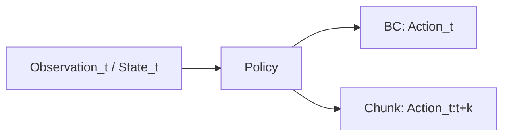

### 4.4 Mermaid 图：模仿学习最小闭环

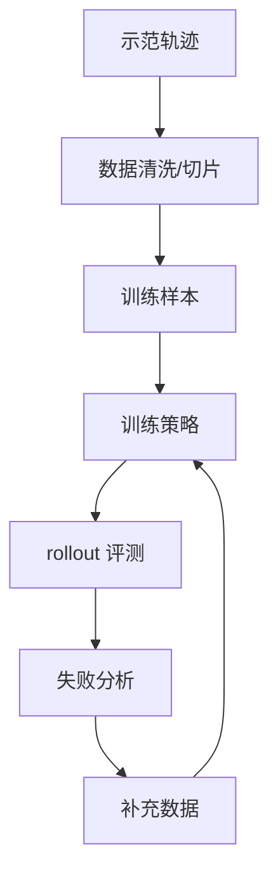

---

## 5. 工程化理解

### 5.1 为什么本章先用二维点任务

很多人会问：为什么不直接上机械臂？

因为在机械臂任务里，变量太多：

- 视觉噪声；
- 相机位姿；
- 夹爪接触；
- 控制器延迟；
- 动作边界；
- 状态同步；
- 失败终止。

如果一开始就上真机，你很难判断 rollout 崩掉到底是：

- 模型没学会；
- action 定义不好；
- 控制器不稳定；
- 数据切片不对；
- 还是环境本身太复杂。

二维点任务虽然简单，但它非常适合帮你单独看清一件事：**单步动作预测与 chunk 预测在时间上的差异。**

### 5.2 为什么“简单可运行”比“复杂但不清楚”更重要

你会发现，本章给出的训练脚本并不是一个“真正的 ACT 论文复现”，而是一个极简版本的 chunk predictor。这是有意为之。

对学习者来说，最有价值的往往不是一份堆满依赖、很难运行的大工程，而是一份：

- 可以运行；
- 可以看懂；
- 可以修改 chunk 长度；
- 可以自己观察 rollout 行为变化；
- 能把概念和工程结果对应起来的脚本。

这正是本书训练路线的特点：先建立直觉，再增加复杂度。

### 5.3 BC、ACT 与 Diffusion Policy 在学习路线中的关系

在本书的学习路径里，它们的关系可以这样理解：

- **BC**：你理解最基础的模仿学习输入输出；
- **ACT / chunk predictor**：你理解多步动作预测与时间结构；
- **Diffusion Policy**：你理解多模态动作分布与更强生成能力；
- **VLA**：你把视觉、语言和动作统一放进更大的系统视角里。

因此，这不是“谁淘汰谁”的关系，而是**学习深度逐步增加**的关系。

---

## 6. 主线项目中的位置

本章在主线项目中的作用，是为后续正式策略训练准备第一个“策略训练脚本雏形”。

本章新增文件：

```text
robot-learning-shelf-demo/
  scripts/
    05_train_act_baseline.py
  reports/
    ch04_toy_act_report.json
    ch04_toy_act_rollout.png
```

请注意，这里的 `05_train_act_baseline.py` 还不是针对真实机械臂 episode 的最终训练脚本，而是一个**概念脚手架**：

- 它先在二维 toy task 上对比 BC 与 chunk predictor；
- 帮你形成对 action chunk 的直觉；
- 为后面正式接入真实机器人数据做准备。

---

## 7. 示例

### 7.1 示例 1：二维点移动中的单步预测

设想一个简单任务：平面上有一个点，初始位置是 `(x, y)`，目标位置是 `(g_x, g_y)`。专家策略每一步都输出一个朝向目标的小位移。

如果我们用 BC 学习，训练样本就是：

```text
[x, y, g_x, g_y] -> [dx, dy]
```

这看起来没问题，但一旦 rollout 时某一步方向偏了一点，后面的 observation 就会改变。于是模型开始在自己不熟悉的状态上继续预测，误差越来越大。

### 7.2 示例 2：二维点移动中的 chunk 预测

如果改成 chunk predictor，那么训练样本变成：

```text
[x, y, g_x, g_y] -> [dx_t, dy_t, dx_t+1, dy_t+1, ..., dx_t+k, dy_t+k]
```

虽然这并不能神奇地消灭所有误差，但它能让局部动作更有连续性，也更容易表现出“短时规划”的效果。

### 7.3 示例 3：为什么平均动作会导致不合理路径

假设对同一个起始 observation，专家示范中存在两条都正确的路径：一条从左绕过去，一条从右绕过去。如果你直接做回归平均，模型可能学到一条“从中间穿过去”的无效路径。

这也是为什么在更复杂任务里，Diffusion Policy 会显得更有吸引力，因为它不只是输出一个平均点，而是更擅长表达多种可能的动作分布。

---

## 8. 练习代码

本章核心代码文件：`robot-learning-shelf-demo/scripts/05_train_act_baseline.py`

这段代码会做四件事：

1. 生成二维点到目标的专家示范数据；
2. 训练一个单步 BC 线性模型；
3. 训练一个 chunk predictor 线性模型；
4. 对比两者 rollout 表现，并保存报告和图像。

核心训练思路如下：

```python
# BC 样本
obs = [x, y, gx, gy]
action = [dx, dy]

# Chunk 样本
obs = [x, y, gx, gy]
action_chunk = [dx_t, dy_t, dx_t+1, dy_t+1, ..., dx_t+k-1, dy_t+k-1]
```

推荐运行方式：

```bash
cd robot-learning-shelf-demo
python scripts/05_train_act_baseline.py \
  --num_train 400 \
  --num_eval 80 \
  --chunk_size 4
```

运行后预期得到：

```text
reports/ch04_toy_act_report.json
reports/ch04_toy_act_rollout.png
```

你可以重点关注以下输出：

- BC 的 success_rate；
- Chunk predictor 的 success_rate；
- 两者 mean_final_error 的差异；
- rollout 图里两条轨迹的稳定性差异。

---

## 9. 代码解释

### 9.1 这段代码解决什么问题

它解决的是：**如何用最小依赖、最小环境复杂度，建立对 BC 与 action chunk 的直觉。**

### 9.2 输入是什么

输入并不是外部数据集，而是脚本内部生成的专家轨迹。每条轨迹包含：

- 起点坐标；
- 目标点坐标；
- 专家在每个时间步给出的动作。

### 9.3 输出是什么

输出是两类结果：

1. `ch04_toy_act_report.json`：保存训练设置与评测统计；
2. `ch04_toy_act_rollout.png`：可视化 BC 与 chunk predictor 的 rollout 轨迹。

### 9.4 为什么使用线性回归而不是复杂神经网络

因为本章的重点不是追求高性能，而是把策略训练链路压缩到最容易理解的形式。只要读者能看懂：

- 样本是怎样构造的；
- BC 与 chunk 的标签如何不同；
- rollout 时为什么会出现差异；

那么本章的教学目标就已经达成。

### 9.5 如何接入主线项目

当前脚本是 toy task，用于建立直觉。后续接入真实项目时，这个脚本将迁移成：

- 用真实 episode 构造样本；
- observation 来自真实图像与 robot state；
- action 来自机械臂末端增量与夹爪状态；
- rollout 从二维模拟变成真实机器人或仿真评测。

---

## 10. 常见错误

### 错误 1：把模仿学习理解成“照着抄动作”

模仿学习不是机械复制动作，而是学习在给定 observation / state 下该如何决策。动作只是监督标签，真正学的是映射关系。

### 错误 2：只看离线损失，不看 rollout

很多模型离线 loss 看起来不错，但 rollout 一跑就漂。因为真正的问题不是拟合专家点，而是在执行时会不会进入训练分布外状态。

### 错误 3：把 ACT 理解成“比 BC 更复杂所以更高级”

ACT 的意义不在于复杂，而在于它针对时间结构和误差累积问题提供了更适合的动作表达。

### 错误 4：用大模型名词替代理解

如果没有先理解 BC、action chunk 与 rollout 之间的关系，那么直接讨论 VLA、GR00T 或 Diffusion Policy，往往会变成“知道术语，但不知道为什么要这样做”。

---

## 11. 本章练习

### 练习 1：基础练习

请用自己的语言解释：为什么 BC 可以被看作一种监督学习？

### 练习 2：基础练习

请解释 covariate shift 的形成过程，并用 `pick_box_to_bin` 的抓取任务举一个现实例子。

### 练习 3：工程练习

修改 `05_train_act_baseline.py` 的 `--chunk_size` 参数，分别尝试 `2`、`4`、`6`，比较不同 chunk 长度下的评测结果。

### 练习 4：进阶练习

在二维点任务中加入执行噪声，让 rollout 时每一步动作都叠加小随机扰动，观察 BC 与 chunk predictor 的差异是否变大。

### 练习 5：思考练习

为什么真实机械臂任务比二维点任务更难？请从 observation、action、接触、时间同步与失败类型五个角度回答。

---

## 12. 本章产出

本章应当产出：

1. 对模仿学习、BC、ACT 与 Diffusion Policy 的整体理解；
2. 一个可运行的极简训练脚本 `05_train_act_baseline.py`；
3. 一份评测报告 `ch04_toy_act_report.json`；
4. 一张 rollout 对比图 `ch04_toy_act_rollout.png`；
5. 为后续进入 VLA 与任务配置奠定正确的策略学习视角。

---

## 13. 小结

这一章你最需要记住的，并不是某个论文名，而是一个策略学习上的核心判断：

> 机器人策略学习的关键问题，不只是“会不会预测动作”，而是“能不能在时间上稳定地预测动作”。

BC 帮你理解最基础的监督学习式策略拟合；ACT 帮你理解 action chunk 对时间结构的好处；Diffusion Policy 则提醒你动作分布可能是多模态的，不一定能用一个平均值解释。

本书之所以先做 ACT 风格 baseline，是因为它在工程上位置非常合适：既能接住前面的任务与数据闭环，又能自然通向后面的 rollout 评测和失败分析。

下一章，我们会把视角再向前推一步：从模仿学习与 chunk 预测，走向 VLA（Vision-Language-Action）。但我们不会把 VLA 神秘化，而是要准确回答一个更重要的问题：**VLA 到底比 VLM 多了什么？**

---

# 第 5 章：VLA 的本质：Vision-Language-Action

如果说第 4 章解决的是“机器人策略如何从示范中学习动作”，那么第 5 章要解决的，就是另一个同样容易被误解的问题：**VLA 到底是什么？**

在今天的技术传播环境里，VLA 这个词经常被说得很神奇。很多演示视频会给人一种印象：

- 机器人看到了画面；
- 人给了它一句自然语言；
- 它就像人一样理解了任务；
- 然后顺利完成动作。

于是，很多人会不自觉地把 VLA 理解成“能聊天的机器人模型”。但这种理解是危险的，因为它会把“理解”和“执行”混在一起。

本章的核心目标，就是把这件事彻底讲清楚：

- VLM 擅长理解和描述；
- VLA 的关键则是从视觉、语言与机器人状态，映射到**可执行动作**；
- 语言理解本身，并不能替代机器人动作数据；
- 结构化任务解析，是自然语言走向机器人执行的重要中间层。

我们还会回答一个非常现实的问题：为什么本书在当前阶段并不急着复现大型 VLA，而是先推进任务定义、数据闭环与 ACT baseline？

---

## 1. 本章要解决的问题

本章重点解决以下八个问题：

1. Vision-Language-Action 中的 Vision、Language、Action 分别指什么？
2. VLM 与 VLA 的差异到底在哪里？
3. 为什么会“看图说话”不等于“会控制机器人”？
4. 为什么互联网视觉语言知识不能直接变成可靠机器人动作？
5. 大规模机器人动作数据为什么如此关键？
6. GR00T、Gemini Robotics、π0、Open X-Embodiment、LeRobot 这些名字，在学习路径中分别应该如何理解？
7. 为什么语言指令通常要先转成结构化任务，而不是直接让机器人“自由发挥”？
8. 在主线项目中，如何先实现一个规则版的 task parser，作为“语言 → 结构化任务”的雏形？

---

## 2. 为什么这个问题重要

如果不把 VLA 说清楚，读者在后续学习中很容易掉进两个极端。

### 极端一：把 VLA 神化

这种极端通常表现为：

- 认为只要有了强大的视觉语言模型，机器人就自然会做动作；
- 认为语言理解几乎可以替代任务定义；
- 认为只要“模型足够大”，动作策略、控制边界、episode 数据和 rollout 评测都不再重要。

这显然不符合工程现实。一个机器人系统能否完成任务，最终还是要看：

- action 是否可执行；
- 机器人状态是否纳入决策；
- 真实动作数据是否足够；
- 失败是否能被回收与迭代。

### 极端二：把 VLA 贬成“噱头”

另一种极端则认为：

- VLA 只是把文字提示加到模型里；
- 机器人还是老一套，只不过包了一层 LLM；
- 语言根本没什么价值。

这同样不准确。语言对机器人系统的价值并不在于“陪你聊天”，而在于：

- 它可以表达任务目标；
- 它可以提供高层约束；
- 它可以帮助统一多任务表述；
- 它可以支持更一般化的人机交互接口。

所以，本章的重要性就在于：**把 VLA 放回正确的位置。既不神化，也不低估。**

---

## 3. 核心概念

### 3.1 Vision-Language-Action 分别是什么

一个 VLA 系统的名字本身已经说明了它的三类核心输入输出元素：

#### Vision

Vision 指视觉输入，通常包括：

- 相机 RGB 图像；
- RGBD；
- 多视角图像；
- 腕部相机图像；
- 有时也包括由视觉提取的中间表征。

#### Language

Language 指自然语言任务描述，例如：

- “把红色盒子放进右边收纳盒”；
- “把歪掉的盒子摆正”；
- “把桌面上的垃圾放进垃圾盒”。

语言的价值在于表达任务目标与约束，而不是直接代替控制器。

#### Action

Action 指机器人可执行的动作输出。它可能是：

- 关节角目标；
- 末端位姿；
- 位姿增量；
- 夹爪开合；
- 动作块；
- 更底层的控制命令。

因此，VLA 与 VLM 的最本质差别就在这里：**VLA 的输出不是文本，而是动作。**

### 3.2 VLM 与 VLA：理解与执行的分界线

VLM（视觉语言模型）擅长做的事情通常包括：

- 看图描述；
- 回答图像相关问题；
- 识别场景中的物体和关系；
- 根据语言进行视觉理解。

例如，给它一张桌面图片，它可以回答：

- 红色盒子在右侧；
- 蓝色盒子在左侧；
- 桌面上有两个盒子和一个机械臂。

这些能力很重要，但它们并不直接等于动作能力。

VLA 则进一步要求模型完成：

- 基于视觉观察；
- 结合语言任务；
- 再结合机器人状态；
- 最终输出一串能被机器人执行的动作序列。

所以，你可以把它们的差异概括成：

- **VLM：从图像与语言到文本；**
- **VLA：从图像、语言与状态到动作。**

### 3.3 为什么互联网知识不能直接变成机器人动作

很多视觉语言模型训练于海量互联网图文数据。这给了它们极强的常识理解与视觉语义能力，但机器人动作并不只是“知道世界是什么”。

机器人动作还需要：

- 知道自己当前的关节状态；
- 知道夹爪是否开合；
- 知道目标在三维空间中的相对关系；
- 知道控制输出会如何改变环境；
- 知道哪些动作是安全的、可执行的。

这些信息，很多都不在互联网图文里。更重要的是，真实机器人动作数据远比互联网图文稀缺，因此动作头（action head）学到的能力更加珍贵，也更依赖高质量示范数据。

### 3.4 robot action data 为什么稀缺

机器人动作数据比图像文本数据稀缺，主要有五个原因：

1. **采集成本高**：需要真实机器人、相机、控制系统与人工示范；
2. **数据结构复杂**：不仅有图像，还有状态、动作、时间戳、成功标签；
3. **时序同步要求高**：不同模态必须在时间上对齐；
4. **任务覆盖难**：不同场景、物体和约束组合很多；
5. **失败也有成本**：真机试错不如纯文本数据便宜。

这也是为什么大规模机器人数据集如此重要。没有足够高质量动作数据，VLA 很难真正学会“执行”。

### 3.5 Open X-Embodiment、LeRobot、GR00T、Gemini Robotics、π0 在学习路径中的位置

这些名字常常会同时出现，但它们并不处在同一层次。

- **Open X-Embodiment**：更像大规模具身数据与研究生态的重要代表；
- **LeRobot**：更贴近工程实践与开源训练流程，是个人学习者更容易接近的入口；
- **GR00T、Gemini Robotics、π0**：代表更大规模、更系统化的机器人基础模型或 VLA 方向探索。

对于个人工程师来说，正确的顺序不是直接“复现大模型”，而是：

1. 理解任务定义；
2. 跑通数据闭环；
3. 做出 BC / ACT baseline；
4. 再去理解大型 VLA 为什么成立、缺什么数据、解决什么问题。

### 3.6 语言指令为什么要先结构化

假设用户说：

```text
把红色盒子放进右边收纳盒。
```

对人来说，这句话似乎很自然。但对机器人系统来说，其中仍然有很多隐含内容需要明确：

- 红色盒子指哪个 object？
- 右边收纳盒在当前场景里对应哪个 target？
- 是否要求盒子保持竖直？
- 是否有时间上限？
- 是否允许碰撞？
- 怎样才算成功？

因此，语言指令通常需要先解析成结构化任务。例如：

```json
{
  "task_name": "pick_box_to_bin",
  "object": {"type": "box", "color": "red"},
  "target": {"name": "right_storage_box"},
  "constraints": {"avoid_collision": true, "keep_upright": true},
  "success_criteria": {"in_target": true, "released": true}
}
```

结构化任务的重要性在于：

1. 更可验证；
2. 更可复现；
3. 更利于数据记录；
4. 更利于系统边界控制；
5. 更容易成为下游策略系统的稳定输入。

### 3.7 语言不能替代动作数据

这是本章最重要的判断之一。

语言非常重要，但语言不能替代动作数据。它能告诉机器人“要做什么”，却不能自动告诉机器人“具体如何做”。

在机器人系统里：

- 语言负责目标；
- 视觉负责感知环境；
- 状态负责描述机器人自身；
- 动作数据负责告诉策略怎样执行。

如果没有动作数据，VLA 最容易停留在“看起来懂任务，但不一定做得出来”的阶段。

---

## 4. 概念图 / 流程图 / 架构图

### 4.1 图 5-1 VLM 与 VLA 的区别


这张图把本章最核心的差别表达得很清楚：

- 左边 VLM 的输出是文本答案；
- 右边 VLA 的输出是动作序列。

请特别注意图中那个高亮判断：

> VLA 的关键不是聊天，而是从 observation / instruction / state 到 action 的映射。

### 4.2 图 5-2 从自然语言指令到结构化机器人任务


这张图把本章主线项目新增能力说得很直观：先把自然语言任务解析成结构化 JSON / YAML，再让后续策略系统使用它。

### 4.3 Mermaid 图：VLA 输入输出结构

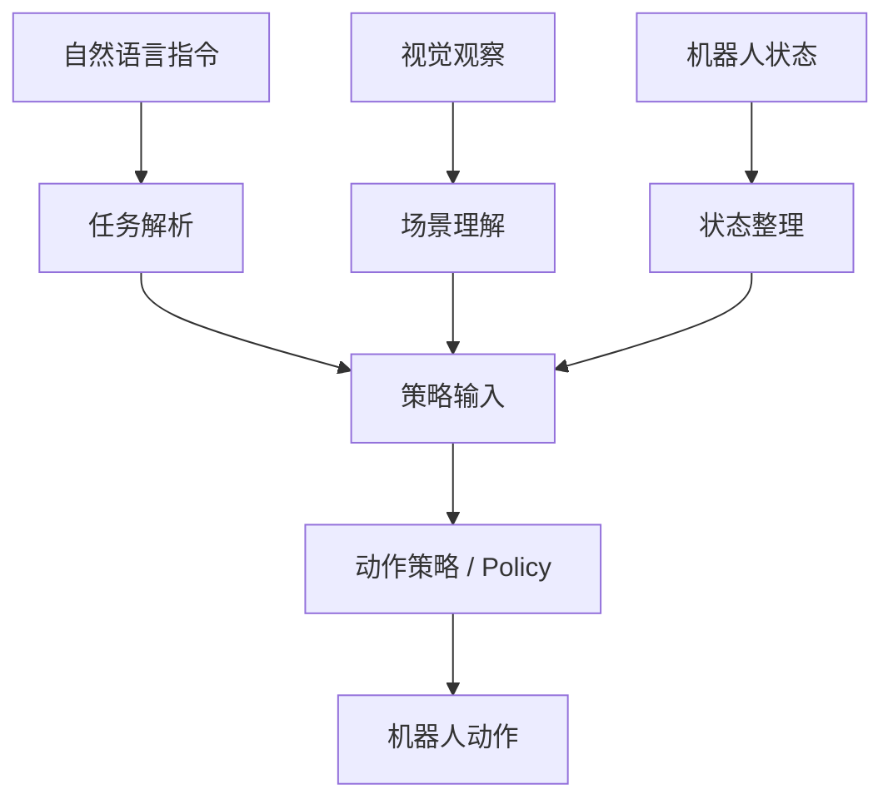

### 4.4 Mermaid 图：语言到结构化任务配置

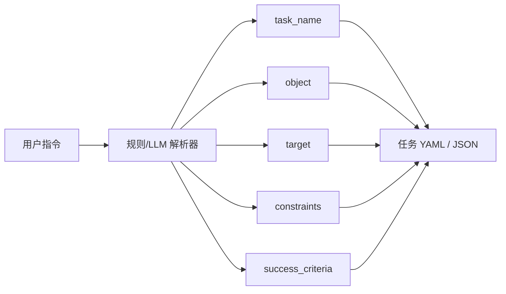

---

## 5. 工程化理解

### 5.1 为什么规则解析器仍然有价值

很多读者看到“语言 → 任务解析”时，第一反应可能是：为什么不用 LLM，为什么还要写规则？

原因很简单：本书当前阶段的目标不是追求语言理解能力最强，而是先建立一个**稳定、可控、可验证**的任务接口。

规则解析器的优点在于：

- 输出字段明确；
- 可控性强；
- 很适合小范围任务验证；
- 更容易与后续 YAML 配置对接；
- 能清楚暴露哪些语义还没有被支持。

因此，规则解析器不是“最终方案”，而是一个非常好的教学与工程脚手架。

### 5.2 为什么本章不急着做真正 VLA 训练

因为真正的 VLA 训练至少需要：

- 大量机器人动作数据；
- 统一的 observation / instruction / state / action 表达；
- 较完整的训练与评测流程；
- 足够强的计算与实验条件。

如果在这些基础尚未成型前直接上 VLA，学习者很容易只剩下“看论文、看架构图、看演示视频”，却无法形成真正的工程能力。

所以，本章在主线项目中的推进是非常务实的：

- 先支持自然语言指令输入；
- 再解析为结构化任务；
- 然后在后续章节中，把结构化任务真正接到任务定义、episode 采集与策略训练上。

### 5.3 语言在机器人系统中的真实位置

语言最适合处在系统的“高层任务接口”位置。它特别擅长：

- 描述任务目标；
- 给出高层限制；
- 统一多任务表述；
- 作为人机交互入口。

但越往底层，语言就越需要被转化成更明确、更结构化的表示。因为控制系统和动作策略更需要的是：

- 明确 object；
- 明确 target；
- 明确 success criteria；
- 明确可执行约束。

这就是为什么“自然语言 → 结构化任务”会成为本书主线项目中的重要一环。

---

## 6. 主线项目中的位置

本章在主线项目中的作用，是让项目第一次具备“语言指令入口”。

新增文件：

```text
robot-learning-shelf-demo/
  configs/
    task_pick_box_to_bin.yaml
  scripts/
    rule_based_task_parser.py
```

项目新增能力：

1. 读者可以输入自然语言指令；
2. 解析器会抽取 task_name、object、target、constraints；
3. 输出结构化 JSON；
4. 在具备 PyYAML 时，还可以输出 YAML；
5. `task_pick_box_to_bin.yaml` 为后续第 6 章正式任务定义做铺垫。

---

## 7. 示例

### 7.1 示例 1：“把红色盒子放进右边收纳盒”如何解析

原始指令：

```text
把红色盒子放进右边收纳盒
```

解析结果可以是：

```json
{
  "task_name": "pick_box_to_bin",
  "instruction": "把红色盒子放进右边收纳盒",
  "object": {
    "type": "box",
    "color": "red"
  },
  "target": {
    "name": "right_storage_box"
  },
  "constraints": {
    "workspace": "table_top",
    "avoid_collision": true,
    "keep_upright": false,
    "max_time_sec": 30
  },
  "success_criteria": {
    "in_target": true,
    "released": true,
    "object_upright": false
  }
}
```

### 7.2 示例 2：VLM 能理解，但不一定能执行

假设你给一个 VLM 输入一张桌面图像，再问：

```text
红色盒子在哪里？
```

VLM 很可能回答：

```text
红色盒子在桌面右侧，蓝色盒子在左侧。
```

这说明它理解了视觉内容。但如果你想让机器人去抓取红色盒子，再放到蓝色盒子左侧，仅靠这句文本描述还远远不够。你仍然需要：

- 机器人状态；
- 动作表示；
- 控制执行；
- 成功标准；
- 动作数据支撑的策略。

### 7.3 示例 3：结构化任务 YAML

文件：`robot-learning-shelf-demo/configs/task_pick_box_to_bin.yaml`

这份 YAML 会包含：

- object 类型与颜色；
- target 名称；
- action mode；
- observation modalities；
- constraints；
- success / failure criteria；
- randomization 参数。

它是后续第 6 章正式任务定义的雏形，而不是最终版。

---

## 8. 练习代码

本章核心代码文件：`robot-learning-shelf-demo/scripts/rule_based_task_parser.py`

这个脚本会完成：

1. 接收自然语言指令；
2. 提取颜色、物体类型与目标区域；
3. 推断 task_name；
4. 构造 constraints 与 success_criteria；
5. 输出 JSON，并在可用时输出 YAML。

推荐运行方式：

```bash
cd robot-learning-shelf-demo
python scripts/rule_based_task_parser.py \
  --instruction "把红色盒子放进右边收纳盒" \
  --output_json reports/ch05_task_parse.json
```

如果环境安装了 `PyYAML`，你还可以这样输出 YAML：

```bash
python scripts/rule_based_task_parser.py \
  --instruction "请将红色盒子轻放到右边收纳盒，保持竖直" \
  --output_json reports/ch05_task_parse.json \
  --output_yaml reports/ch05_task_parse.yaml
```

脚本的教学重点并不在“语义理解最强”，而在于让你明白：**自然语言要进入机器人系统，往往必须先被约束化。**

---

## 9. 代码解释

### 9.1 这段代码解决什么问题

它解决的是：**如何把一个自然语言任务，转成结构清晰、可验证、可存储的任务对象。**

### 9.2 输入是什么

输入是一条自然语言指令，例如：

- 把红色盒子放进右边收纳盒；
- 请将红色的盒子放入右侧收纳盒中；
- 把那个红色盒子放到右边的收纳盒里吧。

### 9.3 输出是什么

输出是结构化任务配置，包括：

- `task_name`
- `object`
- `target`
- `constraints`
- `success_criteria`

### 9.4 为什么这个脚本重要

因为它让主线项目第一次拥有了“从语言走向任务配置”的接口。后续第 6 章会把这个接口真正升级成完整的任务定义系统。

### 9.5 如何接入主线项目

当前解析器输出的 JSON / YAML，可以在后续章节中作为：

- episode `meta.json` 的任务来源；
- 任务配置文件生成器；
- rollout 评测时的任务说明；
- 多任务扩展时的统一接口。

---

## 10. 常见错误

### 错误 1：把语言理解等同于动作能力

一个系统会描述场景，并不意味着它会完成动作。VLA 的核心难点在于动作，而不是描述。

### 错误 2：让自然语言直接驱动底层控制

如果没有中间约束层，语言输出往往太模糊，不适合直接驱动机器人动作。

### 错误 3：忽略机器人状态

很多人谈 VLA 时只强调视觉和语言，但机器人状态同样关键。没有 state，策略很难知道自己现在处于什么执行阶段。

### 错误 4：高估互联网知识对机器人动作的可迁移性

互联网数据能提供语义与常识，但机器人动作需要真实的状态—动作对齐数据，不能简单替代。

---

## 11. 本章练习

### 练习 1：基础练习

请用自己的语言解释 VLM 与 VLA 的区别，重点说明两者输出形式的不同。

### 练习 2：工程练习

使用 `rule_based_task_parser.py` 将以下 5 条自然语言指令解析成结构化任务：

1. 把红色盒子放进右边收纳盒；
2. 请把蓝色盒子放到左边收纳盒；
3. 把绿色盒子移动到桌面中央；
4. 请将红色的盒子轻放到右边收纳盒，保持竖直；
5. Move the red box to the right storage box.

### 练习 3：进阶练习

扩展规则解析器，使其支持：

- 颜色更多样；
- 目标区域更多样；
- “轻放”“快速”“保持竖直”等约束表达。

### 练习 4：思考练习

如果将规则解析器替换成 LLM 解析器，哪些输出字段必须被严格约束与校验？为什么？

### 练习 5：思考练习

为什么语言理解不能替代机器人动作数据？请从任务目标、动作执行、状态反馈和训练数据四个角度回答。

---

## 12. 本章产出

本章应当产出：

1. 对 VLA 本质的正确理解；
2. 对 VLM 与 VLA 差异的清晰判断；
3. 一个可运行的规则版 task parser；
4. 一个结构化任务 YAML 雏形；
5. 主线项目中的“语言 → 结构化任务”入口。

---

## 13. 小结

这一章最重要的判断可以概括成三句话。

第一，VLA 与 VLM 的最本质差别不在于“是不是更聪明”，而在于输出是不是机器人动作。

第二，语言理解非常重要，但它不能替代机器人动作数据。真正的执行能力仍然来自 observation / instruction / state 到 action 的学习。

第三，自然语言如果要稳定进入机器人系统，通常必须经过“结构化任务”这一中间层。

本章把主线项目推进到了一个很关键的位置：从“有 episode 数据、能训练 toy 策略”，进一步推进到“可以接收语言指令，并把它变成任务配置”。

下一章，我们就会顺着这条线继续前进，系统讲清楚：一个真正可执行的机器人任务，应该如何定义。换句话说，我们要正式从“语言上的任务”走向“工程上的任务”。

---

# 第 6 章：任务定义：不要一上来做通用家务机器人

到了这一章，本书主线项目终于从“概念理解”进入“正式建模”。

前几章我们已经完成了几件非常关键的事情：

- 明确了具身智能不是“机器人 + LLM”的口号，而是任务、数据、策略、评测和失败回收构成的闭环；
- 建立了 observation、state、action、policy、episode 这些基础概念；
- 理解了模仿学习、BC、ACT 与 VLA 在学习路径中的相对位置；
- 让主线项目第一次具备了“语言 → 结构化任务”的入口。

但到目前为止，我们仍然还没有真正回答一个更底层、更现实的问题：

> **机器人到底要做什么？**

很多初学者在这里会犯一个非常典型的错误：一开始就说自己要做“家务机器人”“整理桌面机器人”“理货机器人”“厨房机器人”。这些说法在产品讨论里没有错，但在训练与工程实现里，它们几乎都**太大、太泛、太模糊**，无法直接成为可训练任务。

所以本章的目标很明确：

1. 说明为什么“整理桌面”“做家务”不是可直接训练的任务；
2. 讲清楚一个可执行任务到底由哪些要素构成；
3. 用主线项目 `pick_box_to_bin` 给出第一个真正正式、可验证、可采集、可评测的任务定义；
4. 把自然语言任务进一步落成 YAML 任务配置；
5. 给出一个任务配置校验脚本，让任务定义第一次具备“工程边界”。

这一步极其重要。因为从本章开始，主线项目第一次拥有了真正意义上的“任务合同”。

---

## 1. 本章要解决的问题

本章重点解决以下九个问题：

1. 为什么“整理桌面”“做家务”“理货”不是可直接训练的任务？
2. 一个可执行任务至少应包含哪些要素？
3. 什么叫初始状态与目标状态？
4. 成功标准与失败标准为什么必须写清楚？
5. 动作空间为什么是任务定义的一部分，而不是后面再想？
6. 为什么随机化变量必须在任务定义阶段就考虑？
7. 任务定义会怎样反向影响 episode 采集和评测协议？
8. `pick_box_to_bin` 的 v1 / v2 / v3 应如何演进？
9. 如何用 YAML 将任务定义写成工程可用的配置文件？

这些问题看起来像“文档问题”，但实际上它们决定了后面所有的数据、训练和评测能不能成立。

---

## 2. 为什么这个问题重要

### 2.1 任务定义模糊，后面一切都会跟着模糊

如果你不把任务定义清楚，那么：

- 数据采集的人不知道该怎样演示；
- 写规则控制的人不知道怎样判断“完成了没有”；
- 做模仿学习的人不知道标签边界在哪里；
- 做 rollout 评测的人不知道成功率到底怎么算；
- 失败样本回收的人也很难区分，是“模型没学会”，还是“任务从一开始就没定义清楚”。

所以，任务定义不是文档装饰，而是整个闭环的上游约束。

### 2.2 工程上最怕的不是任务小，而是任务边界不清

很多初学者会担心：“是不是我做得太小了？”

其实刚开始最危险的不是任务太小，而是任务太泛。一个任务即使小，只要它：

- 边界清楚；
- 可采集；
- 可执行；
- 可评测；
- 可迭代；

它就是一个好任务。

相反，哪怕你说自己在做“通用家务机器人”，只要你说不清：

- 要处理什么物体；
- 在什么工作空间中；
- 动作能输出什么；
- 什么时候算成功；
- 失败如何记录；

那它就不是一个可以训练的任务，而只是一个愿景。

### 2.3 自动驾驶工程师在这里有天然优势

如果你有自动驾驶背景，会发现这件事其实并不陌生。

自动驾驶里，很多能力也不是一句“自动驾驶”就能概括，而是被拆成：

- 车道保持；
- 跟车；
- 变道；
- 泊车入库；
- 障碍物绕行；
- 特定场景触发逻辑。

具身智能也是一样。真正落地时，必须先把“大目标”拆成“小闭环任务”。

---

## 3. 核心概念

### 3.1 什么是模糊任务，什么是可执行任务

先看几个常见但模糊的任务表述：

- 整理桌面；
- 做家务；
- 收拾房间；
- 理货；
- 分拣杂物。

这些表述的问题并不是它们不重要，而是它们都包含了太多隐含子任务。例如“整理桌面”至少可能包含：

- 识别桌面物体；
- 抓取小盒子；
- 把盒子放入收纳盒；
- 把歪掉的盒子摆正；
- 把垃圾扔进垃圾盒；
- 把散乱的物品推齐；
- 区分哪些物体应该保留、哪些应该丢弃。

这说明“整理桌面”更像一个**任务集合**，而不是一个单一训练任务。

可执行任务则必须再往下走一步，变成类似：

- 从桌面抓取一个小盒子并放入右侧收纳盒；
- 将歪掉的小盒子摆正；
- 把蓝色瓶子移动到桌面中央；
- 将指定区域中的垃圾块放入垃圾桶。

也就是说，可执行任务必须具有：

1. 明确对象；
2. 明确目标；
3. 明确工作空间；
4. 明确动作边界；
5. 明确成功/失败标准。

### 3.2 任务定义的八个关键要素

本书建议把一个任务定义最少拆成以下八部分：

1. **任务名称（task_name）**：唯一标识任务；
2. **初始状态（initial state）**：任务开始时环境和机器人处于什么状态；
3. **目标状态（goal state）**：任务完成后应满足什么条件；
4. **动作空间（action space）**：机器人允许输出什么动作；
5. **成功标准（success criteria）**：什么时候算任务成功；
6. **失败标准（failure criteria）**：什么时候判定失败；
7. **随机化变量（randomization）**：训练和评测中哪些因素会变化；
8. **评测协议（evaluation）**：如何跑评测、记录哪些指标。

这八部分并不是形式主义，而是为了让任务真正可复现、可采集、可训练。

### 3.3 初始状态与目标状态

很多人写任务时只会写“抓起盒子并放入收纳盒”，但真正可执行时，至少还要回答：

- 盒子起始在桌面的什么范围？
- 收纳盒起始在什么位置？
- 机器人起始位姿是什么？
- 夹爪是开还是合？
- 盒子一开始是不是已经在收纳盒中？
- 是否允许环境中有其他干扰物？

这些都属于初始状态的一部分。

目标状态则要回答：

- 盒子是否在收纳盒内？
- 盒子是否稳定静止？
- 夹爪是否已经释放？
- 盒子是否保持竖直？
- 是否要求 2 秒内不再移动？

如果这些条件不写清楚，后续 success/failure 标签就会很混乱。

### 3.4 成功标准与失败标准

对于 `pick_box_to_bin`，一个好的成功标准示例可能是：

- 物体有至少 80% 体积进入目标收纳盒；
- 物体在释放后保持稳定 2 秒；
- 夹爪已经打开；
- 物体未翻倒。

失败标准示例则可能包括：

- 物体在转移过程中掉落；
- 物体掉出工作空间；
- 发生明显碰撞；
- 超时未完成。

请注意：成功标准与失败标准必须是**可记录、可检查、可复核**的，而不是凭感觉判断。

### 3.5 动作空间为什么必须提前定义

动作空间决定了策略到底在学什么。例如在主线项目里，我们当前选择的是：

```text
delta_end_effector_pose_with_gripper
```

也就是：

- 末端位姿增量（dx, dy, dz, droll, dpitch, dyaw）
- 夹爪动作增量（gripper_delta）

如果你不在任务定义里把动作空间写明，后面 episode 的 actions.jsonl、训练脚本的输出头、rollout 的控制器接口都会飘。

### 3.6 随机化变量为什么不是“以后再说”

很多初学者习惯先做完全固定场景，等任务勉强跑通后再考虑随机化。这没问题，但**随机化变量必须在任务定义阶段就被预留出来**，否则后面很难平滑扩展。

例如 `pick_box_to_bin` 可以逐步引入：

- 物体位置随机化；
- 收纳盒位置随机化；
- 物体颜色随机化；
- 光照变化；
- 干扰物随机出现。

如果这些变量在任务定义中完全缺失，那么任务演进从 v1 到 v2 / v3 时就会很痛苦。

### 3.7 v1 / v2 / v3 的任务演进思路

本书建议把任务版本显式写出来，而不是把所有难度一次性堆进去。

- **v1**：固定场景。单个盒子、单个收纳盒、位置固定、成功标准宽松；
- **v2**：位置与外观随机化。盒子位置变动、颜色变动；
- **v3**：更强随机化与更严格标准。收纳盒位置也随机，增加光照变化、干扰物和更严格成功标准。

这种分阶段任务设计很重要，因为它让数据采集、训练和评测都可以稳定迭代，而不会一上来就陷入复杂度泥潭。

---

## 4. 概念图 / 流程图 / 架构图

### 4.1 图 6-1 从模糊目标到可执行任务


这张图做了三件事：

1. 把“整理桌面 / 做家务”这样的模糊目标拆成可执行子任务；
2. 给出可执行任务定义的关键要素；
3. 用 `pick_box_to_bin` 展示 v1 / v2 / v3 的演进路径。

如果你只记住本章一张图，我建议就记住这张。因为它实际上把任务定义的“问题空间”和“演进路径”都讲清楚了。

### 4.2 图 6-2 从自然语言任务到 YAML 配置


这张图强调的是：自然语言指令必须进一步规格化，变成可执行任务配置。它是第 5 章“语言 → 结构化任务”的延续，也是本章“结构化任务 → 正式配置文件”的落地。

### 4.3 Mermaid 图：模糊任务拆解

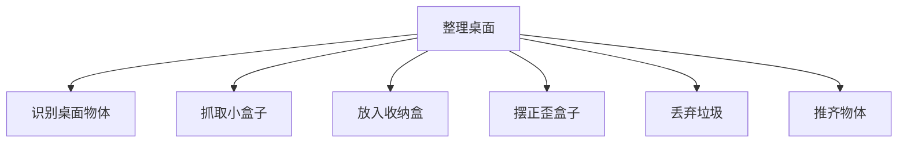

### 4.4 Mermaid 图：任务定义要素结构

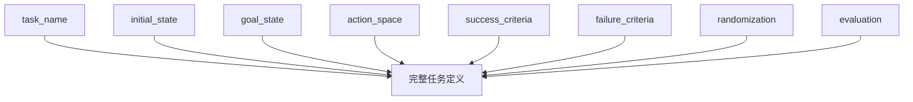

---

## 5. 工程化理解

### 5.1 为什么任务定义是“第一份正式合同”

主线项目进入本章后，第一次出现了一个很重要的变化：

> 后面的数据、代码、评测，不再只是围绕“一个想法”，而是围绕“一个明确任务配置”。

这就是任务定义的合同价值。它把下面这些环节串了起来：

- 采集什么数据；
- episode 如何标注；
- success / failure 怎么判断；
- rollout 用什么指标评估；
- 训练边界在哪里；
- 后续如何演化到更难版本。

### 5.2 为什么 YAML 很合适

YAML 不是唯一选择，但它非常适合当前阶段，因为它：

- 可读性强；
- 容易手工维护；
- 结构清晰；
- 可以直接被脚本加载校验；
- 便于作为后续任务库的一部分长期积累。

本章主线项目会新增两个配置文件：

- `configs/task_pick_box_to_bin.yaml`
- `configs/task_straighten_box.yaml`

其中前者是主线任务的正式定义，后者用于提醒你：一旦任务定义体系建立起来，扩展新任务会容易很多。

### 5.3 为什么要有校验脚本

任务定义如果只是“写在文档里”，仍然可能逐渐失控。比如：

- 忘记写 failure_criteria；
- success_criteria 写得过于空泛；
- observation.modalities 漏了；
- action_space 没有 bounds；
- 没有 timeout 规则。

因此，本章新增 `scripts/validate_task_config.py`，用于做最小静态校验。

请注意，这个脚本的目的不是一次性验证“物理正确性”，而是先做最基本的**字段完整性和结构合理性检查**。这对于工程工作流来说非常有价值。

---

## 6. 主线项目中的位置

本章为主线项目新增：

```text
robot-learning-shelf-demo/
  configs/
    task_pick_box_to_bin.yaml
    task_straighten_box.yaml
  scripts/
    validate_task_config.py
```

这意味着主线项目第一次具备了：

1. 正式任务配置；
2. 任务版本边界；
3. 配置静态校验能力。

这是进入“标准数据格式”和“数据质检”前的必要步骤。

---

## 7. 示例

### 7.1 示例 1：一个不合格的任务定义

错误写法：

```text
任务：整理桌面
成功标准：桌面看起来更整洁
```

它的问题在于：

- 没有具体操作对象；
- 没有工作空间范围；
- 没有动作空间；
- 没有成功的可测量标准；
- 没有失败定义；
- 没有随机化边界。

这样的任务定义几乎无法直接进入数据采集与训练。

### 7.2 示例 2：合格的 `pick_box_to_bin`

一个合格的 `pick_box_to_bin` 任务至少应该明确：

- 物体是小盒子；
- 目标是指定收纳盒；
- 初始状态下物体在桌面、收纳盒为空、机器人在 reset pose；
- 动作空间是末端位姿增量 + 夹爪控制；
- 成功标准是物体进入收纳盒并稳定停住；
- 失败标准包含掉落、出界和超时。

这些信息在 `configs/task_pick_box_to_bin.yaml` 中都会被结构化保存。

### 7.3 示例 3：场景随机化变量表

对本书主线项目，建议至少显式记录：

| 随机化项 | 作用 | 初始建议 |
|---|---|---|
| object_xy_jitter | 增加位置鲁棒性 | 5 cm |
| bin_xy_jitter | 避免策略过拟合固定收纳盒位置 | 3 cm |
| object_color | 支持视觉泛化 | 红/蓝/绿/黄 |
| lighting_variation | 避免对单一光照过拟合 | mild |
| distractor_objects | 提升抗干扰能力 | v3 再加入 |

### 7.4 示例 4：为什么评测协议要前置设计

如果你不在任务定义里提前写清楚评测协议，那么后面很容易出现：

- 每个人对成功率的计算方式不同；
- 一个同样的失败 case 被不同人打成不同标签；
- 没有固定的 trial 数，导致结果不可比；
- 没有 failure reason 分类，改进方向模糊。

所以，本书建议把 `evaluation` 也写进任务配置。

---

## 8. 练习代码

### 8.1 任务配置文件

本章最重要的产物之一是：

```text
configs/task_pick_box_to_bin.yaml
```

该文件定义了：

- 工作空间；
- 物体与目标容器；
- 初始状态；
- 目标状态；
- 动作空间；
- observation modalities；
- success / failure criteria；
- 随机化变量；
- 评测协议。

### 8.2 任务配置校验脚本

脚本：`scripts/validate_task_config.py`

推荐运行方式：

```bash
cd robot-learning-shelf-demo
python scripts/validate_task_config.py \
  --config configs/task_pick_box_to_bin.yaml \
  --output reports/ch06_task_pick_box_to_bin_validation.json
```

运行后你会得到一个类似这样的报告：

```json
{
  "ok": true,
  "errors": [],
  "warnings": [],
  "summary": {
    "task_name": "pick_box_to_bin",
    "version": "v1",
    "observation_modalities": ["top_rgb", "wrist_rgb", "robot_state"],
    "action_mode": "delta_end_effector_pose_with_gripper"
  }
}
```

这说明当前配置至少在字段层面是完整的。

---

## 9. 代码解释

### 9.1 这段代码解决什么问题

`validate_task_config.py` 解决的是：**如何让任务定义第一次变成一个可自动检查的工程对象。**

### 9.2 校验逻辑分三层

第一层：检查顶层字段是否齐全，例如：

- `task_name`
- `version`
- `description`
- `initial_state`
- `goal_state`
- `action_space`
- `observation`
- `success_criteria`
- `failure_criteria`

第二层：检查关键子字段，例如：

- `action_space.mode`
- `action_space.action_dim`
- `observation.modalities`

第三层：给出工程性 warning，例如：

- 是否缺少 `timeout_sec`
- 是否没有 randomization
- 是否没有 action limits

### 9.3 为什么 warning 也重要

很多配置并不是“完全错误”，但会让后续流程变脆弱。例如：

- 没有 randomization，不代表不能跑；
- 但意味着训练泛化性很差；
- 没有 timeout，不一定立刻崩；
- 但 rollout 评测就会模糊。

因此，把 error 和 warning 分开，是更符合工程实际的做法。

---

## 10. 常见错误

### 错误 1：把大愿景当成训练任务

“家务机器人”“整理桌面机器人”都是方向，不是第一阶段训练任务。

### 错误 2：只有成功标准，没有失败标准

没有失败定义，数据标签、回收分析和评测报告都会混乱。

### 错误 3：动作空间不写清楚

不写 action mode，后面的 episode 数据和训练输出就难以统一。

### 错误 4：把随机化理解成“后面再说”

随机化可以后面逐步增加，但变量类别应当在任务定义阶段就被考虑。

### 错误 5：任务配置只写给人看，不写给代码用

真正有价值的任务定义，应该能被脚本加载、校验、版本化、长期维护。

---

## 11. 本章练习

### 练习 1：基础练习

把“理货”拆成至少 8 个可执行子任务。

### 练习 2：工程练习

在 `task_pick_box_to_bin.yaml` 中增加一个 `distractor_objects` 配置，并为 v3 版本预留字段。

### 练习 3：工程练习

补充 `task_straighten_box.yaml` 的 success / failure criteria，使其和 `pick_box_to_bin` 一样完整。

### 练习 4：进阶练习

扩展 `validate_task_config.py`，使其支持：

- 检查 `evaluation.metrics` 是否为空；
- 检查 `instruction_templates` 至少包含一条自然语言示例；
- 检查随机化字段数是否过少。

### 练习 5：思考练习

任务定义不清，会如何影响：

- episode 采集；
- success / failure 标签；
- rollout 评测；
- 模型训练？

请分别展开说明。

---

## 12. 本章产出

本章应当产出：

1. 第一个正式任务配置 `task_pick_box_to_bin.yaml`；
2. 一个辅助任务配置 `task_straighten_box.yaml`；
3. 一个最小任务配置校验脚本 `validate_task_config.py`；
4. 对“模糊任务 → 可执行任务”的清晰理解；
5. 对任务 v1 / v2 / v3 演进路径的初步方法论。

---

## 13. 小结

这一章最重要的结论可以概括成一句话：

> **不要一上来做通用家务机器人，要先做边界清晰、可采集、可评测、可迭代的小任务。**

对主线项目来说，`pick_box_to_bin` 的价值不在于它“简单”，而在于它是一个足够小、又足够完整的任务闭环起点。它能接住：

- 语言任务入口；
- 任务配置；
- episode 采集；
- success / failure 标签；
- 模仿学习 baseline；
- rollout 评测。

下一章，我们就顺着这条线继续推进：既然任务已经正式定义好了，那么**一条 Episode 到底应该长什么样？**换句话说，我们要开始把“任务定义”真正落到“数据格式”。

---

# 第 7 章：机器人数据格式：一条 Episode 到底长什么样

前一章，我们终于把主线任务 `pick_box_to_bin` 正式定义了出来。也就是说，我们已经知道：

- 机器人要做什么；
- 在什么工作空间里做；
- 动作空间是什么；
- 什么算成功；
- 什么算失败；
- 哪些因素会被随机化。

但是，一个正式定义好的任务，仍然还不能直接拿去训练。因为策略训练最终吃的不是“任务说明文档”，而是**数据**。

于是，问题自然推进到了这一章：

> **机器人学习里，一条 Episode 到底长什么样？**

很多初学者会下意识地把机器人数据理解成“视频”。这是一个很常见、但也很危险的误解。视频当然重要，但它只是 observation 的一部分。真正能被训练系统消费的 episode，还必须包含：

- 图像；
- 状态；
- 动作；
- 时间戳；
- 任务元信息；
- success / failure 标签；
- 有时还包括 failure_reason、dataset_version 等。

所以本章要做的，就是把“机器人数据不是视频”这件事彻底讲清楚，并让主线项目第一次拥有真正像样的数据目录结构。

---

## 1. 本章要解决的问题

本章重点解决以下九个问题：

1. 为什么机器人数据不能被简化成一段视频？
2. 一条 episode 最少应该包含哪些文件？
3. `meta.json` 应该记录什么？
4. `states.jsonl` 与 `actions.jsonl` 为什么要分开？
5. 图像应该如何保存？文件夹应如何组织？
6. 为什么 observation、state、action、timestamp 必须同步？
7. success / failure / failure_reason 为什么属于 episode 的一部分？
8. 一条成功 episode 与一条失败 episode 在数据层面应该如何体现？
9. 如何用脚本生成并可视化一个标准 episode 样例？

---

## 2. 为什么这个问题重要

### 2.1 模型学到的不是“录像”，而是带因果结构的样本

对于机器人策略来说，一条训练样本并不是“这一帧画面长什么样”，而是：

- 在时刻 `t`，机器人观察到了什么；
- 自己处于什么状态；
- 任务是什么；
- 然后应该执行什么动作；
- 这个时刻对应哪个 phase；
- 整条 episode 最终是成功还是失败。

如果只有视频而没有动作，那你不知道专家到底做了什么；
如果只有动作而没有状态，那你不知道动作是基于什么条件做出的；
如果没有时间戳，模态之间的因果对应关系就会被破坏。

### 2.2 数据结构比“有没有很多数据”更基础

很多人一开始会问：“我要多少条数据？”

这是一个重要问题，但在它之前还有一个更底层的问题：

> 你的每一条数据到底是不是**结构完整**的训练单元？

如果数据结构都没理清，后面再多数据也只是放大混乱。

### 2.3 自动驾驶经验在这里依然很有帮助

如果你做过自动驾驶数据闭环，会很熟悉这种感觉：

- log 不是单视频，而是多传感器同步；
- 每个时间步都有状态与时间戳；
- 标注、事件、任务上下文都很重要；
- 质量问题常常出在时间同步与字段错位，而不是出在模型本身。

机器人 episode 与自动驾驶 log 在思想上非常接近，只是对象和控制形式不同。

---

## 3. 核心概念

### 3.1 什么是 Episode

在本书中，一个 episode 指的是：

> 从任务开始，到任务结束或中止为止的一段完整、多模态、带标签的时序数据单元。

它至少应该能回答：

- 任务是什么；
- 一共有多少步；
- 每一步看到了什么；
- 每一步机器人处于什么状态；
- 每一步执行了什么动作；
- 最终成功了吗；
- 如果失败了，原因是什么。

### 3.2 为什么“机器人数据不是视频”

视频只是图像帧序列。它能提供视觉观测，但不能完整表达：

- 机器人关节 / 末端状态；
- 夹爪是否闭合；
- 动作命令是什么；
- 当前阶段是 pre_grasp 还是 transfer；
- 该条样本最终是否成功。

所以，机器人数据单元更准确的理解应该是：

```text
Episode = 图像 + 状态 + 动作 + 时间 + 标签 + 任务元信息
```

### 3.3 episode 目录结构

本书建议将一条 episode 设计为目录形式，例如：

```text
episode_0001/
  images/
    front/
      frame_0000.png
      frame_0001.png
      ...
    wrist/
      frame_0000.png
      frame_0001.png
      ...
  meta.json
  states.jsonl
  actions.jsonl
```

这种设计有几个好处：

1. 图像和结构化数据清晰分离；
2. 多视角图像容易扩展；
3. states / actions 的解析更简单；
4. 与后续数据质检、转换脚本兼容性更好。

### 3.4 `meta.json` 的作用

`meta.json` 不是“可有可无的补充文件”，它是整条 episode 的总说明。至少建议记录：

- `episode_id`
- `task_name`
- `instruction`
- `success`
- `failure_reason`
- `num_steps`
- `control_mode`
- `observation_modalities`
- `dataset_version`
- `notes`

换句话说，`meta.json` 更像 episode 的“封面信息”。

### 3.5 `states.jsonl` 与 `actions.jsonl`

为什么不把状态和动作都塞进一个大 JSON 里？

因为从工程上说，分开存储更清晰：

- `states.jsonl` 表示每个时刻世界与机器人“是什么样”；
- `actions.jsonl` 表示每个时刻策略 / 专家“做了什么”；
- `meta.json` 表示整条数据“属于什么任务、最终结果如何”。

这种拆分让后续做：

- 可视化；
- 统计；
- 校验；
- 模型数据加载；
- 失败分析；

都更加方便。

### 3.6 时间同步为什么关键

时间同步的核心不是“看起来整齐”，而是维护因果关系。

在时刻 `t`：

- front camera 图像；
- wrist camera 图像；
- robot state；
- action；
- phase label；

都必须尽可能对应同一个时间点。如果其中一项错位，就可能出现：

- 图像还是接近物体阶段，但 action 已经是 release；
- 状态显示夹爪已闭合，但动作还是 open；
- 标签写的是 success，但真实上物体还没进收纳盒。

这种错位会直接污染训练样本。

### 3.7 成功 episode 与失败 episode

很多初学者只愿意保存成功 episode，觉得失败没价值。其实这是一个很大的损失。

失败 episode 至少有两大价值：

1. 帮你诊断系统问题；
2. 帮你更准确地构造 success / failure 分布。

因此，本章升级后的数据生成脚本会同时生成：

- `episode_0001`：成功样本；
- `episode_0002`：失败样本（`drop_during_transfer`）。

这会让你更清楚地看到 `failure_reason` 在数据结构中的位置。

---

## 4. 概念图 / 流程图 / 架构图

### 4.1 图 7-1 一条 Episode 的目录结构


这张图直观地说明：episode 不是单一视频文件，而是一个小型数据包，包含图像目录和结构化文件。

### 4.2 图 7-2 Episode 的时间同步与数据关系


这张图非常关键，因为它解释了为什么 observation、state、action 与 timestamp 必须对齐。它也是后面“数据质检”章节的重要铺垫。

### 4.3 Mermaid 图：episode 目录结构

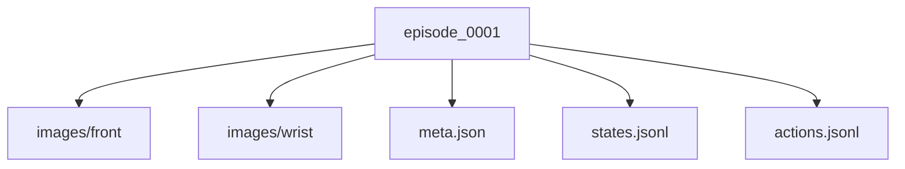

### 4.4 Mermaid 图：单时间步样本关系

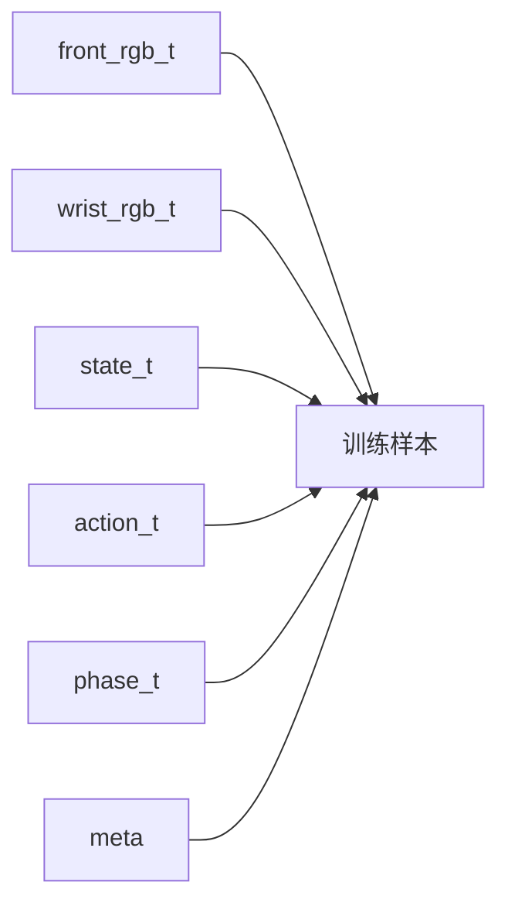

---

## 5. 工程化理解

### 5.1 为什么使用 JSONL

本书建议用 JSONL 存 states / actions，而不是一个超长 JSON 数组。原因是：

- 逐行读取更方便；
- 更适合流式处理；
- 更便于调试与 diff；
- 与很多日志系统习惯一致。

### 5.2 为什么图像按帧保存

在学习阶段，把图像序列保存成独立帧文件而不是压成视频，有几个好处：

- 调试简单；
- 更容易检查缺帧；
- 更容易与 timestamp 对应；
- 后续做数据质检和示例展示更方便。

当然，真实大规模系统中也可以使用更高效的打包格式，但本书当前阶段优先强调“结构清晰与可理解”。

### 5.3 为什么失败原因值得写进 `meta.json`

失败不是一个布尔值就能解释完的。至少在工程诊断中，我们通常还想知道：

- 是 drop_during_transfer？
- 是 timeout？
- 是 out_of_workspace？
- 还是 self_collision？

因此，本章建议把 `failure_reason` 也写入元信息中，这对后面数据质检和评测分析都很重要。

---

## 6. 主线项目中的位置

本章对主线项目的推进非常关键。新增 / 升级内容包括：

```text
robot-learning-shelf-demo/
  datasets/
    dataset_v0_sample/
      episode_0001/
      episode_0002/
  scripts/
    01_generate_synthetic_episode.py
    02_visualize_episode.py
```

也就是说，主线项目现在第一次具备：

1. 标准 episode 目录结构；
2. 前视 / 腕视图像序列；
3. states / actions / meta 三类结构化数据；
4. 成功与失败样本；
5. episode 完整性检查与可视化能力。

---

## 7. 示例

### 7.1 示例 1：`meta.json`

一个典型的 `meta.json` 可能包含：

```json
{
  "episode_id": "episode_0001",
  "task_name": "pick_box_to_bin",
  "instruction": "把红色盒子放进右边收纳盒。",
  "success": true,
  "failure_reason": null,
  "num_steps": 7,
  "dataset_version": "v0.2"
}
```

### 7.2 示例 2：`states.jsonl`

每一行对应一个时间步，记录：

- `timestamp`
- `ee_pose_xyzrpy`
- `gripper_open`
- `object_pose_xyz`
- `bin_pose_xyz`
- `phase`

例如 `phase` 可以依次是：

```text
reset -> observe -> pre_grasp -> approach -> grasp -> transfer -> release
```

### 7.3 示例 3：`actions.jsonl`

每一行记录该时间步的动作：

- `delta_ee_xyzrpy`
- `gripper_delta`
- `comment`

这使得你在看数据时，能够同时知道：

- 当时机器人看到了什么；
- 它处于什么状态；
- 它执行了什么动作；
- 以及动作背后的语义意图。

### 7.4 示例 4：成功与失败对比

`episode_0001`：成功样本。物体被抓起，转移到收纳盒，并最终释放成功。

`episode_0002`：失败样本。物体在 transfer 阶段发生掉落，`success=false`，并记录 `failure_reason=drop_during_transfer`。

这类失败样本在后续数据质检和评测分析中非常有价值。

---

## 8. 练习代码

### 8.1 生成 synthetic episode

脚本：`scripts/01_generate_synthetic_episode.py`

推荐运行：

```bash
cd robot-learning-shelf-demo
python scripts/01_generate_synthetic_episode.py
```

该脚本会生成两个 episode：

- `episode_0001`（成功）
- `episode_0002`（失败）

并自动创建：

- `images/front/*.png`
- `images/wrist/*.png`
- `meta.json`
- `states.jsonl`
- `actions.jsonl`

### 8.2 可视化与完整性检查

脚本：`scripts/02_visualize_episode.py`

推荐运行：

```bash
python scripts/02_visualize_episode.py \
  --episode_dir datasets/dataset_v0_sample/episode_0001 \
  --save_plot reports/ch07_episode_0001_action_timeline.png \
  --save_summary reports/ch07_episode_0001_summary.md
```

它会做三件事：

1. 打印 episode 摘要；
2. 检查图像数量、时间戳和步数是否一致；
3. 生成 action 时间曲线与 Markdown 摘要。

---

## 9. 代码解释

### 9.1 `01_generate_synthetic_episode.py`

升级后的脚本有两个核心改动：

第一，增加了图像帧生成。也就是说，episode 不再只有结构化 JSON / JSONL，而是真正带有 front / wrist 观测。

第二，增加了失败样本生成。这样读者就不再只看到“完美数据”，而是能更直观地理解 `failure_reason` 的作用。

### 9.2 `02_visualize_episode.py`

这个脚本主要帮助读者完成三件事：

- 读取一条 episode；
- 生成人类可读的摘要；
- 执行最小完整性检查。

它体现了一个很重要的工程原则：

> 数据格式一旦设计出来，就要尽快配套“看数据”和“查数据”的工具。

否则你会陷入“虽然有数据，但不知道数据到底是不是好的”的状态。

### 9.3 为什么完整性检查是必要的

本章虽然还没有正式进入“数据质检”，但已经先做了最小版检查，例如：

- states 数量是否等于 num_steps；
- actions 数量是否等于 num_steps；
- front / wrist 图像数量是否匹配；
- timestamps 是否单调；
- state timestamps 与 action timestamps 是否一致。

这些检查会直接成为下一章数据质检工作的前置基础。

---

## 10. 常见错误

### 错误 1：把视频当成全部数据

视频只是 observation 的一部分，不是完整训练样本。

### 错误 2：不保存动作或状态

没有动作，模仿学习无法训练；没有状态，动作的上下文会丢失。

### 错误 3：时间戳不对齐

时间错位会破坏 observation → action 的因果对应，属于非常隐蔽但严重的问题。

### 错误 4：只保留成功样本

失败样本对诊断和分布理解同样重要，不能被简单丢弃。

### 错误 5：没有元信息字段

如果没有 `task_name`、`instruction`、`success`、`dataset_version` 等元信息，后面数据管理会迅速失控。

---

## 11. 本章练习

### 练习 1：基础练习

请用自己的语言解释：为什么“机器人数据不是视频”？

### 练习 2：工程练习

在 `states.jsonl` 中增加一个字段 `gripper_width_mm`，并同步修改生成脚本。

### 练习 3：工程练习

在 `meta.json` 中增加 `session_id` 字段，并说明它对数据管理的作用。

### 练习 4：进阶练习

给 `02_visualize_episode.py` 增加一个检查：如果 `success=true` 但 `failure_reason` 非空，则报告冲突。

### 练习 5：思考练习

如果 action 存的是绝对位姿，而不是相对增量，会对：

- 数据分布；
- 模型学习难度；
- 跨场景泛化；
- rollout 稳定性；

分别带来什么影响？

---

## 12. 本章产出

本章应当产出：

1. 标准 episode 目录结构；
2. 两条示例 episode（成功 + 失败）；
3. 支持生成 RGB 图像的 synthetic data 脚本；
4. 一个可视化与完整性检查脚本；
5. 对“多模态 + 时间同步 + 结构化标签”这一机器人数据观的稳定理解。

---

## 13. 小结

这一章最重要的结论是：

> **机器人学习的数据单元，不是录像，而是结构完整、带时间对齐关系的 episode。**

一个真正可训练的 episode 至少要同时包含：

- 图像；
- 状态；
- 动作；
- 时间戳；
- 标签；
- 任务元信息。

而且，这些部分必须尽可能对齐。

从主线项目角度看，本章完成了一个非常重要的里程碑：它把前一章的任务定义真正落成了数据结构。下一章，我们就会顺势进入一个非常现实的问题：

既然数据格式已经有了，那么**如何检查这些数据是不是好的？**

---

# 第 8 章：数据质检与可视化

前一章我们已经把主线任务 `pick_box_to_bin` 变成了一个正式的 episode 数据结构。到这里，很多初学者会自然地把注意力转向模型：是不是该训练更大的网络？是不是该把 ACT、Diffusion Policy、VLA 全都试一遍？

这当然是后面的方向，但如果现在立刻进入模型调参，通常会走上一条非常低效的路。因为在具身智能项目里，**坏数据往往比小数据更危险**。数据量少，你至少还能慢慢补；但如果数据结构错了、时间戳乱了、标签冲突了、动作越界了，那么你后面训练出来的任何结果都可能建立在错误基础上。

所以，本章的目标非常明确：不讲模型调参，而是讲**数据质检**。我们要把“会采集数据”推进到“会检查数据是否能用”。这一步，是从 demo 式学习转向工程式学习的关键拐点。

本章将围绕以下内容展开：

- 为什么数据质检比模型调参更基础；
- 如何检查 episode 文件完整性；
- 如何检查时间戳、图像数与状态序列是否一致；
- 如何检查动作范围；
- 如何检查 success / failure 标签冲突；
- 如何输出一份可读的 dataset report；
- 如何用动作分布图快速发现异常样本与偏置。

换句话说，本章会让主线项目第一次拥有“数据自查能力”。

---

## 1. 本章要解决的问题

本章重点解决以下问题：

1. 为什么机器人学习里要把数据质检放在模型训练之前？
2. 一个 episode 最常见的数据错误有哪些？
3. 如何检查目录结构与关键文件缺失？
4. 如何检查 `meta.json` 与 `states/actions` 是否一致？
5. 如何检查 timestamp 是否单调、是否对齐？
6. 如何检查动作是否超过任务定义的范围？
7. 如何识别 `success=true` 但 `failure_reason` 非空这类标签冲突？
8. 如何做动作分布统计，并从分布图中发现异常？
9. 如何自动生成 `dataset_report`？

这些问题看似“工程细节”，实际上决定了你后面做任何训练时，究竟是在学习规律，还是在学习噪声与错误。

---

## 2. 为什么这个问题重要

### 2.1 坏数据会污染整个训练闭环

如果一条 episode 的时间戳错位，那么 observation 与 action 的因果关系就被破坏；如果 success 标签错了，那么模型会被鼓励学错行为；如果 action 越界但没被发现，rollout 失败后你甚至不知道问题出在策略，还是出在数据质量。

因此，从工程角度看：

- 数据采集解决“有没有数据”；
- 数据质检解决“这些数据是不是可信”；
- 模型训练才是在可信数据上“能不能学会”。

顺序不能反。

### 2.2 自动驾驶经验在这里尤其有帮助

如果你做过自动驾驶数据闭环，会非常熟悉这种感觉：很多时候模型问题的根源并不在模型，而在数据链路，例如：

- 某个 topic 掉帧；
- 时间戳回退；
- 标注字段缺失；
- 日志切片边界错误；
- train / val 泄漏。

机器人学习的数据问题与之非常相似。区别只是在于：机器人数据多了一条更强的 action 链路，因此动作越界、success/failure 冲突这些问题会更加致命。

### 2.3 为什么动作分布可视化很重要

光靠人工逐条看 JSON 文件效率太低。工程里经常采用“统计 + 可视化”的方式快速做第一轮筛查。例如：

- `dx / dy / dz` 的分布是否偏得离谱；
- `gripper_delta` 是否大多数都卡在极端值；
- 是否有明显超出动作上限的长尾样本；
- 是否某个动作维度几乎不变，暗示数据采集覆盖不足。

这也是为什么本章不仅写验证脚本，还会增加 `action distribution` 分析能力。

---

## 3. 核心概念

### 3.1 数据质检不是“挑毛病”，而是建立信任

所谓数据质检，并不是为了让流程变复杂，而是为了让后面所有分析结果值得信任。它至少包括三层：

1. **结构完整性检查**：目录、文件、字段是否齐全；
2. **时序一致性检查**：states、actions、images 与 timestamp 是否对应；
3. **语义合理性检查**：success/failure 是否冲突，action 是否越界。

只有这三层都过了，数据才具备“可训练、可评估、可追溯”的基础属性。

### 3.2 episode 最常见的四类异常

本书建议把常见异常至少分成四类：

1. **结构异常**：例如缺失 `meta.json`、缺失 `actions.jsonl`、图像目录缺失；
2. **时间异常**：timestamp 不单调，state / action 时间不一致；
3. **动作异常**：`dx/dy/dz` 或 `gripper_delta` 超限；
4. **标签异常**：`success=true` 但 `failure_reason` 非空，或 `success=false` 却没有失败原因。

这样的分类非常实用，因为它能帮助你在 report 中快速定位问题归因。

### 3.3 为什么要把动作范围写成显式规则

如果你没有显式动作范围，数据验证就很难做。对于当前主线项目，动作空间是：

- `dx, dy, dz`：建议在 `[-0.20, 0.20]` 米范围内；
- `gripper_delta`：建议在 `[-1.0, 1.0]` 范围内。

有了这些边界，我们就能自动判断哪些样本“超出合理控制范围”。这也是任务定义与数据质检之间的直接衔接：**任务定义中的 action space，最终要服务于数据检查与训练约束。**

### 3.4 dataset report 的价值

很多团队做到最后，问题不是“没有数据”，而是“不知道现有数据到底是什么样”。

一份基本的 dataset report 至少应该告诉你：

- 一共有多少条 episode；
- 多少条通过检查，多少条失败；
- 失败类型主要分布在哪；
- 动作分布大致怎样；
- 是否存在明显的异常或偏置。

从工程组织的角度看，这份报告是数据团队、算法团队和评测团队之间的共同语言。

---

## 4. 概念图 / 流程图 / 架构图

### 4.1 图 8-1 机器人数据质检流程


这张图展示了一个非常实用的最小数据质检流水线：从读取数据集开始，逐步检查目录结构、`meta.json`、`states/actions`、图像数量、时间戳、动作范围和 success/failure 标签，最后输出 `dataset report`。它也是本章脚本 `04_validate_dataset.py` 的结构蓝图。

### 4.2 图 8-2 数据异常分类与动作分布分析


这张图强调两个重点：

- 左半部分是异常分类框架；
- 右半部分是动作分布分析示意。

也就是说，数据质检不仅要能“找出坏样本”，还要能“看出整体分布是否合理”。

### 4.3 Mermaid 图：数据验证流水线

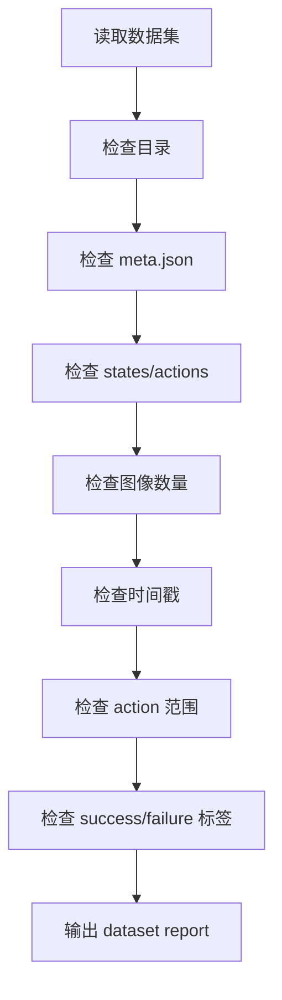

### 4.4 Mermaid 图：异常分类框架

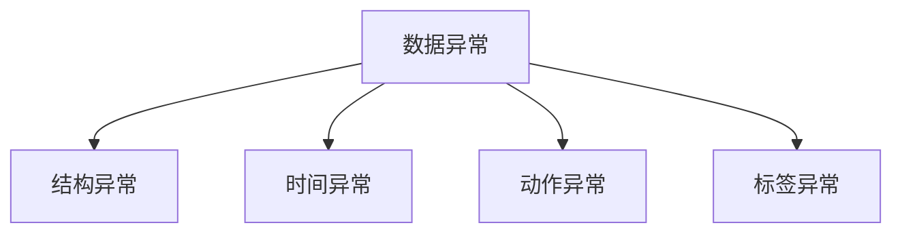

---

## 5. 工程化理解

### 5.1 先有验证脚本，再谈大规模采集

很多新手会在数据量还很小时忽视验证脚本，觉得“以后再写”。但工程经验恰恰相反：**数据量越小越应该尽快把验证链路搭起来**。因为你越早检查，就越早能发现问题、修正采集规范，避免把错误模式成批复制出去。

### 5.2 为什么要保留坏样本目录

本章主线项目不仅验证 `dataset_v0_sample`，还额外构造了：

- `episode_bad_missing_meta`
- `episode_bad_timestamp`
- `episode_bad_action_range`
- `episode_bad_label_conflict`

这些“故意造坏”的样本非常有教学价值。它们能帮助你从“抽象地知道数据会出错”，走向“具体地知道脚本应该怎样抓住错误”。

### 5.3 质检脚本不需要一步到位

`04_validate_dataset.py` 是一个最小但完整的版本。它没有覆盖所有真实系统问题，但已经能检查：

- 目录 / 文件缺失；
- 图像数量不匹配；
- timestamp 非单调；
- state / action 时间戳不一致；
- action 越界；
- success / failure 标签冲突。

对入门阶段来说，这已经足够建立正确的数据工程意识。

---

## 6. 主线项目中的位置

本章为主线项目新增：

```text
robot-learning-shelf-demo/
  scripts/
    04_validate_dataset.py
  notebooks/
    02_action_distribution_analysis.ipynb
  datasets/
    dataset_v0_bad_examples/
  reports/
    ch08_dataset_v0_sample_report.json
    ch08_dataset_v0_sample_report.md
    ch08_dataset_v0_sample_action_distribution.png
    ch08_dataset_v0_bad_examples_report.json
    ch08_dataset_v0_bad_examples_report.md
    ch08_dataset_v0_bad_examples_action_distribution.png
```

这意味着主线项目现在第一次具备了：

- 数据完整性检查能力；
- 异常样本自动识别能力；
- 动作分布统计能力；
- dataset report 产出能力。

从系统演进上看，这一章相当于为后续 ROS2 录制、rosbag 转换和更大规模数据集建设打下了数据卫生基础。

---

## 7. 示例

### 7.1 示例 1：缺失 `meta.json`

如果某条 episode 缺失 `meta.json`，那么你至少会失去：

- `episode_id`
- `task_name`
- `success`
- `failure_reason`
- `num_steps`

这不仅会让数据解析困难，还会让标签统计与版本追踪失效。因此，这类错误通常应直接标为 `issue`，而不是轻量 warning。

### 7.2 示例 2：timestamp 倒退

假设某条 states 序列原本是：

```text
1005 -> 1006 -> 1007
```

结果中间被写成：

```text
1005 -> 1004 -> 1006
```

那么时序关系就被破坏了。训练时，模型会看到“时间在倒流”的样本，这显然不合理。因此，timestamp 单调性检查是基础中的基础。

### 7.3 示例 3：action 超限

如果某步动作中：

```text
dx = 0.25
gripper_delta = 1.60
```

而我们设定的上限分别是 `0.20` 和 `1.0`，那么它就属于典型越界样本。越界动作可能来自：

- 采集器 bug；
- 坐标单位混乱；
- 控制接口改动未同步；
- 人为写入错误。

### 7.4 示例 4：标签冲突

如果某条 `meta.json` 中写着：

```json
{
  "success": true,
  "failure_reason": "drop_during_transfer"
}
```

那么这条样本就存在明显逻辑冲突。对于学习系统来说，这种标签比“纯粹缺失”更危险，因为它看起来“格式正确”，但语义是错的。

---

## 8. 练习代码

### 8.1 核心脚本：`04_validate_dataset.py`

推荐运行：

```bash
cd robot-learning-shelf-demo
python scripts/04_validate_dataset.py   --dataset_dir datasets/dataset_v0_sample   --output_json reports/ch08_dataset_v0_sample_report.json   --output_md reports/ch08_dataset_v0_sample_report.md   --plot_path reports/ch08_dataset_v0_sample_action_distribution.png
```

如果你想检查坏样本目录：

```bash
python scripts/04_validate_dataset.py   --dataset_dir datasets/dataset_v0_bad_examples   --output_json reports/ch08_dataset_v0_bad_examples_report.json   --output_md reports/ch08_dataset_v0_bad_examples_report.md   --plot_path reports/ch08_dataset_v0_bad_examples_action_distribution.png
```

### 8.2 Notebook：动作分布分析

本章还新增：

```text
notebooks/02_action_distribution_analysis.ipynb
```

它展示了如何读取 `actions.jsonl`，并绘制 `dx / dy / dz / gripper_delta` 的分布直方图。这是理解数据覆盖范围和偏置最直观的方式之一。

---

## 9. 代码解释

### 9.1 为什么把检查拆成 episode 级别

`04_validate_dataset.py` 不是直接从“整个数据集”入手，而是先逐条检查 episode，再汇总成 dataset report。这样做的好处是：

- 便于定位问题在哪一条 episode；
- 便于做 failure case 统计；
- 便于未来做并行验证与分布式质检。

### 9.2 为什么 report 同时输出 JSON 和 Markdown

- JSON 便于后续程序消费；
- Markdown 便于人类阅读、审查和留档。

这体现了一个很重要的工程意识：**报告既要能给代码看，也要能给人看。**

### 9.3 为什么动作分布图不只是“好看”

动作分布图最有价值的地方在于：它可以快速暴露隐藏的偏置。例如：

- `dx` 几乎都在正方向，说明采集动作不够多样；
- `gripper_delta` 极度集中在 0，说明抓取开合动作样本太少；
- 某个维度有很长的超限尾部，说明数据中混入异常样本。

因此，可视化不是装饰，而是快速诊断工具。

---

## 10. 常见错误

### 错误 1：急着调模型，不先看数据

这是具身智能入门里最常见的低效行为。

### 错误 2：只看单条样本，不看整体分布

逐条抽查能发现局部问题，但无法发现全局偏置。

### 错误 3：只查格式，不查语义

数据字段都在，不代表标签就一定合理。

### 错误 4：发现坏样本后没有保留案例库

构造一批坏样本目录对提升验证脚本能力非常有帮助。

### 错误 5：report 只在命令行打印，不落盘

不落盘就不利于后续复盘和跨团队沟通。

---

## 11. 本章练习

1. 人为再制造 3 个坏 episode，让验证脚本识别；
2. 增加动作上限配置，使其从 YAML 读取；
3. 统计每个动作维度的均值、方差和 95% 分位数；
4. 增加 train / val split 泄漏检查；
5. 思考：为什么坏数据比小数据更危险？

---

## 12. 本章产出

本章应当产出：

1. 一个最小但完整的数据验证脚本；
2. 一批可复用的坏样本案例；
3. 数据集 Markdown / JSON 报告；
4. 动作分布可视化图；
5. 对“先做数据卫生，再做模型训练”的稳定工程意识。

---

## 13. 小结

这一章最重要的结论可以概括成一句话：

> **在具身智能项目里，数据质量往往比模型复杂度更先决定上限。**

如果数据结构错了、时间乱了、动作越界了、标签冲突了，那么你后面做再多训练都只是在放大问题。相反，只要你先建立起一套最小数据质检链路，哪怕数据量还不大，也能在一个健康的基础上持续迭代。

下一章，我们就顺着这个思路进入真实机器人系统的基础设施：既然数据要被可靠采集、同步和记录，那么在机器人世界里，最重要的通信中间层是什么？答案就是 **ROS2**。

---

# 第 9 章：ROS2 最小知识体系：为数据采集服务

前一章我们已经知道，机器人学习的数据不能只会“生成”，还必须会“检查”。但当你真正从离线 toy 数据走向真实机器人系统时，很快就会碰到一个更现实的问题：这些图像、关节状态、动作命令、任务信息，究竟是通过什么方式在系统里流动的？

对于大多数现代机器人系统来说，这个答案就是 **ROS2**。不过，本章并不是一本完整的 ROS2 教程。我们的目标更聚焦：只讲那些**为了数据采集与主线项目推进必须掌握的最小 ROS2 知识体系**。

也就是说，我们关心 ROS2，不是为了背概念，而是为了回答这些问题：

- 什么是 node、topic、message？
- 相机图像、关节状态、动作命令应该分别挂在哪些 topic 上？
- 数据记录节点应该订阅哪些流？
- 主线项目从 ROS2 数据流到 episode 数据结构之间是什么关系？

如果说第 8 章解决的是“数据进来后怎么检查”，那么本章解决的就是“数据在系统里是怎么流过来的”。

---

## 1. 本章要解决的问题

本章重点解决以下问题：

1. 什么是 node、topic、message、service、action、launch、parameter？
2. 为什么 ROS2 是机器人数据采集的重要中间层？
3. 主线项目中哪些信息适合放在 topic 上？
4. 相机、关节状态、动作命令、任务解析节点之间如何通信？
5. 数据记录节点在整体系统中扮演什么角色？
6. ROS2 topic 与 episode 字段之间应该如何映射？
7. 为什么时间戳在 ROS2 里同样关键？
8. 如何用最小 pub/sub 示例理解数据流？
9. 在没有 ROS2 运行环境时，如何用纯 Python 模拟这个过程？

---

## 2. 为什么这个问题重要

### 2.1 机器人系统本质上是分布式数据流系统

对于初学者来说，机器人很容易被误解成“一个程序控制一个机械臂”。但工程上，真实机器人系统通常由很多节点组成：

- 相机节点负责采图；
- 状态节点负责发布关节与末端状态；
- 任务解析节点负责解释任务指令；
- 控制节点负责发动作命令；
- 数据记录节点负责把多条数据流统一记录下来。

所以，从系统角度看，机器人更像一个**分布式、异步、多模态数据流系统**。ROS2 的价值就在于为这些模块提供了统一通信基础设施。

### 2.2 只会离线数据，不理解在线数据流，工程就接不上

前面几章我们使用的是离线生成的 episode，这对学习核心概念很有帮助。但如果你不理解数据在线是如何产生的，就很难继续推进：

- 不知道相机图像从哪里来；
- 不知道动作命令怎么广播给执行器；
- 不知道 recorder 为什么要订阅多个 topic；
- 不知道后续 rosbag 是怎么记录这些流的。

所以，本章是连接“离线学习世界”和“真实机器人系统世界”的桥梁。

### 2.3 ROS2 对自动驾驶工程师也并不陌生

如果你有自动驾驶背景，可以把 ROS2 topic 类比为：

- 一类轻量级、异步的消息总线；
- 类似各模块之间发布 / 订阅的实时数据流；
- 在概念上有点像多 topic 的车端 log 流。

当然，ROS2 还有更丰富的生态和节点管理能力，但从主线项目角度，这个类比足以帮助你快速建立直觉。

---

## 3. 核心概念

### 3.1 node：执行具体功能的进程

ROS2 中最重要的基本单元之一是 **node**。你可以把它理解为一个执行具体职责的进程或模块。例如：

- `camera_node`：采集相机图像；
- `robot_state_node`：发布机器人关节状态；
- `teleop_node`：接收人工控制并发布动作指令；
- `task_parser_node`：解析任务输入；
- `data_recorder_node`：订阅多个 topic 并保存数据。

也就是说，node 回答的是：**是谁在干这件事？**

### 3.2 topic：节点之间异步传递数据的通道

topic 是 ROS2 中最常用的通信方式之一。它适合多对多、异步的数据分发。比如：

- `/camera/front/image_raw`：前视相机图像；
- `/camera/wrist/image_raw`：腕部相机图像；
- `/joint_states`：关节状态；
- `/action_cmd`：动作命令；
- `/task_info`：任务解析结果。

topic 回答的是：**数据通过哪条通道传递？**

### 3.3 message：在 topic 中传递的数据格式

仅有 topic 名称还不够，还要知道“上面流动的数据长什么样”。这就是 message 的角色。例如：

- 图像用 `sensor_msgs/Image`；
- 关节状态用 `sensor_msgs/JointState`；
- 简单字符串命令可用 `std_msgs/String`；
- 任务信息则可以定义自定义消息 `TaskInfo.msg`。

在主线项目中，我们新增了：

```text
ros2_ws/src/shelf_demo_msgs/msg/TaskInfo.msg
```

它用于承载解析后的任务信息，例如 instruction、task_name、target_object、target_container。

### 3.4 service、action、launch、parameter 的最小理解

虽然本章重点是 topic，但还需要知道其他几个 ROS2 概念：

- **service**：更像一次请求 / 响应，适合短事务；
- **action**：适合需要反馈和可中断的长任务；
- **launch**：用于同时启动多个 node；
- **parameter**：用于配置 node 行为。

在主线项目当前阶段，topic 是最核心的；但从系统视角，你至少要知道这些概念的位置。

### 3.5 数据记录节点为什么重要

在具身学习项目里，`data_recorder_node` 往往是一个非常关键但容易被忽视的模块。它负责：

- 订阅多条 topic；
- 记录时间戳；
- 对齐不同模态；
- 最终将在线数据整理成 episode 或 rosbag 的基础材料。

所以 recorder 可以被看作连接“在线机器人系统”和“离线训练数据”的桥梁。

---

## 4. 概念图 / 流程图 / 架构图

### 4.1 图 9-1 ROS2 节点与 Topic 通信图


这张图展示了主线项目中的最小通信骨架：

- `camera_node` 发布图像；
- `robot_state_node` 发布关节状态；
- `teleop_node` 发布动作命令；
- `task_parser_node` 解析任务并发布 `/task_info`；
- `data_recorder_node` 订阅这些数据并输出 episode dataset。

### 4.2 图 9-2 ROS2 Topic 到 Episode 字段映射


这张图非常关键，因为它直接把 ROS2 数据流和前面几章定义的 episode 结构连接了起来：

- 相机 topic → `images/*.png`
- `/joint_states` → `states.jsonl`
- `/action_cmd` → `actions.jsonl`
- `/task_info` → `meta.json`

也就是说，它让“在线 topic 世界”和“离线 episode 世界”形成了明确映射关系。

### 4.3 Mermaid 图：最小 pub/sub 关系

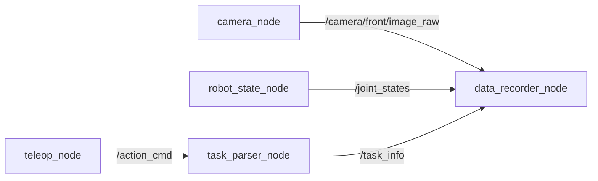

### 4.4 Mermaid 图：ROS2 到 episode 的桥接

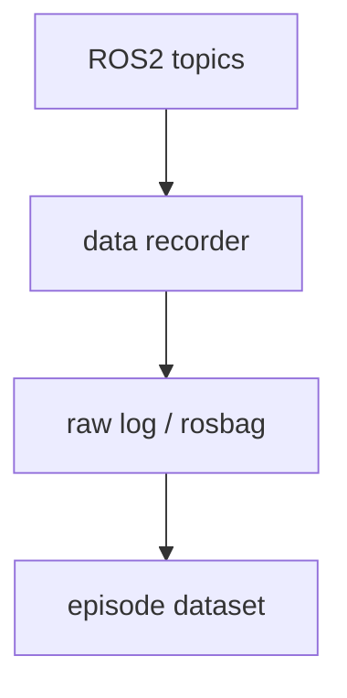

---

## 5. 工程化理解

### 5.1 topic 命名不是小事

主线项目中推荐的 topic 命名要尽量做到：

- 语义清楚；
- 层次一致；
- 便于扩展。

例如：

- `/camera/front/image_raw`
- `/camera/wrist/image_raw`
- `/joint_states`
- `/action_cmd`
- `/task_info`

好的命名会直接降低后面 recorder 配置和 rosbag 记录时的心智成本。

### 5.2 为什么要先画通信图

当系统中节点多起来后，如果不先画通信图，很容易出现：

- 某个 topic 重复发布；
- recorder 忘订阅关键 topic；
- 某条 topic 的 message 类型选错；
- 某些数据需要 service / action，但你误用了 topic。

所以，通信图本身就是一种系统设计工具。

### 5.3 没有 ROS2 环境时如何学习

很多读者此时并没有完整 ROS2 环境。如果因为环境门槛过高而停住，就很可惜。因此，本章在主线项目中新增了一个**纯 Python 的 mock pub/sub demo**，让你先理解信息流，而不是先被环境细节拦住。

---

## 6. 主线项目中的位置

本章为主线项目新增：

```text
robot-learning-shelf-demo/
  ros2_ws/src/
    shelf_demo_msgs/
      msg/TaskInfo.msg
    shelf_demo_data_recorder/
      mock_ros2_pubsub_demo.py
      launch/shelf_demo_record.launch.py
  reports/
    ch09_mock_ros2_demo.json
```

这些新增内容的作用是：

- 建立主线项目的最小 ROS2 topic 设计；
- 提供自定义消息示例；
- 提供 recorder 的教学版 mock demo；
- 为下一章 rosbag 记录与转换做准备。

---

## 7. 示例

### 7.1 示例 1：前视相机 topic

```text
/camera/front/image_raw
sensor_msgs/Image
```

该 topic 用于传输前视 RGB 图像，是数据采集中的主要视觉观测源之一。最终它会对应到 episode 的 `images/front/*.png`。

### 7.2 示例 2：关节状态 topic

```text
/joint_states
sensor_msgs/JointState
```

这条 topic 用于描述机器人当前的关节状态。对于主线项目，我们在教学版数据中更关心的是：末端位姿、夹爪状态、phase 等结构化信息。它们最终会被整理进 `states.jsonl`。

### 7.3 示例 3：动作命令 topic

```text
/action_cmd
std_msgs/String 或自定义消息
```

在真实系统中，动作命令可能会更结构化；但在本章教学阶段，我们先用简化形式建立直觉：动作命令同样是系统中非常关键的一条数据流，它最终会映射到 `actions.jsonl`。

### 7.4 示例 4：任务解析 topic

任务指令可能来自人、来自上层规划器，也可能来自语言解析模块。经过 `task_parser_node` 处理后，形成 `/task_info`，最终进入 `meta.json` 或 episode 级元信息。

---

## 8. 练习代码

### 8.1 自定义消息示例

本章新增：

```text
ros2_ws/src/shelf_demo_msgs/msg/TaskInfo.msg
```

内容示例：

```text
string instruction
string task_name
string target_object
string target_container
```

### 8.2 最小 pub/sub 教学示例

运行方式：

```bash
cd robot-learning-shelf-demo
python ros2_ws/src/shelf_demo_data_recorder/mock_ros2_pubsub_demo.py   --output_json reports/ch09_mock_ros2_demo.json
```

它不会依赖真实 ROS2 运行环境，而是用纯 Python 模拟：

- 发布图像消息；
- 发布关节状态；
- 发布动作命令；
- 发布任务信息；
- 由 recorder 汇总计数并生成报告。

---

## 9. 代码解释

### 9.1 为什么先做纯 Python mock

如果一开始就要求所有读者把 ROS2 环境装好、workspace 配好、依赖拉齐，学习节奏很容易被打断。本章通过 mock demo 先让你理解：

- topic 是什么；
- recorder 为什么要订阅多条流；
- 数据是如何被汇总的。

这是一种“先理解结构，再落地环境”的学习顺序。

### 9.2 `TaskInfo.msg` 的价值

很多初学者只会把任务当成一条字符串，但一旦进入工程场景，你就会发现：

- `instruction`
- `task_name`
- `target_object`
- `target_container`

这些字段分开存，比塞进一句话更利于后续解析、记录和训练。自定义消息的存在，就是为了让系统里的信息表达更明确。

### 9.3 `data_recorder_node` 为什么是中心节点

在图 9-1 中你会发现，真正把系统串起来的，是 `data_recorder_node`。因为它是把：

- 图像流；
- 状态流；
- 动作流；
- 任务流；

汇聚起来的地方。没有 recorder，系统可以运行；但没有 recorder，就很难形成训练数据。

---

## 10. 常见错误

### 错误 1：把 ROS2 学成“术语背诵”

对主线项目来说，更重要的是理解 topic 与 recorder 的数据关系，而不是先背一堆命令。

### 错误 2：topic 设计没有围绕数据采集目标

很多 topic 设计看似完整，但和最终 episode 没有明确映射，后面会很混乱。

### 错误 3：没有统一时间戳策略

topic 可以异步，但记录时必须有统一时间基准，否则后面很难对齐。

### 错误 4：忽略任务信息流

只记录图像和关节状态，而忽略任务信息，会让训练样本缺少上下文。

### 错误 5：recorder 只是“存日志”，没有考虑后续转换

好的 recorder 设计，从一开始就会考虑后面如何转成 episode。

---

## 11. 本章练习

1. 解释 topic 与 service 的区别；
2. 为主线项目再设计 5 个可能有用的 topic；
3. 扩展 `TaskInfo.msg`，增加 `session_id` 与 `operator_id`；
4. 修改 mock demo，使 recorder 同时统计每个 topic 的首个与末个时间戳；
5. 思考：为什么机器人数据采集需要时间戳？

---

## 12. 本章产出

本章应当产出：

1. 一套主线项目最小 ROS2 topic 设计；
2. 一个自定义消息示例；
3. 一个纯 Python mock ROS2 pub/sub 教学示例；
4. 对 recorder 节点角色的清晰理解；
5. 对“ROS2 是数据采集基础设施”这一认识。

---

## 13. 小结

这一章最重要的结论可以概括成一句话：

> **对于具身智能项目来说，ROS2 最核心的价值之一，是把多模态、多节点的数据流组织成一个可记录、可扩展、可分析的系统。**

理解了这一点，你就不会再把 ROS2 仅仅看成一个“机器人框架”，而会把它看成主线项目数据闭环中的通信骨架。

下一章，我们就顺势进入一个非常自然的问题：既然 topic 已经有了，数据也在系统里流动，那么如何把它们记录下来，并转成真正能用于训练的 episode？答案就是 **rosbag 与数据记录流程**。

---

# 第 10 章：rosbag 与机器人数据记录

上一章我们已经建立了主线项目的最小 ROS2 通信骨架：相机、关节状态、动作命令、任务信息等都通过 topic 在系统里流动。接下来，问题就变得非常具体了：

> 这些在线流动的数据，如何被记录下来，并最终转成训练可用的 episode？

在自动驾驶里，我们常常会说 log；在 ROS2 世界里，一个非常核心的工具就是 **rosbag**。它可以理解为：把多个 topic 的时间序列数据完整记录下来，并支持后续回放、调试、转换与分析。也正因为如此，rosbag 是连接“在线机器人运行”与“离线数据集构建”的关键桥梁。

本章的目标，是让你建立这样一条完整理解链：

- ROS2 topics 在线发布；
- rosbag 记录这些 topic；
- 后续用转换脚本抽取并整理数据；
- 最终落成 episode 数据结构；
- 再接回前面第 8 章的数据质检链路。

这一步一旦想通，前 1–10 章的主线就会第一次形成一个较为完整的数据工程闭环。

---

## 1. 本章要解决的问题

本章重点解决以下问题：

1. rosbag 是什么，为什么它重要？
2. `rosbag record` 与 `rosbag play` 分别做什么？
3. rosbag 与自动驾驶 log 在思想上有什么相似之处？
4. 多 topic 记录时为什么时间同步是关键？
5. recorder 节点与 rosbag 的关系是什么？
6. 如何从 rosbag 转换为 episode？
7. 为什么图像、状态、动作和元信息需要分别整理？
8. 不同频率 topic 的对齐难点在哪里？
9. 在没有真实 ROS2 / rosbag 环境时，如何先做教学版转换脚本？

---

## 2. 为什么这个问题重要

### 2.1 没有记录，就没有可复现实验

如果你只是在线运行机器人，而没有把数据系统地记录下来，那么：

- 失败 case 无法复盘；
- 成功示范无法沉淀为训练数据；
- 调参与模型更新无法和历史数据对照；
- 数据质检与数据版本管理都无法成立。

也就是说，**记录能力是学习系统“可积累”的前提。**

### 2.2 rosbag 是离线分析的入口

很多看似“训练问题”的问题，其实是录制问题。例如：

- 某条 topic 没录到；
- 图像和状态时间对不上；
- 回放时发现某个关键阶段数据丢失；
- recorder 的时间基准和其他节点不一致。

rosbag 的价值就在于：它能让你重新回到当时的运行现场，进行回放、调试和转换。

### 2.3 为什么 rosbag 和自动驾驶 log 很像

如果你有自动驾驶背景，会很容易理解 rosbag 的位置：

- 都是多源时序数据记录；
- 都强调 timestamp；
- 都服务于回放、调试、评测与数据构建；
- 都是离线闭环和在线系统之间的桥梁。

差异只在于：机器人系统更贴近执行器控制和操作任务，因此动作流与操作上下文在 rosbag 转换中更重要。

---

## 3. 核心概念

### 3.1 rosbag record：记录 topic 数据流

`rosbag record` 的作用是订阅指定 topic，并把它们记录到 bag 文件中。对主线项目来说，最有价值的 topic 至少包括：

- `/camera/front/image_raw`
- `/camera/wrist/image_raw`
- `/joint_states`
- `/action_cmd`
- `/task_info`

这些 topic 被记录后，就形成了后续可分析、可回放、可转换的原始材料。

### 3.2 rosbag play：回放历史数据

`rosbag play` 可以按照时间顺序把 bag 中的数据重新发布到各个 topic。它的意义在于：

- 方便调试算法；
- 方便验证 recorder / converter 的逻辑；
- 方便复现现场；
- 方便做可视化与错误分析。

也就是说，`record` 更像是“冻结现场”，而 `play` 更像是“重放现场”。

### 3.3 rosbag 到 episode 的转换

原始 rosbag 不是最终训练数据。因为 bag 文件更像系统级日志，而训练阶段通常更需要结构化 episode。转换过程至少包括：

1. 读取 bag 中相关 topic；
2. 按时间同步 / 对齐；
3. 导出图像帧；
4. 整理状态与动作序列；
5. 生成 `meta.json`；
6. 输出 episode 目录结构。

### 3.4 多 topic 对齐为什么难

在真实系统中，不同 topic 常常频率不一致：

- 图像 30Hz；
- joint state 50Hz；
- action command 10Hz；
- task_info 只有任务切换时才发一次。

因此，rosbag 转 episode 的关键挑战之一，就是如何定义统一时间基准，并决定：

- 以哪个流为主时间轴；
- 哪些流做最近邻采样；
- 哪些流只在元信息中保留；
- 缺帧时如何处理。

### 3.5 为什么要引入 session_id

一旦系统开始反复录制，数据管理会迅速变复杂。比如：

- 今天上午录了 10 次；
- 下午又录了 12 次；
- 其中一半是调试，一半是正式采集。

如果没有 `session_id` 或类似标识，后续数据追溯会很混乱。因此，本章会在讨论中强调 session 级管理的重要性。

---

## 4. 概念图 / 流程图 / 架构图

### 4.1 图 10-1 rosbag 记录与回放流程


这张图展示了 rosbag 的两个核心动作：

- `record`：订阅并记录多 topic；
- `play`：按时间顺序回放到各 topic。

它强调了 rosbag 和自动驾驶 log 的类比关系：它们都不是最终训练数据本身，而是用于回放和构建数据集的原始记录材料。

### 4.2 图 10-2 rosbag 到 episode 的转换流程


这张图把转换过程拆得非常清楚：

- 时间同步；
- topic 解析；
- 图像导出；
- state / action 整理；
- meta 生成；
- 最后输出 episode dataset，并接上 validate dataset。

### 4.3 Mermaid 图：record → play → convert

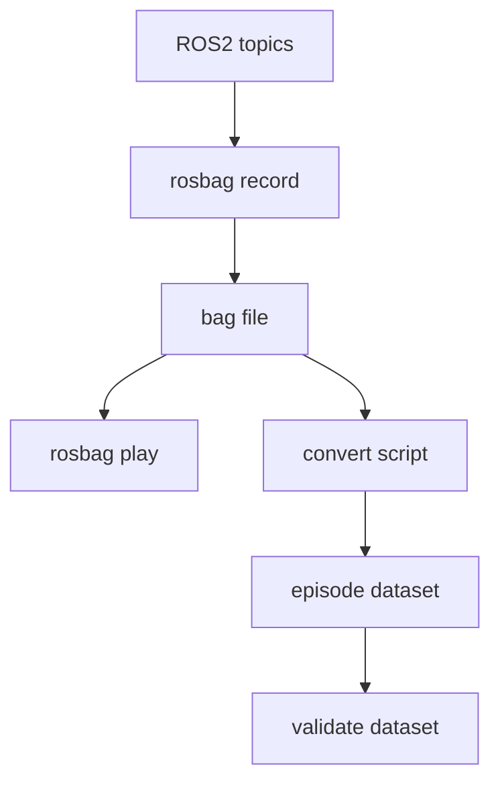

### 4.4 Mermaid 图：转换脚本内部流程

```mermaid
flowchart TD
    A[读取 bag] --> B[按 topic 分组]
    B --> C[时间同步]
    C --> D[导出图像]
    C --> E[整理 states]
    C --> F[整理 actions]
    D --> G[生成 episode 目录]
    E --> G
    F --> G
    G --> H[写入 meta.json]
```

---

## 5. 工程化理解

### 5.1 recorder 与 rosbag 的关系

有些初学者会把 recorder 与 rosbag 混为一谈。更准确地说：

- rosbag 是系统级的多 topic 录制工具；
- recorder node 更像系统里的一个业务节点，它可以辅助记录、筛选、标注或触发 episode 切分。

在很多项目中，这两者会协同工作：用 rosbag 保存原始现场，用 recorder 提供结构化上下文。

### 5.2 教学阶段为什么先用 mock rosbag

本章主线项目新增了一个教学版的“mock rosbag”输入文件：

```text
data/mock_rosbag/session_0001_mock_rosbag.jsonl
```

它并不是真实 `.db3` 文件，而是用 JSONL 模拟 rosbag 中按 topic 写入的消息流。这样做的好处是：

- 便于读者直接看懂输入；
- 便于用纯 Python 实现 converter；
- 先理解转换流程，再迁移到真实 rosbag 环境。

### 5.3 为什么转换脚本值得单独写

很多项目会直接在 recorder 里“边录边转”。这种做法不是不行，但在教学和工程上都不够清晰。把转换脚本单独拿出来有几个好处：

- 逻辑可复用；
- 便于离线调试；
- 便于对不同 session 重复转换；
- 便于版本管理和数据修复。

---

## 6. 主线项目中的位置

本章为主线项目新增：

```text
robot-learning-shelf-demo/
  data/mock_rosbag/
    session_0001_mock_rosbag.jsonl
  scripts/
    03_convert_rosbag_to_dataset.py
  datasets/
    dataset_from_mock_rosbag/
      episode_9001/
  reports/
    ch10_rosbag_conversion_summary.md
    ch10_dataset_from_mock_rosbag_report.json
    ch10_dataset_from_mock_rosbag_report.md
    ch10_dataset_from_mock_rosbag_action_distribution.png
```

这意味着主线项目现在第一次具备：

- 从“模拟 bag”到 episode 的完整转换能力；
- 一条新的 episode 数据来源通路；
- 以及与第 8 章数据验证脚本的衔接能力。

---

## 7. 示例

### 7.1 示例 1：记录哪些 topic

主线项目中最值得优先记录的 topic 是：

- 前视图像；
- 腕视图像；
- joint states；
- action command；
- task info。

这些 topic 基本覆盖了 episode 构建所需的 observation、state、action 和 meta。

### 7.2 示例 2：不同频率流如何处理

如果 `/joint_states` 更新频率高于 `/action_cmd`，一种常见做法是：

- 以图像或主控制周期为主时间轴；
- 对低频或高频 topic 做最近邻对齐；
- 将原始 timestamp 仍然保留下来，便于复查。

### 7.3 示例 3：从 mock rosbag 转换到 episode

本章新增的转换脚本会读取 `session_0001_mock_rosbag.jsonl`，并输出：

```text
datasets/dataset_from_mock_rosbag/episode_9001/
  images/front/
  images/wrist/
  states.jsonl
  actions.jsonl
  meta.json
```

这让你第一次完整走通：topic → bag → episode 的链路。

### 7.4 示例 4：转换后接入验证

转换只是第一步。更完整的工程闭环是：

```text
rosbag / mock bag
  -> convert
  -> episode
  -> validate_dataset
```

也就是说，任何新录制来源的数据，都应该在进入训练前先通过第 8 章的质检。

---

## 8. 练习代码

### 8.1 转换脚本

运行方式：

```bash
cd robot-learning-shelf-demo
python scripts/03_convert_rosbag_to_dataset.py   --bag_jsonl data/mock_rosbag/session_0001_mock_rosbag.jsonl   --output_episode_dir datasets/dataset_from_mock_rosbag/episode_9001   --summary_md reports/ch10_rosbag_conversion_summary.md
```

### 8.2 转换后验证

```bash
python scripts/04_validate_dataset.py   --dataset_dir datasets/dataset_from_mock_rosbag   --output_json reports/ch10_dataset_from_mock_rosbag_report.json   --output_md reports/ch10_dataset_from_mock_rosbag_report.md   --plot_path reports/ch10_dataset_from_mock_rosbag_action_distribution.png
```

这样，你就能验证转换出来的新数据是否合格。

---

## 9. 代码解释

### 9.1 `03_convert_rosbag_to_dataset.py` 的核心思路

这个脚本的输入是按 topic 写入的 JSONL，输出是标准 episode 目录。它主要做了四件事：

1. 按 topic 分组；
2. 以主时间轴重采样对齐；
3. 分别生成 states / actions / meta；
4. 导出图像占位帧。

其中“导出图像占位帧”并不是为了模拟真实视觉复杂度，而是为了让 episode 结构保持完整。

### 9.2 为什么先生成 placeholder 图像

在真实系统中，图像当然来自真实相机数据；但在教学阶段，如果为了等真实图像链路而停住，会大大拖慢学习节奏。因此，这里先生成 placeholder 图像，目的是让你优先理解：

- episode 的目录结构；
- 图像帧与时间步对应；
- conversion script 应该产出什么。

### 9.3 为什么 summary 报告仍然重要

转换脚本不仅要“生成文件”，还要输出一份 summary，说明：

- 转换了多少步；
- 包含哪些 topic；
- 导出了多少 front / wrist 帧；
- 输出目录在哪里。

这能帮助你快速判断转换有没有按预期完成。

---

## 10. 常见错误

### 错误 1：把 bag 当训练数据直接用

bag 更像原始记录，不是最终训练样本。

### 错误 2：忽略多 topic 频率差异

不做时间对齐就直接拼接，很容易得到错位数据。

### 错误 3：图像导出后不校验数量

导出图像数量与 state 数不一致，是非常常见的问题。

### 错误 4：转换后不接质检

没有经过验证的新数据，不应直接进入训练环节。

### 错误 5：没有 session 级命名规范

录制次数多起来后，没有 session_id 会让数据管理迅速失控。

---

## 11. 本章练习

1. 设计 rosbag 录制命名规范，包含日期、任务名、operator_id、session_id；
2. 扩展 `03_convert_rosbag_to_dataset.py`，让它支持读取不同 topic 频率；
3. 在 `meta.json` 中增加 `session_id` 字段；
4. 思考：如果 wrist 图像频率只有 front 图像的一半，应如何对齐？
5. 思考：自动驾驶 log 回放和机器人 rosbag 回放有什么相同与不同？

---

## 12. 本章产出

本章应当产出：

1. 一份教学版 mock rosbag 数据；
2. 一条从 mock rosbag 到 episode 的转换脚本；
3. 转换后的 episode 数据目录；
4. 一份转换 summary；
5. 与第 8 章质检链路相衔接的完整流程。

---

## 13. 小结

这一章最重要的结论可以概括成一句话：

> **rosbag 的真正价值，不只是“把数据录下来”，而是把在线运行现场变成一个可回放、可分析、可转换、可沉淀的学习资产。**

从主线项目角度看，到这一章结束时，我们已经把前面所有内容串成了一个较为完整的工程闭环：

- 明确任务；
- 定义 episode；
- 检查数据；
- 设计 ROS2 topic；
- 记录 / 转换数据；
- 再回到验证与训练。

这意味着第 1–10 章已经不仅是概念介绍，而是在逐步搭起一个真正能继续长成完整具身智能项目的系统骨架。

---

# 第 11 章：TF、机器人坐标系与相机空间理解

前两章我们已经把机器人数据流接到了主线项目里：你知道了 ROS2 topic 是怎么流动的，也知道了 rosbag / mock rosbag 怎么转成 episode。接下来，工程会立刻碰到一个自动驾驶工程师很熟悉、但在机器人里又更“直接”的问题：

> 图像里的目标，怎样变成机器人真正能执行的空间位置？

自动驾驶里，我们会讨论相机模型、外参、坐标变换、目标在车体坐标系中的位置；在具身智能里，这个问题并没有消失，只是从“车体坐标 → 世界坐标 → 规划轨迹”变成了“像素 → 相机坐标 → base_link → 抓取位姿 → 机械臂动作”。

本章就是要把这条链路彻底讲明白，并把你的自动驾驶空间理解经验迁移到机器人上。读完本章后，你应该能清楚回答：

- `world / map`、`base_link`、`camera_link`、`end_effector`、`object_frame` 各自代表什么；
- 为什么同样都是相机，**定置相机（eye-to-hand）** 和 **腕部相机（eye-in-hand）** 会带来完全不同的标定链路与误差传播；
- 给定一个像素点 `(u, v)` 和对应深度 `d`，如何求出相机坐标系下的 3D 点；
- 如何利用外参矩阵把这个点变换到 `base_link`；
- 为什么很多机器人“抓偏了”的问题，本质上不是模型没学好，而是坐标系错了。

---

## 1. 本章要解决的问题

本章重点解决以下问题：

1. 机器人里常见的坐标系有哪些，它们之间是什么关系？
2. TF tree 在工程上到底有什么用？
3. 像素点加深度是如何恢复为相机坐标系 3D 点的？
4. 相机坐标到机器人基座坐标需要哪些已知量？
5. eye-to-hand 与 eye-in-hand 有什么本质差异？
6. 坐标系错误通常会表现为哪些抓取失败现象？
7. 主线项目如何把这一章的知识落成可运行代码与配置？

---

## 2. 为什么这个问题重要

### 2.1 机器人执行和自动驾驶感知的最大共同点：都离不开空间链路

从视觉模型输出到动作执行，中间最容易被忽视的一层就是空间表达。自动驾驶里，你可能已经非常熟悉这些说法：

- 目标在相机坐标系还是车体坐标系？
- BEV 坐标和原始图像坐标如何对应？
- 标定误差会不会引入感知偏移？

机器人里同样如此。区别只在于：自动驾驶中的空间误差通常体现在轨迹规划偏差、占据误差、检测偏移上；而在机器人里，空间误差会更直接地表现为：

- 手爪明明对着盒子，却始终偏左 3 cm；
- 下降方向正确，但高度不对，抓空了；
- 转到收纳盒上方后，放置点明显跑偏；
- 腕部相机视角一变，抓取效果突然不稳定。

### 2.2 在具身智能工程里，坐标系是“系统问题”，不是单个模块问题

很多初学者会把抓取失败归因于检测模型、策略模型，甚至归因于“VLA 还不够强”。但如果你从工程闭环角度看，会发现空间问题横跨多个模块：

- 相机内参决定像素反投影；
- 外参决定相机系到机器人系的变换；
- 任务定义决定抓取位姿的构造规则；
- 运动学与规划决定末端执行器如何到达该位姿；
- 数据记录又决定这些位姿是否被正确保存进 episode。

所以，本章是连接“视觉理解”和“机械臂执行”的第一道桥。

### 2.3 这恰恰是自动驾驶/感知工程师最容易建立优势的地方

如果你来自自动驾驶感知、泊车感知、BEV、点云或标定方向，那么这章内容不是陌生知识，而是一次迁移：

- 你熟悉针孔成像和外参；
- 你知道坐标系一旦搞错，后面整个链路都会歪；
- 你知道“看起来像模型问题，实际是标定问题”在工程里有多常见。

换句话说，很多机器人学习初学者最怕的空间理解问题，恰好是你可以迅速建立信心的切入口。

---

## 3. 核心概念

### 3.1 机器人里常见的坐标系

在本书主线项目里，我们重点关心以下几个坐标系：

- `world / map`：全局参考系。对桌面任务来说，它有时只是一个教学上的全局系；
- `base_link`：机器人基座坐标系。后续很多抓取位姿都要以它作为执行参考；
- `camera_link`：相机坐标系。视觉观测直接发生在这里；
- `end_effector`：末端执行器坐标系，也就是夹爪 / 工具坐标；
- `object_frame`：目标物体坐标系。抓取点、物体朝向通常围绕它来定义。

其中最关键的一点是：**策略或者规则最终输出的目标位姿，通常必须落在机器人控制器能理解的参考坐标系中**，这个系在桌面任务里通常就是 `base_link`。

### 3.2 TF tree：把“谁相对谁”表达清楚

TF 的核心不是画一棵好看的树，而是明确每个坐标系之间的变换链。你可以把 TF tree 理解成：

- 系统里有哪些 frame；
- 每个 frame 的父节点是谁；
- 某个点或位姿想从 A 系变到 B 系，需要沿哪条链做变换。

如果这棵树不清楚，后续会出现三类典型混乱：

1. 相机系点直接拿去控制机械臂；
2. `base_link` 和 `world` 被混用；
3. `camera_link -> end_effector` 和 `camera_link -> base_link` 的链路搞反。

### 3.3 像素 + 深度为什么能恢复 3D 点

如果相机已知内参 `fx, fy, cx, cy`，并且某个像素点 `(u, v)` 对应深度 `d`，那么相机坐标系下的 3D 点 `P_c = [x, y, z]^T` 可由针孔模型恢复：

```text
x = (u - cx) * d / fx
y = (v - cy) * d / fy
z = d
```

这一步本质上就是“反投影”。

在自动驾驶里，你可能更习惯把这件事理解成“由像素射线和深度恢复空间点”；在机器人里，意义非常直接：这个 3D 点可以继续被变换到 `base_link`，从而成为抓取位姿构造的输入。

### 3.4 外参矩阵：把相机看到的点，送到机器人能执行的系里

当你有了 `P_c` 后，还需要一个 4×4 齐次变换矩阵 `T_base_camera`，才能将点变换到机器人基座坐标系：

```text
P_b = T_base_camera * P_c
```

这里的关键不在公式本身，而在于：

- `T_base_camera` 是已知的吗？
- 它是定置相机的静态外参，还是腕部相机的动态链路一部分？
- 它的旋转顺序和轴定义是否与系统一致？

机器人项目里大量“偏一点点”的问题，往往都藏在这里。

### 3.5 Eye-to-Hand 与 Eye-in-Hand

这两个安装方式几乎决定了你后面的系统风格：

- **Eye-to-Hand（定置相机）**：相机固定在环境中，观察机器人和桌面；
- **Eye-in-Hand（腕部相机）**：相机装在末端，视角跟随机械臂运动。

它们的工程差异可以简化理解为：

| 维度 | Eye-to-Hand | Eye-in-Hand |
|---|---|---|
| 视野 | 稳定 | 随运动变化 |
| 遮挡 | 容易被机器人遮挡 | 通常更灵活 |
| 标定链路 | 相对长 | 相对短 |
| 使用场景 | 全局观察、桌面任务 | 精细操作、局部观测 |

在主线项目 `pick_box_to_bin` 中，我们先采用 **eye-to-hand**，因为它更适合教学，也更容易把空间链路讲清楚。

---

## 4. 概念图 / 流程图 / 架构图

### 4.1 图 11-1 TF 树与从像素到抓取位姿的空间链路


这张图可以作为本章总图来理解。它把两件事连到了一起：

1. 上半部分说明了 `world / base_link / camera_link / end_effector / object_frame` 之间的关系；
2. 下半部分把“像素 + 深度”到“抓取位姿”的工程链路拆成 5 步。

### 4.2 图 11-2 Eye-to-Hand 与 Eye-in-Hand 对比


这张图重点帮助你理解：相机安装方式不是部署细节，而是会直接影响标定链路、误差传播和遮挡模式的系统选择。

### 4.3 Mermaid 图：从视觉观测到抓取执行的最小链路

```mermaid
flowchart LR
    A[像素 u,v + 深度 d] --> B[相机坐标点 P_c]
    B --> C[通过 T_base_camera 变换到 P_b]
    C --> D[构造抓取位姿 T_grasp]
    D --> E[发送给运动规划器]
    E --> F[机械臂执行]
```

### 4.4 Mermaid 图：主线项目中的坐标链

```mermaid
flowchart TD
    A[world / map] --> B[base_link]
    B --> C[camera_link]
    B --> D[end_effector]
    C --> E[视觉估计 object_frame]
    E --> F[在 base_link 中构造抓取位姿]
```

---

## 5. 工程化理解

### 5.1 先把“参考坐标系”固定下来，再谈抓取策略

初学者最常见的错误之一，是一边看视觉结果，一边随手在不同坐标系里写规则。例如：

- 检测输出在图像平面；
- 抓取点在相机系；
- 放置点又直接写成了桌面系的数值；
- 最终控制指令却默认控制器接收 `base_link`。

这样做的结果是：每一步看起来都合理，但整个链路拼不起来。一个更工程化的做法是：

1. 明确视觉输出在什么系；
2. 明确控制器需要什么系；
3. 明确中间所有已知变换；
4. 统一在同一个“执行参考系”中表达抓取 / 放置位姿。

在主线项目里，这个执行参考系统一为 `base_link`。

### 5.2 机器人里的“标定问题”往往比模型问题更值得先查

如果机器人抓偏，可以按如下顺序排查：

1. 先看像素点是否选对；
2. 再看深度是否可信；
3. 再看内参是否正确；
4. 再看相机外参是否正确；
5. 最后才看抓取位姿构造与运动规划。

这和自动驾驶里“先查数据、再查标定、最后查模型”的思路是高度一致的。

### 5.3 坐标系调试不要只看数字，要看现象模式

很多空间错误是有“症状”的：

- **整体固定偏移**：通常怀疑外参平移；
- **方向反了**：通常怀疑坐标轴定义或旋转顺序；
- **离中心正常，边缘很差**：通常怀疑内参与深度误差；
- **腕部相机到处跳**：通常怀疑动态链路、末端姿态或时间同步。

学会从现象反推链路位置，是从“会写公式”走向“会调系统”的关键。

---

## 6. 主线项目中的位置

本章为主线项目新增了以下文件：

```text
robot-learning-shelf-demo/
  configs/
    camera_config.yaml
    robot_config.yaml
  ros2_ws/src/
    shelf_demo_tf_tools/
      README.md
  scripts/
    geometry_utils.py
  reports/
    ch11_transform_demo.json
```

这些新增内容的作用分别是：

- `camera_config.yaml`：定义相机内参与静态外参；
- `robot_config.yaml`：定义主线任务的基座、末端与工作空间参数；
- `geometry_utils.py`：把本章最关键的空间计算真正跑起来；
- `ch11_transform_demo.json`：保存一次从像素到 `base_link` 的计算结果，便于后续复查和教学展示。

---

## 7. 示例

### 7.1 示例 1：给定像素和深度，求相机坐标点

假设：

- `u = 356`
- `v = 242`
- `d = 0.58`
- `fx = fy = 615`
- `cx = 320`
- `cy = 240`

则相机坐标为：

```text
x = (356 - 320) * 0.58 / 615 ≈ 0.0339
y = (242 - 240) * 0.58 / 615 ≈ 0.0019
z = 0.58
```

这说明该点在相机系中，位于镜头前方约 58 cm、略偏右上方。

### 7.2 示例 2：用 `geometry_utils.py` 计算 `base_link` 坐标

```bash
cd robot-learning-shelf-demo
python scripts/geometry_utils.py \
  --camera_config configs/camera_config.yaml \
  --u 356 --v 242 --depth 0.58 \
  --output reports/ch11_transform_demo.json
```

输出文件中会包含：

- 输入像素与深度；
- 相机内参；
- `T_base_camera` 4×4 矩阵；
- 点在相机系下的位置；
- 点在 `base_link` 下的位置。

### 7.3 示例 3：固定偏移型抓偏

假设你发现抓取总是比目标偏左约 2–3 cm，且在所有场景中偏差方向相近。此时优先怀疑：

- `T_base_camera` 的平移量有误；
- 物体点位构造时用了错误的 reference frame；
- 末端执行器抓取偏置（grasp offset）没有加对。

这类问题通常和“模型是否足够智能”关系不大。

---

## 8. 练习代码

本章的练习代码放在：

```text
scripts/geometry_utils.py
```

下面给出一个最小核心片段：

```python
from geometry_utils import CameraIntrinsics, pixel_to_camera_point, pose_to_matrix, transform_point

intr = CameraIntrinsics(fx=615.0, fy=615.0, cx=320.0, cy=240.0)
p_c = pixel_to_camera_point(u=356, v=242, depth=0.58, intr=intr)
T_base_camera = pose_to_matrix(
    translation_xyz=[0.45, -0.30, 0.72],
    rpy_rad=[-2.45, 0.0, -1.57],
)
p_b = transform_point(T_base_camera, p_c)

print('camera point =', p_c)
print('base point   =', p_b)
```

建议你做两个小实验：

1. 把 `u, v` 往四周移动，观察 `P_c` 和 `P_b` 如何变化；
2. 故意把外参平移 `x` 增大 0.03 m，再看抓取点会偏移多少。

---

## 9. 代码解释

### 9.1 `pixel_to_camera_point()`

这是最核心的反投影函数。它要求输入：

- 像素坐标；
- 深度值；
- 相机内参。

输出则是相机坐标系下的三维点。它帮助你把“2D 检测结果”提升到“3D 执行候选点”。

### 9.2 `pose_to_matrix()`

这个函数把平移 + RPY 角转成齐次变换矩阵。教学版实现故意保持简洁，让你看清：

- 旋转矩阵是怎么组合的；
- 平移是如何进入 4×4 矩阵的；
- 为什么后续所有点变换都可以统一写成一次矩阵乘法。

### 9.3 `transform_point()`

这个函数把一个 3D 点从源坐标系映射到目标坐标系。对本章来说，它就是“把相机看到的点送进机器人坐标系”的桥梁。

---

## 10. 常见错误

### 10.1 把深度值当成了 z 轴以外的量

在很多深度相机里，深度代表从相机出发沿光线方向或投影模型约定的距离；如果你对深度的定义没有统一，就可能在反投影第一步就出错。

### 10.2 旋转顺序不一致

`roll -> pitch -> yaw` 和 `yaw -> pitch -> roll` 不是一回事。如果相机外参看起来“差不多”，但结果总有奇怪偏差，首先检查旋转顺序。

### 10.3 搞混了 point 和 pose

3D 点只有位置，没有姿态；抓取位姿不仅包含位置，还包含末端执行器的方向。很多初学者把一个目标点直接当成抓取位姿，这是不完整的。

### 10.4 忘了抓取偏置

真正的抓取位姿通常不会等于目标表面中心点本身。你往往还需要考虑：

- 从哪个方向抓；
- 夹爪张开方向；
- 预抓取高度；
- 工具中心点与视觉参考点之间的偏置。

---

## 11. 本章练习

1. 解释 `base_link` 与 `camera_link` 的关系，并画出你自己的 TF tree；
2. 修改 `camera_config.yaml` 中的外参平移，观察 `reports/ch11_transform_demo.json` 的变化；
3. 自己实现 `pixel_to_camera_point()`，不要直接复制示例；
4. 思考：如果改用腕部相机，`camera_link -> base_link` 这条链路会发生什么变化？
5. 用一句话总结：为什么坐标系问题经常被误判为模型问题？

---

## 12. 本章产出

完成本章后，你的主线项目新增了：

- 相机与机器人配置：`configs/camera_config.yaml`, `configs/robot_config.yaml`
- 几何工具脚本：`scripts/geometry_utils.py`
- 一份计算示例结果：`reports/ch11_transform_demo.json`
- 第 11 章两张配图：
  - `images/ch11_tf_tree_and_pixel_to_grasp_pose.png`
  - `images/ch11_eye_to_hand_vs_eye_in_hand.png`

这意味着：主线项目第一次真正具备了“从视觉观测走向抓取空间目标”的基础能力。

---

## 13. 小结

本章可以概括成一句话：

> 视觉看到的是像素，机器人执行的是位姿，而坐标系与 TF 链路负责把两者连接起来。

对于自动驾驶/机器人算法工程师来说，这一章的真正价值不只是会写反投影公式，而是建立一套工程判断：

- 先统一坐标系；
- 再统一参考系；
- 再谈抓取策略；
- 最后再谈模型与泛化。

下一章，我们将沿着这条链继续往下走：既然目标位姿已经有了，机械臂究竟怎样才能到达它？这就进入了机械臂、夹爪、运动学与 MoveIt2 的世界。

---

# 第 12 章：机械臂、夹爪、运动学与 MoveIt2

上一章我们已经完成了一件非常关键的事：把“视觉中的目标”转换成了机器人 `base_link` 下可以理解的空间点或目标位姿。可工程并不会自动因此完成。你接下来会立刻碰到另一个问题：

> 知道目标位姿，并不等于机械臂就能到达这个位姿。

在自动驾驶里，从目标位置到控制命令之间，还要经过规划与控制；在机器人里也一样。一个抓取系统至少还需要回答：

- 机械臂由哪些部分组成？
- 目标位姿如何转换成关节解？
- 目标可达但路径会碰撞时怎么办？
- 夹爪何时打开、何时闭合？
- 为什么在模仿学习之前，最好先理解基础控制接口？

本章的目标不是把你训练成机械臂控制理论专家，而是帮你建立一个**面向具身智能工程的机械臂最小知识体系**。我们会聚焦那些真正服务主线项目 `pick_box_to_bin` 的部分：关节、末端执行器、正逆运动学、路径规划、碰撞检测，以及 MoveIt2 在系统中的位置。

---

## 1. 本章要解决的问题

本章重点解决以下问题：

1. 机械臂和夹爪在系统中分别扮演什么角色？
2. 什么是 FK（正运动学）与 IK（逆运动学）？
3. 目标位姿为什么不能直接等同于“电机命令”？
4. 轨迹规划与碰撞检测为什么重要？
5. MoveIt2 在机器人系统里究竟做什么？
6. 为什么要先抽象一个 `RobotArmInterface`，再做后续策略？
7. 主线项目如何在没有真实硬件时先构建可运行的 mock 控制接口？

---

## 2. 为什么这个问题重要

### 2.1 机器人学习不是“跳过控制”

很多人一听到模仿学习、VLA、端到端，就误以为后面不再需要理解机械臂控制。其实恰恰相反：

- 学习策略最终还是要落到动作空间；
- 动作空间背后一定有控制接口；
- 控制接口背后一定隐含机械臂和末端执行器的约束。

如果你连机械臂能做什么、不能做什么都不清楚，那么后面无论是规则策略、人类遥操作还是策略学习，都会很容易落成“纸上动作”。

### 2.2 从“点位”到“动作”，中间必须有运动学与规划

上一章得到的是目标点或目标位姿，它还没有解决这些问题：

- 当前关节角是什么？
- 哪组关节解能到这个位姿？
- 有没有多组解？哪组更合适？
- 机械臂从当前位置走到目标位置，路径会不会撞桌面、收纳盒或自身？

这些问题一起构成了机械臂控制层最基本的能力。也正因为如此，MoveIt2 这类框架才会在机器人项目中如此常见。

### 2.3 先有规则控制接口，后面数据采集才不会漂

在本书的主线中，第 13 章会构建一个规则式 expert。这个 expert 如果没有统一的机械臂控制接口，通常会出现：

- 脚本到处写死位姿；
- 夹爪指令分散在不同文件；
- 采集 episode 时动作语义不一致；
- 日后接真机、换仿真器时难以复用。

因此，本章会先为后续所有策略层建立一层抽象：`RobotArmInterface`。

---

## 3. 核心概念

### 3.1 机械臂的最小组成

从具身智能工程角度看，一台桌面机械臂至少可以拆成三部分：

1. **机械臂本体**：由多个关节与连杆构成，负责把末端执行器移动到目标位姿；
2. **末端执行器（End Effector）**：例如夹爪、吸盘、工具头，真正与环境发生接触；
3. **控制接口**：接收目标位姿或关节目标，并将其转成低层执行命令。

在主线项目 `pick_box_to_bin` 里，我们假设使用一个 6-DOF 机械臂 + 两指夹爪。这个组合足以说明抓取、搬运、放置任务的基本逻辑。

### 3.2 FK：关节角 → 末端位姿

正运动学（Forward Kinematics, FK）要回答的问题是：

> 如果我知道每个关节角是多少，末端执行器此刻在哪里、朝向如何？

它的输入是关节角向量 `q = [q1, q2, ..., qn]`，输出则是末端位姿 `T_ee`。在工程上，FK 的用途非常广：

- 读取机器人当前状态时，推算末端位姿；
- 验证某个关节解对应的末端位置是否合理；
- 在日志、episode 或调试界面中展示当前操作状态。

### 3.3 IK：目标位姿 → 关节解

逆运动学（Inverse Kinematics, IK）要回答的问题则反过来：

> 如果我希望末端执行器到达某个位姿，需要哪些关节角？

与 FK 不同，IK 可能存在：

- 多组解；
- 无解；
- 虽然数学上有解，但不满足关节限制或机械结构约束。

这就是为什么“目标点可见”并不等于“机械臂可达”。

### 3.4 轨迹规划与碰撞检测

假设你已经求出了一个目标位姿和对应关节解，仍然不能直接执行，因为系统还要回答：

- 从当前姿态到目标姿态，走哪条路径？
- 这条路径会不会穿过桌面？
- 会不会碰到收纳盒边缘？
- 机械臂自身会不会自碰撞？

这正是轨迹规划（Trajectory Planning）与碰撞检测（Collision Checking）的职责。

### 3.5 MoveIt2 在系统中的位置

MoveIt2 可以粗略理解为一个“机器人操作任务的中间层”：

- 上层给它目标位姿或运动请求；
- 它负责调用 IK、规划器、碰撞检测；
- 最终输出可执行轨迹，交给控制器执行。

当然，真实 MoveIt2 比这复杂得多，但对本书当前阶段来说，这样的定位已经足够。

---

## 4. 概念图 / 流程图 / 架构图

### 4.1 图 12-1 机械臂、FK/IK 与 MoveIt2 规划流程


这张图把本章的知识压缩成了三个层次：

1. 左上：6-DOF 机械臂的基本结构；
2. 右上：FK 和 IK 的输入输出关系；
3. 下方：MoveIt2 从目标位姿到执行的最小流程。

### 4.2 图 12-2 规划场景与抓取路径示意


这张图特别适合与第 13 章衔接，因为它已经把 `pick_box_to_bin` 的几个关键阶段画出来了：

- 预抓取位姿；
- 抓取位姿；
- 提升；
- 移动到收纳盒；
- 放置；
- 碰撞检测。

### 4.3 Mermaid 图：目标位姿到执行轨迹

```mermaid
flowchart TD
    A[目标位姿 T_grasp] --> B[IK 求解]
    B --> C[候选关节解]
    C --> D[轨迹规划]
    D --> E[碰撞检测]
    E --> F[执行轨迹]
```

### 4.4 Mermaid 图：主线项目中的控制抽象

```mermaid
flowchart LR
    A[视觉 / 几何模块] --> B[抓取目标位姿]
    B --> C[RobotArmInterface]
    C --> D[MockRobotArm / 真机驱动]
    D --> E[episode recorder]
```

---

## 5. 工程化理解

### 5.1 目标位姿不是终点，而是控制层的输入

在具身智能项目里，经常会看到“我已经算出抓取点了，为何还抓不了？”这本质上是把“目标”误当成“执行”。

从系统视角，一个完整链条通常是：

1. 感知得到目标物体位置；
2. 几何层构造抓取位姿；
3. 控制层将抓取位姿转成关节轨迹；
4. 机械臂按轨迹执行；
5. 夹爪在合适时机开合。

也就是说，抓取位姿只是进入控制层的入口，不是最终动作本身。

### 5.2 为什么要把夹爪单独看待

很多学习型系统容易只关注“机械臂路径”，忽略夹爪。可对于 `pick_box_to_bin` 这类任务，真正导致成功 / 失败的经常就是夹爪时机：

- 太早闭合：可能还没对准物体；
- 太晚闭合：已经越过最佳抓取点；
- 提前打开：转运途中会掉落；
- 打开高度不对：可能碰撞收纳盒边缘。

因此，本章的接口设计中，`open_gripper()` 和 `close_gripper()` 会被作为显式动作存在，而不是隐藏在某个大函数里。

### 5.3 抽象接口比“写死真机 API”更适合教学与工程演化

本章新增的 `RobotArmInterface` 有两个目的：

1. 教学上，让读者先理解动作语义，而不是被某家机器人 SDK 绑住；
2. 工程上，让后续规则策略、遥操作、数据记录、训练评测都能复用同一套动作接口。

这和你在自动驾驶中先抽象 perception / planner / controller 边界，再逐步替换具体实现，是同一种工程思维。

---

## 6. 主线项目中的位置

本章为主线项目新增：

```text
robot-learning-shelf-demo/
  scripts/
    robot_arm_interface.py
  reports/
    ch12_mock_robot_arm_demo.json
```

其中：

- `robot_arm_interface.py` 定义了 `RobotArmInterface` 和 `MockRobotArm`；
- `ch12_mock_robot_arm_demo.json` 保存了一次从 pre-grasp 到 return-home 的 mock 执行历史。

这一步的意义在于：主线项目第一次拥有了**控制抽象层**。后面无论是规则式 expert，还是人类遥操作，都可以基于这层抽象往上搭。

---

## 7. 示例

### 7.1 示例 1：从目标位姿到动作序列

对于 `pick_box_to_bin` 来说，一次典型的抓取并不是一个动作，而是一串带语义的动作：

1. `move_to_pose(pre_grasp)`
2. `move_to_pose(grasp)`
3. `close_gripper()`
4. `move_to_pose(lift)`
5. `move_to_pose(pre_place)`
6. `move_to_pose(place)`
7. `open_gripper()`
8. `move_to_pose(home)`

这串动作恰好也是后面第 13 章状态机的雏形。

### 7.2 示例 2：运行 MockRobotArm 演示

```bash
cd robot-learning-shelf-demo
python scripts/robot_arm_interface.py \
  --output reports/ch12_mock_robot_arm_demo.json
```

该输出文件会记录：

- 每一次 `move` 的目标位姿；
- 夹爪的开闭动作；
- 最终末端状态；
- 整条 mock 控制历史。

### 7.3 示例 3：为什么规划场景不能省略

假设你有一个从盒子到收纳盒的直线路径，如果不做规划场景与碰撞检测，可能出现：

- 路径穿过收纳盒壁；
- 从盒子抬起时擦到旁边障碍物；
- 末端方向正确，但机械臂肘部与桌面自碰撞。

这也是为什么我们不能仅仅停留在“点位控制”的层面。

---

## 8. 练习代码

本章的练习代码位于：

```text
scripts/robot_arm_interface.py
```

核心片段如下：

```python
from robot_arm_interface import MockRobotArm

arm = MockRobotArm(home_pose_xyzrpy=[0.30, -0.10, 0.25, 3.14, 0.0, 0.0])
arm.move_to_pose([0.42, 0.05, 0.18, 3.14, 0.0, 0.0], label='pre_grasp')
arm.move_to_pose([0.42, 0.05, 0.05, 3.14, 0.0, 0.0], label='grasp')
arm.close_gripper()
arm.move_to_pose([0.42, 0.05, 0.22, 3.14, 0.0, 0.0], label='lift')
arm.move_to_pose([0.62, -0.08, 0.18, 3.14, 0.0, 0.0], label='pre_place')
arm.open_gripper()
print(arm.get_state())
```

建议你在此基础上做两个练习：

1. 增加 `move_to_joint_positions()` 接口，思考它与 `move_to_pose()` 的区别；
2. 给 `MockRobotArm` 增加“不可达位姿”判断，让它在越界时返回失败信息。

---

## 9. 代码解释

### 9.1 `RobotArmInterface`

这是一个抽象层，目的是明确“动作语义”而不是绑定具体实现。它定义了四类关键能力：

- `move_to_pose()`：移动末端执行器到某目标位姿；
- `open_gripper()`：打开夹爪；
- `close_gripper()`：关闭夹爪；
- `get_state()`：获取当前状态。

### 9.2 `MockRobotArm`

教学版的 `MockRobotArm` 并不做真实运动学求解，它的职责是：

- 维护一个简化状态；
- 接收动作请求；
- 记录动作历史；
- 为第 13 章的脚本 expert 提供一个可运行目标。

这和我们在自动驾驶算法教学里常常先写一个 fake planner / fake controller，是一样的策略：先让信息流跑通，再逐步替换为更真实的实现。

### 9.3 `run_demo()`

该函数提供了一个标准抓取流程的演示，对后面的状态机编排非常重要。你可以把它看成：

- 一次手工编排的抓取剧本；
- 一条规则策略的雏形；
- 一条可被记录为 episode 的动作序列。

---

## 10. 常见错误

### 10.1 把 FK 和 IK 混为一谈

很多人知道这两个名词，但在工程里分不清用法。一个很简单的判断是：

- 已知关节，求末端：FK；
- 已知末端，求关节：IK。

### 10.2 只关注末端点，不关注路径

即使目标位姿本身可达，路径也可能不可执行。忽略路径规划和碰撞检测，会让系统在 demo 视频里看起来“像能抓”，但一上真实环境就不稳定。

### 10.3 把夹爪动作藏在 move 函数里

如果夹爪开闭动作没有显式暴露出来，后续数据采集时会很难定义 action 语义，也不利于策略学习。

### 10.4 过早绑定某个具体机器人 SDK

教学早期如果就把所有逻辑写死到某个品牌 API 里，会让读者把注意力放在库用法，而不是系统抽象上。先抽象接口，再接真机，是更可迁移的路线。

---

## 11. 本章练习

1. 用自己的话解释 FK 和 IK 的区别；
2. 修改 `MockRobotArm`，让它在 `x/y/z` 超过工作空间时返回失败；
3. 给夹爪增加一个 `gripper_width` 状态；
4. 画出 `pick_box_to_bin` 的预抓取、抓取、提升、放置路径；
5. 思考：为什么模仿学习也离不开底层控制接口？

---

## 12. 本章产出

完成本章后，项目新增：

- 控制抽象脚本：`scripts/robot_arm_interface.py`
- 控制演示报告：`reports/ch12_mock_robot_arm_demo.json`
- 第 12 章配图：
  - `images/ch12_robot_arm_fk_ik_moveit2.png`
  - `images/ch12_planning_scene_and_grasp_path.png`

这意味着：主线项目已经从“会计算目标位姿”进一步发展到“会组织基本控制动作”。

---

## 13. 小结

本章最重要的结论可以概括为：

> 机器人学习不是替代控制，而是建立在控制抽象之上的更高层能力。

在 `pick_box_to_bin` 这样的任务里，视觉与几何告诉你“去哪儿”，机械臂与规划告诉你“怎么去”，夹爪时序决定你“是否真正抓住”。

下一章我们就会把这些能力真正串起来：基于本章的控制抽象，写出一个规则式 Pick-and-Place expert，并把它执行出来的数据保存为 episode。这将是主线项目第一次拥有“可自动生成初始训练数据”的能力。

---

# 第 13 章：规则式 Pick-and-Place 专家策略

前面几章，我们已经一点点把主线任务的底座搭了起来：

- 第 6–8 章明确了任务、episode 数据结构与质检方法；
- 第 9–10 章把数据记录与转换链路接了起来；
- 第 11 章解决了从视觉观测到抓取空间目标的变换问题；
- 第 12 章又把机械臂、夹爪、控制抽象和规划流程理顺了。

到这里，整个系统终于来到一个非常关键的节点：

> 我们能不能先不用学习策略，而是写一个**规则式 expert**，把第一个 pick-and-place 任务真正跑起来？

答案是：必须先做，而且非常值得做。

因为对具身智能初学者而言，规则式 expert 不只是过渡方案，它有四个非常现实的价值：

1. 它能帮你验证任务定义、空间链路和控制接口是否连得通；
2. 它能生成第一批可用 episode，为后续模仿学习提供数据；
3. 它能让你看清一个抓取任务到底被拆成哪些阶段；
4. 它能把“策略”从抽象概念变成具体可执行的状态机。

所以，本章不是在讲“传统方法过时了”，恰恰是在说明：**没有规则 expert，很多人根本走不到学习策略那一步。**

---

## 1. 本章要解决的问题

本章重点解决以下问题：

1. 为什么在模仿学习之前，应该先写一个规则式 expert？
2. `pick_box_to_bin` 这种任务应该拆成哪些阶段？
3. 如何把这些阶段组织成状态机？
4. 规则动作怎样保存为 episode？
5. 规则 expert 的数据和后续人类遥操作数据有什么关系？
6. 规则 expert 的局限在哪里？
7. 主线项目如何用脚本生成 10 条可验证的 scripted episodes？

---

## 2. 为什么这个问题重要

### 2.1 规则 expert 是工程闭环的“冒烟测试”

自动驾驶里，我们常常会先写一个简单的基线，先验证模块间接口是否通；机器人学习同样需要这种基线。规则 expert 的意义在于：

- 不用等遥操作系统完善；
- 不用等大模型策略训练完成；
- 先让感知、空间、控制、记录四条链路真正串一次。

如果连规则 expert 都跑不通，那么大多数情况下不是“模型能力不够”，而是系统工程还没打透。

### 2.2 它能把任务结构暴露出来

很多人说“做个 pick-and-place”，听起来像一句话，但真正写脚本时会发现，至少要拆成这些阶段：

- 回到初始位姿；
- 观察 / 估计目标；
- 移动到目标上方；
- 向下接近；
- 关闭夹爪；
- 抬升；
- 平移到容器上方；
- 放下；
- 打开夹爪；
- 回 home。

也就是说，规则 expert 迫使你把任务从口头描述压缩成**状态机 + 条件切换**。

### 2.3 它能生成第一个“像样”的数据集

第 7 章我们已经知道 episode 的格式；第 8 章也已经知道如何做质检。但如果没有真实 episode，前面的数据格式设计就还是停留在“教学样例”层面。

规则 expert 的一个重要贡献，是让我们第一次拥有：

- 一组连续动作；
- 一组随动作变化的状态；
- 一组图像帧；
- success / failure 标签；
- 失败原因（`failure_reason`）。

这正是后续模仿学习最需要的基本材料。

---

## 3. 核心概念

### 3.1 规则式 expert 是什么

本章所说的规则式 expert，本质上是一段带有任务先验的程序。它不靠学习得到策略，而是手工把任务拆成阶段，并为每个阶段写出：

- 进入条件；
- 执行动作；
- 完成条件；
- 异常处理。

你可以把它理解为：一个**可执行的任务剧本**。

### 3.2 为什么状态机是最自然的表达方式

对于 pick-and-place 这类操作任务，状态机非常适合，因为：

- 阶段边界清晰；
- 每个阶段有明显的动作语义；
- 容易加入条件判断；
- 易于记录和调试。

在本章主线项目中，我们采用的最小状态机大致包含：

1. `Home`
2. `MoveAboveObject`
3. `MoveDown`
4. `CloseGripper`
5. `Lift`
6. `MoveAboveBin`
7. `MoveDownToBin`
8. `OpenGripper`
9. `ReturnHome`

### 3.3 什么是 pre-grasp / grasp / place

这些名字在具身智能任务里非常常见：

- **pre-grasp**：位于目标上方的安全准备位姿；
- **grasp**：真正接触并闭合夹爪的位姿；
- **lift**：抓住后抬升到安全高度；
- **pre-place**：位于放置容器上方的准备位姿；
- **place**：把物体放到目标区域的位姿。

把这些术语先标准化，后面你做人类遥操作数据采集或学习策略分析时就会轻松很多。

### 3.4 规则 expert 的数据为什么有价值

它的价值不一定在于“足够强”，而在于“足够干净、足够可解释”：

- 每一步动作来源清楚；
- 每一阶段语义清楚；
- 失败原因容易标；
- 非常适合作为第一批教学数据。

当然，它也有明显局限：

- 泛化能力弱；
- 很依赖场景先验；
- 一旦目标位置变化复杂、遮挡严重或任务分支变多，脚本会迅速膨胀。

但这不影响它在系统早期阶段的重要性。

---

## 4. 概念图 / 流程图 / 架构图

### 4.1 图 13-1 规则式 Pick-and-Place 状态机


这张图就是本章最核心的“任务剧本”。它把脚本策略从一堆 if/else 逻辑，变成了可视化的阶段流。

### 4.2 图 13-2 从规则 Expert Rollout 到 Episode 数据


这张图把本章与前面所有章节连接起来：

- 输入端：观测与状态；
- 中间：规则策略与机器人动作；
- 记录端：图像、状态、动作、元数据；
- 输出端：一个 episode 文件夹。

### 4.3 Mermaid 图：脚本策略执行流程

```mermaid
flowchart TD
    A[读取场景 / 目标位姿] --> B[构造 pre_grasp]
    B --> C[下移到 grasp]
    C --> D[关闭夹爪]
    D --> E[提升到安全高度]
    E --> F[移动到收纳盒上方]
    F --> G[下移到 place]
    G --> H[打开夹爪]
    H --> I[返回 home]
```

### 4.4 Mermaid 图：规则策略到数据记录

```mermaid
flowchart LR
    A[状态机] --> B[MockRobotArm 执行]
    B --> C[记录 states.jsonl]
    B --> D[记录 actions.jsonl]
    B --> E[保存图像帧]
    C --> F[生成 meta.json]
    D --> F
    E --> F
```

---

## 5. 工程化理解

### 5.1 规则 expert 不是为了“替代学习”，而是为了“清场”

系统一开始最怕的，不是策略不够强，而是所有问题混在一起：

- 是视觉错了？
- 是空间变换错了？
- 是夹爪时序错了？
- 是记录脚本错了？

规则 expert 的作用，就是先用最可控的方式把这些问题拆开。只要规则 expert 能稳定跑出一批合格数据，你就知道：

- 基本动作链是通的；
- episode 记录是通的；
- success/failure 标注逻辑是通的；
- 第 14 章进入遥操作采集时，你已经有对照基线了。

### 5.2 状态命名应该服务调试与数据分析

如果你把每一步都写成 `step1, step2, step3`，后面分析数据会非常难。更好的方式是使用有语义的阶段名：

- `pre_grasp`
- `approach`
- `grasp`
- `lift`
- `transfer`
- `place`
- `release`
- `return_home`

这样一来，你在查看 `states.jsonl` 或画时间线时，一眼就知道当前动作处在哪个阶段。

### 5.3 失败样本同样值得保留

本章生成的数据集中，除了成功轨迹，也保留了少量失败 episode，并为其标注 `failure_reason`。这很重要，因为真实机器人学习并不只依赖成功样本。失败样本可以帮助你：

- 分析哪一步最容易出错；
- 后续训练成功判别器或 reward model；
- 对比规则 expert 与人类遥操作之间的差异。

---

## 6. 主线项目中的位置

本章为主线项目新增：

```text
robot-learning-shelf-demo/
  scripts/
    scripted_pick_and_place.py
  datasets/
    dataset_v1_scripted/
      episode_1001/
      ...
      episode_1010/
  reports/
    ch13_scripted_rollout_summary.md
    ch13_dataset_v1_scripted_report.json
    ch13_dataset_v1_scripted_report.md
    ch13_dataset_v1_scripted_action_distribution.png
```

这些产出意味着：

- 项目第一次拥有一个真正可执行的脚本 expert；
- 项目第一次拥有一个以规则策略生成的批量 episode 数据集；
- 数据集已经通过第 8 章的通用质检脚本验证。

---

## 7. 示例

### 7.1 示例 1：运行脚本 expert 生成 10 条 episode

```bash
cd robot-learning-shelf-demo
python scripts/scripted_pick_and_place.py \
  --output_dir datasets/dataset_v1_scripted \
  --num_episodes 10 \
  --seed 42 \
  --fail_mode mixed \
  --summary_md reports/ch13_scripted_rollout_summary.md
```

该命令会生成：

- `episode_1001` 到 `episode_1010`；
- 每条 episode 的 `images/front` 与 `images/wrist`；
- `states.jsonl`、`actions.jsonl`、`meta.json`；
- 一份执行汇总 `ch13_scripted_rollout_summary.md`。

### 7.2 示例 2：验证规则数据集

```bash
python scripts/04_validate_dataset.py \
  --dataset_dir datasets/dataset_v1_scripted \
  --output_json reports/ch13_dataset_v1_scripted_report.json \
  --output_md reports/ch13_dataset_v1_scripted_report.md \
  --plot_path reports/ch13_dataset_v1_scripted_action_distribution.png
```

当前整合包中的验证结果为：

- `total_episodes = 10`
- `ok_episodes = 10`
- `bad_episodes = 0`

这说明数据格式、时间戳、图像数量与动作范围都满足当前教学版的质检约束。

### 7.3 示例 3：失败样本 `grasp_offset_too_large`

在 `mixed` 模式下，脚本会保留少量失败 episode。比如一个抓取偏移失败，其典型表现是：

- `pre_grasp` 与 `grasp` 在 x 方向存在固定偏差；
- 夹爪闭合后，物体并未随末端移动；
- `meta.json` 中 `success = false`；
- `failure_reason = grasp_offset_too_large`。

这类样本非常适合作为后续误差分析材料。

---

## 8. 练习代码

本章练习代码位于：

```text
scripts/scripted_pick_and_place.py
```

其中状态机主干非常值得反复阅读：

```python
plan = [
    ('reset', HOME_POSE, 0.0, 'Episode start'),
    ('observe', HOME_POSE, 0.0, 'Observe scene'),
    ('pre_grasp', pose_from_xyz(pre_grasp_xyz), 0.0, 'Move above object'),
    ('approach', pose_from_xyz(grasp_xyz), 0.0, 'Move down'),
    ('grasp', pose_from_xyz(grasp_xyz), -1.0, 'Close gripper'),
    ('lift', pose_from_xyz(lift_xyz), 0.0, 'Lift object'),
    ('transfer', pose_from_xyz(pre_place_xyz), 0.0, 'Move above bin'),
    ('place', pose_from_xyz(place_xyz), 0.0, 'Move down to bin'),
    ('release', pose_from_xyz(place_xyz), 1.0, 'Open gripper'),
    ('return_home', HOME_POSE, 0.0, 'Return home'),
]
```

建议你做三个小练习：

1. 增加一个 `pause_observe` 状态，让系统在接近前多停留一帧；
2. 增加 `collision_risk_detected` 的分支处理，不只是记录失败，而是提前中止；
3. 增加一个 `retract_after_release` 状态，使放下后先抬高再回 home。

---

## 9. 代码解释

### 9.1 `generate_episode()`

这是整章最关键的函数。它做了四件事：

1. 随机生成一个简化场景中的目标位置；
2. 根据场景位置构造一条抓取计划；
3. 逐步执行计划，并记录状态与动作；
4. 将结果落盘成 episode 目录。

### 9.2 `render_frame()`

为了降低依赖，这个函数使用非常简化的方式绘制教学图像帧。它不是为了逼真渲染，而是为了让读者看到：

- episode 里图像是如何随阶段变化的；
- 即使没有真实相机，我们也能先把数据闭环跑起来。

### 9.3 `failure_reason`

本章脚本不仅记录 `success`，还尽量让失败原因结构化，例如：

- `object_dropped_during_transfer`
- `grasp_offset_too_large`
- `collision_risk_detected`

这对后面做失败分析、构建奖励模型或人机对比很有帮助。

---

## 10. 常见错误

### 10.1 把规则 expert 写成一串不可读的硬编码

如果所有数值都散落在代码里、所有阶段都没有名字，后面你很难调试，也很难把动作序列解释给别人。状态机的价值，正在于把结构显式化。

### 10.2 只保留成功样本

这会让你失去很多有价值的系统信号。即使是教学数据，也建议保留少量带失败原因的轨迹。

### 10.3 episode 记录与控制动作不同步

如果图像帧、状态和动作没有同步保存，后面模仿学习阶段会出现“看着像对的，训练却不稳定”的问题。规则 expert 早期就应该养成同步记录的习惯。

### 10.4 误以为规则数据可以直接替代真实示教数据

规则数据适合做起步和基线，但它无法覆盖更复杂的变化场景，也难以体现人类操作的柔性与修正行为。所以它更像“第一层脚手架”，而不是最终答案。

---

## 11. 本章练习

1. 画出 `pick_box_to_bin` 的状态机，并解释每个状态的进入 / 退出条件；
2. 给 `scripted_pick_and_place.py` 增加一个失败恢复分支；
3. 手动打开某条 episode，观察 `states.jsonl` 中 `phase` 字段如何变化；
4. 比较成功 episode 与失败 episode 的 `meta.json`；
5. 思考：规则 expert 数据与人类遥操作数据相比，各自更适合解决什么问题？

---

## 12. 本章产出

完成本章后，项目新增：

- 规则策略脚本：`scripts/scripted_pick_and_place.py`
- 规则数据集：`datasets/dataset_v1_scripted/`
- 规则执行汇总：`reports/ch13_scripted_rollout_summary.md`
- 数据集验证报告：
  - `reports/ch13_dataset_v1_scripted_report.json`
  - `reports/ch13_dataset_v1_scripted_report.md`
  - `reports/ch13_dataset_v1_scripted_action_distribution.png`
- 第 13 章配图：
  - `images/ch13_scripted_pick_and_place_state_machine.png`
  - `images/ch13_expert_rollout_to_episode.png`

到此为止，主线项目已经真正拥有了“自动生成初始训练数据”的能力。

---

## 13. 小结

本章最重要的结论是：

> 规则式 expert 不是落后的替代品，而是具身智能工程早期最重要的系统验证器与数据生成器之一。

通过它，我们第一次把前面 1–12 章的内容真正串成了一条可执行链：

- 有任务；
- 有空间目标；
- 有控制动作；
- 有状态机；
- 有 episode；
- 有 success / failure；
- 有数据质检。

下一章开始，我们会继续往“真实数据”方向推进，进入遥操作数据采集。这时你会发现：有了规则 expert 作为对照基线，后续所有示教与学习过程都会更容易理解，也更容易诊断问题。

---

# 第 14 章：遥操作数据采集：机器人学习的数据来源

第 13 章我们用规则式 expert 跑通了第一个可执行的 pick-and-place 闭环，也生成了第一批 scripted episode。这个阶段非常关键，因为它让系统第一次真正“动了起来”。

但如果你想继续往模仿学习、行为克隆、ACT、Diffusion Policy、VLA 方向走，很快就会遇到一个现实问题：

> 机器人学习真正稀缺的，并不是模型代码，而是高质量动作数据。

在自动驾驶里，很多人会把注意力放在模型结构上；可一旦真正进入工程落地，你会发现最昂贵、最难持续积累的，往往是数据系统本身。具身智能更是如此，因为它不仅需要：

- 观测；
- 动作；
- 状态；
- 成功/失败标签；
- 任务上下文；
- 甚至还需要把“人是怎么做这件事的”记录下来。

这就是遥操作（teleoperation）的意义。

本章开始，我们从“脚本生成数据”继续往前推进，进入**人类示范数据采集**。你会看到：

- 为什么很多机器人学习系统都离不开遥操作；
- 为什么采集系统不是“加一个手柄”这么简单；
- 为什么失败样本、干预信息、操作员信息都应该进入 episode；
- 为什么即使是低成本键盘遥操作，也依然有很高的教学价值。

本章会在主线项目中新增一个**键盘遥操作模拟采集器**，让你在没有真机、没有 VR、没有主从机械臂的情况下，依旧能够理解一条 teleop episode 是如何被构造出来的。

---

## 1. 本章要解决的问题

本章重点解决以下问题：

1. 为什么遥操作是机器人学习的重要数据来源？
2. 遥操作系统由哪些部分组成？
3. 为什么 episode 里不仅要记录动作，还要记录 `operator_id`、`intervention_count`、`failure_reason`？
4. 键盘、手柄、VR、主从机械臂有什么差异？
5. 一条遥操作示范为什么不能“采完就用”，而必须做 SOP 与质检？
6. 如何在主线项目中实现一个低成本的键盘遥操作模拟采集器？

---

## 2. 为什么这个问题重要

### 2.1 规则数据能起步，但遥操作数据决定上限

第 13 章的规则 expert 非常适合：

- 做系统联调；
- 验证空间变换；
- 生成干净基线数据；
- 快速覆盖标准成功轨迹。

但它也有明显局限：

- 轨迹往往太“标准”；
- 对异常和边界情况覆盖不足；
- 缺少人类操作中的修正、犹豫与恢复行为；
- 很难体现更高层的任务策略。

而遥操作数据恰好能补上这些空白。

### 2.2 机器人学习需要“人是怎么做的”

在许多操作任务里，最有价值的不是“任务完成了”，而是“人是以什么方式完成的”。比如：

- 接近目标时是否先停一下观察；
- 抓取前是否会微调对齐；
- 放置前是否会避开边缘碰撞；
- 出现偏差时是否会中途纠正。

这些都属于人类示范中的“隐性策略”。它们未必会直接写进规则 expert，却会自然地体现在遥操作轨迹中。

### 2.3 采集系统本身就是具身智能工程能力的一部分

很多读者从自动驾驶转向具身智能时，会习惯性地先盯住网络结构和训练框架。但在具身智能里，数据链路往往更先决定项目能不能跑通。

如果你没有：

- 稳定的采集方式；
- 明确的操作规范；
- 可追溯的 episode 结构；
- 对失败样本的处理原则；

那么模型阶段几乎必然会陷入混乱。

所以，**遥操作数据采集不是“辅助工作”，而是机器人学习系统的主干工程之一。**

---

## 3. 核心概念

### 3.1 遥操作的本质：人通过控制平面间接驱动机器人

遥操作并不等于“远程控制”，更准确地说，它是：

> 人通过某种输入设备，把自己的意图映射为机器人动作，并通过观测反馈闭环修正的过程。

这个输入设备可以是：

- 键盘；
- 游戏手柄；
- VR 控制器；
- 触觉设备；
- 主从机械臂；
- 甚至网页控制台。

关键不在于设备有多高级，而在于它是否能够形成稳定的人机闭环。

### 3.2 遥操作系统的基本组成

一个完整的遥操作采集系统，最少包含以下模块：

1. **Human Operator**：操作员；
2. **Teleop Controller**：输入映射与控制器；
3. **Robot Arm + Gripper**：被控执行体；
4. **Camera / Observation**：观测模块；
5. **Recorder**：数据记录器；
6. **Episode Dataset**：数据输出。

### 3.3 为什么 `operator_id` 很重要

很多初学者会忽略这个字段，觉得“谁操作不都一样吗？”

其实不一样。不同操作者会带来显著差异：

- 有的人动作更稳；
- 有的人更激进；
- 有的人失败后更会恢复；
- 有的人习惯先对齐、后接近；
- 有的人会产生更多犹豫与抖动。

因此，在 episode 里保留 `operator_id`，后续你可以：

- 分析操作员差异；
- 找出高质量示范来源；
- 做 teacher filtering；
- 训练时剔除低质量操作者数据。

### 3.4 `intervention_count` 为什么重要

遥操作看上去像是“人一直在操作”，但在很多半自动系统里，人其实是：

- 只在关键阶段接管；
- 在系统偏离后纠偏；
- 在异常时暂停或重置；
- 在失败边缘进行抢救性干预。

这些干预次数本身就是非常有价值的元数据，因为它能告诉你：

- 某条示范是否顺畅；
- 某个阶段是否难；
- 某个系统是否稳定；
- 某类任务是否对人负担过高。

### 3.5 `failure_reason` 不只是为了统计失败率

`failure_reason` 至少有三个作用：

1. 帮助你区分“示范不好”与“任务确实难”；
2. 后续构建 reward model / success classifier 时提供标签；
3. 帮助你决定哪些失败样本值得保留，哪些应该丢弃。

比如：

- `bad_alignment`
- `drop_during_transfer`
- `timeout`
- `collision_risk_detected`
- `sensor_lost`

这些失败原因，对后续分析非常有帮助。

---

## 4. 概念图 / 流程图 / 架构图

### 4.1 图 14-1 遥操作数据采集系统结构


这张图建议你反复看。它不是在讲某个具体产品，而是在讲一个通用的机器人学习采集结构：

- 命令流从人到机器人；
- 观测流从机器人和环境回到人；
- 所有流都应该被 recorder 按时间同步记录；
- 最终以 episode 形式落盘。

### 4.2 图 14-2 从人类示范到 Episode 数据


这张图把“演示”与“训练数据”之间的转换过程画得很直观。它提醒我们：

- 演示本身不是数据集；
- 只有当观测、动作、状态、元数据被同步记录后，才变成可训练 episode；
- SOP 与示范质量标注是必须环节，而不是可选项。

### 4.3 Mermaid 图：遥操作系统主流程

```mermaid
flowchart LR
    A[Human Operator] --> B[Teleop Controller]
    B --> C[Robot Arm + Gripper]
    C --> D[Environment]
    D --> E[Observation]
    E --> F[Recorder]
    B --> F
    C --> F
    F --> G[Episode Dataset]
```

### 4.4 Mermaid 图：采集 SOP

```mermaid
flowchart TD
    A[任务说明] --> B[重置场景]
    B --> C[开始录制]
    C --> D[执行示范]
    D --> E[成功 / 失败标注]
    E --> F[质量复核]
    F --> G[接受 / 拒绝]
    G --> H[写入 episode 数据集]
```

---

## 5. 工程化理解

### 5.1 采集系统的首要目标不是“先进”，而是“稳定”

如果你是从自动驾驶转过来的，很容易被各种高大上的遥操作设备吸引，比如：

- VR；
- 触觉手套；
- 主从机械臂；
- 远程双臂系统。

这些当然重要，但教学项目的第一目标应该是：

- 先把采集链路跑通；
- 先让 episode 格式一致；
- 先让标注规范可执行；
- 先有一套最小可用 SOP。

因此，本章主线项目 deliberately 选择了一个**低成本键盘遥操作模拟器**。目的不是为了说明“键盘最好”，而是为了强调：

> 你可以先用最低门槛方式理解完整数据链路，再逐步替换成更真实的硬件采集方案。

### 5.2 键盘遥操作为什么仍然值得学

它有三个优势：

1. 它足够简单，容易理解动作映射；
2. 它能迫使你明确 action 定义；
3. 它天然暴露“操作不连续”和“输入离散”的问题，这反而有助于你理解更高级设备的价值。

在本章实现中，我们采用的最小映射大致如下：

- `W/S`：沿 y 轴移动；
- `A/D`：沿 x 轴移动；
- `Q/E`：沿 z 轴移动；
- `C`：关闭夹爪；
- `O`：打开夹爪；
- `H`：回 home。

### 5.3 低质量示范不能直接进入训练

这是遥操作采集最容易踩坑的地方。常见低质量示范包括：

- 画面严重遮挡；
- 关键帧缺失；
- 操作过程抖动极大；
- 明明失败，却被标为成功；
- 完整度不足，抓取过程被截断；
- 操作员为了赶时间，行为非常不自然。

所以，遥操作采集的标准流程一定要包含：

- 采集；
- 审核；
- 接受 / 拒绝。

### 5.4 成功样本不是唯一有价值的数据

本章演示里，我们不仅生成了 5 条成功示范，还保留了 3 条失败示范。原因是：

- 失败样本能帮助你理解任务边界；
- 失败原因可以用于后续训练成功判别器；
- 在开放场景里，机器人系统不可能只遇到成功轨迹。

---

## 6. 主线项目中的位置

本章为主线项目新增：

```text
robot-learning-shelf-demo/
  scripts/
    keyboard_teleop_sim.py
  ros2_ws/src/
    shelf_demo_teleop/
      README.md
  datasets/
    dataset_teleop_demo/
      episode_2001/
      ...
      episode_2008/
  reports/
    ch14_keyboard_teleop_summary.md
    ch14_keyboard_teleop_summary.json
```

这意味着项目第一次具备了：

- 人类示范（教学模拟）数据来源；
- `operator_id` / `intervention_count` / `failure_reason` 等关键元数据；
- 成功与失败示范并存的数据采集能力。

---

## 7. 示例

### 7.1 示例 1：运行键盘遥操作模拟采集

```bash
cd robot-learning-shelf-demo
python scripts/keyboard_teleop_sim.py \
  --output_dir datasets/dataset_teleop_demo \
  --num_success 5 \
  --num_failure 3 \
  --operator_id_prefix teacher \
  --seed 42 \
  --summary_md reports/ch14_keyboard_teleop_summary.md \
  --summary_json reports/ch14_keyboard_teleop_summary.json \
  --reset
```

当前整合包中，这条命令已经被执行，生成结果为：

- 总 episode 数：8
- 成功 episode：5
- 失败 episode：3

其中失败原因分别覆盖：

- `bad_alignment`
- `drop_during_transfer`
- `timeout`

### 7.2 示例 2：查看一条成功示范的元数据

示教 episode 的 `meta.json` 中，除了 `success` 以外，还会保存：

```json
{
  "task_name": "pick_box_to_bin_teleop_keyboard",
  "source": "teleop_keyboard_sim",
  "teleop_device": "keyboard",
  "operator_id": "teacher_01",
  "success": true,
  "failure_reason": null,
  "intervention_count": 0
}
```

这说明：

- 数据来源是遥操作模拟；
- 输入设备是键盘；
- 该条轨迹来自 `teacher_01`；
- 任务顺利完成；
- 没有额外干预。

### 7.3 示例 3：失败示范为什么值得保留

比如 `episode_2007` 对应的失败原因为 `drop_during_transfer`。这类轨迹有几个分析价值：

- 它表明夹持稳定性是风险点；
- 它能帮助你定位“是接近阶段错，还是搬运阶段掉落”；
- 它能作为后续 reward learning 的负样本。

---

## 8. 练习代码

本章练习代码位于：

```text
scripts/keyboard_teleop_sim.py
```

其中最值得关注的是动作输入与末端位姿的映射逻辑：

```python
KEY_MAP = {
    'w': [0.00, 0.02, 0.00],
    's': [0.00, -0.02, 0.00],
    'a': [-0.02, 0.00, 0.00],
    'd': [0.02, 0.00, 0.00],
    'q': [0.00, 0.00, 0.02],
    'e': [0.00, 0.00, -0.02],
    'o': [0.00, 0.00, 0.00],
    'c': [0.00, 0.00, 0.00],
    'h': [0.00, 0.00, 0.00],
}
```

这段代码看似简单，但它背后体现的是一个关键思想：

> 遥操作系统必须先明确“人的输入”如何被映射成“机器人动作空间”。

建议你尝试修改：

1. 为 `j/l` 增加 yaw 控制；
2. 把键盘输入改成游戏手柄风格的连续值；
3. 为 `bad_alignment` 增加自动暂停和人工恢复逻辑。

---

## 9. 代码解释

### 9.1 `create_episode()`

这是本章的核心函数。它做了以下事情：

1. 生成一个目标物体位置；
2. 构造抓取与放置过程；
3. 把每一步操作记录成状态与动作；
4. 将前视角和腕部视角保存为图像帧；
5. 最终把整条示范写成一个 episode 目录。

### 9.2 `record_step()`

它负责把一次时刻写成：

- `states.jsonl`
- `actions.jsonl`
- 图像帧

也就是把“操作过程”变成“训练样本”。

### 9.3 为什么要保存 `pressed_key`

在真实项目里，你未必会把所有原始输入都保存下来，但在教学项目里保留 `pressed_key` 很有帮助，因为它能直接让读者看到：

- 人的输入是什么；
- 机器人动作又是什么；
- 输入映射是否直观；
- 某些失败是否来自操作不熟练。

---

## 10. 常见错误

### 10.1 只关注成功率，不关注示范质量

高成功率不代表高质量数据。如果轨迹全程抖动、遮挡严重、动作不自然，训练效果照样可能很差。

### 10.2 不记录操作员信息

后面当你发现某些数据质量特别差时，如果没有 `operator_id`，你就很难追踪问题来源。

### 10.3 把失败样本全部删除

这会导致你失去大量关于任务边界的信息。正确做法是：区分“有分析价值的失败”与“纯噪声失败”。

### 10.4 遥操作链路和数据链路分离

如果人在操作，但 recorder 没有同步记录动作、状态和图像，最后你得到的只是“视频”，而不是可训练 episode。

---

## 11. 本章练习

1. 画出你自己的遥操作采集系统结构图；
2. 修改 `keyboard_teleop_sim.py`，增加一个 `gamepad_mode`；
3. 采集 5 条成功示范与 3 条失败示范；
4. 给失败示范补充更细粒度的 `failure_reason`；
5. 思考：什么样的遥操作示范不应该进入训练集？

---

## 12. 本章产出

完成本章后，项目新增：

- 键盘遥操作模拟器：`scripts/keyboard_teleop_sim.py`
- 遥操作模块说明：`ros2_ws/src/shelf_demo_teleop/README.md`
- 遥操作数据集：`datasets/dataset_teleop_demo/`
- 统计报告：
  - `reports/ch14_keyboard_teleop_summary.md`
  - `reports/ch14_keyboard_teleop_summary.json`
- 第 14 章配图：
  - `images/ch14_teleoperation_system_structure.png`
  - `images/ch14_human_demo_to_episode_data_flow.png`

---

## 13. 小结

本章最重要的结论是：

> 遥操作数据采集，不是“给模型喂点人类数据”这么简单，而是一套完整的数据工程与操作规范系统。

通过本章，你应该已经建立以下认识：

- 机器人学习的高质量动作数据，大量来自遥操作；
- 遥操作系统至少要包含输入、控制、观测、记录与 episode 输出；
- `operator_id`、`intervention_count`、`failure_reason` 都是重要元数据；
- 低成本键盘遥操作也能帮助我们理解完整的数据链路；
- 示范采集必须配合 SOP 与质检，不能“录了就训”。

下一章，我们会把第 13 章的 scripted 数据与第 14 章的 teleop 数据真正整合起来，构建第一版可训练数据集 `dataset_v0`。

---

# 第 15 章：构建第一版数据集 dataset_v0

到了这一章，我们终于来到一个非常关键的节点：

- 第 13 章，我们得到了规则式 expert 数据；
- 第 14 章，我们得到了遥操作示范数据；
- 现在，我们要把这些“分散的数据来源”整合成**第一版可训练数据集**。

对很多刚接触具身智能的工程师来说，容易产生一个误解：

> 只要目录里堆满 episode，就叫数据集。

事实上并不是。

一个真正可训练、可评测、可迭代的数据集，至少应该回答以下问题：

- 这批数据包含哪些任务？
- 数据来自哪里？
- 成功与失败比例是否合理？
- train / val / test 怎么划分？
- 是否避免了数据泄漏？
- 这个数据集的版本号是什么？
- 下次更新以后，如何比较新旧结果？

这也是为什么本章的关键词不只是“收集数据”，而是：

- 组织；
- 划分；
- 版本化；
- 报告化；
- 可追溯。

从自动驾驶经验迁移过来，这一步可以理解为：我们要把“零散采集片段”，升级成“可稳定支撑训练与评估的数据资产”。

---

## 1. 本章要解决的问题

本章重点解决以下问题：

1. `dataset_v0` 的设计目标是什么？
2. 为什么要把 scripted episode 和 teleop episode 混合起来？
3. 如何做 train / val / test 划分？
4. 为什么要避免 train 和 test 之间的信息泄漏？
5. 为什么数据集必须版本化？
6. 如何生成一份 dataset report？

---

## 2. 从“有数据”到“有数据集”

### 2.1 规则数据和遥操作数据不是竞争关系，而是互补关系

规则式 expert 数据的优点是：

- 生成快；
- 一致性强；
- 便于扩展；
- 特别适合做系统联调和早期 baseline。

遥操作数据的优点是：

- 轨迹更接近人类策略；
- 覆盖边界情况更自然；
- 含有修正与恢复行为；
- 对开放场景适应更强。

因此，`dataset_v0` 的目标不是“选一边”，而是组合两边：

- 用 scripted 数据提供规范基线；
- 用 teleop 数据补充真实多样性；
- 用统一的数据结构把它们放在一个可训练集合里。

### 2.2 数据集构建的本质是设计“学习分布”

模型最终学到什么，不完全取决于模型结构，更取决于你给它看了什么数据。

如果数据集：

- 全是成功样本；
- 全是规则直线轨迹；
- 场景永远不变；
- 测试集和训练集几乎一模一样；

那么你训练出来的模型大概率只会对“教学演示环境”表现得很好，一旦换场景，就会暴露问题。

所以，构建数据集其实是在设计一个学习分布：

- 覆盖哪些任务；
- 包含哪些难度层级；
- 引入哪些扰动和随机化；
- 保留多少失败样本；
- 如何让 val/test 保持评测价值。

---

## 3. dataset_v0 的设计目标

### 3.1 最小可训练，而不是最终完美

本书里的 `dataset_v0` 是一个教学型第一版数据集，它不追求规模最大，而追求：

- 能支撑第一个 baseline 训练；
- 能支撑 train / val / test 评估；
- 能让读者看懂数据组织方式；
- 能为后续扩展到更大规模做好结构准备。

### 3.2 必须具备的五个属性

一个合格的 `dataset_v0` 至少具备：

1. **任务覆盖明确**：知道它在训练什么任务；
2. **成功/失败平衡合理**：不是清一色成功；
3. **来源可追溯**：知道 episode 来自 scripted 还是 teleop；
4. **版本可管理**：知道这个数据集是哪一版；
5. **划分可复现**：知道 train / val / test 是怎么来的。

---

## 4. 概念图 / 流程图 / 架构图

### 4.1 图 15-1 dataset_v0 构建流程


这张图把本章的主线讲清楚了：

- 任务配置决定采什么；
- scripted 数据和 teleop 数据共同进入候选池；
- 通过数据质检筛出可用 episode；
- 再做 train / val / test 划分；
- 最后生成 dataset report。

### 4.2 图 15-2 dataset_v0 划分与版本管理


这张图的重点在于强调：

- 划分不是简单随机打乱；
- 数据集必须伴随版本信息、数据卡片、来源记录与 changelog；
- 这样才能支撑真正的实验对比和后续闭环迭代。

### 4.3 Mermaid 图：dataset_v0 构建管线

```mermaid
flowchart TD
    A[任务配置] --> B[规则 expert 数据]
    A --> C[遥操作数据]
    B --> D[候选 episode 池]
    C --> D
    D --> E[数据质检]
    E --> F[train / val / test split]
    F --> G[dataset card]
    F --> H[dataset report]
```

### 4.4 Mermaid 图：版本化与评测关系

```mermaid
flowchart LR
    A[dataset_v0.0.0] --> B[训练 policy_v1]
    B --> C[记录指标]
    C --> D[数据扩展 / 清洗]
    D --> E[dataset_v0.1.0]
    E --> F[训练 policy_v2]
    F --> G[对比 policy_v1 与 policy_v2]
```

---

## 5. 数据集设计的工程原则

### 5.1 train / val / test 的角色必须清楚

- **train**：用于学习参数；
- **val**：用于调参与选择 checkpoint；
- **test**：用于最终评估。

最常见的错误是把 val 当成 test，或者不断在 test 上反复调参，最终让 test 失去“真正未知数据”的意义。

### 5.2 为什么不能完全随机切分

如果只是把所有 episode 打乱后随机切分，你很容易出现：

- 同一场景的极相似轨迹同时出现在 train 和 test；
- 同一个物体布局在 train 和 val 中高度重复；
- 同一来源的重复 episode 被分到不同集合。

这样会导致评测过于乐观。

本书主线项目中，我们对教学数据做了轻量的**按 `source × success` 分层**，这是一个简化但合理的起点。真实项目中，你应该进一步考虑：

- 场景分层；
- 物体分层；
- 难度分层；
- 时间顺序分层；
- 甚至操作者分层。

### 5.3 成功/失败比例为什么重要

如果数据集里只有成功样本，模型会天然低估失败边界。

如果失败样本过多，又可能：

- 拉低行为克隆学习质量；
- 让模型学到过多保守动作；
- 或者在 reward / success 建模上产生偏移。

因此，数据集不是“失败越多越好”或“失败越少越好”，而是要：

- 失败样本有明确用途；
- 失败原因可区分；
- 训练目标与数据比例相匹配。

### 5.4 为什么一定要写 dataset card

很多团队到最后都能把模型训起来，但一旦过几周回头看，会发现自己根本说不清：

- 那次结果最好的是哪版数据？
- 那一版数据比上一版多了什么？
- train 和 val 的比例是多少？
- 是否做过清洗？

dataset card 的意义，就是把这些信息显式化。它是数据工程的“最小文档化单元”。

---

## 6. 主线项目中的位置

本章新增/完善：

```text
robot-learning-shelf-demo/
  scripts/
    build_dataset_v0.py
  datasets/
    dataset_v0/
      train/
      val/
      test/
      splits/
      dataset_card.json
      manifest.json
      README.md
  reports/
    ch15_dataset_v0_report.json
    ch15_dataset_v0_report.md
```

### 6.1 当前整合包里的 dataset_v0 是一个紧凑教学版

按照原始练习规划，你完全可以继续扩展为：

- 50 条成功 episode；
- 20 条失败 episode；
- 更多 scene / object randomization。

但为了让整合包保持轻量、便于 mdBook 和 GitHub 管理，当前集成版提供的是一个**可运行、可训练的紧凑版 `dataset_v0`**：

- 总 episode：18
- success rate：0.7778
- source：
  - `scripted_state_machine`：10
  - `teleop_keyboard_sim`：8

---

## 7. 示例

### 7.1 示例 1：构建 dataset_v0

```bash
cd robot-learning-shelf-demo
python scripts/build_dataset_v0.py \
  --source_dirs datasets/dataset_v1_scripted datasets/dataset_teleop_demo \
  --output_dir datasets/dataset_v0 \
  --seed 2026 \
  --dataset_name dataset_v0 \
  --version v0.0.0 \
  --report_json reports/ch15_dataset_v0_report.json \
  --report_md reports/ch15_dataset_v0_report.md
```

该命令已经在整合包中执行完成。

### 7.2 示例 2：当前 dataset_v0 的统计结果

当前教学版 `dataset_v0` 的统计如下：

| split | episodes | success | failure | success_rate | source |
|---|---:|---:|---:|---:|---|
| train | 11 | 9 | 2 | 0.8182 | scripted + teleop |
| val | 3 | 2 | 1 | 0.6667 | scripted + teleop |
| test | 4 | 3 | 1 | 0.75 | scripted + teleop |

整体：

- total_episodes = 18
- success_count = 14
- failure_count = 4
- success_rate = 0.7778

### 7.3 示例 3：dataset card 的最小内容

本章产出的 `dataset_card.json` 至少包含：

- `dataset_name`
- `version`
- `num_episodes`
- `success_rate`
- `splits`
- `source_counter`
- `task_name`
- `modalities`

这已经足以支撑第一版教学实验。

---

## 8. 练习代码

本章练习代码位于：

```text
scripts/build_dataset_v0.py
```

其中最关键的流程是：

1. 扫描输入数据源目录；
2. 读取各 episode 的 `meta.json`；
3. 按 `source × success` 分组；
4. 做 train / val / test 划分；
5. 拷贝 episode 到目标数据集；
6. 生成 manifest、dataset card 和报告。

下面这段代码体现了“按来源与成功率轻量分层”的思路：

```python
groups: dict[tuple[str, bool], list[dict[str, Any]]] = defaultdict(list)
for item in items:
    key = (item['meta'].get('source', 'unknown'), bool(item['meta'].get('success', False)))
    groups[key].append(item)
```

对于教学项目，这已经足够清晰；对于真实项目，你可以把分层条件扩展成：

- `task_name`
- `scene_id`
- `difficulty`
- `operator_id`
- `object_category`

---

## 9. 代码解释

### 9.1 `scan_episode_dirs()`

这个函数负责在数据源目录下扫描所有包含 `meta.json` 的 episode 目录。它体现了一个好习惯：

> 所有数据集处理脚本，最好都围绕统一的 episode 目录约定工作。

这样后续你替换数据源时，不需要重写整个处理逻辑。

### 9.2 `stratified_split()`

本函数做的是轻量分层切分。它的目标不是做最复杂的统计最优切分，而是先满足：

- scripted / teleop 都能进入 train / val / test；
- success / failure 都能被保留；
- 划分可以复现。

### 9.3 `copy_episode()`

它会把源 episode 拷贝到目标数据集中，同时：

- 重新编号；
- 更新 `episode_id`；
- 记录 `original_episode_id`。

这一步能保证新的数据集具有统一编号体系，同时保留溯源能力。

### 9.4 为什么要输出 `manifest.json`

因为你迟早会需要回答：

- 这版数据集中到底有哪些 episode？
- 它们被分到了哪个 split？
- 来自哪个源数据集？

`manifest.json` 正是为这个问题服务的。

---

## 10. 常见错误

### 10.1 把所有数据都丢进 train

这样做短期看方便，长期看几乎一定会让你失去评测基准。

### 10.2 划分过程不可复现

如果你没有固定随机种子，或者没有保存 split manifest，那么下次重新构建数据集时，train / val / test 可能完全不同，实验结果也就无法比较。

### 10.3 没有版本号

“最新数据集”这种说法在工程里几乎没有意义。你必须明确：

- `v0.0.0`
- `v0.1.0`
- `v1.0.0`

每一版都应该对应可复现快照。

### 10.4 只写数据，不写报告

数据集报告不是形式主义。它能逼着你把：

- 数据规模；
- 成功率；
- 来源分布；
- 划分策略；
- 版本信息；

全部显式写出来。

---

## 11. 本章练习

1. 把 `dataset_v0` 扩展成 50 条成功 + 20 条失败 episode；
2. 为 `build_dataset_v0.py` 增加 `scene_id` 分层切分；
3. 新增 `difficulty` 字段，并在 split 时保持难度比例；
4. 把 `dataset_card.json` 扩展成更完整的 dataset card；
5. 思考：为什么 val / test 不能和 train 完全同分布？

---

## 12. 本章产出

完成本章后，主线项目新增：

- 数据集构建脚本：`scripts/build_dataset_v0.py`
- 第一版教学数据集：`datasets/dataset_v0/`
- 数据集卡片：`datasets/dataset_v0/dataset_card.json`
- 数据集 manifest：`datasets/dataset_v0/manifest.json`
- 数据集报告：
  - `reports/ch15_dataset_v0_report.json`
  - `reports/ch15_dataset_v0_report.md`
- 第 15 章配图：
  - `images/ch15_dataset_v0_build_pipeline.png`
  - `images/ch15_dataset_split_and_versioning.png`

---

## 13. 小结

本章最重要的结论是：

> 数据集不是 episode 的堆积，而是对学习分布、评测协议与数据可追溯性的工程化设计。

通过本章，你应该掌握：

- `dataset_v0` 的目标是“第一版可训练数据集”；
- scripted 与 teleop 数据应该互补使用；
- train / val / test 必须职责清晰；
- split 必须尽量避免信息泄漏；
- 数据集必须版本化、报告化、可追溯。

下一章，我们会使用本章生成的 `dataset_v0`，训练第一个 ACT baseline，让整个“数据 -> 模型 -> 评测”的主线第一次真正闭合起来。

---

# 第 16 章：训练第一个 ACT Baseline

到这里，我们终于走到了一个非常有成就感的位置：

- 前面十几章，我们一直在补系统地基；
- 我们定义了任务；
- 明确了 observation / action / state / episode；
- 理解了 imitation learning 和 VLA 的基本概念；
- 建了数据格式；
- 做了数据质检；
- 采了 teleop 数据；
- 组装出了第一版 `dataset_v0`。

现在，终于可以问那个大家最关心的问题了：

> 如何用这些数据，训练第一个会输出动作序列的策略 baseline？

这一章，我们选择的对象是 **ACT（Action Chunking Transformer）路线的教学化 baseline**。

请注意：

- 本章不是要复现论文级别完整 ACT；
- 也不是要做最强策略；
- 而是要让你真正理解：**一个 action chunk 策略是如何从数据集走向训练、再走向 rollout 评测的。**

因此，本章会采用一个**ACT-like 教学实现**：

- 输入：当前观测特征；
- 输出：固定长度的 action chunk；
- 训练：监督学习最小化预测动作与真实动作之间的误差；
- 评测：查看 val loss 和 rollout preview。

它不追求最强性能，但非常适合用来建立“第一条训练主线”。

---

## 1. 本章要解决的问题

本章重点解决以下问题：

1. ACT baseline 的训练输入输出是什么？
2. 什么是 action chunk，为什么它有用？
3. 为什么 policy rollout 不是只预测一步？
4. 如何从 `dataset_v0` 构造训练样本？
5. 如何记录 loss、checkpoint 和训练报告？
6. 为什么 baseline 是起点，而不是最终系统？

---

## 2. 为什么选 ACT 路线做第一版 baseline

### 2.1 从单步动作预测到动作块预测

最朴素的行为克隆，会做这样的事情：

- 输入当前观测；
- 预测当前动作。

这当然可以，但它有一个明显问题：

- 连续控制时，单步策略容易抖；
- 动作之间缺少连贯性；
- 每一步都重新决策，可能导致局部不稳定。

ACT 路线的一个关键改进是：

> 在时刻 `t`，不是只预测一步动作，而是预测未来 `K` 步动作，形成一个 `action chunk`。

这会带来几个好处：

- 轨迹更连贯；
- 推理频率可以降低；
- 多步目标更容易编码进输出；
- 对抓取、搬运、放置这类局部连续动作更友好。

### 2.2 为什么这很适合 pick-and-place 主线

pick-and-place 任务中，很多阶段本来就天然是一个局部动作片段：

- 向目标接近；
- 下降并对齐；
- 闭合夹爪；
- 抬起；
- 移动到容器；
- 放置。

因此，用 action chunk 的方式理解策略，会比“只预测下一步”更符合操作任务直觉。

---

## 3. ACT 基础概念

### 3.1 Observation、Action Chunk、Loss

本章的 ACT-like baseline 可以抽象成：

- **输入 observation**：当前时刻的观测特征；
- **输出 action chunk**：未来 `K` 步动作向量拼接结果；
- **loss**：预测动作块与真实动作块之间的均方误差。

### 3.2 本章的教学简化

真实 ACT 往往涉及：

- 更复杂的时序编码；
- transformer 结构；
- 更规范的多模态编码器；
- 更完善的 rollout 与 deployment 逻辑。

为了让全书主线能在本地教学环境里直接跑起来，本章采取的简化是：

1. 用 episode 中的状态字段构造一个 16 维特征；
2. 用线性模型学习 observation -> action chunk；
3. 用 numpy 做训练与 checkpoint；
4. 用 matplotlib 画 loss curve。

这里的目标不是“比论文更强”，而是让你**真正看懂训练链路**。

### 3.3 什么是 policy rollout

训练阶段你看到的是：

- 输入样本；
- 输出预测；
- 计算 loss。

但部署阶段真正发生的是：

1. 观察当前状态；
2. 预测一个 action chunk；
3. 执行其中前若干步；
4. 再次观测；
5. 重复以上过程，直到任务结束。

这就是 policy rollout。

---

## 4. 概念图 / 流程图 / 架构图

### 4.1 图 16-1 ACT Baseline 训练流程


这张图展示了从 `dataset_v0` 到 `policy_v1` 的主流程：

- dataset_v0 -> DataLoader
- Observation Encoder
- ACT-like Policy
- Predicted Action Chunk
- Loss
- Optimizer Update
- Checkpoint
- Validation

### 4.2 图 16-2 action chunk 与 policy rollout


这张图非常重要，因为它把两个概念清晰分开了：

- 左边是“单次推理预测一个 chunk”；
- 右边是“整个 episode 中不断滚动执行 chunk”。

### 4.3 Mermaid 图：ACT-like 训练流程

```mermaid
flowchart TD
    A[dataset_v0] --> B[构建样本 X, Y]
    B --> C[Observation Encoding]
    C --> D[ACT-like Policy]
    D --> E[Predicted Action Chunk]
    E --> F[Loss]
    F --> G[Optimizer Update]
    G --> H[Checkpoint policy_v1]
    H --> I[Validation]
```

### 4.4 Mermaid 图：policy rollout

```mermaid
flowchart LR
    A[Observe o_t] --> B[Predict action chunk a_t:t+K]
    B --> C[Execute first k actions]
    C --> D[Observe new state]
    D --> E[Predict next chunk]
    E --> F[Repeat until success / failure]
```

---

## 5. 从 dataset_v0 到训练样本

### 5.1 样本是如何构造的

在本章的教学实现中，我们把每一个训练样本定义为：

- 输入 `x`：当前时刻的状态特征；
- 输出 `y`：未来 `K=4` 步动作拼接向量。

输入特征由以下部分组成：

- 末端位姿 xyz；
- 夹爪开合状态；
- 物体位置 xyz；
- bin 位置 xyz；
- 物体相对末端位姿；
- bin 相对末端位姿。

总计得到 16 维输入特征。

### 5.2 输出动作定义

本章使用的动作向量为：

- `dx`
- `dy`
- `dz`
- `gripper_delta`

也就是说，一个 4 步 chunk 的输出维度为：

```text
4 steps × 4 dims = 16 dims
```

### 5.3 为什么这是合理的简化

因为本书当前的主线任务是一个相对简单的 pick-and-place 教学场景：

- 主要关注末端三维移动；
- 不强行引入复杂姿态旋转；
- 夹爪开合作为关键离散/连续控制量保留。

这样做可以让读者把注意力集中在：

- chunk prediction 的核心机制；
- 数据到训练样本的转换；
- loss / checkpoint / rollout 的工程逻辑。

---

## 6. 主线项目中的位置

本章新增：

```text
robot-learning-shelf-demo/
  scripts/
    06_train_act_on_dataset_v0.py
  reports/
    ch16_act_dataset_v0_report.json
    ch16_act_dataset_v0_report.md
    ch16_act_dataset_v0_loss_curve.png
    ch16_policy_v1_linear_chunk.npz
```

这意味着主线项目第一次具备了：

- 从数据集构建训练样本；
- 训练一个 ACT-like baseline；
- 保存 checkpoint；
- 输出训练曲线与验证报告。

到这里，“数据 -> 模型 -> 评测”的第一条闭环才真正成立。

---

## 7. 示例

### 7.1 示例 1：运行训练

```bash
cd robot-learning-shelf-demo
python scripts/06_train_act_on_dataset_v0.py \
  --dataset_root datasets/dataset_v0 \
  --chunk_size 4 \
  --epochs 80 \
  --lr 0.06 \
  --weight_decay 0.0001 \
  --checkpoint_path reports/ch16_policy_v1_linear_chunk.npz \
  --report_json reports/ch16_act_dataset_v0_report.json \
  --curve_path reports/ch16_act_dataset_v0_loss_curve.png
```

该命令已在当前整合包中执行。

### 7.2 示例 2：本章训练结果

当前教学版 baseline 的报告如下：

- `feature_dim = 16`
- `output_dim = 16`
- `chunk_size = 4`
- `num_train_samples = 618`
- `num_val_samples = 259`
- `epochs = 80`
- `final_train_loss = 0.004891`
- `final_val_loss = 0.003368`
- `first_step_val_loss = 0.002745`

这里需要注意两点：

1. 这个结果说明“主线训练流程跑通了”；
2. 它不代表系统已经具备真实部署性能。

### 7.3 示例 3：rollout preview 如何看

训练报告还给出了一个验证 episode 的 rollout preview。例如在 `episode_00012` 上：

| t | pred_first_action | gt_first_action |
|---:|---|---|
| 0 | [0.0063, 0.0083, -0.0045, -0.0467] | [0.0, 0.0, 0.0, 0.0] |
| 2 | [0.0280, 0.0289, -0.0089, -0.1482] | [0.0681, 0.1216, -0.0700, 0.0] |
| 4 | [-0.0142, 0.0041, 0.0100, -0.3482] | [0.0, 0.0, 0.0, -1.0] |

这类结果说明：

- 策略已经学到了一定的动作趋势；
- 但与真实动作仍有偏差；
- 尤其在抓取/开合这类离散切换动作上，误差更明显。

这正是 baseline 的价值：它为后续改进指出方向。

---

## 8. 练习代码

本章练习代码位于：

```text
scripts/06_train_act_on_dataset_v0.py
```

这份代码的核心逻辑可以概括为：

1. 从 `dataset_v0/train` 和 `dataset_v0/val` 加载 episode；
2. 把每个时刻转换成 `(observation, action_chunk)` 样本；
3. 对输入特征做归一化；
4. 用一个轻量线性模型做 chunk 预测；
5. 记录 train / val loss；
6. 保存 checkpoint 与训练曲线。

最关键的样本构造代码如下：

```python
for t in range(T - chunk_size):
    x = feature_from_state(states[t])
    chunk = [action_vec(actions[t + k]) for k in range(chunk_size)]
    y = np.concatenate(chunk, axis=0)
    samples.append(Sample(x=x, y=y))
```

这段代码很值得反复体会，因为它把“连续控制轨迹”转换成了“监督学习样本”。

---

## 9. 代码解释

### 9.1 `feature_from_state()`

这个函数从单步状态里提取训练输入特征。它把：

- 绝对位姿；
- 相对位姿；
- 夹爪状态；

组合成一个更适合学习的输入向量。

这跟自动驾驶里做 feature engineering 的思路是一致的：

> 即使最终你会走向更强的端到端模型，先把可解释的中间表征做清楚，仍然非常有价值。

### 9.2 `load_split()`

它负责把 episode 目录转成训练样本集合。这一步其实就相当于在构建一个最小 DataLoader。

### 9.3 `train_linear_chunk_model()`

这里使用的是一个非常轻量的线性模型加梯度下降训练。为什么不直接上 Transformer？

因为本章目标是建立以下因果链：

- 数据样本长什么样；
- action chunk 是什么；
- loss 怎么计算；
- checkpoint 怎么保存；
- rollout preview 怎么生成。

等你把这条因果链看懂，再替换成更强的模型就会容易得多。

### 9.4 `rollout_preview()`

它并不是一个完整物理 rollout，而是一个教学型预览工具。它告诉你：

- 在某个时刻，模型认为下一步最应该做什么；
- 这个预测与真实动作差多少；
- 误差主要发生在什么阶段。

---

## 10. 为什么 baseline 只是起点

### 10.1 baseline 的任务是“搭闭环”，不是“赢 benchmark”

第一版 baseline 最重要的价值，不是把分数刷到最高，而是：

- 证明数据链路可用；
- 证明训练脚本可跑；
- 证明 loss 能下降；
- 证明 checkpoint 可以保存；
- 证明 rollout 逻辑可以建立。

### 10.2 真实系统还差什么

从当前 baseline 到真实机器人系统，中间至少还差：

- 更强的观测编码；
- 多视角图像输入；
- 更长时序建模；
- 更复杂动作空间；
- 更真实 rollout 环境；
- 安全与恢复机制；
- 在线闭环学习。

### 10.3 为什么要尽早训练一个 baseline

因为没有 baseline，你的系统问题几乎无法被分层定位。你会不知道问题到底出在：

- 数据；
- 模型；
- 特征；
- split；
- 还是 rollout。

而一旦有了 baseline，就可以逐步问：

- 数据增强能不能提升？
- teleop 数据比例要不要调？
- chunk 长度变大有没有帮助？
- 线性模型换成 MLP / Transformer 是否收益明显？

---

## 11. 常见错误

### 11.1 还没理解样本构造，就急着换大模型

如果你连 `(observation, action_chunk)` 是如何从 episode 里构造出来的都没吃透，那即使换成更大的模型，也很难真正理解结果。

### 11.2 loss 很低就误以为系统可部署

loss 低只说明离线拟合还可以，不代表真实 rollout 成功率一定高。

### 11.3 忽略 val 集

很多人训练时只看 train loss，这样会让你很难区分模型是真的学到了规律，还是只是记住了训练样本。

### 11.4 checkpoint 不带数据版本信息

如果你只保存 `policy_best.pt` 之类的名字，却不记录它对应的 dataset 版本，后面实验对比几乎一定混乱。

---

## 12. 本章练习

1. 把线性模型替换成两层 MLP；
2. 把 `chunk_size` 从 4 改为 8，观察 loss 变化；
3. 将 `feature_from_state()` 改成更丰富的输入特征；
4. 为训练脚本增加 test 集评测；
5. 思考：为什么 action chunk 常常比单步动作预测更适合操作任务？

---

## 13. 本章产出

完成本章后，项目新增：

- 训练脚本：`scripts/06_train_act_on_dataset_v0.py`
- 训练报告：
  - `reports/ch16_act_dataset_v0_report.json`
  - `reports/ch16_act_dataset_v0_report.md`
- 训练曲线：`reports/ch16_act_dataset_v0_loss_curve.png`
- 第一版 checkpoint：`reports/ch16_policy_v1_linear_chunk.npz`
- 第 16 章配图：
  - `images/ch16_act_training_flow.png`
  - `images/ch16_action_chunk_and_policy_rollout.png`

---

## 14. 小结

本章最重要的结论是：

> baseline 的意义，不是一步到位，而是让“数据 -> 训练 -> rollout -> 分析”第一次形成闭环。

通过本章，你应该掌握：

- ACT-like baseline 的训练输入输出；
- action chunk 的核心思想；
- 如何从 `dataset_v0` 构造监督学习样本；
- 如何记录 loss、checkpoint 和训练报告；
- 为什么 baseline 是系统演进的起点，而不是终点。

到第 16 章为止，本书主线项目已经完成了一条极其关键的基础闭环：

- 定义任务；
- 建立数据格式；
- 采集 scripted / teleop 数据；
- 构建第一版数据集；
- 训练第一个可工作的策略 baseline。

后续章节，我们将继续进入评测、失败回收、闭环迭代与更高阶系统设计，让这个基础闭环真正走向“工程化可持续演进”。

---

# 第 17 章：评测协议：不要只看成功视频

到第 16 章为止，我们已经训练出了第一版 `policy_v1`。这意味着主线项目第一次具备了从数据到策略的完整流程：采集数据、构建 `dataset_v0`、训练 ACT-like baseline、保存 checkpoint、输出训练报告。

但这并不意味着系统已经可用。真正的机器人项目里，最危险的误判之一就是：

> 机器人成功完成了一次 demo，所以系统已经可以用了。

这在具身智能里尤其常见。因为机器人视频非常有欺骗性：一次流畅的抓取、一次漂亮的放置、一个剪辑好的演示，很容易让人产生“系统已经跑通”的错觉。可是从工程角度看，一次成功几乎不能说明任何问题。它可能只是：

- 初始位置刚好合适；
- 物体姿态刚好简单；
- 光照刚好稳定；
- 夹爪没有遇到边界；
- 随机种子刚好幸运；
- 失败片段没有被展示出来。

自动驾驶工程师应该很熟悉这个问题。一次路测成功不能说明自动驾驶系统可靠；一个 corner case 失败也可能暴露重大系统缺陷。机器人学习同样如此。你不能只看“成功视频”，而要建立一套可复现、可统计、可比较的评测协议。

本章的目标，就是把 `policy_v1` 从“看起来能动”推进到“能够被量化评测”。

---

## 1. 本章要解决的问题

本章重点解决以下问题：

1. 为什么单次 demo 不可信？
2. 机器人策略应该评测哪些指标？
3. success rate、completion time、collision rate、drop rate、intervention rate 分别代表什么？
4. 如何设计 30 / 50 / 100 次评测？
5. 为什么要把每次评测写入 CSV？
6. 如何从评测结果生成报告？
7. 如何对 `policy_v1` 做第一轮量化评测？

---

## 2. 为什么单次成功视频不可信

### 2.1 视频展示的是样例，不是分布

机器人视频通常展示的是一次或几次成功行为，但工程评测关心的是分布：

- 在多少种初始位置下能成功？
- 在多少种光照变化下能成功？
- 换一个物体尺寸还能不能成功？
- 失败时是抓空、掉落、碰撞还是超时？
- 需要多少人工干预？

单个视频不能回答这些问题。它只能说明“在某个条件下，系统曾经成功过一次”。

### 2.2 机器人任务的随机性比看起来更强

即便是简单的 `pick_box_to_bin`，也会受到很多因素影响：

- 物体位置；
- 物体姿态；
- 夹爪接近角度；
- 夹持摩擦；
- 深度误差；
- 台面材质；
- 图像噪声；
- 控制延迟；
- 策略输出抖动。

这些因素组合起来，会让“看似简单”的任务出现大量边界情况。

### 2.3 评测协议是工程可信度的入口

如果没有评测协议，你很难判断：

- 新数据是否真的改善了系统；
- `policy_v2` 是否比 `policy_v1` 更好；
- 失败主要来自数据、模型、感知还是控制；
- 系统是否值得进入下一阶段真机实验。

所以从这一章开始，我们不再只看训练 loss，而是进入量化评测。

---

## 3. 核心评测指标

### 3.1 Success Rate：成功率

成功率是最直观的指标：

```text
success_rate = success_trials / total_trials
```

但它不是唯一指标。一个策略成功率高，却可能：

- 完成很慢；
- 经常擦碰；
- 需要频繁人工干预；
- 只在固定位置成功，换位置就失败。

所以成功率必须与其他指标一起看。

### 3.2 Completion Time：完成时间

完成时间衡量任务效率。如果两个策略成功率都差不多，那么更短、更稳定的完成时间通常更好。

但也要注意：过度追求速度可能带来风险，比如：

- 路径更激进；
- 夹持不稳定；
- 碰撞风险增加。

因此完成时间要和安全指标一起看。

### 3.3 Collision Rate：碰撞率

碰撞率是安全指标。哪怕成功率较高，只要碰撞率高，就不能认为系统可靠。

对于桌面抓取任务，碰撞可能包括：

- 末端碰桌面；
- 夹爪撞物体边缘；
- 手臂擦到收纳盒；
- 路径穿过障碍区域。

### 3.4 Drop Rate：掉落率

掉落率衡量夹持与搬运稳定性。掉落通常发生在：

- 夹爪闭合不充分；
- 抓取点偏；
- 搬运速度过快；
- 物体形状与夹爪不匹配。

掉落问题经常不是单纯策略问题，而是策略、控制和接触建模共同作用的结果。

### 3.5 Intervention Rate：干预率

干预率衡量自主性。一个策略即使最终成功，但如果需要人多次接管，也不能称为稳定自主。

```text
intervention_rate = trials_with_intervention / total_trials
```

它尤其适合衡量“系统是否能独立完成任务”。

### 3.6 Failure Reason Distribution：失败原因分布

失败原因分布是第 18 章失败闭环的入口。它回答的是：

> 系统主要输在哪里？

常见失败原因包括：

- `perception_miss`
- `grasp_offset`
- `drop_during_transfer`
- `collision_risk`
- `timeout`

这些标签会直接影响下一轮补采数据计划。

---

## 4. 概念图 / 流程图 / 架构图

### 4.1 图 17-1 机器人策略评测协议流程


这张图说明了一个最小评测协议：同一个 `policy_v1` 不能只跑一个固定场景，而要分别经过固定位置、随机位置、光照变化和物体扰动测试。所有 trial 都写入评测 CSV，最后统一生成报告。

### 4.2 图 17-2 评测指标关系图


这张图强调：success rate 只是入口，completion time、collision rate、drop rate、intervention rate 和 failure reason distribution 共同决定策略是否真的可用。

### 4.3 Mermaid 图：评测流程

```mermaid
flowchart TD
    A[policy_v1] --> B[固定位置测试]
    A --> C[随机位置测试]
    A --> D[光照变化测试]
    A --> E[物体扰动测试]
    B --> F[评测 CSV]
    C --> F
    D --> F
    E --> F
    F --> G[指标统计]
    G --> H[评测报告]
```

### 4.4 Mermaid 图：从评测到数据闭环

```mermaid
flowchart LR
    A[评测结果] --> B[失败样本]
    B --> C[失败原因统计]
    C --> D[定位主要瓶颈]
    D --> E[制定补采计划]
    E --> F[下一轮数据集]
```

---

## 5. 如何设计评测协议

### 5.1 固定位置评测

固定位置评测用于确认系统基础链路是否稳定。它的问题最少，适合回答：

- 策略是否能完成基本任务？
- 控制链路是否正常？
- episode 数据和训练结果是否基本匹配？

但固定位置评测不能证明泛化能力。

### 5.2 随机位置评测

随机位置评测用于测试策略对目标位置变化的适应能力。例如让物体在桌面范围内随机出现：

```text
x ∈ [0.33, 0.48]
y ∈ [-0.05, 0.10]
```

如果固定位置成功率很高，但随机位置成功率明显下降，说明策略可能过拟合了轨迹模板。

### 5.3 光照变化评测

光照变化主要考验感知鲁棒性。对于视觉输入策略而言，这类测试很重要。

如果光照变化下失败原因集中在 `perception_miss`，下一轮数据应该补采不同光照、反光、阴影、曝光变化样本。

### 5.4 物体扰动评测

物体扰动包括：

- 物体位置变化；
- 物体姿态变化；
- 物体尺寸变化；
- 物体颜色变化；
- 物体材质变化。

它是评估泛化能力的重要入口。

### 5.5 30 / 50 / 100 次评测如何选择

对于教学项目：

- 30 次：足够做初步判断；
- 50 次：适合比较两个策略版本；
- 100 次：更适合形成稳定结论。

真实机器人项目里，trial 数量还要结合时间成本、硬件磨损、安全风险和任务复杂度决定。

---

## 6. 主线项目中的位置

本章为主线项目新增：

```text
robot-learning-shelf-demo/
  scripts/
    07_eval_policy.py
  reports/
    ch17_policy_v1_eval.csv
    ch17_policy_v1_eval_summary.json
    experiment_v1.md
```

其中：

- `07_eval_policy.py`：模拟多场景评测；
- `ch17_policy_v1_eval.csv`：每次 trial 的结构化记录；
- `ch17_policy_v1_eval_summary.json`：汇总指标；
- `experiment_v1.md`：可读评测报告。

---

## 7. 示例

### 7.1 示例 1：运行 policy_v1 评测

```bash
cd robot-learning-shelf-demo

python scripts/07_eval_policy.py \
  --policy_name policy_v1 \
  --num_trials 40 \
  --seed 2026 \
  --output_csv reports/ch17_policy_v1_eval.csv \
  --summary_json reports/ch17_policy_v1_eval_summary.json \
  --report_md reports/experiment_v1.md
```

### 7.2 示例 2：评测 CSV 长什么样

评测 CSV 每一行代表一次 trial，包含：

```text
trial_id
policy_name
scenario_type
object_x
object_y
lighting_scale
success
completion_time_sec
collision
dropped
intervention_count
failure_reason
```

这比“视频成功一次”可靠得多，因为它允许后续统计和复盘。

### 7.3 示例 3：当前 policy_v1 的首次评测结果

当前整合包中的 `policy_v1` 教学评测结果为：

- trials：40
- success_rate：0.70
- collision_rate：0.05
- drop_rate：0.025
- intervention_rate：0.10
- mean_completion_time_sec：10.555

失败原因分布包括：

- `grasp_offset`: 5
- `timeout`: 2
- `collision_risk`: 2
- `perception_miss`: 2
- `drop_during_transfer`: 1

这说明 `policy_v1` 已经不是“完全不可用”，但远远没有到稳定可靠的程度。

---

## 8. 练习代码

本章练习代码位于：

```text
scripts/07_eval_policy.py
```

核心逻辑是：

```python
for i in range(num_trials):
    scenario_type = SCENARIO_TYPES[i % len(SCENARIO_TYPES)]
    scenario = scenario_config(i + 1, scenario_type, rng)
    row = simulate_policy_trial(policy_name, scenario, rng)
    rows.append(row)
```

这段代码体现了评测协议的关键思想：同一个策略要在不同场景类型下重复评测，并把每次结果写成结构化记录。

---

## 9. 代码解释

### 9.1 `scenario_config()`

这个函数负责生成评测场景。它把评测拆成：

- fixed；
- random_position；
- lighting_shift；
- object_shift。

不同场景有不同难度，模拟真实系统中“固定场景容易、泛化场景困难”的现象。

### 9.2 `simulate_policy_trial()`

这个函数模拟策略执行一次任务，并输出：

- 是否成功；
- 是否碰撞；
- 是否掉落；
- 是否人工干预；
- 失败原因；
- 完成时间。

真实机器人项目里，这一部分会被替换成真机 rollout 或仿真 rollout。

### 9.3 `aggregate()`

它负责把多次 trial 聚合成指标：

- success rate；
- collision rate；
- drop rate；
- intervention rate；
- completion time；
- failure reason distribution。

这些指标才是评估策略质量的核心材料。

---

## 10. 常见错误

### 10.1 只看成功率

成功率高但碰撞率也高，不是好策略。成功率高但只在固定位置成功，也不是好策略。

### 10.2 评测集和训练集太像

如果评测场景几乎复制训练集，评测结果会过于乐观。

### 10.3 每次评测协议不一致

如果 `policy_v1` 和 `policy_v2` 用不同场景、不同 trial 数、不同成功判定标准评测，就无法公平比较。

### 10.4 没有保存原始 CSV

只保存最终成功率，会丢失大量信息。原始 CSV 是后续失败分析的基础。

---

## 11. 本章练习

1. 设计一个 30 次评测协议，包含固定位置、随机位置和光照变化；
2. 修改 `07_eval_policy.py`，增加 `object_rotation` 场景；
3. 统计 success rate、collision rate、drop rate；
4. 画出 failure reason distribution；
5. 思考：为什么真实机器人评测比离线验证更重要？

---

## 12. 本章产出

完成本章后，项目新增：

- 评测脚本：`scripts/07_eval_policy.py`
- 评测 CSV：`reports/ch17_policy_v1_eval.csv`
- 评测汇总：`reports/ch17_policy_v1_eval_summary.json`
- 实验报告：`reports/experiment_v1.md`
- 第 17 章配图：
  - `images/ch17_eval_protocol_flow.svg`
  - `images/ch17_metric_dashboard.svg`

---

## 13. 小结

本章最重要的结论是：

> 成功视频不是评测，重复 trial、统一协议、结构化 CSV 和失败原因统计才是评测。

通过本章，主线项目已经具备了 `policy_v1` 的量化评测能力。下一章，我们会继续向前：把评测中的失败样本变成下一轮数据闭环的入口。

---

# 第 18 章：失败分析与第二轮数据闭环

第 17 章，我们对 `policy_v1` 做了第一轮评测。结果并不完美：成功率不是 100%，不同场景下表现不同，失败原因也不止一种。

这正是机器人学习真正开始变得有价值的地方。

很多人把失败看作坏消息：模型不行、系统不稳、demo 不好看。但从工程闭环角度看，失败不是负面资产，而是最重要的数据入口。原因很简单：

> 成功样本告诉你系统会什么，失败样本告诉你系统还缺什么。

自动驾驶工程师对此应该非常熟悉。真正推动系统迭代的，往往不是常规路况数据，而是 corner cases：鬼探头、遮挡、极端光照、施工区域、异常车道、非标准交通参与者。具身智能也一样。机器人策略真正变强，靠的不是盲目增加更多相似成功样本，而是系统化识别失败、分类失败、补采针对性数据，再训练下一版策略。

本章是全书主线闭环中最重要的一环：从 `policy_v1` 的评测失败，进入 `dataset_v1` 的补采计划，并为 `policy_v2` 的训练与对比做准备。

---

## 1. 本章要解决的问题

本章重点解决以下问题：

1. 为什么失败是机器人学习的核心资产？
2. 如何区分感知失败、策略失败、控制失败和环境失败？
3. 如何建立 failure taxonomy？
4. 如何从 eval CSV 自动统计失败原因？
5. 如何根据失败类型制定补采数据计划？
6. 如何比较 `policy_v1` 和 `policy_v2`？
7. 为什么“针对失败补数据”比“盲目加数据”更有效？

---

## 2. 为什么失败不是坏消息

### 2.1 没有失败，就没有方向

如果你只知道系统成功率是 70%，这其实还不够。你还需要知道：

- 剩下 30% 为什么失败？
- 是抓空更多，还是掉落更多？
- 是光照变化导致失败，还是随机位置导致失败？
- 是策略动作不对，还是控制路径不安全？
- 是需要补数据，还是需要改规则？

失败分析的意义，就是把一个模糊的“系统不够好”，拆成可执行的改进项。

### 2.2 失败样本比随机样本更有信息密度

假设你盲目再采 100 条数据，其中大部分仍然是系统已经会的标准成功轨迹，那么模型提升可能很有限。

但如果你发现主要失败集中在 `grasp_offset`，然后专门补采：

- 抓取点偏移；
- pre-grasp 对齐；
- 接近阶段微调；
- 抓空后重试；

那么每条新增数据的信息密度都会更高。

这就是“失败驱动数据闭环”的价值。

### 2.3 失败分析让团队对问题达成共识

机器人项目常见争论包括：

- 感知同学说策略不行；
- 策略同学说标定不准；
- 控制同学说上层目标不合理；
- 产品同学说 demo 不稳定；
- 采集同学说数据已经够多了。

结构化失败分析可以让讨论从主观判断变成数据事实。

---

## 3. 建立 Failure Taxonomy

### 3.1 感知失败

感知失败指的是系统对环境理解错误，例如：

- 物体检测不到；
- 目标位置偏移；
- 深度估计错误；
- 光照变化导致识别不稳定；
- 遮挡导致物体状态丢失。

对应的失败标签可能是：

- `perception_miss`
- `depth_error`
- `object_lost`
- `occlusion_failure`

### 3.2 策略失败

策略失败指的是观测基本正确，但策略输出动作不合理，例如：

- 抓取点偏；
- 阶段切换错误；
- 该抬升时继续下降；
- 该释放时没有释放；
- 长时间犹豫导致 timeout。

对应标签可能是：

- `grasp_offset`
- `wrong_action_phase`
- `timeout`
- `bad_recovery`

### 3.3 控制失败

控制失败指的是策略目标合理，但底层执行出现问题，例如：

- 目标不可达；
- 路径碰撞；
- 夹爪闭合不充分；
- 速度过快导致掉落；
- 机械臂执行偏差较大。

对应标签可能是：

- `collision_risk`
- `drop_during_transfer`
- `unreachable_pose`
- `gripper_failure`

### 3.4 环境失败

环境失败来自外部条件变化，例如：

- 物体太滑；
- 台面反光；
- 容器位置变化；
- 光照变化极端；
- 物体形状不在训练分布内。

环境失败并不意味着系统不用负责。对学习系统来说，环境变化通常意味着数据覆盖不足。

---

## 4. 概念图 / 流程图 / 架构图

### 4.1 图 18-1 失败分类树与改进方向


这张图把失败分成四类：感知失败、策略失败、控制失败、环境失败。每一类失败都对应不同的改进动作：补采视觉数据、改策略阶段、调整控制参数或扩大场景随机化。

### 4.2 图 18-2 失败回收、补采数据与 policy_v2 闭环


这张图展示了本章的主线闭环：从 eval CSV 中筛出失败样本，做失败分类，生成补采计划，构建下一版数据集，训练 `policy_v2`，再用同一评测协议对比。

### 4.3 Mermaid 图：失败驱动数据闭环

```mermaid
flowchart TD
    A[policy_v1 评测失败样本] --> B[失败分类 taxonomy]
    B --> C[统计主要失败类型]
    C --> D[制定补采计划]
    D --> E[采集 dataset_v1_targeted]
    E --> F[合并 dataset_v1]
    F --> G[训练 policy_v2]
    G --> H[同协议重新评测]
    H --> I[policy_v1 / v2 对比]
    I --> A
```

### 4.4 Mermaid 图：失败类型到行动

```mermaid
flowchart LR
    A[perception_miss] --> B[补采光照/遮挡/深度样本]
    C[grasp_offset] --> D[补采对齐与 pre-grasp 修正]
    E[drop_during_transfer] --> F[补采夹持稳定与慢速搬运]
    G[collision_risk] --> H[补采避障与安全路径]
    I[timeout] --> J[补采阶段切换与恢复]
```

---

## 5. 从 Eval CSV 到 Failure Database

第 17 章输出了：

```text
reports/ch17_policy_v1_eval.csv
```

这一文件每行代表一次 trial。第 18 章要做的第一件事，就是筛选失败行：

```text
success == 0
```

然后根据 `failure_reason` 建立 failure database。

### 5.1 Failure Database 应该包含什么

一条失败记录至少应该包含：

- trial_id；
- scenario_type；
- failure_reason；
- category；
- object_x / object_y；
- lighting_scale；
- recommended_action。

真实项目里，还可以继续扩展：

- 图像快照；
- 轨迹回放链接；
- rosbag 路径；
- 操作者备注；
- 自动诊断结果；
- 是否已补采。

### 5.2 Failure Snapshot 的价值

失败快照不是为了“截图留念”，而是为了帮助工程师快速判断失败原因。例如：

- 抓空失败：看 pre-grasp 是否偏移；
- 掉落失败：看夹爪闭合和搬运阶段；
- 碰撞失败：看路径是否经过障碍；
- timeout：看阶段机是否卡住。

在真实系统里，failure snapshot 往往比单纯的数字指标更容易推动问题定位。

---

## 6. 根据失败制定补采计划

### 6.1 不同失败对应不同补采策略

失败分析的关键不是“统计完就结束”，而是把统计结果转成下一轮数据计划。

比如：

| 失败类型 | 可能原因 | 补采方向 |
|---|---|---|
| perception_miss | 光照、遮挡、深度错误 | 补采视觉困难场景 |
| grasp_offset | 抓取点偏移 | 补采对齐与微调轨迹 |
| drop_during_transfer | 夹持不稳 | 补采慢速提升与夹爪确认 |
| collision_risk | 路径不安全 | 补采避障和容器边缘轨迹 |
| timeout | 阶段切换失败 | 补采重试、回退、恢复动作 |

### 6.2 针对性补采比盲目扩数据更有效

如果主要失败是 `grasp_offset`，那么继续采大量标准成功轨迹并不能解决问题。你真正需要的是：

- 目标点略偏的情况；
- 抓取前微调；
- 抓空后的恢复；
- 夹爪对齐修正。

这就是 targeted data collection。

### 6.3 dataset_v1 的设计

本章不真正训练完整 `policy_v2`，而是生成下一轮数据计划。真实项目中的 `dataset_v1` 可以这样构建：

```text
dataset_v1 = dataset_v0 + dataset_v1_targeted
```

其中 `dataset_v1_targeted` 应该围绕主要失败类型补采。

---

## 7. 主线项目中的位置

本章新增：

```text
robot-learning-shelf-demo/
  scripts/
    08_analyze_failures.py
    09_plan_next_data_collection.py
  reports/
    ch18_failure_analysis.json
    ch18_failure_analysis.md
    ch18_next_data_collection_plan.json
    ch18_next_data_collection_plan.md
    ch18_policy_v2_eval.csv
    ch18_policy_v2_eval_summary.json
    experiment_v2.md
    ch18_policy_v1_v2_comparison.md
```

这些文件让项目具备了：

- 从 eval CSV 自动统计失败；
- 生成 failure taxonomy 报告；
- 输出下一轮补采数据计划；
- 用相同协议比较 `policy_v1` 与 `policy_v2`。

---

## 8. 示例

### 8.1 示例 1：运行失败分析

```bash
cd robot-learning-shelf-demo

python scripts/08_analyze_failures.py \
  --eval_csv reports/ch17_policy_v1_eval.csv \
  --output_json reports/ch18_failure_analysis.json \
  --output_md reports/ch18_failure_analysis.md
```

当前 `policy_v1` 的失败分析结果为：

- num_trials：40
- num_failures：12
- failure_rate：0.30

失败原因分布：

- `grasp_offset`: 5
- `timeout`: 2
- `collision_risk`: 2
- `perception_miss`: 2
- `drop_during_transfer`: 1

### 8.2 示例 2：生成补采数据计划

```bash
python scripts/09_plan_next_data_collection.py \
  --failure_report reports/ch18_failure_analysis.json \
  --output_md reports/ch18_next_data_collection_plan.md \
  --output_json reports/ch18_next_data_collection_plan.json
```

该脚本会根据失败类别生成 targeted collection plan。例如，当前最大失败类别是策略失败，对应的补采建议是：

- pre-grasp 微调；
- 抓取点偏移恢复；
- 多角度接近；
- 抓空后重试。

### 8.3 示例 3：比较 policy_v1 和 policy_v2

当前整合包里提供了一个教学型 `policy_v2` 对照评测，用于展示比较方式：

| metric | policy_v1 | policy_v2 |
|---|---:|---:|
| success_rate | 0.70 | 0.80 |
| collision_rate | 0.05 | 0.025 |
| drop_rate | 0.025 | 0.025 |
| intervention_rate | 0.10 | 0.05 |

注意：这里的 `policy_v2` 是教学模拟结果，用来说明实验对比流程。真实项目中，`policy_v2` 应该由 `dataset_v1` 重新训练得到。

---

## 9. 练习代码

本章练习代码包括：

```text
scripts/08_analyze_failures.py
scripts/09_plan_next_data_collection.py
```

### 9.1 失败分析核心代码

```python
failures = [r for r in rows if int(r.get("success", "0")) == 0]
reason_counter = Counter(r.get("failure_reason", "unknown") for r in failures)
```

这段代码看似简单，但它完成了从“评测数据”到“失败资产”的第一步。

### 9.2 失败类型到补采计划

```python
CATEGORY_TO_PLAN = {
    "perception_failure": {
        "target": "补采复杂视觉条件",
        "episodes": 20,
    },
    "strategy_failure": {
        "target": "补采对齐与抓取修正",
        "episodes": 18,
    },
}
```

真实项目中，这张映射表会不断演化，最终成为团队的数据闭环经验库。

---

## 10. 工程案例：抓空失败如何闭环

假设 `policy_v1` 中最主要的失败是 `grasp_offset`，我们可以按以下方式闭环：

1. 在 eval CSV 中筛出所有 `grasp_offset` trial；
2. 回放对应轨迹，确认是 pre-grasp 偏移还是下降阶段偏移；
3. 设计补采任务：目标点随机偏移、接近阶段人工微调、抓空后重试；
4. 采集 `dataset_v1_targeted/grasp_offset_recovery`；
5. 合并 `dataset_v1`；
6. 训练 `policy_v2`；
7. 用完全相同评测协议测试；
8. 对比 `grasp_offset` 失败是否下降。

这个流程比“再采 1000 条随机数据”更工程化，也更容易形成可解释提升。

---

## 11. 常见错误

### 11.1 把失败样本全部删掉

失败样本如果是纯噪声，当然可以删除。但如果它暴露了真实边界，就应该保留并分析。

### 11.2 只统计失败原因，不转成行动

失败统计只是中间结果，最终必须转成补采计划、策略修改或控制约束。

### 11.3 不保持评测协议一致

如果 `policy_v1` 和 `policy_v2` 的评测场景不同，那么对比就没有意义。

### 11.4 盲目扩数据

更多数据不一定更好。更关键的是：新增数据是否覆盖了当前主要失败模式。

---

## 12. 本章练习

1. 为主线项目扩展 failure taxonomy，加入 `depth_error` 和 `object_lost`；
2. 修改 `08_analyze_failures.py`，按 `scenario_type` 输出失败热力表；
3. 修改 `09_plan_next_data_collection.py`，为每类失败自动生成 episode 数量建议；
4. 设计一个真实 `dataset_v1_targeted` 目录结构；
5. 思考：为什么“针对失败补数据”比“盲目加数据”更有效？

---

## 13. 本章产出

完成本章后，项目新增：

- 失败分析脚本：`scripts/08_analyze_failures.py`
- 补采计划脚本：`scripts/09_plan_next_data_collection.py`
- 失败分析报告：
  - `reports/ch18_failure_analysis.json`
  - `reports/ch18_failure_analysis.md`
- 下一轮数据计划：
  - `reports/ch18_next_data_collection_plan.json`
  - `reports/ch18_next_data_collection_plan.md`
- policy v2 对照评测：
  - `reports/ch18_policy_v2_eval.csv`
  - `reports/ch18_policy_v2_eval_summary.json`
  - `reports/experiment_v2.md`
  - `reports/ch18_policy_v1_v2_comparison.md`
- 第 18 章配图：
  - `images/ch18_failure_taxonomy.svg`
  - `images/ch18_failure_loop_policy_compare.svg`

---

## 14. 小结

本章最重要的结论是：

> 失败不是训练之外的坏结果，而是机器人学习闭环中最有价值的数据入口。

到此为止，主线项目已经完成第一轮完整机器人学习数据闭环：

1. 定义任务；
2. 采集 scripted / teleop 数据；
3. 构建 dataset_v0；
4. 训练 policy_v1；
5. 评测 policy_v1；
6. 分析失败；
7. 生成下一轮补采计划；
8. 设计 policy_v2 对比实验。

这就是具身智能项目真正可持续演进的核心方法论。

---

# 第 19 章：从桌面抓取扩展到货架理货机器人

到第 18 章为止，我们已经把主线项目推进到了一个非常关键的位置：

- 有了任务定义；
- 有了 episode 数据结构；
- 有了 scripted 数据与 teleop 数据；
- 有了第一版 `dataset_v0`；
- 有了 `policy_v1`、评测协议、失败分析与第二轮闭环。

如果你只把这些内容当成“桌面小实验”，那本书就停留在了入门层。

但如果你进一步追问：

> 这条主线如何走向更接近真实商业价值与职业机会的场景？

那么一个非常自然的下一步，就是从**桌面抓取任务**走向**货架理货 / 补货 / 陈列机器人**。

这一步非常重要。因为它代表了从“单个小技能”到“复杂系统任务”的跃迁：

- 从单物体，到多商品；
- 从稀疏桌面，到密集货架；
- 从单次抓放，到持续理货；
- 从机械臂独立执行，到移动底盘 + 机械臂协同；
- 从受控环境，到更接近真实零售与仓储现场。

对于自动驾驶 / 机器人算法工程师来说，这个章节还有一层更现实的意义：

> 货架理货任务，是把你已有的感知、空间理解、数据闭环能力，迁移到具身智能应用方向的一个典型桥梁。

本章不会假装一步到位做出完整商用理货机器人，而是从工程视角告诉你：**为什么桌面任务是合理起点、为什么理货场景应该先做感知层、以及如何从 v1 项目扩展到更大的任务族。**

---

## 1. 本章要解决的问题

本章重点回答以下问题：

1. 桌面抓取任务为什么不足以代表真实机器人能力？
2. 货架理货任务与桌面任务的核心差异是什么？
3. 为什么理货机器人通常先做“看懂货架”，再做“操作货架”？
4. 缺货检测、错放检测、倾倒检测、商品扶正、货架取放之间是什么关系？
5. 移动底盘 + 机械臂系统的最小架构应该如何理解？
6. 如何把当前主线项目扩展到货架场景，而不是推倒重来？

---

## 2. 为什么要从桌面任务走向货架任务

### 2.1 桌面任务是教学起点，不是业务终点

前面的桌面 pick-and-place 任务非常有价值，因为它帮助我们理解：

- action / observation / state 的定义；
- 数据集是如何构造出来的；
- 模型是如何训练和评测的；
- 失败如何被记录与回收。

但桌面任务也有明显局限：

- 物体数量少；
- 遮挡少；
- 目标选择简单；
- 场景变化少；
- 任务语义浅。

你可以把它理解为具身智能里的“Hello World”。

### 2.2 货架理货更接近真实职业机会

相比桌面小任务，货架理货更接近真实落地场景，因为它天然包含：

- **感知问题**：商品检测、格口建模、缺货识别、错位识别；
- **操作问题**：商品扶正、抓取、补货、放置；
- **系统问题**：机械臂、移动底盘、任务调度、安全监控；
- **业务问题**：缺货率、陈列规范、执行效率、持续巡检。

这类问题在：

- 零售；
- 仓储；
- 理货；
- 商品陈列；
- 医药 / 便利店 / 小型仓配场景；

都有明显的现实需求。

### 2.3 为什么它对转型者很重要

如果你来自自动驾驶感知、泊车感知、空间理解或数据闭环方向，那么货架机器人场景非常适合作为转型桥梁，因为你已有的很多能力都能复用：

- 相机 / 激光雷达 / 多模态感知经验；
- 目标检测、分割、跟踪与分类能力；
- 空间理解与场景表示能力；
- 评测协议与数据闭环思维。

不同的是，在机器人场景里，你不仅要“看懂”，还要“动手”。

---

## 3. 从桌面任务到货架任务的六阶段演进

### 3.1 图 19-1：从桌面拣放到货架补货 / 陈列机器人的六阶段路径


这张图是本章的主线图，它非常重要，因为它告诉你：

- 不是一上来就做“全功能理货机器人”；
- 而是从简单、受控、可重复的小任务逐步扩展；
- 每扩展一步，都对应新的感知复杂度、系统复杂度和环境复杂度。

六个阶段可以概括为：

1. 桌面小盒子抓取；
2. 桌面商品扶正；
3. 货架异常检测；
4. 货架商品扶正；
5. 货架商品取放；
6. 移动底盘 + 机械臂的理货系统。

### 3.2 这六个阶段为什么合理

因为它遵循了一个工程上非常稳妥的原则：

> 先做纯感知可评测，再做局部操作，再做系统协同。

换句话说，理货机器人不应该一开始就追求“边移动边看边抓边补货”，而应该按层推进：

- 先判断货架状态；
- 再决定该不该操作；
- 再确定怎么操作；
- 再决定是否需要移动；
- 最后再做全链路协同。

---

## 4. 货架任务与桌面任务的核心差异

### 4.1 目标密度更高

桌面任务里，目标通常只有 1–3 个；而货架场景里，商品会：

- 密集摆放；
- 外观相似；
- 大量重复；
- 相互遮挡；
- 存在层级结构（格口、层板、区域）。

### 4.2 任务语义更强

桌面任务更多是“抓住这个物体并放到那里”。

而货架任务中，系统不仅要做动作，还要理解：

- 哪个格口缺货；
- 哪个商品放错位置；
- 哪个商品倾倒；
- 哪个商品朝向异常；
- 哪些问题优先级更高。

这意味着系统需要的不只是几何理解，还包括**位置语义与业务语义**。

### 4.3 操作约束更多

在货架场景中，机械臂操作往往会受到更多约束：

- 货架空间狭窄；
- 邻近商品容易碰撞；
- 抓取空间被遮挡；
- 放置动作对精度要求更高；
- 商品类型更丰富。

### 4.4 系统边界更大

桌面任务可以只看机械臂；而货架任务常常必须引入：

- 移动底盘；
- 巡检策略；
- 任务调度；
- 安全监控；
- 与库存或上层任务系统的接口。

---

## 5. 为什么理货机器人应先做感知层，再做操作层

很多刚转向具身智能的工程师会忍不住先想“怎么抓”。

但在理货场景里，真正的第一步其实是：

> 先知道“哪里有问题”，再讨论“如何处理问题”。

### 5.1 感知是动作的前提

如果系统连这些都不知道：

- 缺的是哪个商品；
- 错的是哪个格口；
- 倾倒的是哪一件商品；
- 商品离目标位姿差多少；

那么任何操作规划都无从谈起。

### 5.2 感知层可以先独立形成业务价值

这点非常现实。即使你还没有做出成熟的机械臂操作系统，仅仅是：

- 缺货检测；
- 错放检测；
- 倾倒检测；
- 格口占用检测；

也已经可以形成一个有价值的“巡检 / 货架状态感知”模块。

这也是很多理货机器人项目实际的推进顺序：

1. 先做感知与状态理解；
2. 再做局部可控操作；
3. 最后做全链路自动化。

### 5.3 对工程落地来说，分层能大幅降低风险

如果你把“感知是否正确”和“操作是否正确”混在一起，调试会非常困难。分层之后，你可以分别回答：

- 是看错了，还是抓错了？
- 是格口建模错了，还是动作规划错了？
- 是商品状态判断错了，还是执行阶段碰撞了？

---

## 6. 理货机器人的最小分层架构

### 6.1 图 19-2：货架陈列机器人架构


这张图把理货机器人的最小系统结构分成了三层：

1. **感知层**：货架感知、商品检测、格口建模、异常检测；
2. **操作层**：扶正策略、抓取位姿生成、取放执行；
3. **系统层**：移动底盘、机械臂、夹爪、任务调度、安全监控。

这三个层级是理解真实机器人系统最有效的心智模型之一。

### 6.2 感知层：先回答“发生了什么”

感知层的目标不是直接输出动作，而是输出结构化场景理解。例如：

```json
{
  "shelf_id": "shelf_A",
  "slots": [
    {"slot_id": "A1", "expected_sku": "tea_01", "observed_sku": "tea_01", "status": "normal"},
    {"slot_id": "A2", "expected_sku": "tea_02", "observed_sku": null, "status": "missing"},
    {"slot_id": "A3", "expected_sku": "juice_01", "observed_sku": "juice_02", "status": "misplaced"}
  ]
}
```

这个结构就是“操作层”的输入基础。

### 6.3 操作层：决定“怎么处理问题”

操作层并不一定是一套大模型。它可以是：

- 规则策略；
- 任务树；
- 小型 policy；
- 局部抓取 / 扶正技能组合。

例如，当感知层输出 `missing`、`misplaced`、`tilted` 时：

- `missing` -> 补货；
- `misplaced` -> 调整到正确格口；
- `tilted` -> 扶正并对齐。

### 6.4 系统层：把任务真正执行出来

系统层负责把操作层决策转化为真实系统动作，包括：

- 移动到底盘目标位姿；
- 机械臂运动规划；
- 夹爪动作；
- 安全约束；
- 执行状态监控。

---

## 7. 货架场景里的典型子任务拆解

### 7.1 缺货检测（missing）

这是最容易形成独立价值的子任务之一。它关注：

- 某个格口是否为空；
- 占用率是否低于阈值；
- 是否需要触发补货任务。

### 7.2 错放检测（misplaced）

这个任务不仅要检测“有货”，还要检测“货对不对”。

在实际系统里，它通常需要：

- SKU 分类；
- 格口定义；
- 目标 SKU 与观测 SKU 的对比。

### 7.3 倾倒 / 歪斜检测（tilted）

这个任务跟本书前面的 `straighten_box` 很自然地衔接起来。桌面任务中的“把歪掉的盒子摆正”，在货架环境里，就变成了：

- 检测商品姿态是否异常；
- 输出扶正目标；
- 规划扶正动作。

### 7.4 商品扶正

相比简单抓取，扶正任务更强调：

- 接触式操作；
- 轻推与抓取的组合；
- 对齐目标位姿；
- 避免扰动相邻商品。

### 7.5 商品取放 / 补货

这是货架任务里的操作核心之一。它比桌面 pick-and-place 更复杂，因为：

- 取放目标更密集；
- 可抓取方向更受限制；
- 路径规划与避障要求更高；
- 任务常常与库存系统和移动路径联动。

---

## 8. 主线项目如何扩展到货架方向

这一章不是另起炉灶，而是继续在 `robot-learning-shelf-demo` 上演进。

### 8.1 本章新增文件

```text
robot-learning-shelf-demo/
  scripts/
    shelf_anomaly_detection_demo.py
  reports/
    ch19_shelf_anomaly_report.json
    ch19_shelf_anomaly_report.md
  configs/
    task_straighten_box.yaml
```

### 8.2 为什么 `task_straighten_box.yaml` 仍然重要

很多人看到“货架理货”就会觉得前面那个桌面扶正配置没用了。其实恰恰相反：

> 桌面扶正任务是货架扶正任务的技能前身。

你可以把它理解为：

- v1：桌面环境中的单物体扶正；
- v2：货架环境中的单商品扶正；
- v3：货架中的异常检测 + 局部操作；
- v4：货架中的多任务调度与移动操作。

### 8.3 新增的 `shelf_anomaly_detection_demo.py`

本章新增脚本并不试图做真实视觉算法，而是先建立一个**任务结构化表达**：

- 给定格口期望；
- 给定观测结果；
- 输出 `normal / missing / misplaced / tilted`；
- 生成一个异常检测报告。

这个教学化脚本的价值在于：

- 帮你先把任务边界和数据结构说清楚；
- 帮你为后续接入视觉模型预留接口；
- 帮你把“感知层 -> 操作层”的中间结构显式化。

---

## 9. 示例

### 9.1 示例 1：运行货架异常检测 demo

```bash
cd robot-learning-shelf-demo
python scripts/shelf_anomaly_detection_demo.py \
  --output_json reports/ch19_shelf_anomaly_report.json \
  --output_md reports/ch19_shelf_anomaly_report.md
```

当前整合包里，这个脚本已经执行过，并生成了报告。

### 9.2 示例 2：本章 demo 的异常统计结果

当前演示数据中共有 6 个格口，统计结果如下：

- `normal = 3`
- `missing = 1`
- `misplaced = 1`
- `tilted = 1`

因此系统给出的优先动作是：

```text
priority_action = restock_missing_items
```

这很合理，因为缺货往往是理货任务中优先级最高的问题之一。

### 9.3 示例 3：格口数据结构

本章一个非常关键的设计是：把货架理解为一组格口（slot）。

下面是简化的格口表达：

```json
{
  "slot_id": "A2",
  "expected_sku": "tea_02",
  "observed_sku": null,
  "tilt_deg": 0.0,
  "occupancy": 0.0,
  "status": "missing"
}
```

这个表达很重要，因为它把“视觉输出”转化成了“任务结构输入”。

---

## 10. 练习代码

本章练习代码位于：

```text
scripts/shelf_anomaly_detection_demo.py
```

它的核心函数很值得注意：

```python
def classify_slot(slot: ShelfSlot, tilt_threshold_deg: float = 10.0) -> SlotResult:
    if slot.occupancy < 0.2 or slot.observed_sku is None:
        return SlotResult(..., 'missing', ...)
    if slot.observed_sku != slot.expected_sku:
        return SlotResult(..., 'misplaced', ...)
    if slot.tilt_deg > tilt_threshold_deg:
        return SlotResult(..., 'tilted', ...)
    return SlotResult(..., 'normal', ...)
```

这段代码虽然简单，但它完整体现了“货架异常检测”的最小结构：

- 有格口；
- 有期望；
- 有观测；
- 有规则输出；
- 有报告。

接下来你完全可以把这里的规则逻辑替换成：

- 视觉检测模型；
- 位姿估计模型；
- 多模态感知结果；
- 或更复杂的异常识别器。

---

## 11. Mermaid 图

### 11.1 从桌面任务到理货机器人

```mermaid
flowchart TD
    A[桌面小盒子抓取] --> B[桌面商品扶正]
    B --> C[货架异常检测]
    C --> D[货架商品扶正]
    D --> E[货架商品取放]
    E --> F[移动底盘 + 机械臂]
```

### 11.2 感知层到操作层的映射

```mermaid
flowchart LR
    A[货架感知] --> B[格口建模]
    B --> C[异常检测]
    C --> D{状态类型}
    D -->|missing| E[补货任务]
    D -->|misplaced| F[调整格口]
    D -->|tilted| G[扶正与对齐]
    D -->|normal| H[无需动作]
```

### 11.3 理货机器人分层系统

```mermaid
flowchart TD
    A[感知层] --> B[操作层]
    B --> C[系统层]
    A --> A1[商品检测]
    A --> A2[格口建模]
    A --> A3[异常检测]
    B --> B1[扶正策略]
    B --> B2[抓取位姿生成]
    B --> B3[取放执行]
    C --> C1[移动底盘]
    C --> C2[机械臂]
    C --> C3[安全监控]
```

---

## 12. 常见错误

### 12.1 一上来就做“全自动理货机器人”

这样通常会把感知、操作、导航、调度、安全混在一起，导致系统难以拆解、难以评测、难以迭代。

### 12.2 不做格口建模

如果没有明确的格口结构，系统就很难回答“这个商品到底算不算错位、缺货、倾倒”。

### 12.3 直接把检测结果输出成动作

感知输出和动作之间最好有一层中间结构，例如：

- shelf state；
- anomaly state；
- task list。

这样后续调试和扩展会容易得多。

### 12.4 忽略任务优先级

真实理货任务里，不同异常的处理优先级不同。通常：

- 缺货 > 错放 > 倾倒 > 轻微对齐偏差。

如果没有优先级，系统就很难进行合理调度。

---

## 13. 本章练习

1. 将 `shelf_anomaly_detection_demo.py` 扩展成支持更多格口与更多 SKU；
2. 为每个格口增加 `confidence` 字段；
3. 增加 `priority_score`，把缺货、错放、倾倒排序；
4. 把桌面 `straighten_box` 任务改写成“货架商品扶正任务”；
5. 思考：为什么理货机器人更适合先做感知层，再做操作层？

---

## 14. 本章产出

完成本章后，项目新增：

- 第 19 章配图：
  - `images/ch19_desktop_to_shelf_robot_evolution.png`
  - `images/ch19_shelf_merchandising_robot_architecture.png`
- 练习脚本：`scripts/shelf_anomaly_detection_demo.py`
- 报告：
  - `reports/ch19_shelf_anomaly_report.json`
  - `reports/ch19_shelf_anomaly_report.md`

---

## 15. 小结

本章最重要的结论是：

> 从桌面抓取走向货架理货，不是简单把场景换大，而是把机器人系统从单技能演示，推进到感知、决策、执行、移动协同的复杂工程问题。

通过本章，你应该已经理解：

- 桌面任务是起点，不是终点；
- 货架任务更接近真实业务与职业机会；
- 理货机器人应先做感知层，再做操作层；
- 格口建模与异常检测是整个系统的关键中间表示；
- 当前主线项目可以自然扩展到货架理货方向，而不需要推倒重来。

下一章，我们将收束全书，把这套项目沉淀为 GitHub 作品集、简历项目、面试讲解材料和后续学习路线，让“学习 demo”真正变成“职业资产”。

---

# 第 20 章：作品集、职业机会与后续学习路线

终于到了全书的收束章。

如果前面 19 章解决的是：

- 什么是具身智能；
- 为什么要做数据闭环；
- 机器人学习项目应该如何搭建；
- 如何从任务、数据、训练、评测、失败分析一步步推进；

那么本章要解决的是另一个同样现实的问题：

> 你做完这些内容之后，如何把它真正转化成你的作品集、简历项目、面试表达与下一阶段学习路线？

很多工程师在转型时会遇到一个共同困境：

- 学了很多概念；
- 复现过一些 demo；
- 也写过一些代码；
- 但最终拿不出一个能够清晰说明“我真正掌握了什么”的项目成果。

原因通常不是能力不够，而是**没有把学习过程沉淀成可展示的工程资产**。

所以，本章不再继续扩展新的算法模块，而是帮助你做更重要的收束工作：

- 如何整理 GitHub 项目；
- 如何写 README；
- 如何整理实验报告；
- 如何展示成功 / 失败视频；
- 如何写简历项目描述；
- 如何准备面试问答；
- 自动驾驶工程师应如何讲清楚自己的迁移优势；
- 接下来 90 天应该如何继续深入。

这不是“附带建议”，而是项目真正完成的最后一步。

---

## 1. 本章要解决的问题

本章重点回答以下问题：

1. 一个具身智能项目，怎样才算“能拿出去展示”？
2. GitHub README 应该怎么组织？
3. 实验报告应该突出什么？
4. 成功视频和失败视频分别应该如何展示？
5. 简历项目描述该怎么写，才能既技术化又不过度空泛？
6. 面试时应该如何讲这条主线？
7. 自动驾驶 / 机器人算法工程师转向具身智能时，优势在哪里？
8. 后续应该沿哪几条路线继续深入？

---

## 2. 为什么“项目收束”与“项目开发”同样重要

### 2.1 没有收束，项目就只是私人草稿

很多学习型项目之所以最后没有形成真正价值，并不是因为内容不够，而是因为：

- 文件散乱；
- 没有文档；
- 没有结果说明；
- 没有可复现入口；
- 没有清楚讲明项目主线。

结果就是：

- 自己过几周也看不懂；
- 别人更看不懂；
- 面试时只能零碎讲一些点；
- 很难形成系统印象。

### 2.2 好的作品集，本质上是在讲一个完整工程故事

真正有说服力的项目展示，不是堆砌“我学过哪些模型”，而是讲清楚：

1. 我解决了什么问题；
2. 我如何定义任务；
3. 我如何设计数据结构；
4. 我如何训练和评测；
5. 我如何分析失败并迭代；
6. 我最后把系统推进到了什么程度。

也就是说，作品集不是代码仓库的副产品，而是**工程叙事的载体**。

---

## 3. 如何把主线项目转化成作品集

### 3.1 图 20-1：将机器人学习项目转化为作品集与职业材料


这张图把本章最重要的收束逻辑画了出来：

- 左边是机器人学习项目本身；
- 中间是代码仓库与项目目录；
- 右边是作品集输出物：README、实验报告、数据说明、结果可视化、视频、简历项目描述、面试材料；
- 最后汇总为“具身智能工程师作品集”。

这张图想强调的是：

> 一个好项目的终点，不是“代码写完了”，而是“能够被别人理解、复现、评价与信任”。

### 3.2 作品集最少应该包含什么

一个具身智能学习项目，最低限度应包含以下几类材料：

1. **README**：项目入口；
2. **实验报告**：方法与结果；
3. **数据说明**：数据集与评测协议；
4. **成功 / 失败视频**：效果展示；
5. **简历项目描述**：求职入口；
6. **面试讲解材料**：深入交流材料。

### 3.3 为什么失败视频也要展示

这一点非常关键。很多人只想展示成功视频，但对机器人项目来说，失败视频同样有价值，因为它能证明：

- 你不是只会挑最好的结果展示；
- 你理解系统边界；
- 你做过 failure analysis；
- 你知道下一步怎么改。

这反而比单纯展示一个成功片段更有说服力。

---

## 4. GitHub README 应该怎么写

### 4.1 README 的目标不是“详细”，而是“让人快速理解”

README 的首要任务是让陌生读者在 1–3 分钟内回答这些问题：

- 这个项目是干什么的？
- 为什么值得看？
- 我能运行到哪一步？
- 项目目前做到了什么程度？
- 有哪些关键结果？

### 4.2 推荐结构

建议 README 至少包含以下章节：

1. 项目简介；
2. 项目主线；
3. 项目结构；
4. 运行顺序；
5. 关键结果；
6. 数据与评测说明；
7. 失败分析与改进；
8. 后续路线图。

### 4.3 本章项目中的自动化辅助脚本

为了让“作品集收束”这件事不只是文案建议，本章新增了：

```text
scripts/10_generate_portfolio_manifest.py
```

它的功能是：

- 扫描项目中的 scripts / datasets / reports / docs；
- 生成一个 `portfolio_manifest.json`；
- 生成一份 `README_portfolio_template.md` 模板。

这非常适合作为你整理 GitHub 项目的起点。

---

## 5. 实验报告应该怎么写

### 5.1 实验报告要解决什么问题

实验报告不是把结果截图贴一堆，而是要讲清楚：

- 做了什么实验；
- 为什么做；
- 用了什么数据；
- 采用什么评测协议；
- 得到了什么结果；
- 为什么会得到这个结果；
- 下一步应该怎么做。

### 5.2 我们这个主线项目中的代表性报告

当前整合包里，已经有两份非常适合作品集展示的实验报告：

- `reports/experiment_v1.md`
- `reports/experiment_v2.md`

它们对应：

- `policy_v1` 的首次评测；
- `policy_v2` 的第二轮闭环后评测。

你在展示时，重点应该强调的是：

- 指标是结构化的；
- 失败原因是可追踪的；
- 改进是基于失败驱动而不是拍脑袋；
- 结果是可比较的。

---

## 6. 简历项目描述怎么写

### 6.1 简历不是 README 的缩写版

简历项目描述要做两件事：

1. 快速说明你做了什么；
2. 让面试官愿意进一步追问。

因此它必须：

- 具体；
- 可量化；
- 强调你的贡献；
- 强调系统闭环，而不是只写“参与了某某模型训练”。

### 6.2 推荐写法

在当前项目中，一个合格的简历项目描述可以强调：

- 设计了机器人学习主线项目，覆盖任务、数据、训练、评测、失败闭环；
- 构建了 scripted / teleop 数据，并组织成 `dataset_v0`；
- 训练了 ACT-like baseline，并建立结构化评测协议；
- 基于失败分析推动第二轮数据补采和策略迭代；
- 将场景从桌面任务扩展到货架异常检测与理货方向。

本章已经补充：

```text
docs/resume_project_description.md
```

你可以直接在此基础上调整为适合自己背景的版本。

---

## 7. 面试时应该怎么讲这个项目

### 7.1 最常见的错误：按时间顺序流水账式讲述

比如：

- 我先学了什么；
- 然后写了什么脚本；
- 然后又加了什么模块……

这种讲法的问题是：

- 信息很多；
- 没有中心；
- 面试官抓不住重点。

### 7.2 推荐的 4 段式讲法

1. **一句话介绍项目**；
2. **讲主线闭环**；
3. **讲最有代表性的失败分析案例**；
4. **讲如何扩展到更真实场景**。

例如：

> 我做了一个机器人学习教学项目，不是只停留在抓取 demo，而是把任务定义、episode 结构、数据采集、ACT-like baseline、评测协议、failure analysis 和第二轮数据闭环完整串了起来。之后又把任务扩展到货架异常检测和理货机器人方向，最终把这套内容整理成 GitHub 作品集与面试材料。

### 7.3 为什么“失败案例”反而是亮点

因为失败案例最能体现：

- 你是否真正理解系统；
- 你是否具备工程分析能力；
- 你是否会做闭环迭代。

本章提供了：

```text
docs/interview_qa.md
```

其中包含 10 个代表性问答，可直接作为面试准备素材。

---

## 8. 自动驾驶 / 机器人算法工程师的迁移优势

### 8.1 图 20-2：从自动驾驶到具身智能的职业与学习路线图


这张图把一个很重要的现实问题讲清楚了：

- 你不是从零开始；
- 你已经有一部分非常宝贵的能力积累；
- 真正要做的是：找出哪些能力可迁移，哪些能力要补齐。

### 8.2 三类可迁移能力

#### （1）机器人感知

自动驾驶背景中的：

- 视觉感知；
- 激光雷达；
- 多传感器融合；
- 目标检测 / 分割 / 跟踪；

都可以迁移到机器人感知场景，只不过目标从“车、人、路”变成了“商品、货架、操作对象”。

#### （2）空间理解

自动驾驶里对：

- 3D 结构；
- 场景表示；
- 几何关系；
- 可通行空间；

的理解，完全可以迁移到：

- 操作空间；
- 货架结构；
- 物体位姿；
- 可抓取区域。

#### （3）数据闭环

这是很多转型者最容易忽视、却最值钱的一点。你如果已经熟悉：

- 数据采集；
- 标注与质检；
- 训练 / 验证 / 测试；
- 指标与失败分析；
- 版本管理与迭代；

那么你在机器人学习项目里会比很多只会“复现模型”的人更有优势。

### 8.3 三类需要补齐的能力

1. 操作任务与控制抽象；
2. 机械臂、夹爪、MoveIt2、执行系统；
3. 感知与操作耦合的系统设计。

---

## 9. 后续学习路线：90 天之后怎么继续

### 9.1 三条主线

你可以把后续学习分成三条线：

1. **感知与操作**：多模态感知、6D 理解、grasp / manipulation；
2. **数据与学习**：采集、仿真、模仿学习、策略训练；
3. **系统与部署**：ROS2、MoveIt2、推理优化、上线与运维。

### 9.2 当前整合包中补充的文件

本章新增：

```text
docs/portfolio_notes.md
docs/interview_qa.md
docs/resume_project_description.md
docs/next_90_days_plan.md
docs/portfolio_manifest.json
docs/README_portfolio_template.md
```

这些内容的目的，就是帮助你把项目变成一个真正可持续迭代的职业资产，而不是一次性练习。

---

## 10. 示例

### 10.1 示例 1：生成作品集清单与 README 模板

```bash
cd robot-learning-shelf-demo
python scripts/10_generate_portfolio_manifest.py \
  --project_root . \
  --manifest_json docs/portfolio_manifest.json \
  --readme_template_md docs/README_portfolio_template.md
```

这个脚本会扫描项目结构，并自动生成：

- `docs/portfolio_manifest.json`
- `docs/README_portfolio_template.md`

### 10.2 示例 2：推荐展示文件

本章脚本当前扫描出的推荐展示文件包括：

- `reports/ch16_act_dataset_v0_report.md`
- `reports/experiment_v1.md`
- `reports/experiment_v2.md`
- `reports/ch19_shelf_anomaly_report.md`
- `docs/portfolio_notes.md`
- `docs/interview_qa.md`
- `docs/resume_project_description.md`

这是一组非常适合用于 GitHub 与面试展示的“最小作品集资产”。

### 10.3 示例 3：一句话项目介绍模板

你可以参考下面这句：

> 我构建了一套面向具身智能入门的机器人学习项目主线，从任务定义、episode 数据结构、scripted / teleop 数据采集、ACT-like baseline 训练、结构化评测、failure taxonomy 和第二轮数据闭环完整跑通，并进一步扩展到货架异常检测和理货机器人方向，最终沉淀为可展示的 GitHub 作品集与面试材料。

---

## 11. 练习代码

本章练习代码位于：

```text
scripts/10_generate_portfolio_manifest.py
```

核心逻辑并不复杂，但非常实用。它会扫描项目结构，生成一个可展示的作品集索引。以下代码体现了“从项目目录到作品集材料”的转换：

```python
manifest = {
    'project_name': project_root.name,
    'scripts': scripts,
    'datasets': datasets,
    'reports': reports,
    'docs': docs,
    'recommended_showcase_files': [k for k in KEY_FILES if (project_root / k).exists()],
}
```

这段代码的意义在于：

- 让你从“文件很多”转向“哪些文件真正值得展示”；
- 让作品集构建变成一个可重复的工程动作；
- 让整理项目的过程本身也具备自动化能力。

---

## 12. Mermaid 图

### 12.1 职业能力迁移图

```mermaid
flowchart TD
    A[自动驾驶感知经验] --> B[机器人感知]
    A --> C[空间理解]
    A --> D[数据闭环]
    B --> E[移动操作机器人]
    C --> E
    D --> E
    E --> F[具身智能工程师]
```

### 12.2 项目作品集结构图

```mermaid
flowchart LR
    A[robot-learning-shelf-demo] --> B[README]
    A --> C[实验报告]
    A --> D[数据说明]
    A --> E[训练与评测结果]
    A --> F[成功 / 失败视频]
    A --> G[简历项目描述]
    A --> H[面试讲解材料]
    H --> I[作品集输出]
```

### 12.3 后续学习路线图

```mermaid
flowchart TD
    A[当前主线项目] --> B[感知与操作]
    A --> C[数据与学习]
    A --> D[系统与部署]
    B --> E[多模态感知 / 6D 理解 / manipulation]
    C --> F[采集 / 仿真 / 模型训练]
    D --> G[ROS2 / MoveIt2 / 部署优化]
```

---

## 13. 常见错误

### 13.1 作品集只放代码，不放结果

这样别人很难快速判断项目价值。README、报告、图示、视频缺一不可。

### 13.2 简历只写“参与模型训练”

这种表述太弱，无法体现你的系统能力。更好的写法是强调：

- 你定义了什么问题；
- 你做了什么闭环；
- 你产出了什么结果。

### 13.3 面试只讲成功，不讲失败

这会让人觉得你对系统理解不深。失败分析往往更能体现你的真实能力。

### 13.4 学习路线没有主线

如果今天学一点模型，明天看一点论文，后天又学一点 ROS2，而没有围绕主线项目不断推进，成长速度会慢很多。

---

## 14. 本章练习

1. 完成一版面向 GitHub 的 README；
2. 完成 `experiment_v1` / `experiment_v2` 报告的整理；
3. 把 `docs/resume_project_description.md` 调整为你的真实简历版本；
4. 按 `docs/interview_qa.md` 准备 10 个面试问答；
5. 根据 `docs/next_90_days_plan.md` 制定自己的下一阶段学习计划。

---

## 15. 本章产出

完成本章后，项目新增：

- 第 20 章配图：
  - `images/ch20_project_to_portfolio_map.png`
  - `images/ch20_career_learning_roadmap.png`
- 练习脚本：`scripts/10_generate_portfolio_manifest.py`
- 文档：
  - `docs/portfolio_notes.md`
  - `docs/interview_qa.md`
  - `docs/resume_project_description.md`
  - `docs/next_90_days_plan.md`
  - `docs/portfolio_manifest.json`
  - `docs/README_portfolio_template.md`

---

## 16. 小结

本章最重要的结论是：

> 一个学习项目只有在被整理、文档化、可视化并能够被清晰讲述之后，才真正转化成你的职业资产。

通过本章，你应该掌握：

- 如何把具身智能项目整理成 GitHub 作品集；
- README、实验报告、视频、简历与面试材料应如何协同；
- 自动驾驶 / 机器人算法工程师向具身智能迁移时，哪些能力可以直接复用；
- 90 天之后应该如何继续沿着感知、数据、系统三条线深入。

到这里，本书的主线已经完成了一个非常完整的闭环：

- 从为什么学具身智能开始；
- 到如何搭建机器人学习项目；
- 到如何建立数据闭环；
- 到如何扩展到更真实的应用方向；
- 再到如何把整个过程沉淀成职业作品集。

这并不意味着学习结束，而意味着：

> 你已经拥有了一条可以不断扩展、不断复用、不断沉淀的工程主线。
