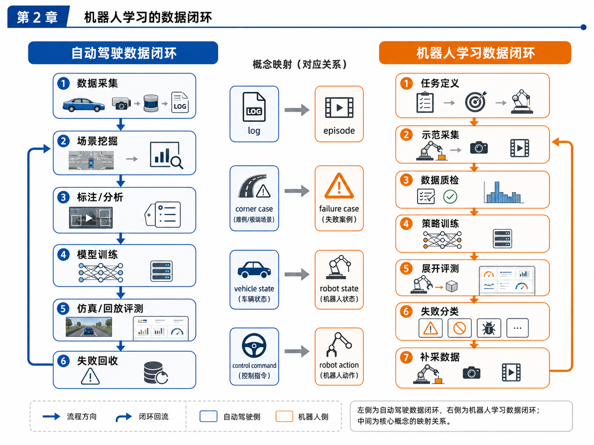

# 附录 G：mdBook 与 GitHub 发布指南

本附录用于指导读者将本书整理成 mdBook 并发布到 GitHub Pages。

---

## G.1 推荐目录结构

当前整合包可以继续整理为以下 mdBook 结构：

```text
book.toml
src/
  SUMMARY.md
  chapters/
  appendix/
assets/
  images/
examples/
  robot-learning-shelf-demo/
docs/
```

其中：

- `src/` 放正文和附录；
- `assets/images/` 放图片；
- `examples/` 放主线代码项目；
- `docs/` 放终检报告、索引、发布说明等。

---

## G.2 book.toml 示例

```toml
[book]
title = "从自动驾驶感知到具身智能：90 天构建机器人学习数据闭环"
authors = ["kai feng"]
language = "zh-CN"
multilingual = false
src = "src"

[output.html]
mathjax-support = true
git-repository-url = "https://github.com/your-name/your-repo"
edit-url-template = "https://github.com/your-name/your-repo/edit/main/{path}"
```

---

## G.3 SUMMARY.md 注意事项

`SUMMARY.md` 是 mdBook 的核心目录文件。常见错误包括：

- 路径写错；
- 文件名和真实文件不一致；
- 图片路径未随目录迁移调整；
- 中文文件名导致兼容问题；
- 附录未加入目录。

建议使用英文文件名、中文标题。

---

## G.4 本地构建步骤

```bash
# 安装 mdBook
cargo install mdbook

# 启动本地预览
mdbook serve

# 构建静态文件
mdbook build
```

构建后会生成：

```text
book/
```

可以将其作为 GitHub Pages 的发布内容。

---

## G.5 GitHub 发布步骤

1. 新建 GitHub 仓库；
2. 提交 mdBook 项目结构；
3. 确认 `book.toml` 和 `src/SUMMARY.md`；
4. 本地运行 `mdbook serve`；
5. 推送到 GitHub；
6. 在 GitHub Pages 中选择部署分支；
7. 打开在线书籍链接检查图片、目录和代码块。

---

## G.6 图片路径建议

如果 Markdown 文件位于：

```text
src/chapters/01-xxx.md
```

图片位于：

```text
assets/images/ch02_data_closed_loop_comparison.png
```

则图片引用可以写成：

```markdown

```

为了减少混乱，建议最终整理时统一路径。

---

## G.7 大文件注意事项

本书包含较多图片和示例数据。发布到 GitHub 时要注意：

- 图片大小；
- 数据集大小；
- 是否需要 Git LFS；
- 是否把大型中间产物排除；
- 是否只保留教学必要样本。

---

## G.8 发布前检查清单

```text
[ ] SUMMARY.md 路径正确
[ ] 所有章节文件存在
[ ] 所有附录文件存在
[ ] 图片路径正确
[ ] Mermaid 可渲染
[ ] 代码块格式正常
[ ] README 说明清晰
[ ] examples/ 可运行或说明边界清楚
```
