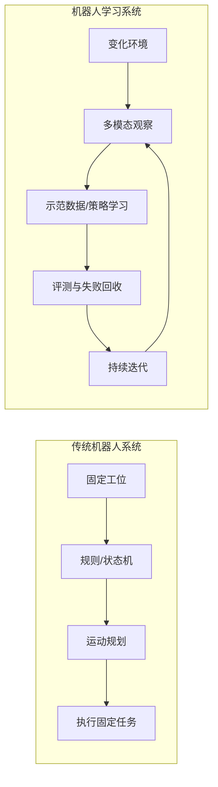
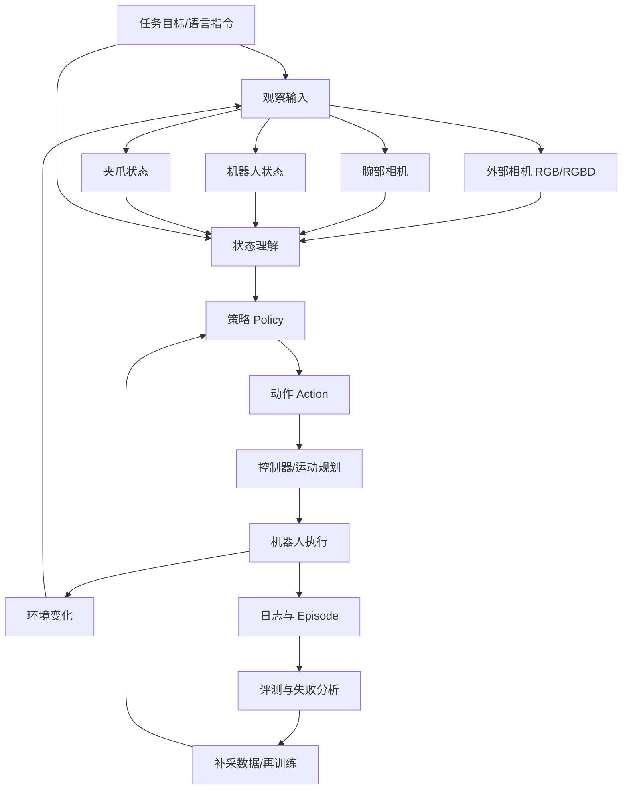
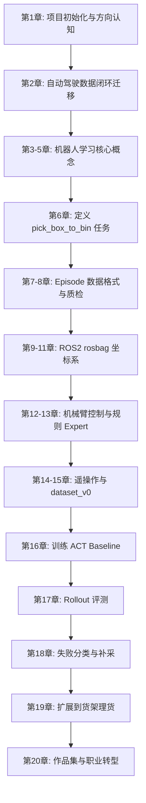

# 第 1 章：为什么具身智能不是“机器人 + 大模型”

本章是全书的起点。它不急着教你安装 ROS2，也不急着让你训练一个策略模型，而是先回答一个更基础的问题：当我们说“转向具身智能”时，到底应该转向什么？

很多工程师第一次接触具身智能，会自然地把它理解成下面这个公式：

```text
具身智能 = 机器人硬件 + 大语言模型
```

这个理解有一定直觉基础，但如果把它当成工程路线，就会很危险。因为真正让机器人完成任务的，不是机器人能不能“聊天”，而是它能不能在真实物理环境中观察、判断、行动、反馈、纠错，并在失败之后形成下一轮数据改进。

本书的核心目标不是带你追逐一个宏大的概念，而是让你从一个可控的小任务开始，建立完整的数据闭环能力：任务定义、数据采集、策略训练、评测、失败回收和场景扩展。你最终要形成的能力，不是“知道很多具身智能名词”，而是能把一个机器人任务拆成可采集、可训练、可评测、可迭代的工程系统。

本章会先纠正常见误解，再建立全书的主线项目：`robot-learning-shelf-demo`。这个项目从一个桌面小盒子抓取任务开始，逐步扩展到商品扶正和简易货架理货任务。

---

## 1. 本章要解决的问题

本章要解决五个问题。

第一，为什么具身智能不是简单的“机器人 + 大模型”？

第二，传统机器人、自动驾驶、LLM Agent 和具身智能到底有什么区别？

第三，为什么 VLA，也就是 Vision-Language-Action 模型，重点不是语言本身，而是从视觉、语言、状态到动作的映射？

第四，为什么家务机器人虽然长期空间很大，但不适合作为普通工程师的第一个切入任务？为什么理货、仓储、工厂辅助和移动操作机器人更适合作为学习与职业转型入口？

第五，本书为什么选择“桌面/货架理货机器人模仿学习闭环 Demo”作为主线项目？

这几个问题看似偏认知，但它们直接决定后面 90 天的学习路径。如果一开始把方向理解错，后续就很容易陷入两类误区：一种是只看论文和大模型发布，觉得自己做不了；另一种是只做机械臂小 demo，忽略数据、评测和失败回收，最后无法形成可迁移的工程能力。

本书要避免这两种极端。我们既不假装可以在个人条件下复现 GR00T、Gemini Robotics、π0 这类大模型，也不满足于写几个机械臂脚本然后录一段成功视频。我们要做的是更适合个人工程师的中间路线：围绕一个小任务，把机器人学习最重要的数据闭环跑通。

---

## 2. 为什么这个问题重要

如果你来自自动驾驶感知、泊车感知、视觉算法、点云处理或 AI 工程背景，你很可能已经具备一部分进入具身智能的能力。比如，你可能熟悉图像、点云、目标检测、BEV、时序数据、标注、评测、corner case、数据回灌和模型迭代。这些经验并不会因为领域变化而失效。

但是，机器人学习又有几个明显不同点。

自动驾驶系统主要在开放道路或停车场中行动，车辆是一个大型移动平台，输出通常是轨迹、控制量或规划结果。机器人学习尤其是机械臂和移动操作任务，则更强调近距离接触、末端执行器、抓取、放置、碰撞、物体姿态、夹爪状态、坐标系转换以及执行过程中的细粒度失败。

在自动驾驶里，一帧感知错误可能影响规划，但车辆通常不会直接“抓住”世界中的某个物体。在机器人里，策略的一个小动作误差，可能导致夹爪碰到盒子边缘、物体滑落、放置位置偏移、任务中断。也就是说，机器人学习的问题不是只在屏幕上判断对不对，而是必须让动作在物理世界中闭环。

这也是“机器人 + 大模型”这个公式的问题所在。大模型可以理解指令，可以规划高层步骤，可以解释失败，也可以调用工具。但如果没有可靠的 observation、action、state、policy、episode、evaluation 和 failure recovery，机器人依然无法稳定完成任务。

换句话说，大模型可以是具身智能系统中的一个重要模块，但不是整个系统本身。

我们可以把具身智能的工程问题压缩成一句话：

> 机器人是否能在特定环境中，根据观察和任务目标，持续产生可执行动作，并通过评测和失败回收不断改进？

这个问题里面至少包含六层内容：

1. 任务是否定义清楚；
2. 观察数据是否足够；
3. 动作空间是否合理；
4. 策略是否能从数据中学习；
5. 评测是否能反映真实任务能力；
6. 失败样本是否能被回收成下一轮训练数据。

这六层内容，正是本书后续 20 章的主线。

---

## 3. 核心概念

### 3.1 具身智能：不是“会说话的机器人”

具身智能，英文通常称为 Embodied AI。它强调智能体不是只在文本、图片或虚拟环境中推理，而是要拥有一个身体，能通过传感器感知环境，通过执行器改变环境，并在交互中完成任务。

这里的“身体”不一定是人形机器人。它可以是机械臂、移动底盘、夹爪、吸盘、轮式机器人、仓储机器人，也可以是带机械臂的移动操作平台。关键不是外形像不像人，而是系统是否需要在物理环境中闭环行动。

因此，具身智能至少包含三类能力：

- 感知能力：看到或感知环境中的物体、空间、状态和变化；
- 行动能力：把任务目标转化为连续或离散动作；
- 闭环能力：根据执行结果持续调整，并从失败中改进。

如果一个系统只能理解自然语言，但不能可靠地产生动作，它更接近 LLM Agent 或 VLM 系统，而不是完整的具身智能系统。如果一个系统只能执行固定轨迹，但不能根据环境变化调整，它更接近传统自动化设备，而不是机器人学习系统。

### 3.2 传统机器人：强工程、强约束、弱泛化

传统机器人并不落后。工厂里的机械臂、流水线分拣设备、AGV、AMR、焊接机器人、喷涂机器人，很多都非常成熟、稳定、可靠。它们的优势是任务边界清晰、环境可控、动作可规划、成本可估算。

但传统机器人的典型前提是：

- 物体种类有限；
- 工位位置固定；
- 光照、姿态、夹具、轨迹经过工程设计；
- 异常情况可以通过规则穷举；
- 评测标准明确。

这种系统在工业场景中很有效，但迁移到家庭、开放货架、杂乱桌面、混合物体时会遇到困难。原因不是传统机器人“不智能”，而是开放环境中的变化太多，规则工程很难覆盖所有情况。

本书不会贬低传统机器人。相反，你会看到，传统机器人的控制、坐标系、运动规划、状态机和安全边界，是机器人学习落地的基础。真正有价值的路线，不是用学习方法替代一切，而是理解什么时候用规则，什么时候用学习，什么时候需要人类遥操作数据。

### 3.3 LLM Agent：擅长信息任务，不等于擅长物理动作

LLM Agent 可以读取网页、调用工具、写代码、总结邮件、规划任务。这类系统的核心环境通常是数字空间：文本、API、数据库、文件、浏览器、代码仓库。

它们的 action 通常是：

- 调用一个工具；
- 发出一条命令；
- 生成一段文本；
- 修改一个文件；
- 查询一个网页；
- 调用一个 API。

这些 action 的执行结果通常可以被系统较快观测到，并且错误成本相对可控。比如代码运行失败，可以读报错；网页抓取失败，可以重试；文件写错了，可以回滚。

机器人 action 则不同。机器人动作会改变真实世界。夹爪闭合过早可能夹空，末端位姿偏 2 厘米可能撞到盒子，放置高度过低可能压坏物体，动作速度过快可能带来安全风险。机器人系统的错误不是只存在日志里，而是发生在物理世界中。

因此，LLM Agent 的经验可以借鉴，但不能直接替代机器人学习系统。具身智能需要更严格的时间同步、状态记录、动作约束、评测协议和安全边界。

### 3.4 VLA：重点是 Action，不是聊天

VLA 是 Vision-Language-Action 的缩写，即视觉-语言-动作模型。它和 VLM 的关键区别在于，VLM 通常输出文本，而 VLA 要输出动作。

一个 VLM 面对图片和问题，可能回答：

```text
桌面上有一个红色盒子，它在画面左侧。
```

一个 VLA 面对图像、任务指令和机器人状态，应该输出类似这样的动作信息：

```text
将末端执行器移动到盒子上方 5 厘米，调整夹爪姿态，下降，闭合夹爪，抬起，移动到收纳盒上方，打开夹爪。
```

在真实系统中，这些动作可能不是自然语言，而是关节角、末端位姿、末端增量、夹爪开合状态或一段 action chunk。也就是说，VLA 的核心不是“会不会描述画面”，而是能不能把观察和任务目标映射到机器人可执行动作。

这对工程师提出了一个非常实际的问题：你必须知道 action 是什么。它是关节空间动作，还是末端位姿动作？是绝对位姿，还是相对增量？频率是多少？是否包含夹爪？是否包含停止信号？是否可以被控制器安全执行？

如果这些问题没有定义清楚，再强的模型也无法训练出稳定策略。

### 3.5 数据闭环：比单次 demo 更重要

很多机器人视频看起来很惊艳，但工程上真正重要的问题不是“这一次成功了吗”，而是：

- 成功率是多少？
- 在什么物体上成功？
- 在什么光照下失败？
- 失败发生在抓取前、接触瞬间、移动过程中还是放置阶段？
- 失败能否被分类？
- 下一轮应该补采什么数据？
- 策略更新后是否真的提升？

这就是数据闭环思维。

本书会反复强调：机器人学习不是训练一次模型就结束，而是围绕任务不断循环。

```text
定义任务 → 采集数据 → 训练策略 → 展开评测 → 失败分析 → 补采数据 → 再训练
```

这套思维和自动驾驶非常接近。自动驾驶不会因为某个 demo 能跑一圈就认为系统可用，而是要看大量场景、corner case、回归评测和真实接管率。机器人学习同样不能只看一个成功视频，而要看 episode 质量、rollout 成功率和 failure taxonomy。

---

## 4. 概念图 / 流程图 / 架构图

### 4.1 传统机器人与机器人学习系统对比



这张图不是说传统机器人简单，也不是说机器人学习一定更高级。它表达的是两者的工程假设不同。传统机器人倾向于通过工程约束降低环境复杂度；机器人学习则试图从数据中学习对变化环境的适应能力。

在真实项目中，两者经常混合使用。比如本书后面会先实现规则式 pick-and-place expert，用它帮助我们理解任务流程、动作结构和失败类型；之后再进入遥操作数据采集和 ACT baseline 训练。规则不是学习的敌人，规则是构建学习系统的重要脚手架。

### 4.2 具身智能系统结构



这张图是全书的核心图之一。它说明具身智能系统不是一个单独模型，而是一条从观察到动作、从执行到数据、从失败到再训练的闭环链路。

你可以把大模型放在其中的某些位置：例如理解语言指令、生成高层计划、解释失败原因、辅助标注数据、帮助写代码或生成实验报告。但机器人能不能完成任务，最终取决于 action 是否能在真实环境中执行，并且失败是否能被系统性回收。

### 4.3 本书主线项目路线图



这条路线刻意从小任务开始。第一个完整任务不是“整理房间”，也不是“通用家务机器人”，而是：

```text
桌面小盒子抓取并放入收纳盒
```

这个任务足够小，但并不幼稚。它已经包含机器人学习的关键要素：物体识别、空间关系、抓取、夹爪控制、移动、放置、成功判断、失败分类、数据采集和评测。

---

## 5. 工程化理解

### 5.1 不要从“宏大任务”开始

很多人进入具身智能时，会被“家务机器人”吸引。比如：让机器人整理房间、叠衣服、洗碗、擦桌子、收拾玩具、倒垃圾。这些任务确实代表了长期方向，但不适合作为第一阶段学习任务。

原因在于，家务任务通常有以下特点：

- 环境极度开放；
- 物体种类多；
- 姿态变化大；
- 任务目标模糊；
- 成功标准难定义；
- 接触过程复杂；
- 失败类型多且难复现；
- 对硬件安全和可靠性要求高。

例如，“把房间整理好”看起来是一句话，但工程上它至少包含：识别哪些东西不在原位、判断哪些物体可以抓、规划移动路径、避开障碍、选择抓取方式、确定归置位置、执行放置、检查结果、处理失败。每一步都可以拆出一个复杂研究问题。

如果第一天就把目标定成“整理房间”，很容易陷入不可执行状态。你不知道该采什么数据，不知道如何定义 episode，不知道如何评测，也不知道失败后该补采什么。

工程学习最重要的原则是：先把任务边界缩小到可以闭环。

### 5.2 为什么理货、仓储、工厂辅助更现实

和家庭环境相比，理货、仓储和工厂辅助场景有几个明显优势。

第一，环境更可控。货架、桌面、料框、工位的位置通常比较固定，可以通过相机、标定、夹具和流程设计降低复杂度。

第二，任务更容易拆分。比如理货可以拆成缺货检测、商品扶正、商品取放、标签识别、异常上报。每个子任务都可以被定义、采集和评测。

第三，成功标准更清楚。商品是否扶正、是否放到指定区域、是否从 A 点移动到 B 点，通常比“房间是否整理好”更容易判断。

第四，职业迁移价值更直接。对自动驾驶感知工程师来说，货架、仓储和工厂辅助任务中的视觉、空间、检测、跟踪、数据闭环和评测方法，更容易与已有经验连接。

第五，商业落地路径更现实。家庭机器人需要面对成本、可靠性、安全、售后和用户预期等复杂问题。工业和半结构化场景虽然也难，但更容易通过限定边界形成阶段性价值。

因此，本书的路线是：从桌面任务开始，逐步走向货架理货，而不是直接做通用家务机器人。

### 5.3 小任务、小数据、小模型、小闭环

本书反复强调四个“小”：

```text
小任务、小数据、小模型、小闭环
```

小任务，是指任务边界要清楚。比如“把桌面上的小盒子放入收纳盒”比“整理桌面”更适合第一阶段。

小数据，是指先用几十条、几百条 episode 理解数据结构、质量问题和训练流程，而不是一开始幻想百万级机器人数据。

小模型，是指先训练行为克隆、ACT baseline 或轻量策略模型，理解 observation 到 action 的映射，而不是一开始追求通用 VLA 大模型。

小闭环，是指先完成一轮完整迭代：采集、训练、评测、失败分析、补采。即使任务很小，只要闭环完整，价值就很高。

这四个“小”不是降低目标，而是让你真正进入工程状态。很多人学习新方向时，最大的问题不是目标不够大，而是目标大到无法执行。

### 5.4 自动驾驶经验如何迁移

如果你有自动驾驶或泊车感知经验，可以从以下角度理解机器人学习。

| 自动驾驶/泊车系统 | 机器人学习系统 | 迁移关系 |
|---|---|---|
| log | episode | 都是一次任务或场景过程的数据记录 |
| camera/lidar | RGB/RGBD/wrist camera | 都是 observation 来源 |
| ego state | robot state | 都描述智能体自身状态 |
| planning/control | action/policy | 都需要输出可执行动作 |
| corner case | failure case | 都是系统改进的关键样本 |
| replay/eval | rollout/evaluation | 都需要评测协议而不是只看单例 |
| data mining | failure mining | 都要从失败中挖掘下一轮数据 |
| model iteration | policy iteration | 都是数据驱动迭代 |

这张表是下一章的入口。你会发现，机器人学习并不是完全陌生的领域。真正需要补齐的是：机械臂、末端执行器、接触任务、坐标系、遥操作数据、动作空间和策略训练。

---

## 6. 主线项目中的位置

本章在主线项目中承担两个作用。

第一，确定项目方向。

项目名称固定为：

```text
robot-learning-shelf-demo
```

项目目标是：

> 构建一个“桌面/货架理货机器人模仿学习闭环 Demo”。

项目不是为了展示一个单次成功视频，而是为了完整呈现机器人学习数据闭环。

第二，初始化项目骨架。

本章会新增第一个文件：

```text
robot-learning-shelf-demo/README.md
```

README 不是形式文件，而是项目合同。它要写清楚项目目标、任务版本、学习路线、目录结构和阶段性产出。后续每一章新增的代码、配置、数据和报告，都应该能回到 README 中找到位置。

### 6.1 三个任务版本

主线项目分为三个任务版本。

| 版本 | 任务 | 目标 | 本书完成程度 |
|---|---|---|---|
| v1 | 桌面小盒子抓取并放入收纳盒 | 跑通任务定义、数据格式、规则控制、数据采集、ACT 训练、评测、失败分析 | 必须完整完成 |
| v2 | 商品扶正任务 | 引入接触任务、失败类型、策略泛化 | 作为扩展任务展开 |
| v3 | 简易货架取放任务 | 靠近真实理货机器人，引入货架结构、遮挡、物体变化、任务扩展 | 作为高级扩展和职业连接 |

v1 是全书最重要的任务。不要因为它看起来小就轻视它。只要 v1 能完整闭环，你就已经掌握了进入机器人学习的关键方法。

v2 和 v3 则用于连接更真实的理货场景。它们不一定在本书中完成全部训练和部署，但会帮助你理解从桌面 demo 走向现实任务时需要增加哪些能力。

### 6.2 本章之后项目应该长什么样

本章结束后，你的项目目录至少应该是：

```text
robot-learning-shelf-demo/
  README.md
```

为了给后续章节预留位置，我们也会创建一批空目录：

```text
robot-learning-shelf-demo/
  docs/
  configs/
  scripts/
  ros2_ws/
  notebooks/
  datasets/
  reports/
  videos/
```

这些目录不会在本章填满，但它们代表了一个完整机器人学习项目的基本边界。

---

## 7. 示例

### 7.1 示例一：为什么“把房间整理好”不是一个好任务定义

假设你给机器人一个指令：

```text
把房间整理好。
```

从人的角度看，这句话很自然。但从机器人学习角度看，它几乎不可直接训练。

首先，什么叫“整理好”？是地面没有杂物，还是桌面没有杂物？衣服要叠起来，还是放进篮子？书要放在书架，还是叠在桌角？不同家庭、不同人、不同房间的标准都不同。

其次，任务边界不清楚。机器人是否需要打开柜门？是否需要识别个人物品？是否需要移动易碎品？是否需要处理垃圾？是否需要判断哪些东西不能碰？

再次，成功标准不清楚。训练策略时，你需要给 episode 标注 success 或 failure。如果“整理好”没有明确标准，就很难判断一条 episode 是否成功。

最后，失败回收困难。假设机器人没有整理好，你要补采什么数据？是补采抓袜子的数据，还是补采开抽屉的数据？是补采导航数据，还是补采物体分类数据？如果任务不能拆解，失败就无法转化成下一轮数据。

因此，“把房间整理好”应该被拆成多个可执行小任务。例如：

| 原始任务 | 可执行子任务 |
|---|---|
| 整理房间 | 检测地面可抓取杂物 |
| 整理房间 | 将玩具放入玩具箱 |
| 整理房间 | 将衣物放入脏衣篮 |
| 整理房间 | 将桌面杯子移动到托盘 |
| 整理房间 | 将书本推齐到桌面一侧 |

这就是本书后面会不断训练的能力：把模糊任务变成可采集、可训练、可评测的小任务。

### 7.2 示例二：将“理货”拆成机器人任务

“理货”同样是一个大词。对人来说，理货可能包括检查货架、补货、扶正商品、清理异物、整理标签、盘点库存。对机器人来说，我们必须继续拆分。

可以拆成以下任务：

| 理货子任务 | 机器人学习角度 |
|---|---|
| 缺货检测 | 视觉检测货架空位或商品数量不足 |
| 商品扶正 | 判断倾斜商品姿态，执行推/扶动作 |
| 商品取放 | 从料框取商品，放到货架目标位置 |
| 标签识别 | 读取货架标签或商品类别信息 |
| 异常上报 | 将无法处理的情况交给人类 |

本书主线项目选择其中最适合入门的路径：先从桌面抓取放置开始，再扩展到商品扶正，最后讨论货架取放。

为什么不直接做完整理货机器人？因为完整理货机器人涉及移动底盘、导航、货架定位、物体识别、抓取、补货策略、人机协作和安全规范。对于 90 天学习计划来说，直接做全系统不现实。

但是，如果你能把桌面小盒子任务做成一个完整数据闭环，你就已经具备了迁移到理货任务的核心方法。

### 7.3 示例三：聊天机器人回答问题与机器人执行动作的差异

看一个简单对比。

用户问聊天机器人：

```text
桌面上的红色盒子在哪里？
```

模型可以回答：

```text
红色盒子在桌面左侧，靠近收纳盒。
```

这是一个视觉语言问答问题。输出是文本。

如果机器人要执行任务：

```text
把红色盒子放进收纳盒。
```

系统需要的不只是文本描述，而是完整动作过程：

1. 确定红色盒子在相机坐标系中的位置；
2. 将目标位置转换到机器人坐标系；
3. 判断当前夹爪是否打开；
4. 移动到预抓取位姿；
5. 下降到抓取高度；
6. 闭合夹爪；
7. 判断是否抓住；
8. 抬起物体；
9. 移动到收纳盒上方；
10. 打开夹爪；
11. 判断物体是否落入收纳盒；
12. 记录 episode 和结果。

同样一句话，在聊天系统中主要是理解问题，在机器人系统中则是观察、坐标、控制、策略、执行和评测的组合。

这就是为什么本书不会把重点放在“机器人能不能听懂人话”，而是放在“机器人任务如何被定义成数据闭环”。

---

## 8. 练习代码

本章的练习代码用于初始化主线项目目录，并生成 README 初稿。你可以把下面代码保存为临时脚本，例如：

```text
init_robot_learning_shelf_demo.py
```

这个脚本不属于最终项目必须保留的核心脚本，它只是用于创建项目初始结构。后续正式进入主线项目后，核心脚本会从 `scripts/01_generate_synthetic_episode.py` 开始。

### 8.1 初始化项目目录与 README

```python
from pathlib import Path
from textwrap import dedent


def ensure_dir(path: Path) -> None:
    """Create a directory if it does not exist."""
    path.mkdir(parents=True, exist_ok=True)


def write_text_if_missing(path: Path, content: str) -> None:
    """Write a text file only when the file does not already exist."""
    if path.exists():
        print(f"Skip existing file: {path}")
        return
    path.write_text(content, encoding="utf-8")
    print(f"Create file: {path}")


def build_readme() -> str:
    """Return the initial README content for robot-learning-shelf-demo."""
    return dedent(
        """
        # robot-learning-shelf-demo

        本项目是《从自动驾驶感知到具身智能：90 天构建机器人学习数据闭环》的主线工程项目。

        项目目标不是复现通用机器人基础模型，而是围绕一个可控的桌面/货架理货任务，完整跑通机器人学习数据闭环：

        ```text
        任务定义 → 数据采集 → 数据格式 → 策略训练 → 展开评测 → 失败分析 → 补采数据 → 再训练
        ```

        ## 1. 项目目标

        构建一个“桌面/货架理货机器人模仿学习闭环 Demo”。

        本项目从一个最小任务开始：

        ```text
        v1: 桌面小盒子抓取并放入收纳盒
        ```

        在完成 v1 的任务定义、episode 数据格式、规则 expert、遥操作数据采集、ACT baseline 训练、rollout 评测和失败回收之后，再扩展到：

        ```text
        v2: 商品扶正任务
        v3: 简易货架取放任务
        ```

        ## 2. 为什么选择这个任务

        桌面小盒子抓取任务足够小，便于在仿真或低成本硬件上实现；同时它又包含机器人学习的关键问题：

        - observation：相机图像、机器人状态、夹爪状态；
        - action：末端位姿、关节角、夹爪开合；
        - episode：一次完整任务执行过程；
        - policy：从观察到动作的映射；
        - rollout：使用策略进行展开评测；
        - failure taxonomy：抓取失败、放置失败、碰撞、空抓、滑落等失败分类；
        - data closed loop：根据失败补采数据并再训练。

        ## 3. 任务版本

        | 版本 | 任务 | 目标 |
        |---|---|---|
        | v1 | 桌面小盒子抓取并放入收纳盒 | 跑通完整数据闭环 |
        | v2 | 商品扶正任务 | 引入接触任务和策略泛化 |
        | v3 | 简易货架取放任务 | 接近真实理货机器人场景 |

        ## 4. 项目目录

        ```text
        robot-learning-shelf-demo/
          README.md
          docs/
          configs/
          scripts/
          ros2_ws/
          notebooks/
          datasets/
          reports/
          videos/
        ```

        后续章节会逐步补齐这些目录中的文件。

        ## 5. 当前阶段

        当前阶段：项目初始化。

        本阶段只需要完成两件事：

        1. 明确项目目标和任务版本；
        2. 创建项目目录和 README。

        下一阶段将从自动驾驶数据闭环迁移到机器人数据闭环，并生成第一条模拟 episode。
        """
    ).strip() + "\n"


def main() -> None:
    project_root = Path("robot-learning-shelf-demo")

    directories = [
        project_root,
        project_root / "docs",
        project_root / "configs",
        project_root / "scripts",
        project_root / "ros2_ws",
        project_root / "notebooks",
        project_root / "datasets",
        project_root / "reports",
        project_root / "videos",
    ]

    for directory in directories:
        ensure_dir(directory)

    write_text_if_missing(project_root / "README.md", build_readme())

    print("Project initialized successfully.")


if __name__ == "__main__":
    main()
```

### 8.2 如何运行

将代码保存为：

```text
init_robot_learning_shelf_demo.py
```

然后在命令行运行：

```bash
python init_robot_learning_shelf_demo.py
```

运行后，你应该看到类似输出：

```text
Create file: robot-learning-shelf-demo/README.md
Project initialized successfully.
```

如果你重复运行脚本，已有 README 不会被覆盖。这样做是为了避免你后续手动修改 README 后被初始化脚本误覆盖。

---

## 9. 代码解释

这段代码解决的是项目初始化问题。它不是机器人算法代码，但它很重要，因为一个长期项目必须先有清晰边界。

### 9.1 输入是什么

脚本没有外部输入。它默认在当前目录下创建：

```text
robot-learning-shelf-demo/
```

如果你希望创建到其他位置，可以修改：

```python
project_root = Path("robot-learning-shelf-demo")
```

### 9.2 输出是什么

脚本输出一个项目目录和一个 README 文件：

```text
robot-learning-shelf-demo/
  README.md
  docs/
  configs/
  scripts/
  ros2_ws/
  notebooks/
  datasets/
  reports/
  videos/
```

其中，`README.md` 是本章的核心产出。它会在项目一开始就固定住项目目标，防止后续学习发散。

### 9.3 为什么要先写 README

很多工程项目失败，并不是因为第一段代码写错，而是因为项目目标一直不清楚。

在机器人学习中，这个问题更明显。你可能今天想做机械臂抓取，明天想做 VLA，后天想做家务机器人，大后天又想接 ROS2 仿真。每个方向都重要，但如果没有主线，最后会变成知识碎片。

README 的作用就是把项目变成一个“工程合同”。它至少要回答：

- 项目叫什么；
- 要解决什么任务；
- 当前阶段做到哪里；
- 后续目录如何组织；
- 哪些能力是必须完成的；
- 哪些能力只是扩展方向。

后续章节中，每次新增代码和文档，我们都要问：它是否服务于 README 中定义的主线项目？如果不能服务，就暂时不要加入。

### 9.4 为什么本章不直接写训练代码

因为训练代码依赖很多前置定义。你还没有定义 observation、state、action、episode，也没有定义任务起止条件、成功标准和数据格式。现在直接训练模型，只会制造混乱。

机器人学习项目的顺序应该是：

```text
先定义任务，再定义数据；
先生成数据，再训练策略；
先有评测协议，再讨论模型好坏；
先能分析失败，再谈持续迭代。
```

这也是本书的组织顺序。

---

## 10. 常见错误

### 10.1 错误一：把具身智能理解成“给机器人接一个 ChatGPT”

大模型可以让机器人更好地理解语言、规划任务和解释失败，但机器人执行动作需要更底层的数据结构和控制系统。没有 observation、action、state、policy 和 evaluation，大模型只是一个语言接口。

正确理解是：大模型可以成为具身智能系统的一部分，但具身智能工程的核心仍然是物理交互闭环。

### 10.2 错误二：一开始就追求通用家务机器人

家务机器人是长期方向，但作为入门项目太大。它涉及开放环境、多物体、多任务、移动导航、复杂接触、安全和用户体验。如果第一阶段目标过大，就很难形成闭环。

正确做法是：先选择一个小任务，把数据闭环跑通，再逐步扩展任务复杂度。

### 10.3 错误三：只看成功视频，不看评测协议

机器人 demo 很容易通过挑选成功案例看起来不错。但工程上要问的是：成功率是多少？失败类型是什么？评测次数够不够？物体变化是否覆盖？光照变化是否覆盖？失败样本是否进入下一轮数据？

正确做法是：从第一天开始就建立评测意识。即使本章还没有写评测代码，也要在 README 中明确最终要做 rollout evaluation 和 failure analysis。

### 10.4 错误四：过早陷入模型名词

ACT、Diffusion Policy、VLA、Open X-Embodiment、GR00T、π0 都值得学习，但如果你还不知道自己的 action space 是什么，模型名词并不能帮你完成任务。

正确做法是：先理解任务、数据和动作，再学习模型。模型是策略学习的一部分，不是项目的全部。

### 10.5 错误五：忽略传统机器人基础

有些人一接触机器人学习，就觉得规则、控制、状态机、运动规划都不重要。这是错误的。真实机器人系统必须处理安全边界、速度限制、碰撞检查、坐标系、夹爪状态和异常恢复。

正确做法是：把传统机器人能力当作机器人学习的工程底座。后续我们会先实现规则式 expert，再进入模仿学习。

### 10.6 错误六：没有项目目录和长期产出意识

如果所有实验都散落在临时脚本里，最后很难形成作品集。职业转型需要可展示的项目，而不是零散截图。

正确做法是：从第一章开始就维护统一项目目录。README、docs、configs、scripts、datasets、reports 都是作品集的一部分。

---

## 11. 本章练习

### 练习 1：基础练习

用自己的话解释：为什么具身智能不是“机器人 + 大模型”？

要求至少包含以下关键词：

- observation；
- action；
- policy；
- episode；
- evaluation；
- failure recovery。

不要只写“因为机器人需要行动”。你需要说明：行动为什么必须被数据化、被评测、被失败回收。

### 练习 2：任务拆解练习

将下面这个模糊任务拆成 5 个可执行小任务：

```text
整理桌面。
```

每个小任务要满足三个条件：

1. 有明确起点；
2. 有明确终点；
3. 能判断成功或失败。

示例格式：

```text
任务：将桌面上的小盒子放入收纳盒
起点：小盒子在桌面任意指定区域，收纳盒在桌面右侧
终点：小盒子完全落入收纳盒内部
成功标准：盒子没有掉落，夹爪已松开，机器人回到安全位姿
```

### 练习 3：工程练习

运行本章的初始化脚本，创建：

```text
robot-learning-shelf-demo/
```

然后打开 `README.md`，根据自己的学习目标补充一段：

```markdown
## 我的学习目标

我希望通过本项目获得哪些能力：

1. ...
2. ...
3. ...
```

这段内容不需要提交给任何人，但它能帮助你明确为什么要做这个项目。

### 练习 4：迁移思考练习

如果你有自动驾驶、视觉算法或感知工程背景，请写下 5 个可以迁移到机器人学习中的能力。

可以参考以下方向：

- 数据采集；
- 数据标注；
- corner case 分析；
- 目标检测；
- 空间理解；
- 模型评测；
- 工程部署；
- 可视化工具；
- 日志分析。

同时写下 3 个需要补齐的新能力，比如 ROS2、机械臂控制、坐标系、遥操作或模仿学习。

### 练习 5：进阶练习

在 README 中新增一个“风险与边界”小节，写清楚本项目暂时不做什么。

例如：

```markdown
## 风险与边界

本项目第一阶段不追求：

1. 复现通用 VLA 大模型；
2. 实现完整家务机器人；
3. 处理所有未知物体；
4. 在没有评测协议的情况下只展示成功视频。
```

这个练习非常重要。能说清楚“不做什么”，是工程项目能够推进的前提。

---

## 12. 本章产出

完成本章后，你应该得到以下产出。

### 12.1 认知产出

你应该理解：

- 具身智能不是“机器人 + 大模型”的简单叠加；
- VLA 的关键在于从视觉、语言、状态映射到动作；
- 机器人学习的核心是数据闭环，而不是单次 demo；
- 家务机器人是长期方向，理货、仓储、工厂辅助更适合作为工程切入点；
- 小任务、小数据、小模型、小闭环，是个人工程师进入具身智能的合理路线。

### 12.2 工程产出

你应该创建：

```text
robot-learning-shelf-demo/
  README.md
  docs/
  configs/
  scripts/
  ros2_ws/
  notebooks/
  datasets/
  reports/
  videos/
```

其中，本章实际新增的核心文件是：

```text
robot-learning-shelf-demo/README.md
```

### 12.3 文档产出

你的 README 至少应该包含：

- 项目目标；
- 任务版本 v1/v2/v3；
- 项目目录；
- 当前阶段；
- 后续路线；
- 可选的个人学习目标；
- 可选的风险与边界。

---

## 13. 小结

本章完成了全书最重要的方向校准。

我们没有把具身智能理解成“机器人 + 大模型”，而是把它理解成一个围绕物理动作展开的数据闭环系统。这个系统需要观察环境、理解任务、产生动作、执行动作、记录过程、评测结果，并从失败中产生下一轮数据。

我们也没有从通用家务机器人这种宏大目标开始，而是选择了一个更适合个人工程师学习和作品集建设的主线项目：`robot-learning-shelf-demo`。这个项目从 v1 桌面小盒子抓取并放入收纳盒开始，逐步扩展到 v2 商品扶正和 v3 简易货架取放。

本章的工程产出虽然只有 README 和项目目录，但它为后续所有章节建立了边界。接下来，每一章都会围绕这个项目推进：新增数据结构、配置文件、脚本、ROS2 节点、训练流程、评测协议和失败分析报告。

下一章我们会进入一个对自动驾驶感知工程师非常关键的问题：

> 自动驾驶中的数据闭环、log、corner case、评测和回灌，如何迁移到机器人学习中的 episode、failure case、rollout evaluation 和数据补采？

从下一章开始，主线项目会生成第一条模拟机器人 episode。届时，抽象的“数据闭环”会开始落到具体文件和字段上。
