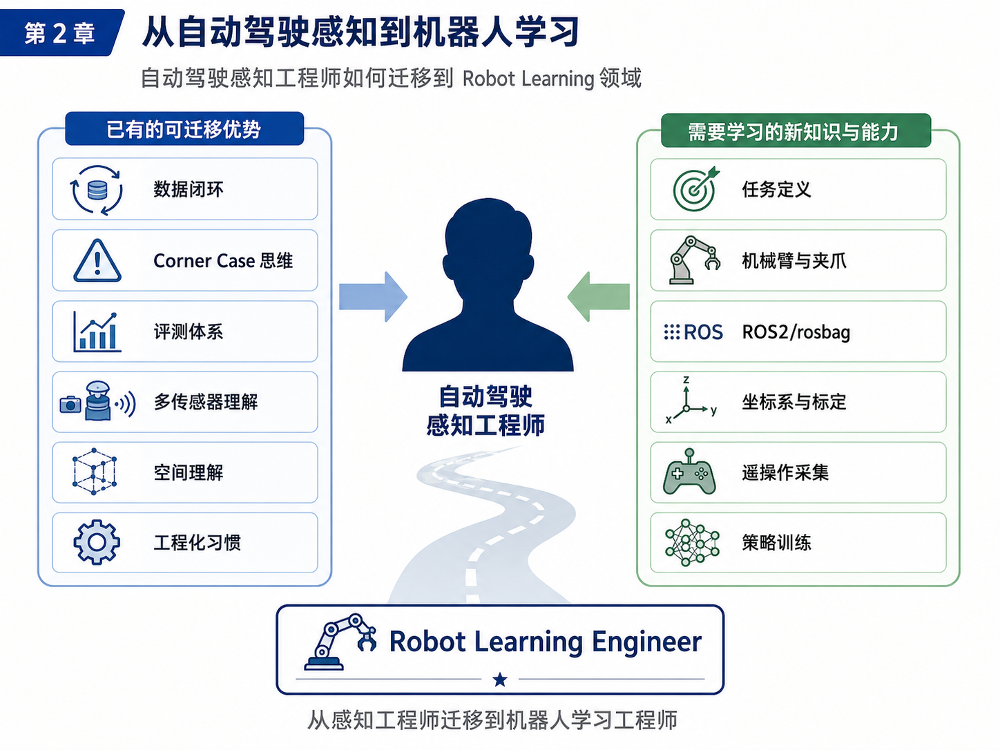
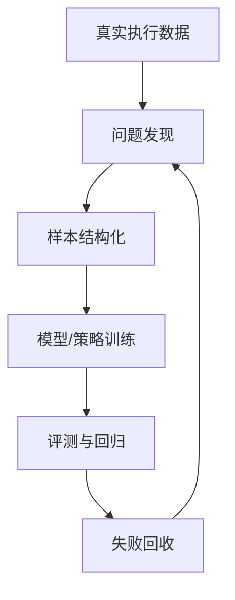
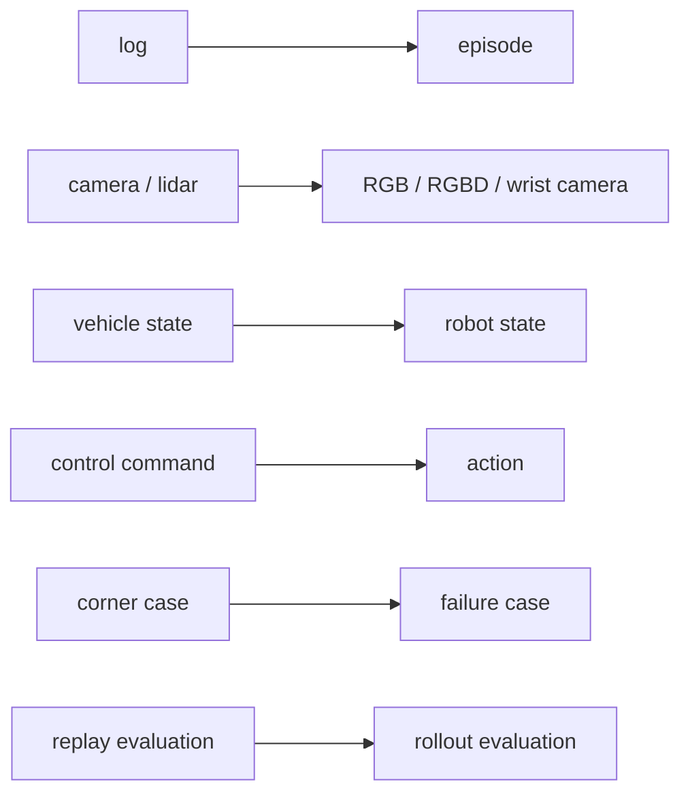

# 第 2 章：从自动驾驶数据闭环迁移到机器人数据闭环

第 1 章解决了一个方向性问题：具身智能不是“机器人 + 大模型”，而是一个围绕任务、数据、策略、评测和失败回收展开的工程闭环。到了第 2 章，我们要把这个判断再往前推一步：如果你本来就是自动驾驶感知、泊车感知、视觉算法或数据闭环方向的工程师，你是不是要从零开始进入机器人学习？

我的判断是：**不是从零开始，而是从“迁移开始”。**

自动驾驶和机器人学习表面上看差别很大。一个面对道路、车道线、目标车和规划控制，另一个面对机械臂、夹爪、桌面物体和抓取放置。但如果把这两个系统放到工程视角里看，你会发现它们共享同一种更底层的方法论：

```text
采集真实执行数据 → 找到失败与难例 → 设计数据表达 → 训练模型 → 建立评测协议 → 回收失败样本 → 进入下一轮迭代
```

换句话说，自动驾驶和机器人学习都不是“单次模型训练问题”，而是“数据闭环系统问题”。

本章的任务，就是把这种迁移关系讲清楚。你不仅要看到两者的相似处，也要准确看到差异处。只有这样，你才不会一边低估自己的已有能力，一边又忽略进入机器人领域必须补上的新能力。

---

## 1. 本章要解决的问题

本章重点解决以下六个问题：

1. 自动驾驶中的 log、scene、corner case、回放评测，与机器人学习中的 episode、failure case、rollout、补采数据之间到底是什么关系？
2. 自动驾驶的 camera / lidar / ego state / control command，如何映射到机器人学习里的 RGB / RGBD / robot state / action？
3. 自动驾驶感知工程师已经具备哪些可迁移优势？
4. 自动驾驶工程师转向机器人学习时，最容易忽略哪些新问题？
5. 为什么“数据闭环”是两个领域共有的底层工程方法？
6. 如何在主线项目 `robot-learning-shelf-demo` 中迈出第一个可执行步骤，而不是只停留在概念理解？

本章结束后，读者应该形成一个非常明确的判断：**你过去在自动驾驶里积累的经验不会消失，而是需要重新投影到机器人任务中。**

---

## 2. 为什么这个问题重要

很多工程师一提到机器人学习，会立即想到机械臂控制、夹爪接触、ROS2、MoveIt2、VLA、模仿学习和遥操作，然后自然得出一个心理结论：

> 这是一套完全不同的东西，我大概要从头学起。

这个结论只对了一半。

确实，机器人学习有不少新的知识点：末端执行器、抓取接触、眼在手上相机、坐标系、机器人状态、示范采集、动作空间设计、展开评测等。但如果因此忽略你已经掌握的工程能力，就会产生两个问题。

第一，你会低估自己的迁移速度。一个做过自动驾驶数据闭环的人，通常已经熟悉以下工作：

- 如何从真实系统采集日志；
- 如何从大规模日志中寻找失败样本；
- 如何定义数据字段和标注格式；
- 如何建设评测指标和回归集；
- 如何做模型迭代与版本比较；
- 如何理解“单次 demo 成功”和“系统能力提升”之间的差异。

这些能力恰恰是机器人学习最需要的。机器人领域真正稀缺的，不只是“会调机械臂”，而是能把任务组织成数据闭环的人。

第二，如果你只看到相似处，又会误判机器人学习的难点。自动驾驶里的车是一个整体平台，控制和动力学边界相对稳定；机器人则经常处理近距离交互、接触瞬间、物体遮挡、抓取失败、目标滑落、相机外参变化、末端微小误差等问题。一个 2 厘米的位置误差，可能在自动驾驶里只是轨迹偏一点，在机器人里却足以导致完全抓空。

所以，本章重要，不是因为它在讲“迁移故事”，而是因为它在建立一种**正确的迁移姿势**：

- 看到你已有的能力；
- 补足你没有的能力；
- 以数据闭环为共同底层，把自动驾驶经验重构为机器人学习能力。

---

## 3. 核心概念

### 3.1 自动驾驶数据闭环回顾

自动驾驶系统之所以会建立起成熟的数据闭环，是因为道路场景高度复杂，算法不可能靠一次建模就覆盖所有情况。典型流程通常包括：

1. **数据采集**：从车端采集相机、雷达、定位、车辆状态、控制命令和环境上下文日志；
2. **场景挖掘**：从大量日志中发现感兴趣场景，如泊车失败、误检、漏检、狭窄车位、光照异常等；
3. **标注 / 分析**：对关键片段做标注、复盘和问题归因；
4. **模型训练**：使用筛选后的数据训练感知、预测或规划模块；
5. **仿真 / 回放评测**：在回放集、回归集或仿真环境中比较新旧版本；
6. **失败回收**：把新失败重新送回场景池，推动下一轮迭代。

这里最重要的，不是某个具体模块，而是“失败样本如何进入下一轮训练”这一点。没有这一点，所谓闭环就只是一次性离线训练。

### 3.2 机器人学习数据闭环

机器人学习的数据闭环，在形式上与自动驾驶极其相似，但对象会发生变化。一个较为典型的机器人学习闭环是：

1. **任务定义**：明确目标、起始条件、成功标准、失败标准和可执行边界；
2. **示范采集**：通过遥操作、脚本 expert、仿真器或人机协作采集 episode；
3. **数据质检**：检查时间同步、字段完整性、夹爪状态、视觉帧可用性和标签一致性；
4. **策略训练**：使用行为克隆、ACT 或其他模仿学习方法训练 policy；
5. **展开评测**：让 policy 在真实环境或仿真环境中 rollout，统计成功率和失败阶段；
6. **失败分类**：将失败分为抓取失败、定位失败、接近失败、放置偏移、目标丢失等；
7. **补采数据**：针对失败簇补充示范数据，再进入下一轮训练。

两者最大的共同点是：**都必须把真实执行中的失败样本结构化地收回来。**

### 3.3 log 与 episode

自动驾驶工程师最容易建立迁移感的一个概念映射，就是 `log` 和 `episode`。

- 在自动驾驶中，log 通常表示某段连续行驶过程中采集到的多模态日志，它可能很长，也可能包含多个事件。
- 在机器人学习中，episode 表示一次完整任务执行过程，从任务开始到成功结束或失败终止。

如果把自动驾驶的“一个关键片段”抽出来看，它在数据组织方式上就很像一个机器人 episode：

- 都有时间顺序；
- 都包含传感器数据；
- 都包含系统状态；
- 都包含控制 / 动作；
- 都可以打成功 / 失败 / 原因标签。

区别在于，自动驾驶 log 往往是“大系统连续运行日志”，而 episode 更强调“单个任务闭环单元”。

### 3.4 corner case 与 failure case

自动驾驶里常说 corner case，机器人学习里更常说 failure case 或 failure episode。

二者关系非常接近，但使用场景略有不同。

- **corner case** 往往强调稀有、极端、长尾场景，可能是对感知、预测、规划不利的复杂情况；
- **failure case** 更强调当前 policy 或系统在某个任务执行中的失败实例。

在机器人任务中，我们往往不是先讨论“极端性”，而是先讨论“失败发生在什么环节”。例如：

- 视觉识别正常，但接近轨迹不对；
- 接近轨迹正常，但夹爪关闭时没有夹稳；
- 抓起来了，但在移动过程中滑落；
- 成功移动到收纳盒上方，但释放时盒子掉在边缘外。

这些都属于 failure case。随着数据积累增多，我们再进一步区分哪些 failure case 是常见失败，哪些是具有代表性的“机器人 corner case”。

### 3.5 vehicle state 与 robot state

自动驾驶里，vehicle state 常包括速度、加速度、方向盘角度、车体姿态、位置信息和控制状态。机器人里，robot state 则经常包括：

- 关节角；
- 关节速度；
- 末端执行器位姿；
- 夹爪开合状态；
- 末端是否持物；
- 当前任务阶段；
- 安全状态与控制模式。

二者本质相同：都是描述“系统此刻自身处于什么状态”。

但机器人的一个特殊点在于，**状态与任务完成之间的几何关系往往更直接、更精细。** 比如，末端执行器和目标物体之间相差 1–2 厘米，可能就决定了下一步是成功抓取还是完全抓空。因此机器人状态不仅是“有状态”，而且经常要以更高的精度参与策略学习与评测。

### 3.6 control command 与 robot action

自动驾驶中，系统的输出可能是轨迹点、转向角、油门、制动等控制命令。机器人学习中，policy 输出的则是 action，例如：

- 关节角目标；
- 关节速度；
- 末端绝对位姿；
- 末端位姿增量；
- 夹爪开合命令；
- action chunk。

你可以把 robot action 理解为机器人领域的“控制输出表达”。

不过机器人 action 的设计比很多工程师想象中更关键。因为 action 不是一个随手填写的字段，而是后面训练 policy 的目标空间。action 设计不合理，往往会直接导致学习困难、执行不稳定或控制器无法安全落地。

### 3.7 自动驾驶工程师的优势与短板

自动驾驶感知工程师通常具备以下优势：

1. **数据闭环意识**：知道真实系统必须靠迭代提升；
2. **场景与错误分析能力**：习惯做 failure review；
3. **评测意识**：习惯建立指标与回归集；
4. **多模态感知基础**：懂视觉、点云、几何和时序；
5. **工程化能力**：能处理日志、脚本、配置和批处理。

但也有典型短板：

1. 对机械臂、夹爪和抓取接触没有直觉；
2. 对 ROS2、topic、tf、rosbag 的组织方式不熟；
3. 对“任务定义”不够敏感，容易直接跳到模型；
4. 对 action 的设计与控制器约束理解不足；
5. 对示范采集和遥操作工作量预期不足。

这也解释了为什么本书要先从“小任务、小数据、小闭环”开始。

---

## 4. 概念图 / 流程图 / 架构图

### 4.1 图 2-1 自动驾驶数据闭环与机器人学习数据闭环对比


这张图把两个领域的共同结构直接摆在了一起。左侧是自动驾驶数据闭环，右侧是机器人学习数据闭环，中间则是几个关键概念映射：

- `log → episode`
- `corner case → failure case`
- `vehicle state → robot state`
- `control command → robot action`

你应该从中看到的，不是“两个领域长得像”，而是“两个领域用的是同一种迭代逻辑”。

### 4.2 图 2-2 自动驾驶工程师迁移到机器人学习工程师的能力路径



这张图把“已有能力”和“待补能力”拆开了。很多人转型失败，不是因为能力不够，而是因为两边没有分开看：要么把自己想得太弱，要么把新领域想得太简单。

### 4.3 Mermaid 图：两个闭环的共性流程



这是一张更抽象的图。它把自动驾驶和机器人学习都压缩到“真实执行—失败回收—再训练”这一条共同主线上。

### 4.4 Mermaid 图：自动驾驶对象到机器人对象的映射



这张图可以视为本章最重要的“词汇翻译表”。后面很多章节，都会默认你已经理解这层映射。

---

## 5. 工程化理解

### 5.1 自动驾驶闭环为什么能迁移

自动驾驶的价值，不仅在于你见过很多模型，还在于你见过“模型不够”的真实样子。你知道：

- 离线指标好看，不代表上车表现稳定；
- 某次 demo 成功，不代表边界条件被覆盖；
- 没有失败回收，系统几乎不会稳定进化；
- 没有回归评测，版本升级可能是随机波动。

这些判断完全可以迁移到机器人学习里。一个机械臂 demo 成功 5 次，不代表 policy 可靠；一组示范数据训练出能抓几个盒子的策略，不代表扩展到新盒子、新光照、新摆放位置时还行。机器人学习同样需要：

- 定义标准任务集；
- 统计 rollout 成功率；
- 分类失败阶段；
- 找到失败簇；
- 针对失败补采数据；
- 比较新旧策略版本。

### 5.2 自动驾驶闭环为什么不能原样照搬

尽管底层方法共通，但机器人学习不能直接照搬自动驾驶流程，原因至少有四个。

**第一，任务粒度不同。** 自动驾驶是连续、长时程的开放任务；机器人学习往往是短时程、边界清晰的任务单元。你更需要先定义单个 episode，再讨论大规模扩展。

**第二，状态与动作更精细。** 自动驾驶里的感知误差通常通过后续规划和控制在一定程度上被吸收，而机器人抓取任务对末端相对位置极其敏感。action 的定义和执行器能力必须提前考虑。

**第三，数据采集方式不同。** 自动驾驶大量依赖车端自然采集，机器人学习则经常需要遥操作、人类示范、脚本 expert 或受控实验采集。

**第四，失败的物理成本不同。** 自动驾驶失败很危险，但很多感知调试发生在日志回放里；机器人策略的很多问题会在真机接触阶段立刻显现，因此必须更重视控制边界、安全速度和失败终止条件。

### 5.3 对主线项目的具体启发

在 `robot-learning-shelf-demo` 中，我们不是一上来就采集真实遥操作数据，而是先生成一条**模拟 synthetic episode**。这一步非常重要，因为它等价于自动驾驶项目中的“先把日志格式和评测输入定义清楚”。

你可以把这理解为：

- 在开始大规模数据采集前，先把数据接口想明白；
- 在真正训练策略前，先把 episode 结构打通；
- 在接入 ROS2 之前，先用纯 Python 验证文件组织方式。

这与自动驾驶里先定义 log schema、标注字段、评测接口，再进入大规模数据工程，是完全一致的工程思路。

---

## 6. 主线项目中的位置

本章在主线项目中的位置非常明确：**它负责把“迁移认知”落到第一条可用 episode 数据上。**

本章新增的项目文件为：

```text
robot-learning-shelf-demo/
  scripts/
    01_generate_synthetic_episode.py
  datasets/
    dataset_v0_sample/
      episode_0001/
        meta.json
        states.jsonl
        actions.jsonl
```

这一步的目标不是追求逼真的机器人行为，而是让整个项目第一次拥有“像机器人学习数据那样组织的数据单元”。

本章完成后，项目能力推进到：

1. 已经有了一个任务 `pick_box_to_bin`；
2. 已经有了一条 synthetic episode；
3. 已经有了 `meta / state / action` 三类核心文件；
4. 第 3 章可以在这个基础上继续讲 observation、state、action、policy、episode 的精确定义。

---

## 7. 示例

### 7.1 示例 1：一次泊车失败如何变成 corner case

假设你在泊车系统中发现一个失败案例：车辆在逆光环境下识别不到地锁，导致路径规划保守甚至停止。一个典型的自动驾驶闭环做法是：

1. 从整段 log 中截取关键片段；
2. 标记失败发生的时间段；
3. 检查感知输出、定位、车辆状态和控制行为；
4. 将该片段加入回归集或难例池；
5. 针对类似场景补充样本后重训；
6. 对新版本进行回放评测。

你会发现，这里面真正有价值的不是“失败了一次”，而是“失败如何被转化为数据资产”。

### 7.2 示例 2：一次抓取失败如何变成 failure case

现在把场景换成桌面抓盒子任务。机器人看到盒子后移动到上方，下降，关闭夹爪，但没有夹稳，盒子在抬起瞬间滑落。

对应的 failure case 处理流程可能是：

1. 保存本次 episode 的视觉帧、状态与动作；
2. 标记失败阶段为 `grasp_failure`；
3. 记录失败原因候选，如“夹爪宽度不匹配”或“接近高度不合理”；
4. 汇总一批类似 failure episode；
5. 针对该失败簇补采示范数据；
6. 使用补采后的数据再训练 policy。

对比一下你会发现：自动驾驶里的 corner case mining，和机器人里的 failure mining，本质是一回事。

### 7.3 示例 3：自动驾驶 log 与机器人 episode 的字段对比

| 自动驾驶字段 | 机器人字段 | 含义说明 |
|---|---|---|
| log_id | episode_id | 一个连续数据单元的唯一标识 |
| camera_frames | rgb_frames | 视觉输入 |
| lidar_frames | depth / point cloud（可选） | 深度或几何输入 |
| ego_state | robot_state | 系统自身状态 |
| control_cmd | action | 控制输出 |
| route / mission | instruction / task_name | 任务目标 |
| event_tag | success / failure label | 结果标签 |
| scenario_tag | phase / failure_reason | 过程与失败阶段标签 |
| replay_eval | rollout_eval | 离线或在线评测 |
| hard_case_pool | failure_pool | 失败样本池 |

请注意，这张表不是说字段名必须完全对应，而是帮助你在脑中建立一个“工程角色映射”。

---

## 8. 练习代码

本章的练习代码目标是：**用纯 Python 生成一条模拟机器人 episode。**

文件路径：`robot-learning-shelf-demo/scripts/01_generate_synthetic_episode.py`

```python
from __future__ import annotations

from dataclasses import asdict, dataclass
from pathlib import Path
import json
from typing import Any


@dataclass
class EpisodeMeta:
    episode_id: str
    task_name: str
    instruction: str
    success: bool
    num_steps: int
    control_mode: str
    observation_modalities: list[str]
    action_definition: str
    notes: str


@dataclass
class StateRecord:
    t: int
    timestamp: float
    ee_pose_xyzrpy: list[float]
    gripper_open: bool
    object_pose_xyz: list[float]
    bin_pose_xyz: list[float]
    phase: str


@dataclass
class ActionRecord:
    t: int
    timestamp: float
    delta_ee_xyzrpy: list[float]
    gripper_delta: float
    comment: str


def write_json(path: Path, data: Any) -> None:
    path.parent.mkdir(parents=True, exist_ok=True)
    with path.open("w", encoding="utf-8") as f:
        json.dump(data, f, ensure_ascii=False, indent=2)


def write_jsonl(path: Path, rows: list[dict[str, Any]]) -> None:
    path.parent.mkdir(parents=True, exist_ok=True)
    with path.open("w", encoding="utf-8") as f:
        for row in rows:
            f.write(json.dumps(row, ensure_ascii=False) + "\n")


def build_synthetic_episode() -> tuple[EpisodeMeta, list[StateRecord], list[ActionRecord]]:
    meta = EpisodeMeta(
        episode_id="episode_0001",
        task_name="pick_box_to_bin",
        instruction="Pick up the small box and place it into the bin.",
        success=True,
        num_steps=7,
        control_mode="delta_end_effector_pose_with_gripper",
        observation_modalities=["top_rgb", "robot_state"],
        action_definition="[dx, dy, dz, droll, dpitch, dyaw, gripper_delta]",
        notes="Synthetic data for chapter 2.",
    )

    states = [
        StateRecord(0, 0.00, [0.30, -0.10, 0.25, 3.14, 0.0, 0.0], True, [0.42, 0.05, 0.02], [0.62, -0.08, 0.04], "reset"),
        StateRecord(1, 0.10, [0.30, -0.10, 0.25, 3.14, 0.0, 0.0], True, [0.42, 0.05, 0.02], [0.62, -0.08, 0.04], "observe"),
        StateRecord(2, 0.20, [0.42, 0.05, 0.18, 3.14, 0.0, 0.0], True, [0.42, 0.05, 0.02], [0.62, -0.08, 0.04], "pre_grasp"),
        StateRecord(3, 0.30, [0.42, 0.05, 0.05, 3.14, 0.0, 0.0], True, [0.42, 0.05, 0.02], [0.62, -0.08, 0.04], "approach"),
        StateRecord(4, 0.40, [0.42, 0.05, 0.05, 3.14, 0.0, 0.0], False, [0.42, 0.05, 0.05], [0.62, -0.08, 0.04], "grasp"),
        StateRecord(5, 0.50, [0.62, -0.08, 0.18, 3.14, 0.0, 0.0], False, [0.62, -0.08, 0.18], [0.62, -0.08, 0.04], "transfer"),
        StateRecord(6, 0.60, [0.62, -0.08, 0.10, 3.14, 0.0, 0.0], True, [0.62, -0.08, 0.04], [0.62, -0.08, 0.04], "release"),
    ]

    actions = [
        ActionRecord(0, 0.00, [0.0, 0.0, 0.0, 0.0, 0.0, 0.0], 0.0, "Episode start"),
        ActionRecord(1, 0.10, [0.0, 0.0, 0.0, 0.0, 0.0, 0.0], 0.0, "Keep observing"),
        ActionRecord(2, 0.20, [0.12, 0.15, -0.07, 0.0, 0.0, 0.0], 0.0, "Move above the box"),
        ActionRecord(3, 0.30, [0.0, 0.0, -0.13, 0.0, 0.0, 0.0], 0.0, "Move down"),
        ActionRecord(4, 0.40, [0.0, 0.0, 0.0, 0.0, 0.0, 0.0], -1.0, "Close gripper"),
        ActionRecord(5, 0.50, [0.20, -0.13, 0.13, 0.0, 0.0, 0.0], 0.0, "Move to the bin"),
        ActionRecord(6, 0.60, [0.0, 0.0, -0.08, 0.0, 0.0, 0.0], +1.0, "Open gripper and release"),
    ]
    return meta, states, actions
```

建议运行方式：

```bash
cd robot-learning-shelf-demo
python scripts/01_generate_synthetic_episode.py
```

运行后，你应该得到：

```text
datasets/dataset_v0_sample/episode_0001/
  meta.json
  states.jsonl
  actions.jsonl
```

---

## 9. 代码解释

这段代码解决的问题是：**先不依赖 ROS2 和真实硬件，模拟出一条结构清晰的 episode 数据。**

### 9.1 输入是什么

严格来说，这段脚本没有外部输入。它在内部构造了一条固定示例任务 `pick_box_to_bin` 的 synthetic episode。

### 9.2 输出是什么

输出是三个文件：

1. `meta.json`：保存任务级元信息；
2. `states.jsonl`：按时间步保存状态；
3. `actions.jsonl`：按时间步保存动作。

### 9.3 为什么不用一开始就上真实数据

因为此时我们最需要先对齐的是**数据结构**，而不是硬件真实性。只要数据结构没有理清，后面即便接了 ROS2 或真机，也只会让问题更乱。

### 9.4 如何接入主线项目

这条 synthetic episode 会在第 3 章被继续使用：

- 第 3 章会基于它解释 `observation / state / action / policy / episode`；
- 第 3 章会新增 `02_visualize_episode.py`，对这条 episode 做加载和可视化；
- 第 6–8 章会进一步把它演化成更规范的数据格式与任务定义。

---

## 10. 常见错误

### 错误 1：把“迁移”理解成“字段改名”

很多人以为只要把 log 改成 episode，把 control 改成 action，就完成迁移了。其实不是。真正要迁移的是：

- 失败驱动的数据思维；
- 评测驱动的工程习惯；
- 从执行系统中回收数据的能力。

### 错误 2：高估模型，低估任务定义

自动驾驶转到机器人时，很容易被模仿学习和 VLA 吸引，直接把注意力放在训练上。但在机器人学习里，任务定义、动作空间设计和 episode 切分往往比模型名字更先决定上限。

### 错误 3：忽略动作的物理含义

自动驾驶里的控制命令与底盘执行之间通常已有成熟控制层；而在机器人里，action 设计会直接影响控制器是否可执行。一个动作字段看起来对，但不意味着机械臂能稳定执行。

### 错误 4：把单次成功当成能力建立

无论是自动驾驶还是机器人，工程能力都不是“能演示一次”，而是“能稳定迭代”。如果没有 failure case 回收机制，你只是做出了一次 demo，不是建立了闭环。

---

## 11. 本章练习

### 练习 1：基础练习

请用你自己的语言解释以下映射：

- `log → episode`
- `corner case → failure case`
- `vehicle state → robot state`
- `control command → robot action`

要求每一条都结合一个具体例子说明。

### 练习 2：工程练习

在 `01_generate_synthetic_episode.py` 中新增字段 `failure_reason`，并让它在成功 episode 中为 `null`，在失败 episode 中可以取值 `grasp_failure`、`target_lost`、`drop_during_transfer` 等。

### 练习 3：进阶练习

把当前的成功 episode 改造为一个失败 episode，例如让 `gripper_open=False` 之后物体仍然没有被抬起，并在 `meta.json` 中标记 `success=False`。

### 练习 4：思考练习

如果将当前桌面抓盒子任务迁移到货架理货任务，自动驾驶里的哪些能力会更有帮助？哪些地方会暴露明显短板？请至少写出 5 条判断。

### 练习 5：表格练习

自己补充一个“自动驾驶与机器人学习对象映射表”，要求不少于 10 条映射关系，并说明每条映射在工程上有什么意义。

---

## 12. 本章产出

本章应当产出以下内容：

1. 对自动驾驶数据闭环与机器人数据闭环的系统理解；
2. 一份可复用的对象映射表；
3. 主线项目中的第一个 synthetic episode；
4. 一个可运行的脚本 `scripts/01_generate_synthetic_episode.py`；
5. 为第 3 章概念体系铺好的数据基础。

---

## 13. 小结

本章最核心的判断可以归纳为三句话。

第一，自动驾驶与机器人学习并不是两个完全割裂的领域。它们在数据闭环层面有非常强的同构性。

第二，自动驾驶工程师真正可迁移的，不只是视觉和感知能力，更重要的是失败回收、评测设计和数据闭环意识。

第三，这种迁移不是简单换一套术语，而是把过去的数据工程经验，重新组织到机器人任务、episode、action 和 failure case 上。

如果说第 1 章解决的是“为什么要这样学”，那么本章解决的是“你凭什么可以学得更快”。

下一章，我们将在这条 synthetic episode 的基础上，正式进入机器人学习最小概念体系：`Observation`、`State`、`Action`、`Policy` 与 `Episode`。到那时，你会看到，本章建立的迁移映射，会如何进一步落到数据字段、时间线和策略接口上。
