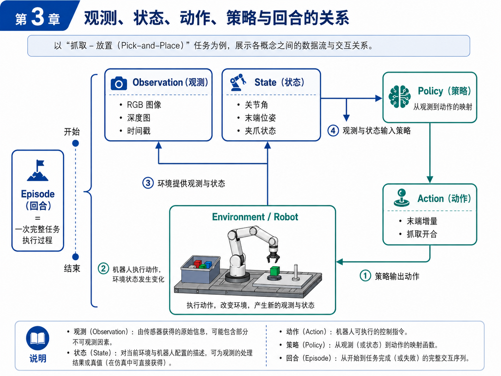
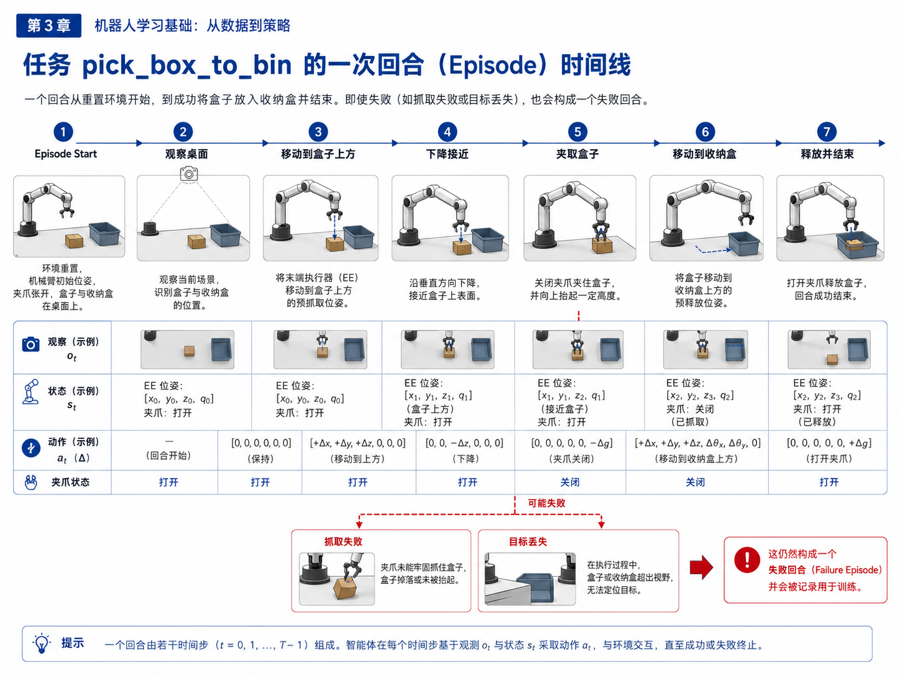
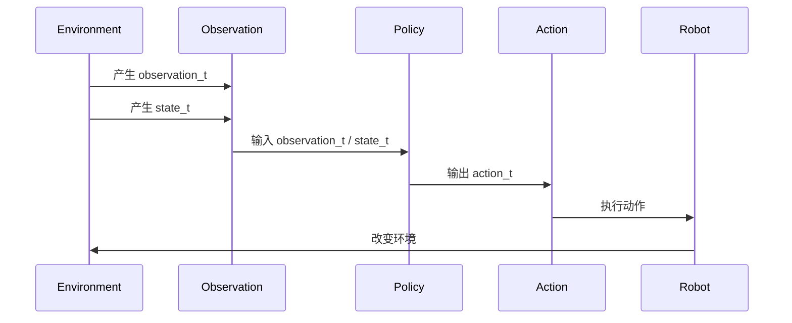
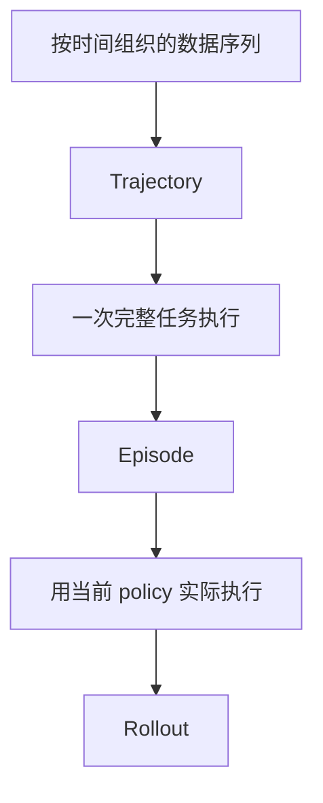
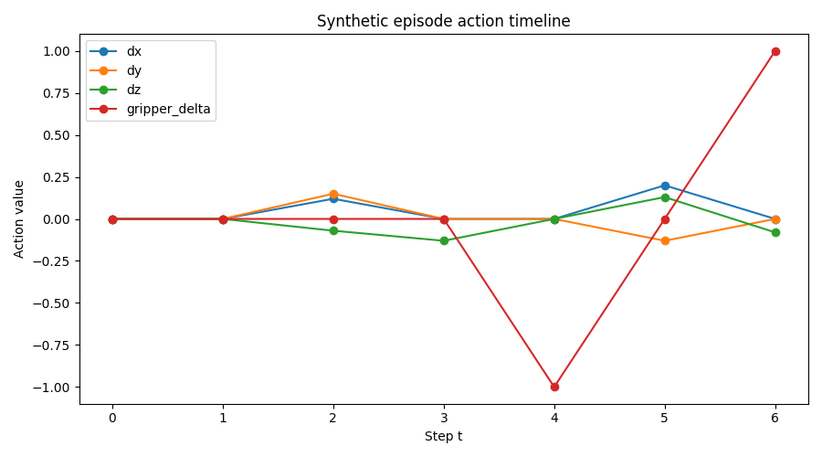

# 第 3 章：Observation、Action、State、Policy 与 Episode

从这一章开始，我们正式进入机器人学习的最小知识体系。

如果说第 2 章回答的是“自动驾驶经验如何迁移到机器人”，那么第 3 章回答的就是另一个更基础的问题：**机器人学习到底在处理什么对象？**

很多初学者读机器人学习论文时，会不断碰到这些词：`observation`、`state`、`action`、`policy`、`trajectory`、`episode`、`rollout`。如果这些词没有在脑中建立稳定含义，后面的任务定义、数据格式、模仿学习训练和评测就会全部变成“看起来懂了，但一动手就乱”。

所以，本章非常关键。它不是词汇背诵章，而是后续所有工程实践的地基。

本章依然围绕主线任务 `pick_box_to_bin` 展开。你将看到：

- 一次桌面抓盒子任务，从时间上如何构成一个 episode；
- observation 和 state 到底有什么区别；
- action 应该怎么设计，为什么不能随便定义；
- policy 在系统中处于什么位置；
- 为什么 episode 的起点、终点和标签，会直接影响后续训练质量。

---

## 1. 本章要解决的问题

本章要解决以下七个问题：

1. `Observation` 和 `State` 有什么区别？为什么很多初学者会把它们混为一谈？
2. `Action` 有哪些常见形式？在机械臂任务里为什么经常使用“末端位姿增量 + 夹爪开合”？
3. `Policy` 到底是什么？为什么说它是从 observation（或 state）到 action 的映射？
4. `Trajectory`、`Episode` 和 `Rollout` 有什么联系和区别？
5. 为什么 episode 不只是“多条数据拼起来”，而是“一次完整任务执行过程”？
6. 在主线任务 `pick_box_to_bin` 中，上述概念分别落在哪些字段上？
7. 为什么 episode 的切分、时间戳和 success / failure label 会影响训练质量？

---

## 2. 为什么这个问题重要

在机器人学习里，很多问题最终都会回到这几个对象上。

比如，当你说“我想训练一个 ACT baseline”，本质上你是在说：

- 我要准备怎样的 observation？
- 我要输出怎样的 action？
- 我要不要显式输入 robot state？
- 我的 episode 怎么切分？
- rollout 成功与否怎么定义？

当你说“这个策略效果不好”，你其实可能在面对以下几种完全不同的问题：

- observation 信息不够；
- state 表达不合理；
- action 定义过难或不可执行；
- episode 切分混乱；
- success / failure 标注不稳定；
- policy 并没有学到正确映射。

所以，这一章不是为了“理解论文术语”，而是为了让你在后面的工程实践中能精确判断问题属于哪一层。

---

## 3. 核心概念

### 3.1 Observation：观测

`Observation` 是机器人在某个时间步通过传感器获得的信息。它通常是策略在决策时最直接看到的输入。

在主线任务 `pick_box_to_bin` 中，observation 可以包括：

- 桌面顶视 RGB 图像；
- 深度图（如果有 RGBD）；
- 腕部相机图像（如果有眼在手上相机）；
- 当前时间戳；
- 有时还会包含已经预处理好的视觉特征。

注意，observation 不等于“世界真相”。它只是当前系统看到的东西，因此可能受到遮挡、光照、噪声、视角变化和同步误差影响。也正因为如此，机器人学习天生带有**部分可观测性**。

### 3.2 State：状态

`State` 描述的是当前环境与机器人配置的一种表示。它既可能来自传感器原始读数的整理，也可能来自系统内部可直接获得的真值信息。

在真实机器人里，常见 state 包括：

- 关节角；
- 关节速度；
- 末端执行器位姿；
- 夹爪开合状态；
- 当前控制模式；
- 任务阶段标签；
- 是否持物。

在仿真环境里，state 还可能包含物体的精确位姿、接触状态和场景真值。也就是说，**state 往往比 observation 更“干净”、更结构化**。

因此，一个简单但非常重要的区分是：

- observation 更像“我看到了什么”；
- state 更像“系统当前处于什么配置”。

很多策略会同时使用 observation 与 state，因为视觉告诉模型“环境长什么样”，而机器人状态告诉模型“自己现在在哪、手里是什么姿态”。

### 3.3 Action：动作

`Action` 是策略在时间步 `t` 输出的控制指令。它定义了机器人接下来要做什么。

在机械臂任务中，action 有几种常见表达方式：

1. **关节角目标**：直接输出各关节目标值；
2. **关节速度 / 力矩**：更底层的控制；
3. **末端绝对位姿**：输出期望的末端位姿；
4. **末端位姿增量**：输出相对当前位姿的位移与旋转增量；
5. **夹爪开合命令**：通常与前面的动作一起组成完整 action；
6. **Action Chunk**：一次预测未来多个动作步。

对于初学者来说，“末端位姿增量 + 夹爪开合”往往是最容易理解、最适合小型 pick-and-place 任务的 action 定义。因为：

- 它比直接输出关节角更贴近任务语义；
- 它更容易跨不同机械臂迁移；
- 它便于与人类示范数据对应；
- 它能把策略输出和控制器解耦。

### 3.4 Policy：策略

`Policy` 是从 observation（或 observation + state）到 action 的映射函数。它回答的问题是：

> 在当前观测和状态下，下一步应该做什么动作？

在行为克隆里，policy 往往通过监督学习从示范数据中学出来；在 ACT 中，policy 还会学习动作块；在更复杂的机器人系统里，policy 也可能包含高层与低层的层次结构。

你可以先把 policy 理解为一个“学动作的函数”，但一定要记住：它不是孤立存在的。policy 的意义由它的输入和输出定义。如果 observation 不对、action 不合理，那么 policy 再复杂也无法学对。

### 3.5 Trajectory、Episode 与 Rollout

这三个词经常一起出现，但含义并不完全相同。

#### Trajectory：轨迹

trajectory 强调的是一段按时间组织的状态—动作序列。它更偏“序列结构”的概念。

#### Episode：回合

episode 强调的是一次完整任务执行过程。它有明确起点和终点，并且通常对应一次成功或失败的结果。

#### Rollout：展开评测

rollout 强调的是“让当前 policy 真正跑起来”。它通常用于评测阶段，表示把 policy 部署到环境中，从起点执行到终点，统计成功与失败。

一个简单理解是：

- 你采集到的数据可以组织成 trajectory；
- 一次完整任务执行通常构成一个 episode；
- 用当前 policy 实际执行一次任务，这就是一次 rollout。

### 3.6 时间戳、标签和 episode 边界

机器人学习不仅关心字段名，更关心字段是否在时间上自洽。

一个高质量 episode 通常至少应满足：

- 每个时间步都能对齐 observation、state 和 action；
- 有清楚的起点与终点；
- 有 success / failure 标签；
- 最好能记录 phase（如 observe、pre_grasp、approach、grasp、transfer、release）；
- 如果失败，最好能记录 failure_reason。

为什么这很重要？因为 episode 边界一旦切得混乱，策略就会学到很多“半截动作”或“无意义过渡”。比如，你把环境重置前的晃动、人工干预阶段或任务结束后的无关动作也放进 episode，模型很可能会学到错误分布。

### 3.7 主线任务中的概念落点

在 `pick_box_to_bin` 中，你可以把各概念落到如下对象：

- **Observation**：桌面 RGB 图像、深度图、时间戳；
- **State**：末端位姿、夹爪状态、物体位置（仿真可得）、阶段标签；
- **Action**：末端增量 `[dx, dy, dz, droll, dpitch, dyaw]` 加上 `gripper_delta`；
- **Policy**：从 observation/state 预测 action 的模型；
- **Episode**：从环境重置开始，到盒子成功放入收纳盒或失败终止为止的全过程；
- **Rollout**：让当前训练好的 policy 在环境中完整执行一次或多次。

---

## 4. 概念图 / 流程图 / 架构图

### 4.1 图 3-1 Observation、State、Action、Policy 与 Episode 的关系



这张图建议你反复看几遍。因为它几乎就是整个机器人学习系统的最小框架：

```text
环境 / 机器人 → 产生 observation 与 state → 输入 policy → 输出 action → 作用回环境
```

而 episode，则是这个闭环从“开始”到“结束”的完整包络。

### 4.2 图 3-2 主线任务 pick_box_to_bin 的 episode 时间线



这张图把一次回合分解成了几个典型阶段：

1. 环境重置；
2. 观察桌面；
3. 移动到目标上方；
4. 下降接近；
5. 夹取；
6. 移动到收纳盒；
7. 释放并结束。

同时，它也提醒你：即便任务失败，这仍然是一个 failure episode，而不是“无效数据”。很多有价值的学习信息，就藏在失败 episode 里。

### 4.3 Mermaid 图：episode 时间步视角



这张图强调的是“一个时间步”内部发生的事情。

### 4.4 Mermaid 图：Episode、Trajectory、Rollout 的关系



这张图不是严格数学定义，而是帮助初学者建立概念层次。

---

## 5. 工程化理解

### 5.1 为什么 observation 和 state 都重要

有些工程师会问：既然我已经有图像了，为什么还要输入机器人状态？

因为仅靠图像，策略未必能稳定推断出末端执行器精确位姿、夹爪是否闭合、当前处于哪一个动作阶段。尤其在抓取这种近距离任务中，机器人自身状态是非常关键的先验信息。

反过来，只给 state 而不给 observation，也往往不够。因为 state 能告诉你机械臂在哪，却不能告诉你盒子是否还在原位置、收纳盒是否偏了、光照和遮挡是否发生变化。

所以在工程上，一个常见而实用的策略输入形式是：

```text
observation = 视觉输入
state = 机器人内部状态
policy 输入 = observation + state
```

### 5.2 Action 定义为什么是系统上限之一

很多机器人学习实验失败，表面看像是模型学不好，实际上是 action 定义不合理。

例如：

- 直接输出关节角，可能导致迁移到另一台机械臂时几乎不能复用；
- 直接输出绝对位姿，可能对标定误差过于敏感；
- 动作频率定义不合理，可能导致控制器执行不稳定；
- 不单独建模夹爪状态，会让抓取瞬间变得含糊。

因此，action 设计既要服务策略学习，也要服务控制执行。本书主线项目选择“末端增量 + 夹爪开合”，就是为了在可学性与可执行性之间取得一个适合入门的平衡。

### 5.3 Episode 边界为什么会影响训练质量

假设你采集了 100 条示范数据，但这些示范里有些 episode 从机器人还没准备好时就开始记录，有些在任务结束后还包含很多无关动作，有些失败后还被人为补救成成功。这样的数据即使数量不少，训练出来的策略也经常会很不稳定。

因为 policy 学到的是“数据中的时间分布”。如果 episode 的边界和标签不干净，policy 就会在关键阶段做出含糊决策。

这也是为什么工程上常常需要：

- 定义 clear start / end condition；
- 统一 success / failure 判定；
- 保留失败数据但标清失败原因；
- 做 episode 可视化和质检。

这些内容在后面的第 7–8 章会进一步展开。

---

## 6. 主线项目中的位置

本章在主线项目中的作用，是把第 2 章那条 synthetic episode 变成“可理解、可读取、可检查”的数据对象。

本章新增或完善的项目文件：

```text
robot-learning-shelf-demo/
  scripts/
    01_generate_synthetic_episode.py
    02_visualize_episode.py
  notebooks/
    01_episode_structure_exploration.ipynb
```

本章完成后，项目能力推进到：

1. 可以加载已有 episode；
2. 可以打印 episode 摘要；
3. 可以看到 action 随时间的变化；
4. 可以用统一语言描述主线任务中的 observation / state / action / episode。

---

## 7. 示例

### 7.1 示例 1：一次抓盒子放入收纳盒的 episode 时间线

在主线任务中，一次典型成功 episode 可以分成以下阶段：

1. `reset`：环境重置，机器人回到初始位姿；
2. `observe`：读取桌面场景，识别盒子与收纳盒；
3. `pre_grasp`：将末端执行器移动到盒子上方；
4. `approach`：沿 z 轴下降接近物体；
5. `grasp`：关闭夹爪夹住物体；
6. `transfer`：抬起并移动到收纳盒上方；
7. `release`：打开夹爪完成放置。

这些 phase 的存在，不只是为了人读起来方便，它们在后续的数据质检和失败分类中都非常有价值。

### 7.2 示例 2：为什么 action 选择末端增量而不是关节角

假设你采集了人类遥操作演示。人类通常更容易从任务语义上理解“往前一点、往下一点、夹紧、抬起来”，而不是“第 2 关节转到多少度、第 4 关节回到多少度”。

这意味着：

- 末端增量 action 更接近任务空间；
- 它更利于将人类操作与策略学习对齐；
- 也更有利于你后续接入不同型号机械臂。

当然，这并不是说关节角 action 不可用，而是本书主线项目作为入门闭环，更适合从可解释性更强的 action 定义入手。

### 7.3 示例 3：失败 episode 的结构仍然有价值

假设一次 episode 在 `grasp` 阶段失败：夹爪关闭了，但盒子没有被夹起来。这个 episode 仍然有完整价值，因为它告诉你：

- observation 看到了什么；
- 机器人当时的 state 是什么；
- action 是如何执行的；
- 失败发生在哪个 phase；
- 下一轮应该补采怎样的示范数据。

失败 episode 并不是“脏数据”，相反，它经常是 failure taxonomy 最重要的来源。

---

## 8. 练习代码

本章新增脚本：`robot-learning-shelf-demo/scripts/02_visualize_episode.py`

```python
from __future__ import annotations

from dataclasses import dataclass
from pathlib import Path
import argparse
import json
from typing import Any


@dataclass
class EpisodeSummary:
    episode_id: str
    task_name: str
    success: bool
    num_steps: int
    phases: list[str]
    gripper_closed_steps: list[int]


def load_json(path: Path) -> Any:
    with path.open("r", encoding="utf-8") as f:
        return json.load(f)


def load_jsonl(path: Path) -> list[dict[str, Any]]:
    rows: list[dict[str, Any]] = []
    with path.open("r", encoding="utf-8") as f:
        for line in f:
            line = line.strip()
            if line:
                rows.append(json.loads(line))
    return rows


def load_episode(episode_dir: Path) -> tuple[dict[str, Any], list[dict[str, Any]], list[dict[str, Any]]]:
    meta = load_json(episode_dir / "meta.json")
    states = load_jsonl(episode_dir / "states.jsonl")
    actions = load_jsonl(episode_dir / "actions.jsonl")
    return meta, states, actions


def summarize_episode(meta: dict[str, Any], states: list[dict[str, Any]]) -> EpisodeSummary:
    phases = [row["phase"] for row in states]
    gripper_closed_steps = [row["t"] for row in states if not row["gripper_open"]]
    return EpisodeSummary(
        episode_id=meta["episode_id"],
        task_name=meta["task_name"],
        success=meta["success"],
        num_steps=meta["num_steps"],
        phases=phases,
        gripper_closed_steps=gripper_closed_steps,
    )


def print_episode_summary(summary: EpisodeSummary) -> None:
    print("=" * 60)
    print(f"Episode ID : {summary.episode_id}")
    print(f"Task       : {summary.task_name}")
    print(f"Success    : {summary.success}")
    print(f"Num steps  : {summary.num_steps}")
    print(f"Phases     : {' -> '.join(summary.phases)}")
    print(f"Gripper closed at steps: {summary.gripper_closed_steps}")
    print("=" * 60)
```

推荐运行：

```bash
cd robot-learning-shelf-demo
python scripts/02_visualize_episode.py \
  --episode_dir datasets/dataset_v0_sample/episode_0001 \
  --save_plot reports/action_timeline.png
```

如果环境中安装了 `matplotlib`，脚本还会保存 action 时间曲线图；如果没有安装，也至少会打印文本摘要。

---

## 9. 代码解释

### 9.1 这段代码解决什么问题

它解决的是：**如何把一条 episode 读取出来，并转成“人能检查、脚本能分析”的形式。**

### 9.2 输入是什么

输入是 episode 目录，目录中包含：

- `meta.json`
- `states.jsonl`
- `actions.jsonl`

### 9.3 输出是什么

输出主要有两类：

1. 文本摘要：例如 episode 长度、phase 序列、夹爪关闭发生在哪几个时间步；
2. 图形摘要：action 随时间变化的折线图（如果安装 matplotlib）。

### 9.4 为什么这一步重要

因为从这一章开始，episode 已经不再只是“被写到磁盘上的文件”，而变成了一个可以被检查、可视化、分析的工程对象。后面当我们做数据质检时，这一步会非常自然地扩展下去。

---

## 10. 常见错误

### 错误 1：把 observation 和 state 当成同一件事

很多初学者会说：“反正都是输入给模型的，分那么细干嘛？” 但一旦进入工程实践，这种混淆会直接导致数据设计混乱。视觉帧、时间戳、关节角、末端位姿和夹爪状态不应该糊成一个“万能输入字典”而不做区分。

### 错误 2：只谈 policy，不谈 action

很多人刚接触机器人学习，就很想研究模型结构。但如果不先把 action 定义清楚，policy 没有明确学习目标，训练几乎一定会变得模糊。

### 错误 3：把失败 episode 当垃圾数据

实际上，失败 episode 常常是最重要的数据来源之一。真正的问题不是“要不要保留失败数据”，而是“如何给失败数据补上阶段和原因标签”。

### 错误 4：episode 边界混乱

如果 episode 开始点和结束点不一致，有些包含 reset，有些不包含；有些失败后继续人工修复，有些直接终止，那么训练出来的策略很容易学到错误时间分布。

### 错误 5：把 trajectory、episode、rollout 完全混用

在非严格语境里偶尔混用问题不大，但做工程时最好保持清楚：trajectory 更偏序列，episode 更偏完整任务，rollout 更偏评测执行。

---

## 11. 本章练习

### 练习 1：基础练习

请用自己的语言分别解释 `observation`、`state`、`action`、`policy`、`episode`、`rollout`，并以 `pick_box_to_bin` 为例给出对应对象。

### 练习 2：工程练习

扩展 `01_generate_synthetic_episode.py`，为每个 state 增加字段 `holding_object`，表示当前夹爪是否持物。然后修改 `02_visualize_episode.py`，在摘要中打印该字段的时间步变化。

### 练习 3：进阶练习

在 `02_visualize_episode.py` 中增加一个统计：计算动作序列中 `dz` 的累计变化，并据此估计“接近阶段”和“抬升阶段”的时间步范围。

### 练习 4：思考练习

如果给主线任务增加一台 wrist camera，那么 observation 和 state 应该如何变化？哪些数据应该放进 observation，哪些仍应放进 state？

### 练习 5：设计练习

为 `pick_box_to_bin` 设计一个你认为更合理的 action 表达，并说明：

- 为什么这样设计；
- 它的优点是什么；
- 它对控制器和训练会带来什么代价。

---

## 12. 本章产出

本章应产出：

1. 一套清晰的机器人学习最小概念体系；
2. 对主线任务 `pick_box_to_bin` 的数据对象拆解；
3. 一个 episode 加载与摘要脚本 `02_visualize_episode.py`；
4. 一个可继续扩展的 Notebook 占位文件 `01_episode_structure_exploration.ipynb`；
5. 为第 4 章进入模仿学习与行为克隆做好输入输出准备。

---

## 13. 小结

本章你需要真正记住的，不是术语定义本身，而是它们之间的关系。

- observation 是机器人看到的；
- state 是系统所处的配置；
- action 是下一步控制输出；
- policy 是从 observation / state 到 action 的映射；
- episode 是一次完整任务执行过程；
- rollout 是让 policy 真正跑起来做评测。

这些概念一旦在脑中稳定，后面任务定义、数据格式、行为克隆训练和评测协议都会变得顺很多。相反，如果这里混乱，后面每一章都会觉得“看着懂，一做就乱”。

下一章，我们将在这个概念地基上继续前进，进入模仿学习、行为克隆、ACT 与 Diffusion Policy。届时你会看到：策略学习并不是一个抽象大词，而是从本章的 observation / state / action 关系中自然长出来的。

### 补充结果图：action timeline



