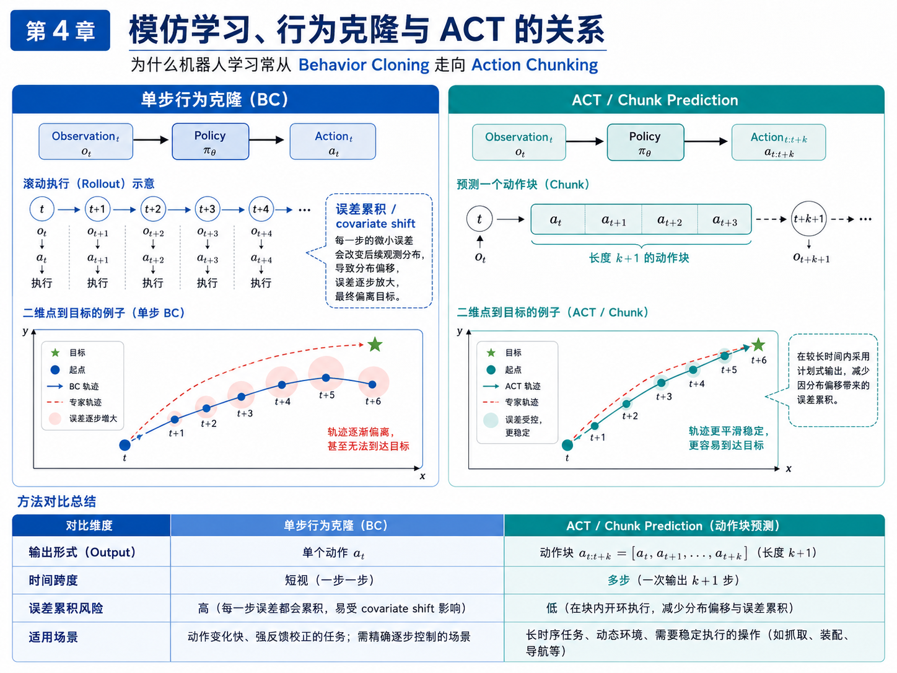
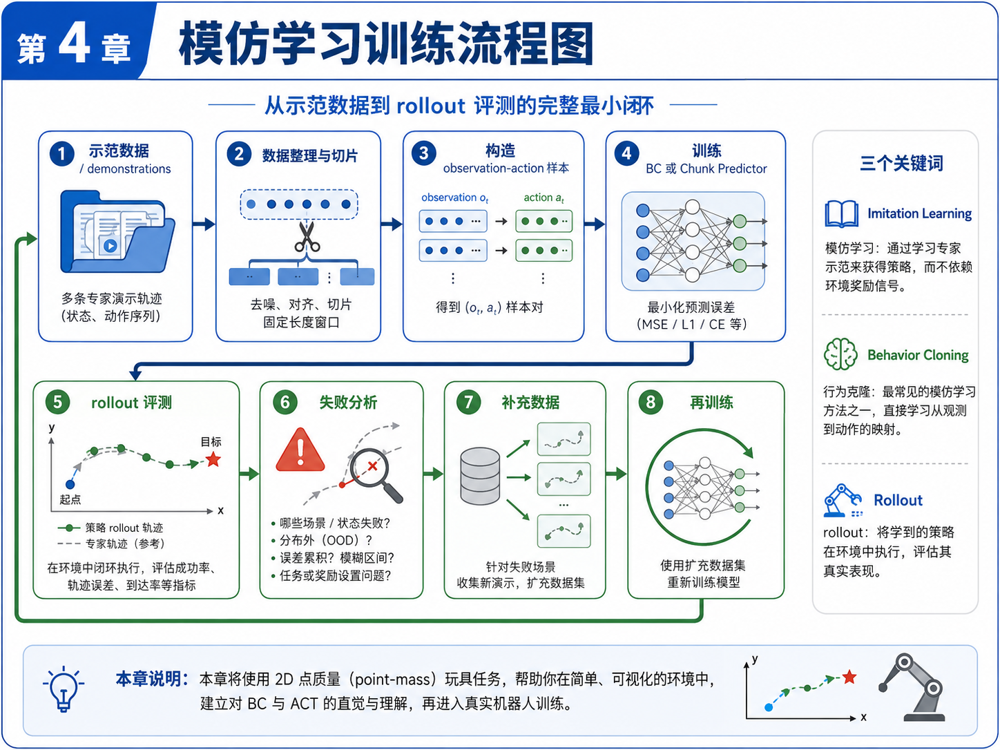
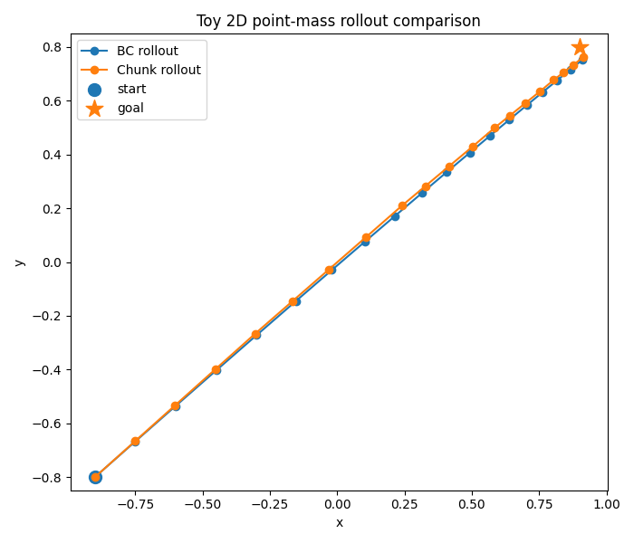
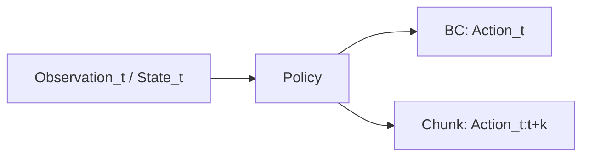
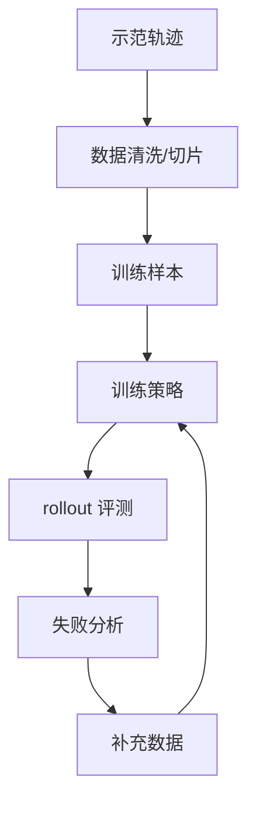

# 第 4 章：模仿学习、行为克隆、ACT 与 Diffusion Policy

到了这一章，我们终于开始正面回答一个很多读者最关心的问题：**机器人学习里的“学”，到底是在学什么？**

前两章我们已经建立了两层地基。

第一层地基，是方向地基：具身智能不是“机器人 + 大模型”的口号，而是任务、数据、策略、评测与失败回收构成的工程闭环。

第二层地基，是概念地基：机器人学习中的 observation、state、action、policy 与 episode，到底分别是什么，以及它们在主线项目 `pick_box_to_bin` 中如何落地。

有了这两层地基，今天我们终于可以进入策略学习本身。具体来说，本章要回答四个关键问题：

1. 什么是模仿学习（Imitation Learning）？
2. 什么是行为克隆（Behavior Cloning, BC）？
3. 为什么单步 BC 在机器人任务中容易出现误差累积？
4. 为什么本书建议你先做 ACT 风格的 action chunk predictor，而不是一开始就追逐大型 VLA？

这一章会非常重要，因为它决定了本书后续“训练路线”的技术口径。我们不会从一开始就追求复现大模型，也不会在尚未理解输入输出关系前就被复杂网络结构淹没。相反，我们会从一个**最小、可运行、可解释的玩具任务**入手：一个二维平面上的点（point-mass）如何从起点移动到目标点。然后用这个玩具任务建立对 BC 与 ACT 的直觉，再把这种直觉迁移到真实机械臂任务。

这也是本书一贯的思路：**先用最小系统理解核心机制，再逐步接近真实系统。**

---

## 1. 本章要解决的问题

本章重点解决以下八个问题：

1. 为什么模仿学习本质上是一种监督学习？
2. 行为克隆在数学上与普通的输入—输出拟合有什么关系？
3. 什么叫 covariate shift，为什么机器人滚动执行时会更严重？
4. 为什么单步预测 action 容易在长时序任务里误差累积？
5. ACT 的 action chunking 到底在解决什么问题？
6. Diffusion Policy 的核心直觉是什么，它与 ACT 有什么异同？
7. 为什么本书先做 ACT 风格 baseline，而不是一上来做大型 VLA？
8. 在主线项目中，如何先用一个极简脚本体验“单步 BC vs chunk predictor”的差异？

这些问题看上去像是模型问题，但其实背后都指向同一件事：**策略如何在时间上稳定地产生动作。**

---

## 2. 为什么这个问题重要

很多初学者一听到机器人学习，会自然地把关注点放在“模型名称”上。比如：

- 现在最火的是不是 ACT？
- Diffusion Policy 是不是已经比 BC 强很多？
- VLA 会不会统一一切？
- 我要不要直接研究 GR00T、π0 或 Gemini Robotics？

这些问题都值得关心，但如果你在学习顺序上把“模型名词”放在“问题结构”前面，就很容易学偏。

真正应该先问的是：

- 策略输入是什么？
- 策略输出是什么？
- 输出是一时刻动作，还是一段动作块？
- 策略训练目标是什么？
- rollout 时为什么会漂？
- 失败是模型太弱，还是 action 定义不合理，还是 episode 切分不对？

一旦把这些问题问清楚，你就会发现：

- BC 是最基础、最直接的模仿学习方法；
- ACT 的价值不是“更复杂”，而是“更适合较长时序动作任务”；
- Diffusion Policy 的价值不是“名字高级”，而是“更适合建模多模态动作分布”；
- 大型 VLA 的价值也不是“会说话”，而是如何把视觉、语言和动作真正统一到可执行策略中。

因此，本章的重要性在于：它会帮你建立一种**以问题驱动、而不是以名词驱动**的学习视角。

---

## 3. 核心概念

### 3.1 模仿学习：从专家示范中学策略

模仿学习，英文是 Imitation Learning。它的核心思想可以压缩成一句话：

> 不依赖环境奖励函数，而是通过学习专家示范，让策略学会在给定 observation / state 下输出合理 action。

如果你熟悉自动驾驶，其实这个思想并不陌生。很多端到端驾驶策略，本质上也是在学习人类驾驶行为或高质量控制器行为。只不过在机器人任务里，模仿学习通常更直接，因为很多任务天然适合通过示范来表达，比如：

- 抓住盒子；
- 把物体放进收纳盒；
- 把瓶子摆正；
- 用机械臂完成简单装配；
- 通过遥操作采集 pick-and-place 轨迹。

模仿学习的优势在于：

1. 任务意图容易表达；
2. 不需要精心设计奖励函数；
3. 很适合从小任务、小数据开始快速迭代；
4. 与真实机器人示范数据天然兼容。

但它也有明显挑战：

1. 示范数据质量直接决定上限；
2. 数据分布覆盖范围有限；
3. rollout 时容易偏离训练分布；
4. 一旦策略进入没见过的状态，很可能迅速崩坏。

### 3.2 行为克隆：最直接的模仿学习形式

行为克隆（Behavior Cloning, BC）可以视为模仿学习中最直接、最朴素的一种形式。

在 BC 中，我们通常有一组监督样本：

```text
(observation_t, action_t)
```

或者更严格一点：

```text
(observation_t, state_t) -> action_t
```

训练目标就是让策略网络拟合专家在这个时刻给出的动作。它和普通监督学习非常像：

- 输入：当前观测与状态；
- 标签：专家动作；
- 损失：MSE、L1 或分类损失；
- 输出：预测动作。

因此，如果要从工程角度解释 BC，可以把它看成：

> 一个从 observation / state 到 action 的监督学习问题。

这也是为什么本书前面要花很多篇幅讲 observation、state 和 action。因为一旦这些对象定义清楚，BC 的输入输出就非常自然了。

### 3.3 单步 BC 的问题：covariate shift 与误差累积

BC 最大的问题，并不是“它太简单”，而是它在 rollout 阶段会遇到一个非常现实的问题：**covariate shift（协变量偏移 / 分布偏移）**。

它的直觉是这样的：

1. 训练数据来自专家轨迹；
2. 策略在训练时总是看到“专家会到达的状态”；
3. 但 rollout 时，策略执行的是自己的动作；
4. 只要某一步动作有一点偏差，下一步看到的 observation 就和专家状态不一样；
5. 于是策略开始在“自己没见过的状态”上继续预测；
6. 误差就会一步步积累，最终越来越偏。

这个问题在短时任务里不一定很严重，但在较长时序任务里会非常突出。比如，抓取任务里只要接近阶段偏了几厘米，后面夹爪闭合、抬起、转移和释放都会受影响。

### 3.4 Action Chunk：为什么一次预测多个动作更有帮助

ACT 的核心直觉之一，就是不要只预测一步动作，而是**一次预测一段动作块（action chunk）**。

假设单步 BC 的输出是：

```text
a_t
```

那么 action chunk predictor 的输出可能是：

```text
[a_t, a_{t+1}, a_{t+2}, ..., a_{t+k}]
```

这样做的直觉收益有三点。

**第一，输出更有时序计划性。**

单步 BC 更像每一步都临时决定下一步；action chunk 更像先给出一小段局部动作计划。

**第二，减少高频重规划带来的漂移。**

当策略在较短窗口内输出多个动作时，它能在更长时间范围上保持动作一致性，而不是每一步都对小噪声过度敏感。

**第三，更适合机器人操作任务。**

机器人很多动作天然具有短时连续结构，比如：

- 靠近物体；
- 下降；
- 闭合夹爪；
- 抬起；
- 平移；
- 释放。

这些动作不是孤立点，而是局部连续片段。action chunking 正好匹配这种结构。

### 3.5 ACT：为什么它适合入门路线

本书提到的 ACT，可以先从“Action Chunking with Transformers 的直觉”来理解，而不是一开始追求论文复现细节。

在我们的学习路线中，ACT 的价值体现在：

1. 它清晰地强调了 action chunk 的重要性；
2. 它比大型 VLA 更聚焦于机器人动作预测本身；
3. 它天然适合基于示范数据做模仿学习 baseline；
4. 它很适合作为“小任务闭环”的第一阶段策略模型。

换句话说，ACT 之所以适合作为入门路线，并不是因为它最先进，而是因为它在工程路径上位置很合适：

- 前面可以接任务定义、episode 数据与数据质检；
- 中间可以连接 observation / action 的时间建模；
- 后面可以自然接 rollout 评测与 failure case 分析。

### 3.6 Diffusion Policy：多模态动作分布的另一种思路

如果说 ACT 更强调 action chunk 的时序组织，那么 Diffusion Policy 更强调动作分布的生成能力。

很多机器人任务并不是“只有一种正确动作”。例如，从桌面抓一个盒子，可能有多条都能成功的接近轨迹。如果你强行用回归做平均，很可能会得到一条“平均之后谁都不像”的轨迹。

这就是 Diffusion Policy 受关注的重要原因之一：它更适合建模**多模态动作分布**。

在入门层面，你不需要一开始就掌握扩散模型的全部数学细节。只需要先把直觉记住：

- BC 往往输出一个点估计；
- Diffusion Policy 更像在动作空间中逐步生成一个合理样本；
- 当存在多种可行动作模式时，它通常比简单回归更有优势。

但本书当前阶段不会先做 Diffusion Policy baseline。原因不是它不重要，而是它对工程与理解门槛更高，而我们当前最需要的是先把数据闭环与最小策略训练链路跑通。

### 3.7 为什么本书不先做大型 VLA

很多读者可能会问：既然现在 VLA 很火，为什么不一开始就做 VLA？

答案其实很明确：**因为在还没掌握任务定义、数据格式、策略输出与评测流程之前，直接做 VLA 基本没有工程抓手。**

大模型路线并不会替代这些基础环节：

- observation 仍然要定义；
- state 仍然要整理；
- action 仍然要能执行；
- episode 仍然要切分；
- rollout 仍然要评测；
- failure case 仍然要回收。

所以，本书先走这条路线：

```text
任务定义 / episode / 数据质量 → BC / ACT baseline → rollout 评测 → failure 闭环 → 再讨论更大的模型系统
```

这不是保守，而是工程上更稳。

---

## 4. 概念图 / 流程图 / 架构图

### 4.1 图 4-1 单步 BC 与 ACT / Chunk Prediction 对比



这张图是本章最重要的图之一。它把两个核心差异讲得很直观：

- BC 输出单个 action；
- ACT / chunk predictor 一次输出一段 action chunk。

更重要的是，图中用二维点到目标的例子把误差累积可视化了。左边单步 BC 的轨迹会逐渐偏离，右边 chunk predictor 的轨迹更平滑、更稳定。

### 4.2 图 4-2 模仿学习训练流程图



这张图把本章的最小训练闭环完整表达了出来：

1. 收集示范数据；
2. 对数据做整理与切片；
3. 构造 `(o_t, a_t)` 或 `(o_t, a_{t:t+k})` 样本；
4. 训练 BC 或 chunk predictor；
5. rollout 评测；
6. 失败分析；
7. 补充数据；
8. 再训练。

这张图很重要，因为它不是“玩具任务专用图”，而是后面真实机器人训练都适用的通用骨架。

### 4.3 图 4-3 toy rollout 对比图（BC vs Chunk）



这张图来自 `reports/ch04_toy_act_rollout.png`，用于直观看到两类策略在 rollout 轨迹上的差异。

### 4.4 Mermaid 图：BC 与 action chunk 的输出差异



### 4.5 Mermaid 图：模仿学习最小闭环



---

## 5. 工程化理解

### 5.1 为什么本章先用二维点任务

很多人会问：为什么不直接上机械臂？

因为在机械臂任务里，变量太多：

- 视觉噪声；
- 相机位姿；
- 夹爪接触；
- 控制器延迟；
- 动作边界；
- 状态同步；
- 失败终止。

如果一开始就上真机，你很难判断 rollout 崩掉到底是：

- 模型没学会；
- action 定义不好；
- 控制器不稳定；
- 数据切片不对；
- 还是环境本身太复杂。

二维点任务虽然简单，但它非常适合帮你单独看清一件事：**单步动作预测与 chunk 预测在时间上的差异。**

### 5.2 为什么“简单可运行”比“复杂但不清楚”更重要

你会发现，本章给出的训练脚本并不是一个“真正的 ACT 论文复现”，而是一个极简版本的 chunk predictor。这是有意为之。

对学习者来说，最有价值的往往不是一份堆满依赖、很难运行的大工程，而是一份：

- 可以运行；
- 可以看懂；
- 可以修改 chunk 长度；
- 可以自己观察 rollout 行为变化；
- 能把概念和工程结果对应起来的脚本。

这正是本书训练路线的特点：先建立直觉，再增加复杂度。

### 5.3 BC、ACT 与 Diffusion Policy 在学习路线中的关系

在本书的学习路径里，它们的关系可以这样理解：

- **BC**：你理解最基础的模仿学习输入输出；
- **ACT / chunk predictor**：你理解多步动作预测与时间结构；
- **Diffusion Policy**：你理解多模态动作分布与更强生成能力；
- **VLA**：你把视觉、语言和动作统一放进更大的系统视角里。

因此，这不是“谁淘汰谁”的关系，而是**学习深度逐步增加**的关系。

---

## 6. 主线项目中的位置

本章在主线项目中的作用，是为后续正式策略训练准备第一个“策略训练脚本雏形”。

本章新增文件：

```text
robot-learning-shelf-demo/
  scripts/
    05_train_act_baseline.py
  reports/
    ch04_toy_act_report.json
    ch04_toy_act_rollout.png
```

请注意，这里的 `05_train_act_baseline.py` 还不是针对真实机械臂 episode 的最终训练脚本，而是一个**概念脚手架**：

- 它先在二维 toy task 上对比 BC 与 chunk predictor；
- 帮你形成对 action chunk 的直觉；
- 为后面正式接入真实机器人数据做准备。

---

## 7. 示例

### 7.1 示例 1：二维点移动中的单步预测

设想一个简单任务：平面上有一个点，初始位置是 `(x, y)`，目标位置是 `(g_x, g_y)`。专家策略每一步都输出一个朝向目标的小位移。

如果我们用 BC 学习，训练样本就是：

```text
[x, y, g_x, g_y] -> [dx, dy]
```

这看起来没问题，但一旦 rollout 时某一步方向偏了一点，后面的 observation 就会改变。于是模型开始在自己不熟悉的状态上继续预测，误差越来越大。

### 7.2 示例 2：二维点移动中的 chunk 预测

如果改成 chunk predictor，那么训练样本变成：

```text
[x, y, g_x, g_y] -> [dx_t, dy_t, dx_t+1, dy_t+1, ..., dx_t+k, dy_t+k]
```

虽然这并不能神奇地消灭所有误差，但它能让局部动作更有连续性，也更容易表现出“短时规划”的效果。

### 7.3 示例 3：为什么平均动作会导致不合理路径

假设对同一个起始 observation，专家示范中存在两条都正确的路径：一条从左绕过去，一条从右绕过去。如果你直接做回归平均，模型可能学到一条“从中间穿过去”的无效路径。

这也是为什么在更复杂任务里，Diffusion Policy 会显得更有吸引力，因为它不只是输出一个平均点，而是更擅长表达多种可能的动作分布。

---

## 8. 练习代码

本章核心代码文件：`robot-learning-shelf-demo/scripts/05_train_act_baseline.py`

这段代码会做四件事：

1. 生成二维点到目标的专家示范数据；
2. 训练一个单步 BC 线性模型；
3. 训练一个 chunk predictor 线性模型；
4. 对比两者 rollout 表现，并保存报告和图像。

核心训练思路如下：

```python
# BC 样本
obs = [x, y, gx, gy]
action = [dx, dy]

# Chunk 样本
obs = [x, y, gx, gy]
action_chunk = [dx_t, dy_t, dx_t+1, dy_t+1, ..., dx_t+k-1, dy_t+k-1]
```

推荐运行方式：

```bash
cd robot-learning-shelf-demo
python scripts/05_train_act_baseline.py \
  --num_train 400 \
  --num_eval 80 \
  --chunk_size 4
```

运行后预期得到：

```text
reports/ch04_toy_act_report.json
reports/ch04_toy_act_rollout.png
```

你可以重点关注以下输出：

- BC 的 success_rate；
- Chunk predictor 的 success_rate；
- 两者 mean_final_error 的差异；
- rollout 图里两条轨迹的稳定性差异。

---

## 9. 代码解释

### 9.1 这段代码解决什么问题

它解决的是：**如何用最小依赖、最小环境复杂度，建立对 BC 与 action chunk 的直觉。**

### 9.2 输入是什么

输入并不是外部数据集，而是脚本内部生成的专家轨迹。每条轨迹包含：

- 起点坐标；
- 目标点坐标；
- 专家在每个时间步给出的动作。

### 9.3 输出是什么

输出是两类结果：

1. `ch04_toy_act_report.json`：保存训练设置与评测统计；
2. `ch04_toy_act_rollout.png`：可视化 BC 与 chunk predictor 的 rollout 轨迹。

### 9.4 为什么使用线性回归而不是复杂神经网络

因为本章的重点不是追求高性能，而是把策略训练链路压缩到最容易理解的形式。只要读者能看懂：

- 样本是怎样构造的；
- BC 与 chunk 的标签如何不同；
- rollout 时为什么会出现差异；

那么本章的教学目标就已经达成。

### 9.5 如何接入主线项目

当前脚本是 toy task，用于建立直觉。后续接入真实项目时，这个脚本将迁移成：

- 用真实 episode 构造样本；
- observation 来自真实图像与 robot state；
- action 来自机械臂末端增量与夹爪状态；
- rollout 从二维模拟变成真实机器人或仿真评测。

---

## 10. 常见错误

### 错误 1：把模仿学习理解成“照着抄动作”

模仿学习不是机械复制动作，而是学习在给定 observation / state 下该如何决策。动作只是监督标签，真正学的是映射关系。

### 错误 2：只看离线损失，不看 rollout

很多模型离线 loss 看起来不错，但 rollout 一跑就漂。因为真正的问题不是拟合专家点，而是在执行时会不会进入训练分布外状态。

### 错误 3：把 ACT 理解成“比 BC 更复杂所以更高级”

ACT 的意义不在于复杂，而在于它针对时间结构和误差累积问题提供了更适合的动作表达。

### 错误 4：用大模型名词替代理解

如果没有先理解 BC、action chunk 与 rollout 之间的关系，那么直接讨论 VLA、GR00T 或 Diffusion Policy，往往会变成“知道术语，但不知道为什么要这样做”。

---

## 11. 本章练习

### 练习 1：基础练习

请用自己的语言解释：为什么 BC 可以被看作一种监督学习？

### 练习 2：基础练习

请解释 covariate shift 的形成过程，并用 `pick_box_to_bin` 的抓取任务举一个现实例子。

### 练习 3：工程练习

修改 `05_train_act_baseline.py` 的 `--chunk_size` 参数，分别尝试 `2`、`4`、`6`，比较不同 chunk 长度下的评测结果。

### 练习 4：进阶练习

在二维点任务中加入执行噪声，让 rollout 时每一步动作都叠加小随机扰动，观察 BC 与 chunk predictor 的差异是否变大。

### 练习 5：思考练习

为什么真实机械臂任务比二维点任务更难？请从 observation、action、接触、时间同步与失败类型五个角度回答。

---

## 12. 本章产出

本章应当产出：

1. 对模仿学习、BC、ACT 与 Diffusion Policy 的整体理解；
2. 一个可运行的极简训练脚本 `05_train_act_baseline.py`；
3. 一份评测报告 `ch04_toy_act_report.json`；
4. 一张 rollout 对比图 `ch04_toy_act_rollout.png`；
5. 为后续进入 VLA 与任务配置奠定正确的策略学习视角。

---

## 13. 小结

这一章你最需要记住的，并不是某个论文名，而是一个策略学习上的核心判断：

> 机器人策略学习的关键问题，不只是“会不会预测动作”，而是“能不能在时间上稳定地预测动作”。

BC 帮你理解最基础的监督学习式策略拟合；ACT 帮你理解 action chunk 对时间结构的好处；Diffusion Policy 则提醒你动作分布可能是多模态的，不一定能用一个平均值解释。

本书之所以先做 ACT 风格 baseline，是因为它在工程上位置非常合适：既能接住前面的任务与数据闭环，又能自然通向后面的 rollout 评测和失败分析。

下一章，我们会把视角再向前推一步：从模仿学习与 chunk 预测，走向 VLA（Vision-Language-Action）。但我们不会把 VLA 神秘化，而是要准确回答一个更重要的问题：**VLA 到底比 VLM 多了什么？**
