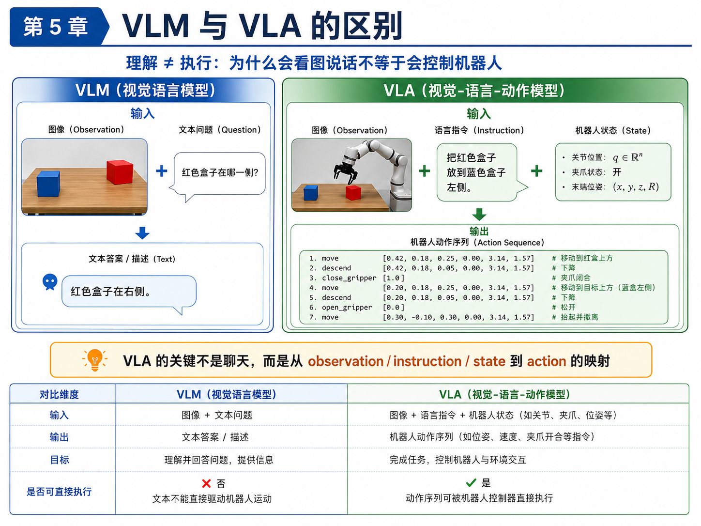
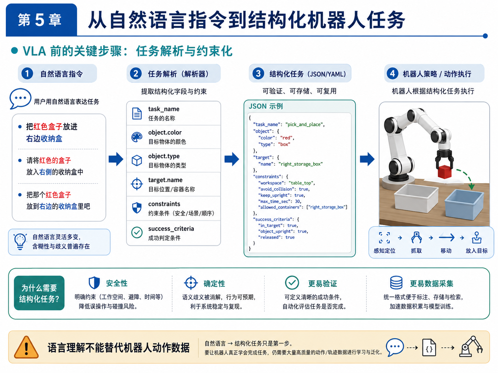
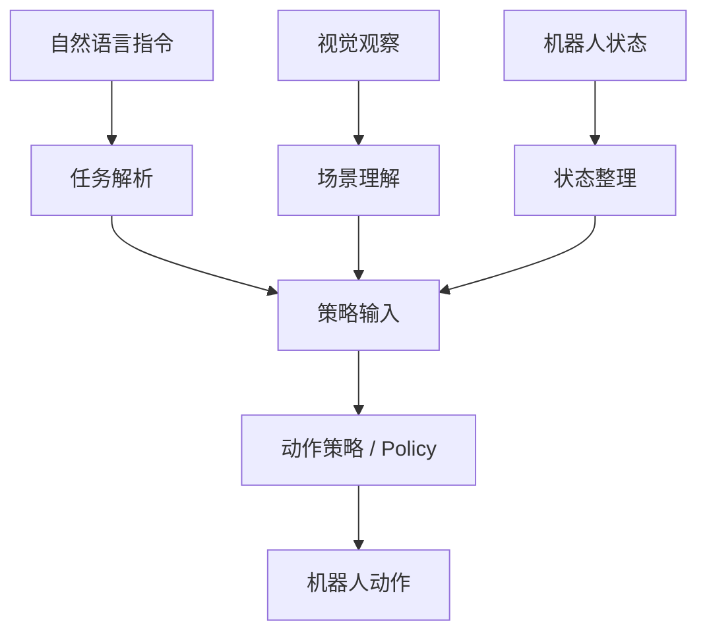
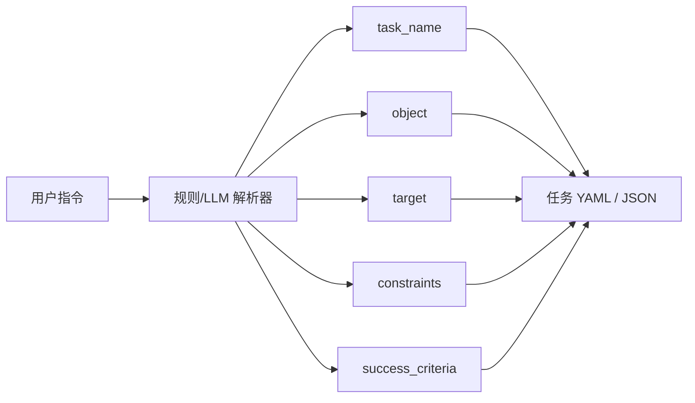

# 第 5 章：VLA 的本质：Vision-Language-Action

如果说第 4 章解决的是“机器人策略如何从示范中学习动作”，那么第 5 章要解决的，就是另一个同样容易被误解的问题：**VLA 到底是什么？**

在今天的技术传播环境里，VLA 这个词经常被说得很神奇。很多演示视频会给人一种印象：

- 机器人看到了画面；
- 人给了它一句自然语言；
- 它就像人一样理解了任务；
- 然后顺利完成动作。

于是，很多人会不自觉地把 VLA 理解成“能聊天的机器人模型”。但这种理解是危险的，因为它会把“理解”和“执行”混在一起。

本章的核心目标，就是把这件事彻底讲清楚：

- VLM 擅长理解和描述；
- VLA 的关键则是从视觉、语言与机器人状态，映射到**可执行动作**；
- 语言理解本身，并不能替代机器人动作数据；
- 结构化任务解析，是自然语言走向机器人执行的重要中间层。

我们还会回答一个非常现实的问题：为什么本书在当前阶段并不急着复现大型 VLA，而是先推进任务定义、数据闭环与 ACT baseline？

---

## 1. 本章要解决的问题

本章重点解决以下八个问题：

1. Vision-Language-Action 中的 Vision、Language、Action 分别指什么？
2. VLM 与 VLA 的差异到底在哪里？
3. 为什么会“看图说话”不等于“会控制机器人”？
4. 为什么互联网视觉语言知识不能直接变成可靠机器人动作？
5. 大规模机器人动作数据为什么如此关键？
6. GR00T、Gemini Robotics、π0、Open X-Embodiment、LeRobot 这些名字，在学习路径中分别应该如何理解？
7. 为什么语言指令通常要先转成结构化任务，而不是直接让机器人“自由发挥”？
8. 在主线项目中，如何先实现一个规则版的 task parser，作为“语言 → 结构化任务”的雏形？

---

## 2. 为什么这个问题重要

如果不把 VLA 说清楚，读者在后续学习中很容易掉进两个极端。

### 极端一：把 VLA 神化

这种极端通常表现为：

- 认为只要有了强大的视觉语言模型，机器人就自然会做动作；
- 认为语言理解几乎可以替代任务定义；
- 认为只要“模型足够大”，动作策略、控制边界、episode 数据和 rollout 评测都不再重要。

这显然不符合工程现实。一个机器人系统能否完成任务，最终还是要看：

- action 是否可执行；
- 机器人状态是否纳入决策；
- 真实动作数据是否足够；
- 失败是否能被回收与迭代。

### 极端二：把 VLA 贬成“噱头”

另一种极端则认为：

- VLA 只是把文字提示加到模型里；
- 机器人还是老一套，只不过包了一层 LLM；
- 语言根本没什么价值。

这同样不准确。语言对机器人系统的价值并不在于“陪你聊天”，而在于：

- 它可以表达任务目标；
- 它可以提供高层约束；
- 它可以帮助统一多任务表述；
- 它可以支持更一般化的人机交互接口。

所以，本章的重要性就在于：**把 VLA 放回正确的位置。既不神化，也不低估。**

---

## 3. 核心概念

### 3.1 Vision-Language-Action 分别是什么

一个 VLA 系统的名字本身已经说明了它的三类核心输入输出元素：

#### Vision

Vision 指视觉输入，通常包括：

- 相机 RGB 图像；
- RGBD；
- 多视角图像；
- 腕部相机图像；
- 有时也包括由视觉提取的中间表征。

#### Language

Language 指自然语言任务描述，例如：

- “把红色盒子放进右边收纳盒”；
- “把歪掉的盒子摆正”；
- “把桌面上的垃圾放进垃圾盒”。

语言的价值在于表达任务目标与约束，而不是直接代替控制器。

#### Action

Action 指机器人可执行的动作输出。它可能是：

- 关节角目标；
- 末端位姿；
- 位姿增量；
- 夹爪开合；
- 动作块；
- 更底层的控制命令。

因此，VLA 与 VLM 的最本质差别就在这里：**VLA 的输出不是文本，而是动作。**

### 3.2 VLM 与 VLA：理解与执行的分界线

VLM（视觉语言模型）擅长做的事情通常包括：

- 看图描述；
- 回答图像相关问题；
- 识别场景中的物体和关系；
- 根据语言进行视觉理解。

例如，给它一张桌面图片，它可以回答：

- 红色盒子在右侧；
- 蓝色盒子在左侧；
- 桌面上有两个盒子和一个机械臂。

这些能力很重要，但它们并不直接等于动作能力。

VLA 则进一步要求模型完成：

- 基于视觉观察；
- 结合语言任务；
- 再结合机器人状态；
- 最终输出一串能被机器人执行的动作序列。

所以，你可以把它们的差异概括成：

- **VLM：从图像与语言到文本；**
- **VLA：从图像、语言与状态到动作。**

### 3.3 为什么互联网知识不能直接变成机器人动作

很多视觉语言模型训练于海量互联网图文数据。这给了它们极强的常识理解与视觉语义能力，但机器人动作并不只是“知道世界是什么”。

机器人动作还需要：

- 知道自己当前的关节状态；
- 知道夹爪是否开合；
- 知道目标在三维空间中的相对关系；
- 知道控制输出会如何改变环境；
- 知道哪些动作是安全的、可执行的。

这些信息，很多都不在互联网图文里。更重要的是，真实机器人动作数据远比互联网图文稀缺，因此动作头（action head）学到的能力更加珍贵，也更依赖高质量示范数据。

### 3.4 robot action data 为什么稀缺

机器人动作数据比图像文本数据稀缺，主要有五个原因：

1. **采集成本高**：需要真实机器人、相机、控制系统与人工示范；
2. **数据结构复杂**：不仅有图像，还有状态、动作、时间戳、成功标签；
3. **时序同步要求高**：不同模态必须在时间上对齐；
4. **任务覆盖难**：不同场景、物体和约束组合很多；
5. **失败也有成本**：真机试错不如纯文本数据便宜。

这也是为什么大规模机器人数据集如此重要。没有足够高质量动作数据，VLA 很难真正学会“执行”。

### 3.5 Open X-Embodiment、LeRobot、GR00T、Gemini Robotics、π0 在学习路径中的位置

这些名字常常会同时出现，但它们并不处在同一层次。

- **Open X-Embodiment**：更像大规模具身数据与研究生态的重要代表；
- **LeRobot**：更贴近工程实践与开源训练流程，是个人学习者更容易接近的入口；
- **GR00T、Gemini Robotics、π0**：代表更大规模、更系统化的机器人基础模型或 VLA 方向探索。

对于个人工程师来说，正确的顺序不是直接“复现大模型”，而是：

1. 理解任务定义；
2. 跑通数据闭环；
3. 做出 BC / ACT baseline；
4. 再去理解大型 VLA 为什么成立、缺什么数据、解决什么问题。

### 3.6 语言指令为什么要先结构化

假设用户说：

```text
把红色盒子放进右边收纳盒。
```

对人来说，这句话似乎很自然。但对机器人系统来说，其中仍然有很多隐含内容需要明确：

- 红色盒子指哪个 object？
- 右边收纳盒在当前场景里对应哪个 target？
- 是否要求盒子保持竖直？
- 是否有时间上限？
- 是否允许碰撞？
- 怎样才算成功？

因此，语言指令通常需要先解析成结构化任务。例如：

```json
{
  "task_name": "pick_box_to_bin",
  "object": {"type": "box", "color": "red"},
  "target": {"name": "right_storage_box"},
  "constraints": {"avoid_collision": true, "keep_upright": true},
  "success_criteria": {"in_target": true, "released": true}
}
```

结构化任务的重要性在于：

1. 更可验证；
2. 更可复现；
3. 更利于数据记录；
4. 更利于系统边界控制；
5. 更容易成为下游策略系统的稳定输入。

### 3.7 语言不能替代动作数据

这是本章最重要的判断之一。

语言非常重要，但语言不能替代动作数据。它能告诉机器人“要做什么”，却不能自动告诉机器人“具体如何做”。

在机器人系统里：

- 语言负责目标；
- 视觉负责感知环境；
- 状态负责描述机器人自身；
- 动作数据负责告诉策略怎样执行。

如果没有动作数据，VLA 最容易停留在“看起来懂任务，但不一定做得出来”的阶段。

---

## 4. 概念图 / 流程图 / 架构图

### 4.1 图 5-1 VLM 与 VLA 的区别



这张图把本章最核心的差别表达得很清楚：

- 左边 VLM 的输出是文本答案；
- 右边 VLA 的输出是动作序列。

请特别注意图中那个高亮判断：

> VLA 的关键不是聊天，而是从 observation / instruction / state 到 action 的映射。

### 4.2 图 5-2 从自然语言指令到结构化机器人任务



这张图把本章主线项目新增能力说得很直观：先把自然语言任务解析成结构化 JSON / YAML，再让后续策略系统使用它。

### 4.3 Mermaid 图：VLA 输入输出结构



### 4.4 Mermaid 图：语言到结构化任务配置



---

## 5. 工程化理解

### 5.1 为什么规则解析器仍然有价值

很多读者看到“语言 → 任务解析”时，第一反应可能是：为什么不用 LLM，为什么还要写规则？

原因很简单：本书当前阶段的目标不是追求语言理解能力最强，而是先建立一个**稳定、可控、可验证**的任务接口。

规则解析器的优点在于：

- 输出字段明确；
- 可控性强；
- 很适合小范围任务验证；
- 更容易与后续 YAML 配置对接；
- 能清楚暴露哪些语义还没有被支持。

因此，规则解析器不是“最终方案”，而是一个非常好的教学与工程脚手架。

### 5.2 为什么本章不急着做真正 VLA 训练

因为真正的 VLA 训练至少需要：

- 大量机器人动作数据；
- 统一的 observation / instruction / state / action 表达；
- 较完整的训练与评测流程；
- 足够强的计算与实验条件。

如果在这些基础尚未成型前直接上 VLA，学习者很容易只剩下“看论文、看架构图、看演示视频”，却无法形成真正的工程能力。

所以，本章在主线项目中的推进是非常务实的：

- 先支持自然语言指令输入；
- 再解析为结构化任务；
- 然后在后续章节中，把结构化任务真正接到任务定义、episode 采集与策略训练上。

### 5.3 语言在机器人系统中的真实位置

语言最适合处在系统的“高层任务接口”位置。它特别擅长：

- 描述任务目标；
- 给出高层限制；
- 统一多任务表述；
- 作为人机交互入口。

但越往底层，语言就越需要被转化成更明确、更结构化的表示。因为控制系统和动作策略更需要的是：

- 明确 object；
- 明确 target；
- 明确 success criteria；
- 明确可执行约束。

这就是为什么“自然语言 → 结构化任务”会成为本书主线项目中的重要一环。

---

## 6. 主线项目中的位置

本章在主线项目中的作用，是让项目第一次具备“语言指令入口”。

新增文件：

```text
robot-learning-shelf-demo/
  configs/
    task_pick_box_to_bin.yaml
  scripts/
    rule_based_task_parser.py
```

项目新增能力：

1. 读者可以输入自然语言指令；
2. 解析器会抽取 task_name、object、target、constraints；
3. 输出结构化 JSON；
4. 在具备 PyYAML 时，还可以输出 YAML；
5. `task_pick_box_to_bin.yaml` 为后续第 6 章正式任务定义做铺垫。

---

## 7. 示例

### 7.1 示例 1：“把红色盒子放进右边收纳盒”如何解析

原始指令：

```text
把红色盒子放进右边收纳盒
```

解析结果可以是：

```json
{
  "task_name": "pick_box_to_bin",
  "instruction": "把红色盒子放进右边收纳盒",
  "object": {
    "type": "box",
    "color": "red"
  },
  "target": {
    "name": "right_storage_box"
  },
  "constraints": {
    "workspace": "table_top",
    "avoid_collision": true,
    "keep_upright": false,
    "max_time_sec": 30
  },
  "success_criteria": {
    "in_target": true,
    "released": true,
    "object_upright": false
  }
}
```

### 7.2 示例 2：VLM 能理解，但不一定能执行

假设你给一个 VLM 输入一张桌面图像，再问：

```text
红色盒子在哪里？
```

VLM 很可能回答：

```text
红色盒子在桌面右侧，蓝色盒子在左侧。
```

这说明它理解了视觉内容。但如果你想让机器人去抓取红色盒子，再放到蓝色盒子左侧，仅靠这句文本描述还远远不够。你仍然需要：

- 机器人状态；
- 动作表示；
- 控制执行；
- 成功标准；
- 动作数据支撑的策略。

### 7.3 示例 3：结构化任务 YAML

文件：`robot-learning-shelf-demo/configs/task_pick_box_to_bin.yaml`

这份 YAML 会包含：

- object 类型与颜色；
- target 名称；
- action mode；
- observation modalities；
- constraints；
- success / failure criteria；
- randomization 参数。

它是后续第 6 章正式任务定义的雏形，而不是最终版。

---

## 8. 练习代码

本章核心代码文件：`robot-learning-shelf-demo/scripts/rule_based_task_parser.py`

这个脚本会完成：

1. 接收自然语言指令；
2. 提取颜色、物体类型与目标区域；
3. 推断 task_name；
4. 构造 constraints 与 success_criteria；
5. 输出 JSON，并在可用时输出 YAML。

推荐运行方式：

```bash
cd robot-learning-shelf-demo
python scripts/rule_based_task_parser.py \
  --instruction "把红色盒子放进右边收纳盒" \
  --output_json reports/ch05_task_parse.json
```

如果环境安装了 `PyYAML`，你还可以这样输出 YAML：

```bash
python scripts/rule_based_task_parser.py \
  --instruction "请将红色盒子轻放到右边收纳盒，保持竖直" \
  --output_json reports/ch05_task_parse.json \
  --output_yaml reports/ch05_task_parse.yaml
```

脚本的教学重点并不在“语义理解最强”，而在于让你明白：**自然语言要进入机器人系统，往往必须先被约束化。**

---

## 9. 代码解释

### 9.1 这段代码解决什么问题

它解决的是：**如何把一个自然语言任务，转成结构清晰、可验证、可存储的任务对象。**

### 9.2 输入是什么

输入是一条自然语言指令，例如：

- 把红色盒子放进右边收纳盒；
- 请将红色的盒子放入右侧收纳盒中；
- 把那个红色盒子放到右边的收纳盒里吧。

### 9.3 输出是什么

输出是结构化任务配置，包括：

- `task_name`
- `object`
- `target`
- `constraints`
- `success_criteria`

### 9.4 为什么这个脚本重要

因为它让主线项目第一次拥有了“从语言走向任务配置”的接口。后续第 6 章会把这个接口真正升级成完整的任务定义系统。

### 9.5 如何接入主线项目

当前解析器输出的 JSON / YAML，可以在后续章节中作为：

- episode `meta.json` 的任务来源；
- 任务配置文件生成器；
- rollout 评测时的任务说明；
- 多任务扩展时的统一接口。

---

## 10. 常见错误

### 错误 1：把语言理解等同于动作能力

一个系统会描述场景，并不意味着它会完成动作。VLA 的核心难点在于动作，而不是描述。

### 错误 2：让自然语言直接驱动底层控制

如果没有中间约束层，语言输出往往太模糊，不适合直接驱动机器人动作。

### 错误 3：忽略机器人状态

很多人谈 VLA 时只强调视觉和语言，但机器人状态同样关键。没有 state，策略很难知道自己现在处于什么执行阶段。

### 错误 4：高估互联网知识对机器人动作的可迁移性

互联网数据能提供语义与常识，但机器人动作需要真实的状态—动作对齐数据，不能简单替代。

---

## 11. 本章练习

### 练习 1：基础练习

请用自己的语言解释 VLM 与 VLA 的区别，重点说明两者输出形式的不同。

### 练习 2：工程练习

使用 `rule_based_task_parser.py` 将以下 5 条自然语言指令解析成结构化任务：

1. 把红色盒子放进右边收纳盒；
2. 请把蓝色盒子放到左边收纳盒；
3. 把绿色盒子移动到桌面中央；
4. 请将红色的盒子轻放到右边收纳盒，保持竖直；
5. Move the red box to the right storage box.

### 练习 3：进阶练习

扩展规则解析器，使其支持：

- 颜色更多样；
- 目标区域更多样；
- “轻放”“快速”“保持竖直”等约束表达。

### 练习 4：思考练习

如果将规则解析器替换成 LLM 解析器，哪些输出字段必须被严格约束与校验？为什么？

### 练习 5：思考练习

为什么语言理解不能替代机器人动作数据？请从任务目标、动作执行、状态反馈和训练数据四个角度回答。

---

## 12. 本章产出

本章应当产出：

1. 对 VLA 本质的正确理解；
2. 对 VLM 与 VLA 差异的清晰判断；
3. 一个可运行的规则版 task parser；
4. 一个结构化任务 YAML 雏形；
5. 主线项目中的“语言 → 结构化任务”入口。

---

## 13. 小结

这一章最重要的判断可以概括成三句话。

第一，VLA 与 VLM 的最本质差别不在于“是不是更聪明”，而在于输出是不是机器人动作。

第二，语言理解非常重要，但它不能替代机器人动作数据。真正的执行能力仍然来自 observation / instruction / state 到 action 的学习。

第三，自然语言如果要稳定进入机器人系统，通常必须经过“结构化任务”这一中间层。

本章把主线项目推进到了一个很关键的位置：从“有 episode 数据、能训练 toy 策略”，进一步推进到“可以接收语言指令，并把它变成任务配置”。

下一章，我们就会顺着这条线继续前进，系统讲清楚：一个真正可执行的机器人任务，应该如何定义。换句话说，我们要正式从“语言上的任务”走向“工程上的任务”。
