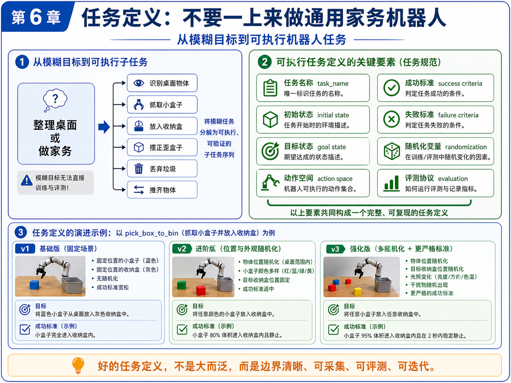
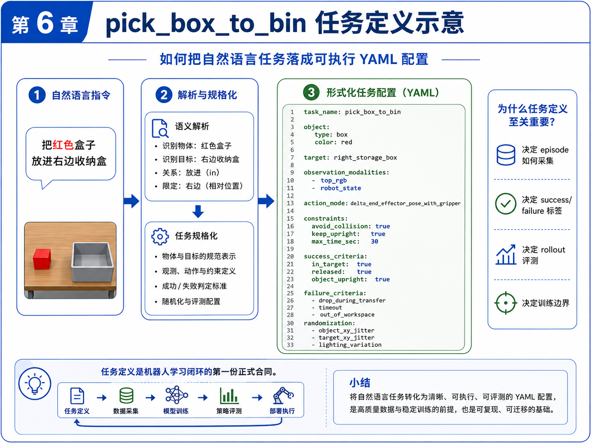
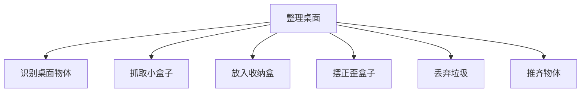
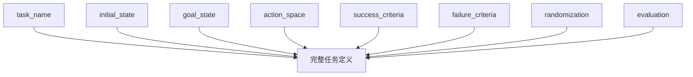

# 第 6 章：任务定义：不要一上来做通用家务机器人

到了这一章，本书主线项目终于从“概念理解”进入“正式建模”。

前几章我们已经完成了几件非常关键的事情：

- 明确了具身智能不是“机器人 + LLM”的口号，而是任务、数据、策略、评测和失败回收构成的闭环；
- 建立了 observation、state、action、policy、episode 这些基础概念；
- 理解了模仿学习、BC、ACT 与 VLA 在学习路径中的相对位置；
- 让主线项目第一次具备了“语言 → 结构化任务”的入口。

但到目前为止，我们仍然还没有真正回答一个更底层、更现实的问题：

> **机器人到底要做什么？**

很多初学者在这里会犯一个非常典型的错误：一开始就说自己要做“家务机器人”“整理桌面机器人”“理货机器人”“厨房机器人”。这些说法在产品讨论里没有错，但在训练与工程实现里，它们几乎都**太大、太泛、太模糊**，无法直接成为可训练任务。

所以本章的目标很明确：

1. 说明为什么“整理桌面”“做家务”不是可直接训练的任务；
2. 讲清楚一个可执行任务到底由哪些要素构成；
3. 用主线项目 `pick_box_to_bin` 给出第一个真正正式、可验证、可采集、可评测的任务定义；
4. 把自然语言任务进一步落成 YAML 任务配置；
5. 给出一个任务配置校验脚本，让任务定义第一次具备“工程边界”。

这一步极其重要。因为从本章开始，主线项目第一次拥有了真正意义上的“任务合同”。

---

## 1. 本章要解决的问题

本章重点解决以下九个问题：

1. 为什么“整理桌面”“做家务”“理货”不是可直接训练的任务？
2. 一个可执行任务至少应包含哪些要素？
3. 什么叫初始状态与目标状态？
4. 成功标准与失败标准为什么必须写清楚？
5. 动作空间为什么是任务定义的一部分，而不是后面再想？
6. 为什么随机化变量必须在任务定义阶段就考虑？
7. 任务定义会怎样反向影响 episode 采集和评测协议？
8. `pick_box_to_bin` 的 v1 / v2 / v3 应如何演进？
9. 如何用 YAML 将任务定义写成工程可用的配置文件？

这些问题看起来像“文档问题”，但实际上它们决定了后面所有的数据、训练和评测能不能成立。

---

## 2. 为什么这个问题重要

### 2.1 任务定义模糊，后面一切都会跟着模糊

如果你不把任务定义清楚，那么：

- 数据采集的人不知道该怎样演示；
- 写规则控制的人不知道怎样判断“完成了没有”；
- 做模仿学习的人不知道标签边界在哪里；
- 做 rollout 评测的人不知道成功率到底怎么算；
- 失败样本回收的人也很难区分，是“模型没学会”，还是“任务从一开始就没定义清楚”。

所以，任务定义不是文档装饰，而是整个闭环的上游约束。

### 2.2 工程上最怕的不是任务小，而是任务边界不清

很多初学者会担心：“是不是我做得太小了？”

其实刚开始最危险的不是任务太小，而是任务太泛。一个任务即使小，只要它：

- 边界清楚；
- 可采集；
- 可执行；
- 可评测；
- 可迭代；

它就是一个好任务。

相反，哪怕你说自己在做“通用家务机器人”，只要你说不清：

- 要处理什么物体；
- 在什么工作空间中；
- 动作能输出什么；
- 什么时候算成功；
- 失败如何记录；

那它就不是一个可以训练的任务，而只是一个愿景。

### 2.3 自动驾驶工程师在这里有天然优势

如果你有自动驾驶背景，会发现这件事其实并不陌生。

自动驾驶里，很多能力也不是一句“自动驾驶”就能概括，而是被拆成：

- 车道保持；
- 跟车；
- 变道；
- 泊车入库；
- 障碍物绕行；
- 特定场景触发逻辑。

具身智能也是一样。真正落地时，必须先把“大目标”拆成“小闭环任务”。

---

## 3. 核心概念

### 3.1 什么是模糊任务，什么是可执行任务

先看几个常见但模糊的任务表述：

- 整理桌面；
- 做家务；
- 收拾房间；
- 理货；
- 分拣杂物。

这些表述的问题并不是它们不重要，而是它们都包含了太多隐含子任务。例如“整理桌面”至少可能包含：

- 识别桌面物体；
- 抓取小盒子；
- 把盒子放入收纳盒；
- 把歪掉的盒子摆正；
- 把垃圾扔进垃圾盒；
- 把散乱的物品推齐；
- 区分哪些物体应该保留、哪些应该丢弃。

这说明“整理桌面”更像一个**任务集合**，而不是一个单一训练任务。

可执行任务则必须再往下走一步，变成类似：

- 从桌面抓取一个小盒子并放入右侧收纳盒；
- 将歪掉的小盒子摆正；
- 把蓝色瓶子移动到桌面中央；
- 将指定区域中的垃圾块放入垃圾桶。

也就是说，可执行任务必须具有：

1. 明确对象；
2. 明确目标；
3. 明确工作空间；
4. 明确动作边界；
5. 明确成功/失败标准。

### 3.2 任务定义的八个关键要素

本书建议把一个任务定义最少拆成以下八部分：

1. **任务名称（task_name）**：唯一标识任务；
2. **初始状态（initial state）**：任务开始时环境和机器人处于什么状态；
3. **目标状态（goal state）**：任务完成后应满足什么条件；
4. **动作空间（action space）**：机器人允许输出什么动作；
5. **成功标准（success criteria）**：什么时候算任务成功；
6. **失败标准（failure criteria）**：什么时候判定失败；
7. **随机化变量（randomization）**：训练和评测中哪些因素会变化；
8. **评测协议（evaluation）**：如何跑评测、记录哪些指标。

这八部分并不是形式主义，而是为了让任务真正可复现、可采集、可训练。

### 3.3 初始状态与目标状态

很多人写任务时只会写“抓起盒子并放入收纳盒”，但真正可执行时，至少还要回答：

- 盒子起始在桌面的什么范围？
- 收纳盒起始在什么位置？
- 机器人起始位姿是什么？
- 夹爪是开还是合？
- 盒子一开始是不是已经在收纳盒中？
- 是否允许环境中有其他干扰物？

这些都属于初始状态的一部分。

目标状态则要回答：

- 盒子是否在收纳盒内？
- 盒子是否稳定静止？
- 夹爪是否已经释放？
- 盒子是否保持竖直？
- 是否要求 2 秒内不再移动？

如果这些条件不写清楚，后续 success/failure 标签就会很混乱。

### 3.4 成功标准与失败标准

对于 `pick_box_to_bin`，一个好的成功标准示例可能是：

- 物体有至少 80% 体积进入目标收纳盒；
- 物体在释放后保持稳定 2 秒；
- 夹爪已经打开；
- 物体未翻倒。

失败标准示例则可能包括：

- 物体在转移过程中掉落；
- 物体掉出工作空间；
- 发生明显碰撞；
- 超时未完成。

请注意：成功标准与失败标准必须是**可记录、可检查、可复核**的，而不是凭感觉判断。

### 3.5 动作空间为什么必须提前定义

动作空间决定了策略到底在学什么。例如在主线项目里，我们当前选择的是：

```text
delta_end_effector_pose_with_gripper
```

也就是：

- 末端位姿增量（dx, dy, dz, droll, dpitch, dyaw）
- 夹爪动作增量（gripper_delta）

如果你不在任务定义里把动作空间写明，后面 episode 的 actions.jsonl、训练脚本的输出头、rollout 的控制器接口都会飘。

### 3.6 随机化变量为什么不是“以后再说”

很多初学者习惯先做完全固定场景，等任务勉强跑通后再考虑随机化。这没问题，但**随机化变量必须在任务定义阶段就被预留出来**，否则后面很难平滑扩展。

例如 `pick_box_to_bin` 可以逐步引入：

- 物体位置随机化；
- 收纳盒位置随机化；
- 物体颜色随机化；
- 光照变化；
- 干扰物随机出现。

如果这些变量在任务定义中完全缺失，那么任务演进从 v1 到 v2 / v3 时就会很痛苦。

### 3.7 v1 / v2 / v3 的任务演进思路

本书建议把任务版本显式写出来，而不是把所有难度一次性堆进去。

- **v1**：固定场景。单个盒子、单个收纳盒、位置固定、成功标准宽松；
- **v2**：位置与外观随机化。盒子位置变动、颜色变动；
- **v3**：更强随机化与更严格标准。收纳盒位置也随机，增加光照变化、干扰物和更严格成功标准。

这种分阶段任务设计很重要，因为它让数据采集、训练和评测都可以稳定迭代，而不会一上来就陷入复杂度泥潭。

---

## 4. 概念图 / 流程图 / 架构图

### 4.1 图 6-1 从模糊目标到可执行任务



这张图做了三件事：

1. 把“整理桌面 / 做家务”这样的模糊目标拆成可执行子任务；
2. 给出可执行任务定义的关键要素；
3. 用 `pick_box_to_bin` 展示 v1 / v2 / v3 的演进路径。

如果你只记住本章一张图，我建议就记住这张。因为它实际上把任务定义的“问题空间”和“演进路径”都讲清楚了。

### 4.2 图 6-2 从自然语言任务到 YAML 配置



这张图强调的是：自然语言指令必须进一步规格化，变成可执行任务配置。它是第 5 章“语言 → 结构化任务”的延续，也是本章“结构化任务 → 正式配置文件”的落地。

### 4.3 Mermaid 图：模糊任务拆解



### 4.4 Mermaid 图：任务定义要素结构



---

## 5. 工程化理解

### 5.1 为什么任务定义是“第一份正式合同”

主线项目进入本章后，第一次出现了一个很重要的变化：

> 后面的数据、代码、评测，不再只是围绕“一个想法”，而是围绕“一个明确任务配置”。

这就是任务定义的合同价值。它把下面这些环节串了起来：

- 采集什么数据；
- episode 如何标注；
- success / failure 怎么判断；
- rollout 用什么指标评估；
- 训练边界在哪里；
- 后续如何演化到更难版本。

### 5.2 为什么 YAML 很合适

YAML 不是唯一选择，但它非常适合当前阶段，因为它：

- 可读性强；
- 容易手工维护；
- 结构清晰；
- 可以直接被脚本加载校验；
- 便于作为后续任务库的一部分长期积累。

本章主线项目会新增两个配置文件：

- `configs/task_pick_box_to_bin.yaml`
- `configs/task_straighten_box.yaml`

其中前者是主线任务的正式定义，后者用于提醒你：一旦任务定义体系建立起来，扩展新任务会容易很多。

### 5.3 为什么要有校验脚本

任务定义如果只是“写在文档里”，仍然可能逐渐失控。比如：

- 忘记写 failure_criteria；
- success_criteria 写得过于空泛；
- observation.modalities 漏了；
- action_space 没有 bounds；
- 没有 timeout 规则。

因此，本章新增 `scripts/validate_task_config.py`，用于做最小静态校验。

请注意，这个脚本的目的不是一次性验证“物理正确性”，而是先做最基本的**字段完整性和结构合理性检查**。这对于工程工作流来说非常有价值。

---

## 6. 主线项目中的位置

本章为主线项目新增：

```text
robot-learning-shelf-demo/
  configs/
    task_pick_box_to_bin.yaml
    task_straighten_box.yaml
  scripts/
    validate_task_config.py
```

这意味着主线项目第一次具备了：

1. 正式任务配置；
2. 任务版本边界；
3. 配置静态校验能力。

这是进入“标准数据格式”和“数据质检”前的必要步骤。

---

## 7. 示例

### 7.1 示例 1：一个不合格的任务定义

错误写法：

```text
任务：整理桌面
成功标准：桌面看起来更整洁
```

它的问题在于：

- 没有具体操作对象；
- 没有工作空间范围；
- 没有动作空间；
- 没有成功的可测量标准；
- 没有失败定义；
- 没有随机化边界。

这样的任务定义几乎无法直接进入数据采集与训练。

### 7.2 示例 2：合格的 `pick_box_to_bin`

一个合格的 `pick_box_to_bin` 任务至少应该明确：

- 物体是小盒子；
- 目标是指定收纳盒；
- 初始状态下物体在桌面、收纳盒为空、机器人在 reset pose；
- 动作空间是末端位姿增量 + 夹爪控制；
- 成功标准是物体进入收纳盒并稳定停住；
- 失败标准包含掉落、出界和超时。

这些信息在 `configs/task_pick_box_to_bin.yaml` 中都会被结构化保存。

### 7.3 示例 3：场景随机化变量表

对本书主线项目，建议至少显式记录：

| 随机化项 | 作用 | 初始建议 |
|---|---|---|
| object_xy_jitter | 增加位置鲁棒性 | 5 cm |
| bin_xy_jitter | 避免策略过拟合固定收纳盒位置 | 3 cm |
| object_color | 支持视觉泛化 | 红/蓝/绿/黄 |
| lighting_variation | 避免对单一光照过拟合 | mild |
| distractor_objects | 提升抗干扰能力 | v3 再加入 |

### 7.4 示例 4：为什么评测协议要前置设计

如果你不在任务定义里提前写清楚评测协议，那么后面很容易出现：

- 每个人对成功率的计算方式不同；
- 一个同样的失败 case 被不同人打成不同标签；
- 没有固定的 trial 数，导致结果不可比；
- 没有 failure reason 分类，改进方向模糊。

所以，本书建议把 `evaluation` 也写进任务配置。

---

## 8. 练习代码

### 8.1 任务配置文件

本章最重要的产物之一是：

```text
configs/task_pick_box_to_bin.yaml
```

该文件定义了：

- 工作空间；
- 物体与目标容器；
- 初始状态；
- 目标状态；
- 动作空间；
- observation modalities；
- success / failure criteria；
- 随机化变量；
- 评测协议。

### 8.2 任务配置校验脚本

脚本：`scripts/validate_task_config.py`

推荐运行方式：

```bash
cd robot-learning-shelf-demo
python scripts/validate_task_config.py \
  --config configs/task_pick_box_to_bin.yaml \
  --output reports/ch06_task_pick_box_to_bin_validation.json
```

运行后你会得到一个类似这样的报告：

```json
{
  "ok": true,
  "errors": [],
  "warnings": [],
  "summary": {
    "task_name": "pick_box_to_bin",
    "version": "v1",
    "observation_modalities": ["top_rgb", "wrist_rgb", "robot_state"],
    "action_mode": "delta_end_effector_pose_with_gripper"
  }
}
```

这说明当前配置至少在字段层面是完整的。

---

## 9. 代码解释

### 9.1 这段代码解决什么问题

`validate_task_config.py` 解决的是：**如何让任务定义第一次变成一个可自动检查的工程对象。**

### 9.2 校验逻辑分三层

第一层：检查顶层字段是否齐全，例如：

- `task_name`
- `version`
- `description`
- `initial_state`
- `goal_state`
- `action_space`
- `observation`
- `success_criteria`
- `failure_criteria`

第二层：检查关键子字段，例如：

- `action_space.mode`
- `action_space.action_dim`
- `observation.modalities`

第三层：给出工程性 warning，例如：

- 是否缺少 `timeout_sec`
- 是否没有 randomization
- 是否没有 action limits

### 9.3 为什么 warning 也重要

很多配置并不是“完全错误”，但会让后续流程变脆弱。例如：

- 没有 randomization，不代表不能跑；
- 但意味着训练泛化性很差；
- 没有 timeout，不一定立刻崩；
- 但 rollout 评测就会模糊。

因此，把 error 和 warning 分开，是更符合工程实际的做法。

---

## 10. 常见错误

### 错误 1：把大愿景当成训练任务

“家务机器人”“整理桌面机器人”都是方向，不是第一阶段训练任务。

### 错误 2：只有成功标准，没有失败标准

没有失败定义，数据标签、回收分析和评测报告都会混乱。

### 错误 3：动作空间不写清楚

不写 action mode，后面的 episode 数据和训练输出就难以统一。

### 错误 4：把随机化理解成“后面再说”

随机化可以后面逐步增加，但变量类别应当在任务定义阶段就被考虑。

### 错误 5：任务配置只写给人看，不写给代码用

真正有价值的任务定义，应该能被脚本加载、校验、版本化、长期维护。

---

## 11. 本章练习

### 练习 1：基础练习

把“理货”拆成至少 8 个可执行子任务。

### 练习 2：工程练习

在 `task_pick_box_to_bin.yaml` 中增加一个 `distractor_objects` 配置，并为 v3 版本预留字段。

### 练习 3：工程练习

补充 `task_straighten_box.yaml` 的 success / failure criteria，使其和 `pick_box_to_bin` 一样完整。

### 练习 4：进阶练习

扩展 `validate_task_config.py`，使其支持：

- 检查 `evaluation.metrics` 是否为空；
- 检查 `instruction_templates` 至少包含一条自然语言示例；
- 检查随机化字段数是否过少。

### 练习 5：思考练习

任务定义不清，会如何影响：

- episode 采集；
- success / failure 标签；
- rollout 评测；
- 模型训练？

请分别展开说明。

---

## 12. 本章产出

本章应当产出：

1. 第一个正式任务配置 `task_pick_box_to_bin.yaml`；
2. 一个辅助任务配置 `task_straighten_box.yaml`；
3. 一个最小任务配置校验脚本 `validate_task_config.py`；
4. 对“模糊任务 → 可执行任务”的清晰理解；
5. 对任务 v1 / v2 / v3 演进路径的初步方法论。

---

## 13. 小结

这一章最重要的结论可以概括成一句话：

> **不要一上来做通用家务机器人，要先做边界清晰、可采集、可评测、可迭代的小任务。**

对主线项目来说，`pick_box_to_bin` 的价值不在于它“简单”，而在于它是一个足够小、又足够完整的任务闭环起点。它能接住：

- 语言任务入口；
- 任务配置；
- episode 采集；
- success / failure 标签；
- 模仿学习 baseline；
- rollout 评测。

下一章，我们就顺着这条线继续推进：既然任务已经正式定义好了，那么**一条 Episode 到底应该长什么样？**换句话说，我们要开始把“任务定义”真正落到“数据格式”。
