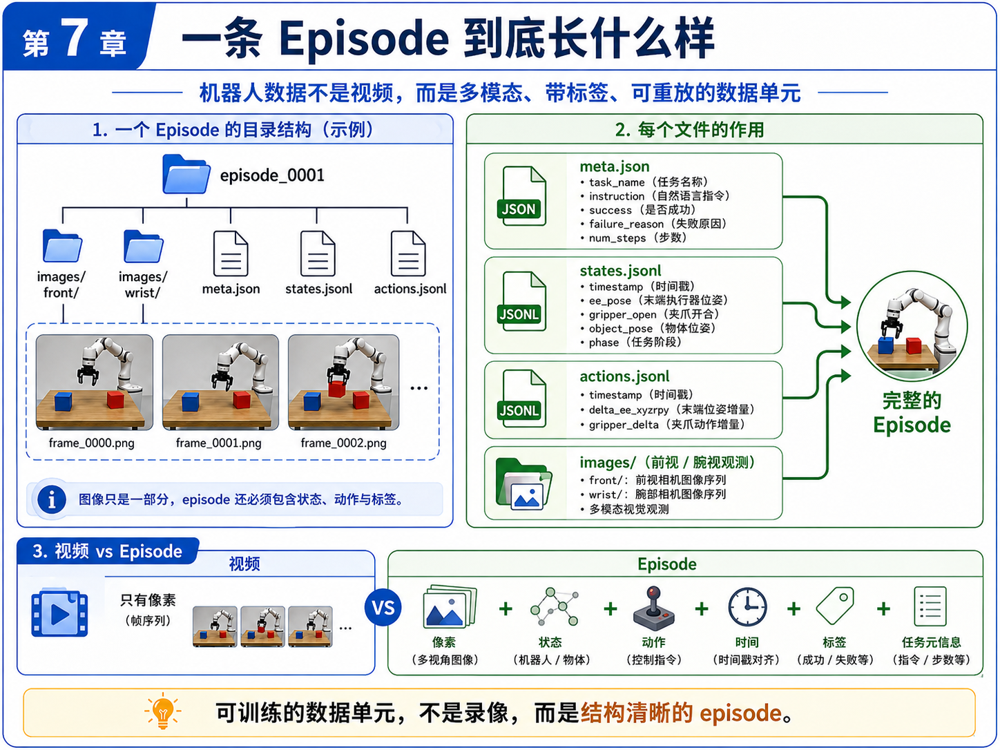
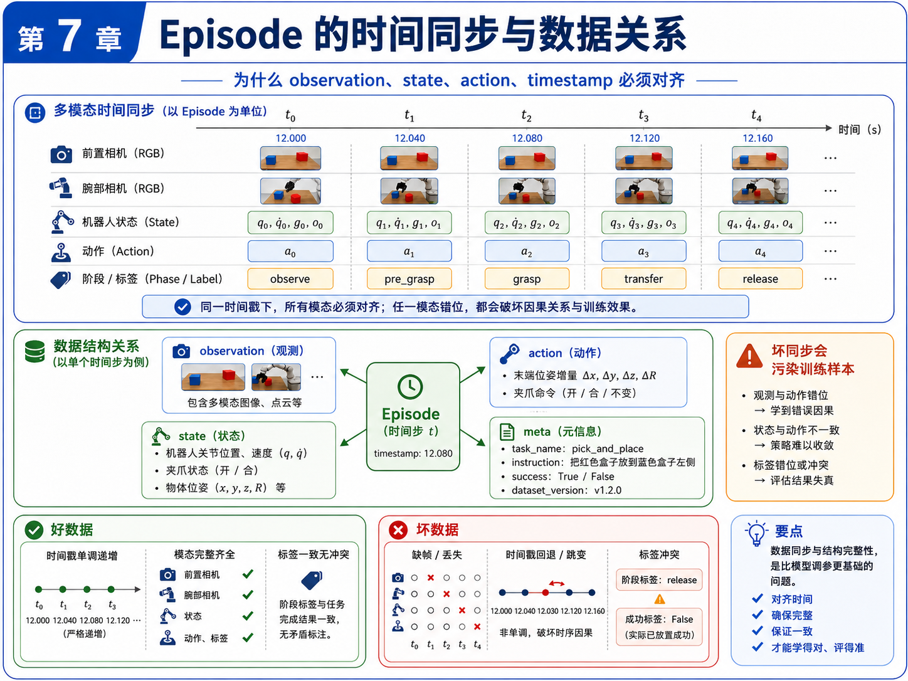
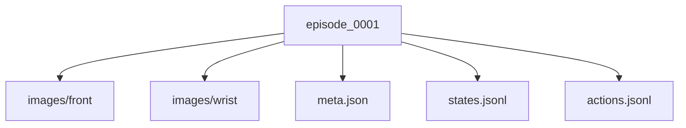
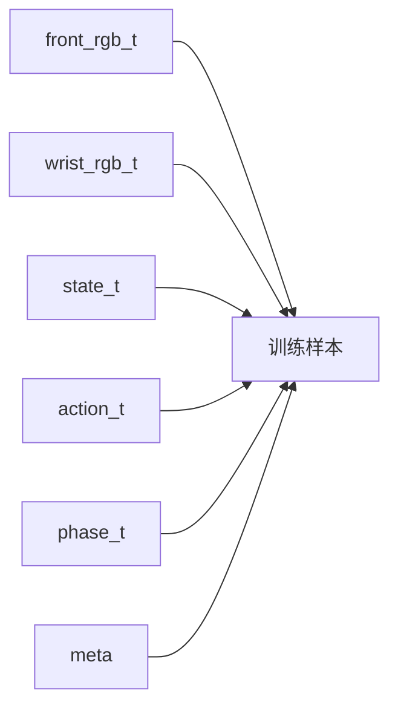

# 第 7 章：机器人数据格式：一条 Episode 到底长什么样

前一章，我们终于把主线任务 `pick_box_to_bin` 正式定义了出来。也就是说，我们已经知道：

- 机器人要做什么；
- 在什么工作空间里做；
- 动作空间是什么；
- 什么算成功；
- 什么算失败；
- 哪些因素会被随机化。

但是，一个正式定义好的任务，仍然还不能直接拿去训练。因为策略训练最终吃的不是“任务说明文档”，而是**数据**。

于是，问题自然推进到了这一章：

> **机器人学习里，一条 Episode 到底长什么样？**

很多初学者会下意识地把机器人数据理解成“视频”。这是一个很常见、但也很危险的误解。视频当然重要，但它只是 observation 的一部分。真正能被训练系统消费的 episode，还必须包含：

- 图像；
- 状态；
- 动作；
- 时间戳；
- 任务元信息；
- success / failure 标签；
- 有时还包括 failure_reason、dataset_version 等。

所以本章要做的，就是把“机器人数据不是视频”这件事彻底讲清楚，并让主线项目第一次拥有真正像样的数据目录结构。

---

## 1. 本章要解决的问题

本章重点解决以下九个问题：

1. 为什么机器人数据不能被简化成一段视频？
2. 一条 episode 最少应该包含哪些文件？
3. `meta.json` 应该记录什么？
4. `states.jsonl` 与 `actions.jsonl` 为什么要分开？
5. 图像应该如何保存？文件夹应如何组织？
6. 为什么 observation、state、action、timestamp 必须同步？
7. success / failure / failure_reason 为什么属于 episode 的一部分？
8. 一条成功 episode 与一条失败 episode 在数据层面应该如何体现？
9. 如何用脚本生成并可视化一个标准 episode 样例？

---

## 2. 为什么这个问题重要

### 2.1 模型学到的不是“录像”，而是带因果结构的样本

对于机器人策略来说，一条训练样本并不是“这一帧画面长什么样”，而是：

- 在时刻 `t`，机器人观察到了什么；
- 自己处于什么状态；
- 任务是什么；
- 然后应该执行什么动作；
- 这个时刻对应哪个 phase；
- 整条 episode 最终是成功还是失败。

如果只有视频而没有动作，那你不知道专家到底做了什么；
如果只有动作而没有状态，那你不知道动作是基于什么条件做出的；
如果没有时间戳，模态之间的因果对应关系就会被破坏。

### 2.2 数据结构比“有没有很多数据”更基础

很多人一开始会问：“我要多少条数据？”

这是一个重要问题，但在它之前还有一个更底层的问题：

> 你的每一条数据到底是不是**结构完整**的训练单元？

如果数据结构都没理清，后面再多数据也只是放大混乱。

### 2.3 自动驾驶经验在这里依然很有帮助

如果你做过自动驾驶数据闭环，会很熟悉这种感觉：

- log 不是单视频，而是多传感器同步；
- 每个时间步都有状态与时间戳；
- 标注、事件、任务上下文都很重要；
- 质量问题常常出在时间同步与字段错位，而不是出在模型本身。

机器人 episode 与自动驾驶 log 在思想上非常接近，只是对象和控制形式不同。

---

## 3. 核心概念

### 3.1 什么是 Episode

在本书中，一个 episode 指的是：

> 从任务开始，到任务结束或中止为止的一段完整、多模态、带标签的时序数据单元。

它至少应该能回答：

- 任务是什么；
- 一共有多少步；
- 每一步看到了什么；
- 每一步机器人处于什么状态；
- 每一步执行了什么动作；
- 最终成功了吗；
- 如果失败了，原因是什么。

### 3.2 为什么“机器人数据不是视频”

视频只是图像帧序列。它能提供视觉观测，但不能完整表达：

- 机器人关节 / 末端状态；
- 夹爪是否闭合；
- 动作命令是什么；
- 当前阶段是 pre_grasp 还是 transfer；
- 该条样本最终是否成功。

所以，机器人数据单元更准确的理解应该是：

```text
Episode = 图像 + 状态 + 动作 + 时间 + 标签 + 任务元信息
```

### 3.3 episode 目录结构

本书建议将一条 episode 设计为目录形式，例如：

```text
episode_0001/
  images/
    front/
      frame_0000.png
      frame_0001.png
      ...
    wrist/
      frame_0000.png
      frame_0001.png
      ...
  meta.json
  states.jsonl
  actions.jsonl
```

这种设计有几个好处：

1. 图像和结构化数据清晰分离；
2. 多视角图像容易扩展；
3. states / actions 的解析更简单；
4. 与后续数据质检、转换脚本兼容性更好。

### 3.4 `meta.json` 的作用

`meta.json` 不是“可有可无的补充文件”，它是整条 episode 的总说明。至少建议记录：

- `episode_id`
- `task_name`
- `instruction`
- `success`
- `failure_reason`
- `num_steps`
- `control_mode`
- `observation_modalities`
- `dataset_version`
- `notes`

换句话说，`meta.json` 更像 episode 的“封面信息”。

### 3.5 `states.jsonl` 与 `actions.jsonl`

为什么不把状态和动作都塞进一个大 JSON 里？

因为从工程上说，分开存储更清晰：

- `states.jsonl` 表示每个时刻世界与机器人“是什么样”；
- `actions.jsonl` 表示每个时刻策略 / 专家“做了什么”；
- `meta.json` 表示整条数据“属于什么任务、最终结果如何”。

这种拆分让后续做：

- 可视化；
- 统计；
- 校验；
- 模型数据加载；
- 失败分析；

都更加方便。

### 3.6 时间同步为什么关键

时间同步的核心不是“看起来整齐”，而是维护因果关系。

在时刻 `t`：

- front camera 图像；
- wrist camera 图像；
- robot state；
- action；
- phase label；

都必须尽可能对应同一个时间点。如果其中一项错位，就可能出现：

- 图像还是接近物体阶段，但 action 已经是 release；
- 状态显示夹爪已闭合，但动作还是 open；
- 标签写的是 success，但真实上物体还没进收纳盒。

这种错位会直接污染训练样本。

### 3.7 成功 episode 与失败 episode

很多初学者只愿意保存成功 episode，觉得失败没价值。其实这是一个很大的损失。

失败 episode 至少有两大价值：

1. 帮你诊断系统问题；
2. 帮你更准确地构造 success / failure 分布。

因此，本章升级后的数据生成脚本会同时生成：

- `episode_0001`：成功样本；
- `episode_0002`：失败样本（`drop_during_transfer`）。

这会让你更清楚地看到 `failure_reason` 在数据结构中的位置。

---

## 4. 概念图 / 流程图 / 架构图

### 4.1 图 7-1 一条 Episode 的目录结构



这张图直观地说明：episode 不是单一视频文件，而是一个小型数据包，包含图像目录和结构化文件。

### 4.2 图 7-2 Episode 的时间同步与数据关系



这张图非常关键，因为它解释了为什么 observation、state、action 与 timestamp 必须对齐。它也是后面“数据质检”章节的重要铺垫。

### 4.3 Mermaid 图：episode 目录结构



### 4.4 Mermaid 图：单时间步样本关系



---

## 5. 工程化理解

### 5.1 为什么使用 JSONL

本书建议用 JSONL 存 states / actions，而不是一个超长 JSON 数组。原因是：

- 逐行读取更方便；
- 更适合流式处理；
- 更便于调试与 diff；
- 与很多日志系统习惯一致。

### 5.2 为什么图像按帧保存

在学习阶段，把图像序列保存成独立帧文件而不是压成视频，有几个好处：

- 调试简单；
- 更容易检查缺帧；
- 更容易与 timestamp 对应；
- 后续做数据质检和示例展示更方便。

当然，真实大规模系统中也可以使用更高效的打包格式，但本书当前阶段优先强调“结构清晰与可理解”。

### 5.3 为什么失败原因值得写进 `meta.json`

失败不是一个布尔值就能解释完的。至少在工程诊断中，我们通常还想知道：

- 是 drop_during_transfer？
- 是 timeout？
- 是 out_of_workspace？
- 还是 self_collision？

因此，本章建议把 `failure_reason` 也写入元信息中，这对后面数据质检和评测分析都很重要。

---

## 6. 主线项目中的位置

本章对主线项目的推进非常关键。新增 / 升级内容包括：

```text
robot-learning-shelf-demo/
  datasets/
    dataset_v0_sample/
      episode_0001/
      episode_0002/
  scripts/
    01_generate_synthetic_episode.py
    02_visualize_episode.py
```

也就是说，主线项目现在第一次具备：

1. 标准 episode 目录结构；
2. 前视 / 腕视图像序列；
3. states / actions / meta 三类结构化数据；
4. 成功与失败样本；
5. episode 完整性检查与可视化能力。

---

## 7. 示例

### 7.1 示例 1：`meta.json`

一个典型的 `meta.json` 可能包含：

```json
{
  "episode_id": "episode_0001",
  "task_name": "pick_box_to_bin",
  "instruction": "把红色盒子放进右边收纳盒。",
  "success": true,
  "failure_reason": null,
  "num_steps": 7,
  "dataset_version": "v0.2"
}
```

### 7.2 示例 2：`states.jsonl`

每一行对应一个时间步，记录：

- `timestamp`
- `ee_pose_xyzrpy`
- `gripper_open`
- `object_pose_xyz`
- `bin_pose_xyz`
- `phase`

例如 `phase` 可以依次是：

```text
reset -> observe -> pre_grasp -> approach -> grasp -> transfer -> release
```

### 7.3 示例 3：`actions.jsonl`

每一行记录该时间步的动作：

- `delta_ee_xyzrpy`
- `gripper_delta`
- `comment`

这使得你在看数据时，能够同时知道：

- 当时机器人看到了什么；
- 它处于什么状态；
- 它执行了什么动作；
- 以及动作背后的语义意图。

### 7.4 示例 4：成功与失败对比

`episode_0001`：成功样本。物体被抓起，转移到收纳盒，并最终释放成功。

`episode_0002`：失败样本。物体在 transfer 阶段发生掉落，`success=false`，并记录 `failure_reason=drop_during_transfer`。

这类失败样本在后续数据质检和评测分析中非常有价值。

---

## 8. 练习代码

### 8.1 生成 synthetic episode

脚本：`scripts/01_generate_synthetic_episode.py`

推荐运行：

```bash
cd robot-learning-shelf-demo
python scripts/01_generate_synthetic_episode.py
```

该脚本会生成两个 episode：

- `episode_0001`（成功）
- `episode_0002`（失败）

并自动创建：

- `images/front/*.png`
- `images/wrist/*.png`
- `meta.json`
- `states.jsonl`
- `actions.jsonl`

### 8.2 可视化与完整性检查

脚本：`scripts/02_visualize_episode.py`

推荐运行：

```bash
python scripts/02_visualize_episode.py \
  --episode_dir datasets/dataset_v0_sample/episode_0001 \
  --save_plot reports/ch07_episode_0001_action_timeline.png \
  --save_summary reports/ch07_episode_0001_summary.md
```

它会做三件事：

1. 打印 episode 摘要；
2. 检查图像数量、时间戳和步数是否一致；
3. 生成 action 时间曲线与 Markdown 摘要。

---

## 9. 代码解释

### 9.1 `01_generate_synthetic_episode.py`

升级后的脚本有两个核心改动：

第一，增加了图像帧生成。也就是说，episode 不再只有结构化 JSON / JSONL，而是真正带有 front / wrist 观测。

第二，增加了失败样本生成。这样读者就不再只看到“完美数据”，而是能更直观地理解 `failure_reason` 的作用。

### 9.2 `02_visualize_episode.py`

这个脚本主要帮助读者完成三件事：

- 读取一条 episode；
- 生成人类可读的摘要；
- 执行最小完整性检查。

它体现了一个很重要的工程原则：

> 数据格式一旦设计出来，就要尽快配套“看数据”和“查数据”的工具。

否则你会陷入“虽然有数据，但不知道数据到底是不是好的”的状态。

### 9.3 为什么完整性检查是必要的

本章虽然还没有正式进入“数据质检”，但已经先做了最小版检查，例如：

- states 数量是否等于 num_steps；
- actions 数量是否等于 num_steps；
- front / wrist 图像数量是否匹配；
- timestamps 是否单调；
- state timestamps 与 action timestamps 是否一致。

这些检查会直接成为下一章数据质检工作的前置基础。

---

## 10. 常见错误

### 错误 1：把视频当成全部数据

视频只是 observation 的一部分，不是完整训练样本。

### 错误 2：不保存动作或状态

没有动作，模仿学习无法训练；没有状态，动作的上下文会丢失。

### 错误 3：时间戳不对齐

时间错位会破坏 observation → action 的因果对应，属于非常隐蔽但严重的问题。

### 错误 4：只保留成功样本

失败样本对诊断和分布理解同样重要，不能被简单丢弃。

### 错误 5：没有元信息字段

如果没有 `task_name`、`instruction`、`success`、`dataset_version` 等元信息，后面数据管理会迅速失控。

---

## 11. 本章练习

### 练习 1：基础练习

请用自己的语言解释：为什么“机器人数据不是视频”？

### 练习 2：工程练习

在 `states.jsonl` 中增加一个字段 `gripper_width_mm`，并同步修改生成脚本。

### 练习 3：工程练习

在 `meta.json` 中增加 `session_id` 字段，并说明它对数据管理的作用。

### 练习 4：进阶练习

给 `02_visualize_episode.py` 增加一个检查：如果 `success=true` 但 `failure_reason` 非空，则报告冲突。

### 练习 5：思考练习

如果 action 存的是绝对位姿，而不是相对增量，会对：

- 数据分布；
- 模型学习难度；
- 跨场景泛化；
- rollout 稳定性；

分别带来什么影响？

---

## 12. 本章产出

本章应当产出：

1. 标准 episode 目录结构；
2. 两条示例 episode（成功 + 失败）；
3. 支持生成 RGB 图像的 synthetic data 脚本；
4. 一个可视化与完整性检查脚本；
5. 对“多模态 + 时间同步 + 结构化标签”这一机器人数据观的稳定理解。

---

## 13. 小结

这一章最重要的结论是：

> **机器人学习的数据单元，不是录像，而是结构完整、带时间对齐关系的 episode。**

一个真正可训练的 episode 至少要同时包含：

- 图像；
- 状态；
- 动作；
- 时间戳；
- 标签；
- 任务元信息。

而且，这些部分必须尽可能对齐。

从主线项目角度看，本章完成了一个非常重要的里程碑：它把前一章的任务定义真正落成了数据结构。下一章，我们就会顺势进入一个非常现实的问题：

既然数据格式已经有了，那么**如何检查这些数据是不是好的？**
