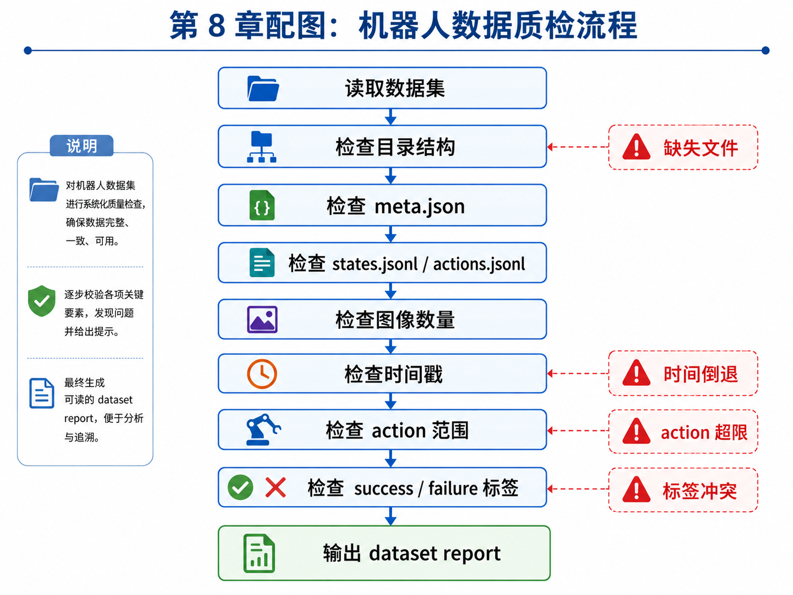
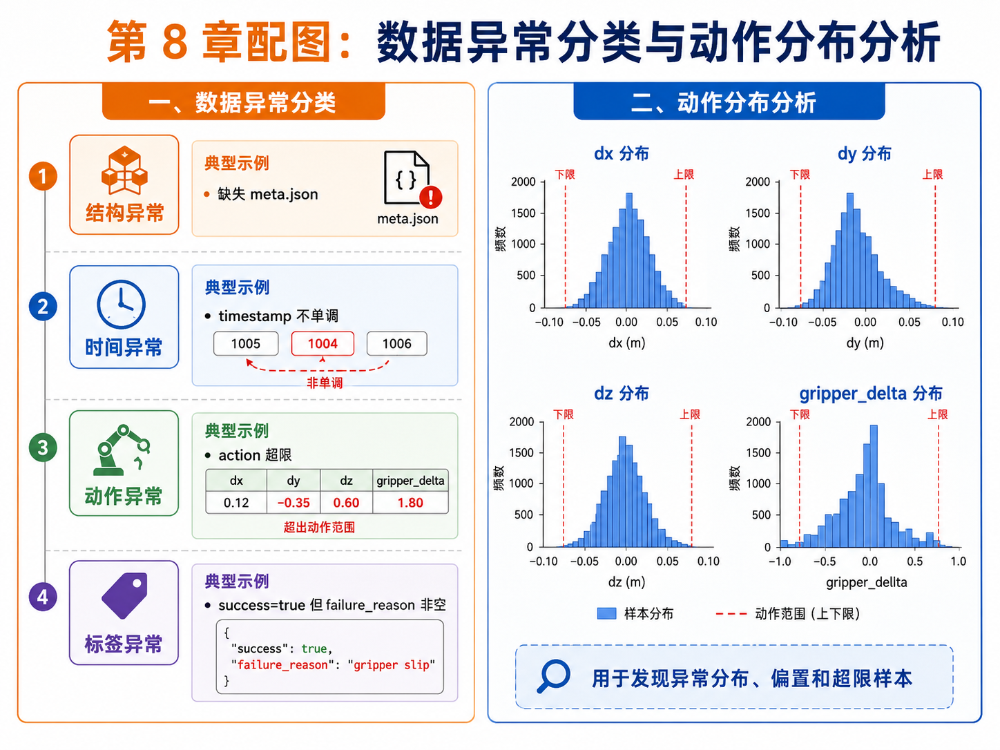
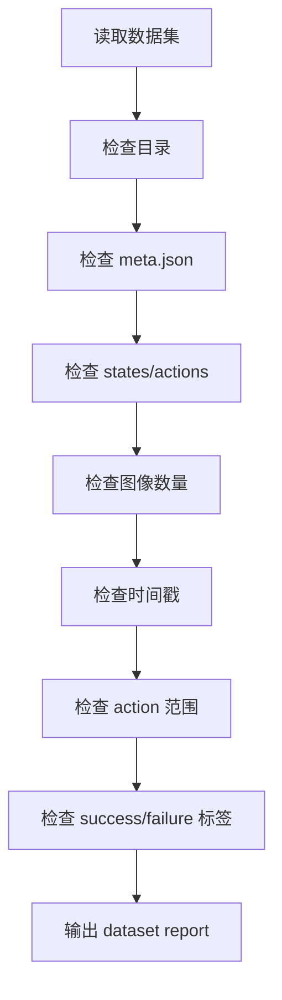
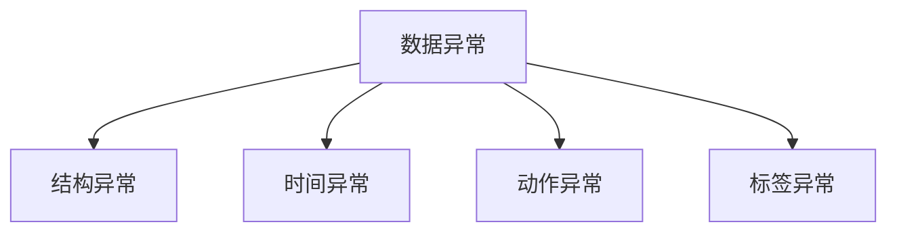

# 第 8 章：数据质检与可视化

前一章我们已经把主线任务 `pick_box_to_bin` 变成了一个正式的 episode 数据结构。到这里，很多初学者会自然地把注意力转向模型：是不是该训练更大的网络？是不是该把 ACT、Diffusion Policy、VLA 全都试一遍？

这当然是后面的方向，但如果现在立刻进入模型调参，通常会走上一条非常低效的路。因为在具身智能项目里，**坏数据往往比小数据更危险**。数据量少，你至少还能慢慢补；但如果数据结构错了、时间戳乱了、标签冲突了、动作越界了，那么你后面训练出来的任何结果都可能建立在错误基础上。

所以，本章的目标非常明确：不讲模型调参，而是讲**数据质检**。我们要把“会采集数据”推进到“会检查数据是否能用”。这一步，是从 demo 式学习转向工程式学习的关键拐点。

本章将围绕以下内容展开：

- 为什么数据质检比模型调参更基础；
- 如何检查 episode 文件完整性；
- 如何检查时间戳、图像数与状态序列是否一致；
- 如何检查动作范围；
- 如何检查 success / failure 标签冲突；
- 如何输出一份可读的 dataset report；
- 如何用动作分布图快速发现异常样本与偏置。

换句话说，本章会让主线项目第一次拥有“数据自查能力”。

---

## 1. 本章要解决的问题

本章重点解决以下问题：

1. 为什么机器人学习里要把数据质检放在模型训练之前？
2. 一个 episode 最常见的数据错误有哪些？
3. 如何检查目录结构与关键文件缺失？
4. 如何检查 `meta.json` 与 `states/actions` 是否一致？
5. 如何检查 timestamp 是否单调、是否对齐？
6. 如何检查动作是否超过任务定义的范围？
7. 如何识别 `success=true` 但 `failure_reason` 非空这类标签冲突？
8. 如何做动作分布统计，并从分布图中发现异常？
9. 如何自动生成 `dataset_report`？

这些问题看似“工程细节”，实际上决定了你后面做任何训练时，究竟是在学习规律，还是在学习噪声与错误。

---

## 2. 为什么这个问题重要

### 2.1 坏数据会污染整个训练闭环

如果一条 episode 的时间戳错位，那么 observation 与 action 的因果关系就被破坏；如果 success 标签错了，那么模型会被鼓励学错行为；如果 action 越界但没被发现，rollout 失败后你甚至不知道问题出在策略，还是出在数据质量。

因此，从工程角度看：

- 数据采集解决“有没有数据”；
- 数据质检解决“这些数据是不是可信”；
- 模型训练才是在可信数据上“能不能学会”。

顺序不能反。

### 2.2 自动驾驶经验在这里尤其有帮助

如果你做过自动驾驶数据闭环，会非常熟悉这种感觉：很多时候模型问题的根源并不在模型，而在数据链路，例如：

- 某个 topic 掉帧；
- 时间戳回退；
- 标注字段缺失；
- 日志切片边界错误；
- train / val 泄漏。

机器人学习的数据问题与之非常相似。区别只是在于：机器人数据多了一条更强的 action 链路，因此动作越界、success/failure 冲突这些问题会更加致命。

### 2.3 为什么动作分布可视化很重要

光靠人工逐条看 JSON 文件效率太低。工程里经常采用“统计 + 可视化”的方式快速做第一轮筛查。例如：

- `dx / dy / dz` 的分布是否偏得离谱；
- `gripper_delta` 是否大多数都卡在极端值；
- 是否有明显超出动作上限的长尾样本；
- 是否某个动作维度几乎不变，暗示数据采集覆盖不足。

这也是为什么本章不仅写验证脚本，还会增加 `action distribution` 分析能力。

---

## 3. 核心概念

### 3.1 数据质检不是“挑毛病”，而是建立信任

所谓数据质检，并不是为了让流程变复杂，而是为了让后面所有分析结果值得信任。它至少包括三层：

1. **结构完整性检查**：目录、文件、字段是否齐全；
2. **时序一致性检查**：states、actions、images 与 timestamp 是否对应；
3. **语义合理性检查**：success/failure 是否冲突，action 是否越界。

只有这三层都过了，数据才具备“可训练、可评估、可追溯”的基础属性。

### 3.2 episode 最常见的四类异常

本书建议把常见异常至少分成四类：

1. **结构异常**：例如缺失 `meta.json`、缺失 `actions.jsonl`、图像目录缺失；
2. **时间异常**：timestamp 不单调，state / action 时间不一致；
3. **动作异常**：`dx/dy/dz` 或 `gripper_delta` 超限；
4. **标签异常**：`success=true` 但 `failure_reason` 非空，或 `success=false` 却没有失败原因。

这样的分类非常实用，因为它能帮助你在 report 中快速定位问题归因。

### 3.3 为什么要把动作范围写成显式规则

如果你没有显式动作范围，数据验证就很难做。对于当前主线项目，动作空间是：

- `dx, dy, dz`：建议在 `[-0.20, 0.20]` 米范围内；
- `gripper_delta`：建议在 `[-1.0, 1.0]` 范围内。

有了这些边界，我们就能自动判断哪些样本“超出合理控制范围”。这也是任务定义与数据质检之间的直接衔接：**任务定义中的 action space，最终要服务于数据检查与训练约束。**

### 3.4 dataset report 的价值

很多团队做到最后，问题不是“没有数据”，而是“不知道现有数据到底是什么样”。

一份基本的 dataset report 至少应该告诉你：

- 一共有多少条 episode；
- 多少条通过检查，多少条失败；
- 失败类型主要分布在哪；
- 动作分布大致怎样；
- 是否存在明显的异常或偏置。

从工程组织的角度看，这份报告是数据团队、算法团队和评测团队之间的共同语言。

---

## 4. 概念图 / 流程图 / 架构图

### 4.1 图 8-1 机器人数据质检流程



这张图展示了一个非常实用的最小数据质检流水线：从读取数据集开始，逐步检查目录结构、`meta.json`、`states/actions`、图像数量、时间戳、动作范围和 success/failure 标签，最后输出 `dataset report`。它也是本章脚本 `04_validate_dataset.py` 的结构蓝图。

### 4.2 图 8-2 数据异常分类与动作分布分析



这张图强调两个重点：

- 左半部分是异常分类框架；
- 右半部分是动作分布分析示意。

也就是说，数据质检不仅要能“找出坏样本”，还要能“看出整体分布是否合理”。

### 4.3 Mermaid 图：数据验证流水线



### 4.4 Mermaid 图：异常分类框架



---

## 5. 工程化理解

### 5.1 先有验证脚本，再谈大规模采集

很多新手会在数据量还很小时忽视验证脚本，觉得“以后再写”。但工程经验恰恰相反：**数据量越小越应该尽快把验证链路搭起来**。因为你越早检查，就越早能发现问题、修正采集规范，避免把错误模式成批复制出去。

### 5.2 为什么要保留坏样本目录

本章主线项目不仅验证 `dataset_v0_sample`，还额外构造了：

- `episode_bad_missing_meta`
- `episode_bad_timestamp`
- `episode_bad_action_range`
- `episode_bad_label_conflict`

这些“故意造坏”的样本非常有教学价值。它们能帮助你从“抽象地知道数据会出错”，走向“具体地知道脚本应该怎样抓住错误”。

### 5.3 质检脚本不需要一步到位

`04_validate_dataset.py` 是一个最小但完整的版本。它没有覆盖所有真实系统问题，但已经能检查：

- 目录 / 文件缺失；
- 图像数量不匹配；
- timestamp 非单调；
- state / action 时间戳不一致；
- action 越界；
- success / failure 标签冲突。

对入门阶段来说，这已经足够建立正确的数据工程意识。

---

## 6. 主线项目中的位置

本章为主线项目新增：

```text
robot-learning-shelf-demo/
  scripts/
    04_validate_dataset.py
  notebooks/
    02_action_distribution_analysis.ipynb
  datasets/
    dataset_v0_bad_examples/
  reports/
    ch08_dataset_v0_sample_report.json
    ch08_dataset_v0_sample_report.md
    ch08_dataset_v0_sample_action_distribution.png
    ch08_dataset_v0_bad_examples_report.json
    ch08_dataset_v0_bad_examples_report.md
    ch08_dataset_v0_bad_examples_action_distribution.png
```

这意味着主线项目现在第一次具备了：

- 数据完整性检查能力；
- 异常样本自动识别能力；
- 动作分布统计能力；
- dataset report 产出能力。

从系统演进上看，这一章相当于为后续 ROS2 录制、rosbag 转换和更大规模数据集建设打下了数据卫生基础。

---

## 7. 示例

### 7.1 示例 1：缺失 `meta.json`

如果某条 episode 缺失 `meta.json`，那么你至少会失去：

- `episode_id`
- `task_name`
- `success`
- `failure_reason`
- `num_steps`

这不仅会让数据解析困难，还会让标签统计与版本追踪失效。因此，这类错误通常应直接标为 `issue`，而不是轻量 warning。

### 7.2 示例 2：timestamp 倒退

假设某条 states 序列原本是：

```text
1005 -> 1006 -> 1007
```

结果中间被写成：

```text
1005 -> 1004 -> 1006
```

那么时序关系就被破坏了。训练时，模型会看到“时间在倒流”的样本，这显然不合理。因此，timestamp 单调性检查是基础中的基础。

### 7.3 示例 3：action 超限

如果某步动作中：

```text
dx = 0.25
gripper_delta = 1.60
```

而我们设定的上限分别是 `0.20` 和 `1.0`，那么它就属于典型越界样本。越界动作可能来自：

- 采集器 bug；
- 坐标单位混乱；
- 控制接口改动未同步；
- 人为写入错误。

### 7.4 示例 4：标签冲突

如果某条 `meta.json` 中写着：

```json
{
  "success": true,
  "failure_reason": "drop_during_transfer"
}
```

那么这条样本就存在明显逻辑冲突。对于学习系统来说，这种标签比“纯粹缺失”更危险，因为它看起来“格式正确”，但语义是错的。

---

## 8. 练习代码

### 8.1 核心脚本：`04_validate_dataset.py`

推荐运行：

```bash
cd robot-learning-shelf-demo
python scripts/04_validate_dataset.py   --dataset_dir datasets/dataset_v0_sample   --output_json reports/ch08_dataset_v0_sample_report.json   --output_md reports/ch08_dataset_v0_sample_report.md   --plot_path reports/ch08_dataset_v0_sample_action_distribution.png
```

如果你想检查坏样本目录：

```bash
python scripts/04_validate_dataset.py   --dataset_dir datasets/dataset_v0_bad_examples   --output_json reports/ch08_dataset_v0_bad_examples_report.json   --output_md reports/ch08_dataset_v0_bad_examples_report.md   --plot_path reports/ch08_dataset_v0_bad_examples_action_distribution.png
```

### 8.2 Notebook：动作分布分析

本章还新增：

```text
notebooks/02_action_distribution_analysis.ipynb
```

它展示了如何读取 `actions.jsonl`，并绘制 `dx / dy / dz / gripper_delta` 的分布直方图。这是理解数据覆盖范围和偏置最直观的方式之一。

---

## 9. 代码解释

### 9.1 为什么把检查拆成 episode 级别

`04_validate_dataset.py` 不是直接从“整个数据集”入手，而是先逐条检查 episode，再汇总成 dataset report。这样做的好处是：

- 便于定位问题在哪一条 episode；
- 便于做 failure case 统计；
- 便于未来做并行验证与分布式质检。

### 9.2 为什么 report 同时输出 JSON 和 Markdown

- JSON 便于后续程序消费；
- Markdown 便于人类阅读、审查和留档。

这体现了一个很重要的工程意识：**报告既要能给代码看，也要能给人看。**

### 9.3 为什么动作分布图不只是“好看”

动作分布图最有价值的地方在于：它可以快速暴露隐藏的偏置。例如：

- `dx` 几乎都在正方向，说明采集动作不够多样；
- `gripper_delta` 极度集中在 0，说明抓取开合动作样本太少；
- 某个维度有很长的超限尾部，说明数据中混入异常样本。

因此，可视化不是装饰，而是快速诊断工具。

---

## 10. 常见错误

### 错误 1：急着调模型，不先看数据

这是具身智能入门里最常见的低效行为。

### 错误 2：只看单条样本，不看整体分布

逐条抽查能发现局部问题，但无法发现全局偏置。

### 错误 3：只查格式，不查语义

数据字段都在，不代表标签就一定合理。

### 错误 4：发现坏样本后没有保留案例库

构造一批坏样本目录对提升验证脚本能力非常有帮助。

### 错误 5：report 只在命令行打印，不落盘

不落盘就不利于后续复盘和跨团队沟通。

---

## 11. 本章练习

1. 人为再制造 3 个坏 episode，让验证脚本识别；
2. 增加动作上限配置，使其从 YAML 读取；
3. 统计每个动作维度的均值、方差和 95% 分位数；
4. 增加 train / val split 泄漏检查；
5. 思考：为什么坏数据比小数据更危险？

---

## 12. 本章产出

本章应当产出：

1. 一个最小但完整的数据验证脚本；
2. 一批可复用的坏样本案例；
3. 数据集 Markdown / JSON 报告；
4. 动作分布可视化图；
5. 对“先做数据卫生，再做模型训练”的稳定工程意识。

---

## 13. 小结

这一章最重要的结论可以概括成一句话：

> **在具身智能项目里，数据质量往往比模型复杂度更先决定上限。**

如果数据结构错了、时间乱了、动作越界了、标签冲突了，那么你后面做再多训练都只是在放大问题。相反，只要你先建立起一套最小数据质检链路，哪怕数据量还不大，也能在一个健康的基础上持续迭代。

下一章，我们就顺着这个思路进入真实机器人系统的基础设施：既然数据要被可靠采集、同步和记录，那么在机器人世界里，最重要的通信中间层是什么？答案就是 **ROS2**。
