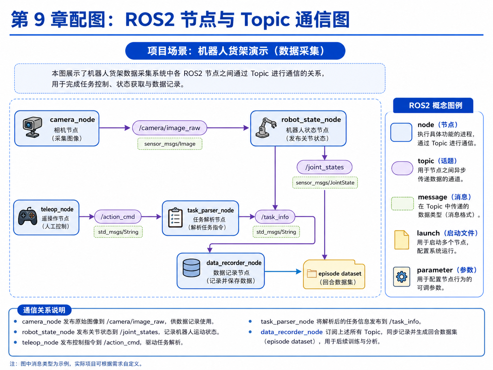
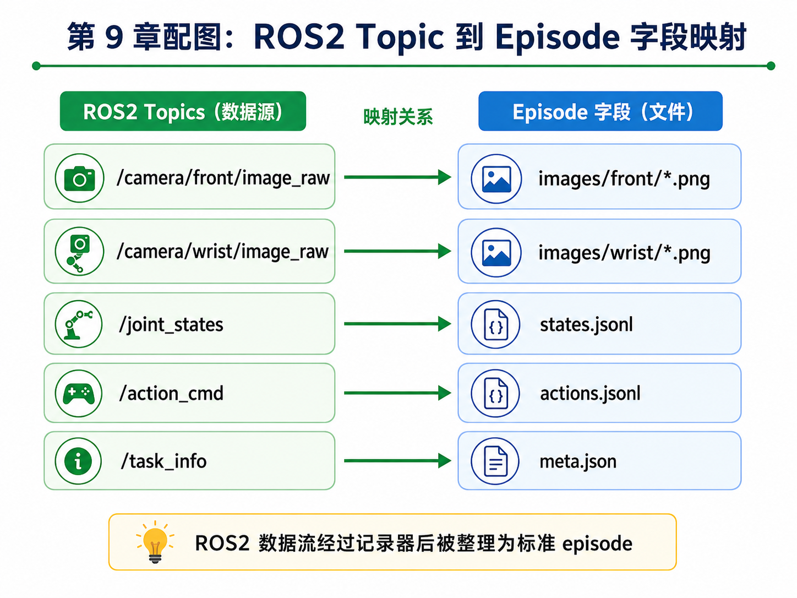
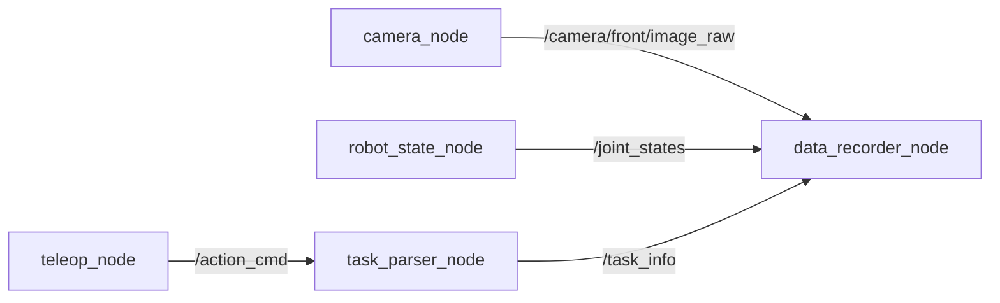
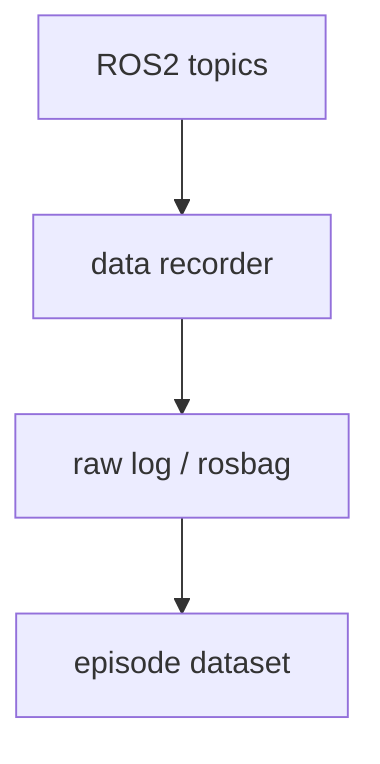

# 第 9 章：ROS2 最小知识体系：为数据采集服务

前一章我们已经知道，机器人学习的数据不能只会“生成”，还必须会“检查”。但当你真正从离线 toy 数据走向真实机器人系统时，很快就会碰到一个更现实的问题：这些图像、关节状态、动作命令、任务信息，究竟是通过什么方式在系统里流动的？

对于大多数现代机器人系统来说，这个答案就是 **ROS2**。不过，本章并不是一本完整的 ROS2 教程。我们的目标更聚焦：只讲那些**为了数据采集与主线项目推进必须掌握的最小 ROS2 知识体系**。

也就是说，我们关心 ROS2，不是为了背概念，而是为了回答这些问题：

- 什么是 node、topic、message？
- 相机图像、关节状态、动作命令应该分别挂在哪些 topic 上？
- 数据记录节点应该订阅哪些流？
- 主线项目从 ROS2 数据流到 episode 数据结构之间是什么关系？

如果说第 8 章解决的是“数据进来后怎么检查”，那么本章解决的就是“数据在系统里是怎么流过来的”。

---

## 1. 本章要解决的问题

本章重点解决以下问题：

1. 什么是 node、topic、message、service、action、launch、parameter？
2. 为什么 ROS2 是机器人数据采集的重要中间层？
3. 主线项目中哪些信息适合放在 topic 上？
4. 相机、关节状态、动作命令、任务解析节点之间如何通信？
5. 数据记录节点在整体系统中扮演什么角色？
6. ROS2 topic 与 episode 字段之间应该如何映射？
7. 为什么时间戳在 ROS2 里同样关键？
8. 如何用最小 pub/sub 示例理解数据流？
9. 在没有 ROS2 运行环境时，如何用纯 Python 模拟这个过程？

---

## 2. 为什么这个问题重要

### 2.1 机器人系统本质上是分布式数据流系统

对于初学者来说，机器人很容易被误解成“一个程序控制一个机械臂”。但工程上，真实机器人系统通常由很多节点组成：

- 相机节点负责采图；
- 状态节点负责发布关节与末端状态；
- 任务解析节点负责解释任务指令；
- 控制节点负责发动作命令；
- 数据记录节点负责把多条数据流统一记录下来。

所以，从系统角度看，机器人更像一个**分布式、异步、多模态数据流系统**。ROS2 的价值就在于为这些模块提供了统一通信基础设施。

### 2.2 只会离线数据，不理解在线数据流，工程就接不上

前面几章我们使用的是离线生成的 episode，这对学习核心概念很有帮助。但如果你不理解数据在线是如何产生的，就很难继续推进：

- 不知道相机图像从哪里来；
- 不知道动作命令怎么广播给执行器；
- 不知道 recorder 为什么要订阅多个 topic；
- 不知道后续 rosbag 是怎么记录这些流的。

所以，本章是连接“离线学习世界”和“真实机器人系统世界”的桥梁。

### 2.3 ROS2 对自动驾驶工程师也并不陌生

如果你有自动驾驶背景，可以把 ROS2 topic 类比为：

- 一类轻量级、异步的消息总线；
- 类似各模块之间发布 / 订阅的实时数据流；
- 在概念上有点像多 topic 的车端 log 流。

当然，ROS2 还有更丰富的生态和节点管理能力，但从主线项目角度，这个类比足以帮助你快速建立直觉。

---

## 3. 核心概念

### 3.1 node：执行具体功能的进程

ROS2 中最重要的基本单元之一是 **node**。你可以把它理解为一个执行具体职责的进程或模块。例如：

- `camera_node`：采集相机图像；
- `robot_state_node`：发布机器人关节状态；
- `teleop_node`：接收人工控制并发布动作指令；
- `task_parser_node`：解析任务输入；
- `data_recorder_node`：订阅多个 topic 并保存数据。

也就是说，node 回答的是：**是谁在干这件事？**

### 3.2 topic：节点之间异步传递数据的通道

topic 是 ROS2 中最常用的通信方式之一。它适合多对多、异步的数据分发。比如：

- `/camera/front/image_raw`：前视相机图像；
- `/camera/wrist/image_raw`：腕部相机图像；
- `/joint_states`：关节状态；
- `/action_cmd`：动作命令；
- `/task_info`：任务解析结果。

topic 回答的是：**数据通过哪条通道传递？**

### 3.3 message：在 topic 中传递的数据格式

仅有 topic 名称还不够，还要知道“上面流动的数据长什么样”。这就是 message 的角色。例如：

- 图像用 `sensor_msgs/Image`；
- 关节状态用 `sensor_msgs/JointState`；
- 简单字符串命令可用 `std_msgs/String`；
- 任务信息则可以定义自定义消息 `TaskInfo.msg`。

在主线项目中，我们新增了：

```text
ros2_ws/src/shelf_demo_msgs/msg/TaskInfo.msg
```

它用于承载解析后的任务信息，例如 instruction、task_name、target_object、target_container。

### 3.4 service、action、launch、parameter 的最小理解

虽然本章重点是 topic，但还需要知道其他几个 ROS2 概念：

- **service**：更像一次请求 / 响应，适合短事务；
- **action**：适合需要反馈和可中断的长任务；
- **launch**：用于同时启动多个 node；
- **parameter**：用于配置 node 行为。

在主线项目当前阶段，topic 是最核心的；但从系统视角，你至少要知道这些概念的位置。

### 3.5 数据记录节点为什么重要

在具身学习项目里，`data_recorder_node` 往往是一个非常关键但容易被忽视的模块。它负责：

- 订阅多条 topic；
- 记录时间戳；
- 对齐不同模态；
- 最终将在线数据整理成 episode 或 rosbag 的基础材料。

所以 recorder 可以被看作连接“在线机器人系统”和“离线训练数据”的桥梁。

---

## 4. 概念图 / 流程图 / 架构图

### 4.1 图 9-1 ROS2 节点与 Topic 通信图



这张图展示了主线项目中的最小通信骨架：

- `camera_node` 发布图像；
- `robot_state_node` 发布关节状态；
- `teleop_node` 发布动作命令；
- `task_parser_node` 解析任务并发布 `/task_info`；
- `data_recorder_node` 订阅这些数据并输出 episode dataset。

### 4.2 图 9-2 ROS2 Topic 到 Episode 字段映射



这张图非常关键，因为它直接把 ROS2 数据流和前面几章定义的 episode 结构连接了起来：

- 相机 topic → `images/*.png`
- `/joint_states` → `states.jsonl`
- `/action_cmd` → `actions.jsonl`
- `/task_info` → `meta.json`

也就是说，它让“在线 topic 世界”和“离线 episode 世界”形成了明确映射关系。

### 4.3 Mermaid 图：最小 pub/sub 关系



### 4.4 Mermaid 图：ROS2 到 episode 的桥接



---

## 5. 工程化理解

### 5.1 topic 命名不是小事

主线项目中推荐的 topic 命名要尽量做到：

- 语义清楚；
- 层次一致；
- 便于扩展。

例如：

- `/camera/front/image_raw`
- `/camera/wrist/image_raw`
- `/joint_states`
- `/action_cmd`
- `/task_info`

好的命名会直接降低后面 recorder 配置和 rosbag 记录时的心智成本。

### 5.2 为什么要先画通信图

当系统中节点多起来后，如果不先画通信图，很容易出现：

- 某个 topic 重复发布；
- recorder 忘订阅关键 topic；
- 某条 topic 的 message 类型选错；
- 某些数据需要 service / action，但你误用了 topic。

所以，通信图本身就是一种系统设计工具。

### 5.3 没有 ROS2 环境时如何学习

很多读者此时并没有完整 ROS2 环境。如果因为环境门槛过高而停住，就很可惜。因此，本章在主线项目中新增了一个**纯 Python 的 mock pub/sub demo**，让你先理解信息流，而不是先被环境细节拦住。

---

## 6. 主线项目中的位置

本章为主线项目新增：

```text
robot-learning-shelf-demo/
  ros2_ws/src/
    shelf_demo_msgs/
      msg/TaskInfo.msg
    shelf_demo_data_recorder/
      mock_ros2_pubsub_demo.py
      launch/shelf_demo_record.launch.py
  reports/
    ch09_mock_ros2_demo.json
```

这些新增内容的作用是：

- 建立主线项目的最小 ROS2 topic 设计；
- 提供自定义消息示例；
- 提供 recorder 的教学版 mock demo；
- 为下一章 rosbag 记录与转换做准备。

---

## 7. 示例

### 7.1 示例 1：前视相机 topic

```text
/camera/front/image_raw
sensor_msgs/Image
```

该 topic 用于传输前视 RGB 图像，是数据采集中的主要视觉观测源之一。最终它会对应到 episode 的 `images/front/*.png`。

### 7.2 示例 2：关节状态 topic

```text
/joint_states
sensor_msgs/JointState
```

这条 topic 用于描述机器人当前的关节状态。对于主线项目，我们在教学版数据中更关心的是：末端位姿、夹爪状态、phase 等结构化信息。它们最终会被整理进 `states.jsonl`。

### 7.3 示例 3：动作命令 topic

```text
/action_cmd
std_msgs/String 或自定义消息
```

在真实系统中，动作命令可能会更结构化；但在本章教学阶段，我们先用简化形式建立直觉：动作命令同样是系统中非常关键的一条数据流，它最终会映射到 `actions.jsonl`。

### 7.4 示例 4：任务解析 topic

任务指令可能来自人、来自上层规划器，也可能来自语言解析模块。经过 `task_parser_node` 处理后，形成 `/task_info`，最终进入 `meta.json` 或 episode 级元信息。

---

## 8. 练习代码

### 8.1 自定义消息示例

本章新增：

```text
ros2_ws/src/shelf_demo_msgs/msg/TaskInfo.msg
```

内容示例：

```text
string instruction
string task_name
string target_object
string target_container
```

### 8.2 最小 pub/sub 教学示例

运行方式：

```bash
cd robot-learning-shelf-demo
python ros2_ws/src/shelf_demo_data_recorder/mock_ros2_pubsub_demo.py   --output_json reports/ch09_mock_ros2_demo.json
```

它不会依赖真实 ROS2 运行环境，而是用纯 Python 模拟：

- 发布图像消息；
- 发布关节状态；
- 发布动作命令；
- 发布任务信息；
- 由 recorder 汇总计数并生成报告。

---

## 9. 代码解释

### 9.1 为什么先做纯 Python mock

如果一开始就要求所有读者把 ROS2 环境装好、workspace 配好、依赖拉齐，学习节奏很容易被打断。本章通过 mock demo 先让你理解：

- topic 是什么；
- recorder 为什么要订阅多条流；
- 数据是如何被汇总的。

这是一种“先理解结构，再落地环境”的学习顺序。

### 9.2 `TaskInfo.msg` 的价值

很多初学者只会把任务当成一条字符串，但一旦进入工程场景，你就会发现：

- `instruction`
- `task_name`
- `target_object`
- `target_container`

这些字段分开存，比塞进一句话更利于后续解析、记录和训练。自定义消息的存在，就是为了让系统里的信息表达更明确。

### 9.3 `data_recorder_node` 为什么是中心节点

在图 9-1 中你会发现，真正把系统串起来的，是 `data_recorder_node`。因为它是把：

- 图像流；
- 状态流；
- 动作流；
- 任务流；

汇聚起来的地方。没有 recorder，系统可以运行；但没有 recorder，就很难形成训练数据。

---

## 10. 常见错误

### 错误 1：把 ROS2 学成“术语背诵”

对主线项目来说，更重要的是理解 topic 与 recorder 的数据关系，而不是先背一堆命令。

### 错误 2：topic 设计没有围绕数据采集目标

很多 topic 设计看似完整，但和最终 episode 没有明确映射，后面会很混乱。

### 错误 3：没有统一时间戳策略

topic 可以异步，但记录时必须有统一时间基准，否则后面很难对齐。

### 错误 4：忽略任务信息流

只记录图像和关节状态，而忽略任务信息，会让训练样本缺少上下文。

### 错误 5：recorder 只是“存日志”，没有考虑后续转换

好的 recorder 设计，从一开始就会考虑后面如何转成 episode。

---

## 11. 本章练习

1. 解释 topic 与 service 的区别；
2. 为主线项目再设计 5 个可能有用的 topic；
3. 扩展 `TaskInfo.msg`，增加 `session_id` 与 `operator_id`；
4. 修改 mock demo，使 recorder 同时统计每个 topic 的首个与末个时间戳；
5. 思考：为什么机器人数据采集需要时间戳？

---

## 12. 本章产出

本章应当产出：

1. 一套主线项目最小 ROS2 topic 设计；
2. 一个自定义消息示例；
3. 一个纯 Python mock ROS2 pub/sub 教学示例；
4. 对 recorder 节点角色的清晰理解；
5. 对“ROS2 是数据采集基础设施”这一认识。

---

## 13. 小结

这一章最重要的结论可以概括成一句话：

> **对于具身智能项目来说，ROS2 最核心的价值之一，是把多模态、多节点的数据流组织成一个可记录、可扩展、可分析的系统。**

理解了这一点，你就不会再把 ROS2 仅仅看成一个“机器人框架”，而会把它看成主线项目数据闭环中的通信骨架。

下一章，我们就顺势进入一个非常自然的问题：既然 topic 已经有了，数据也在系统里流动，那么如何把它们记录下来，并转成真正能用于训练的 episode？答案就是 **rosbag 与数据记录流程**。
