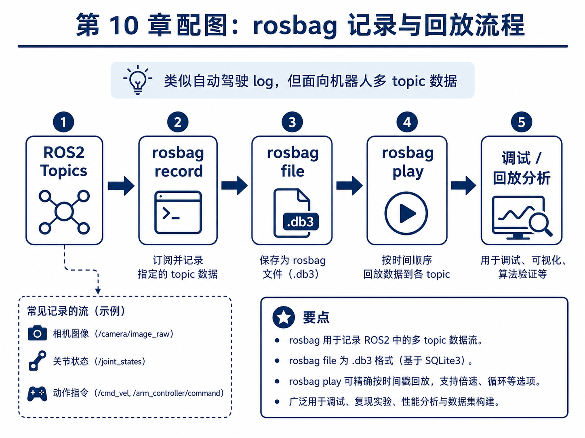
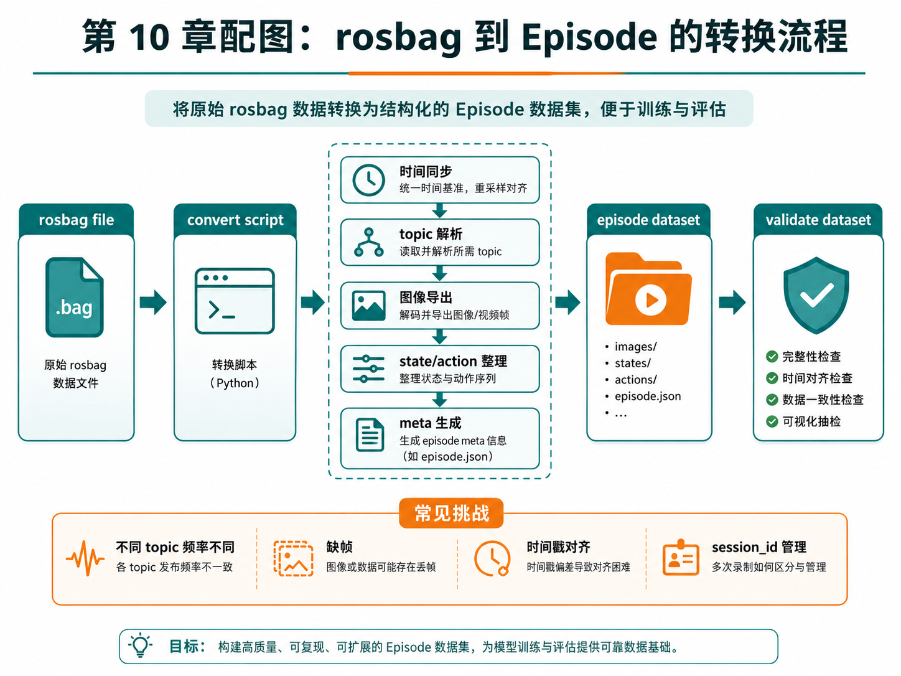
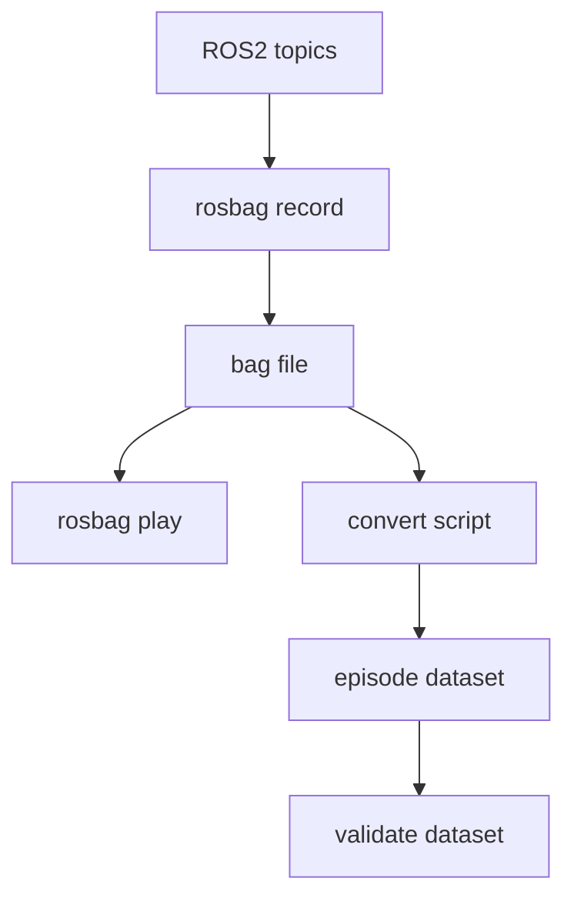
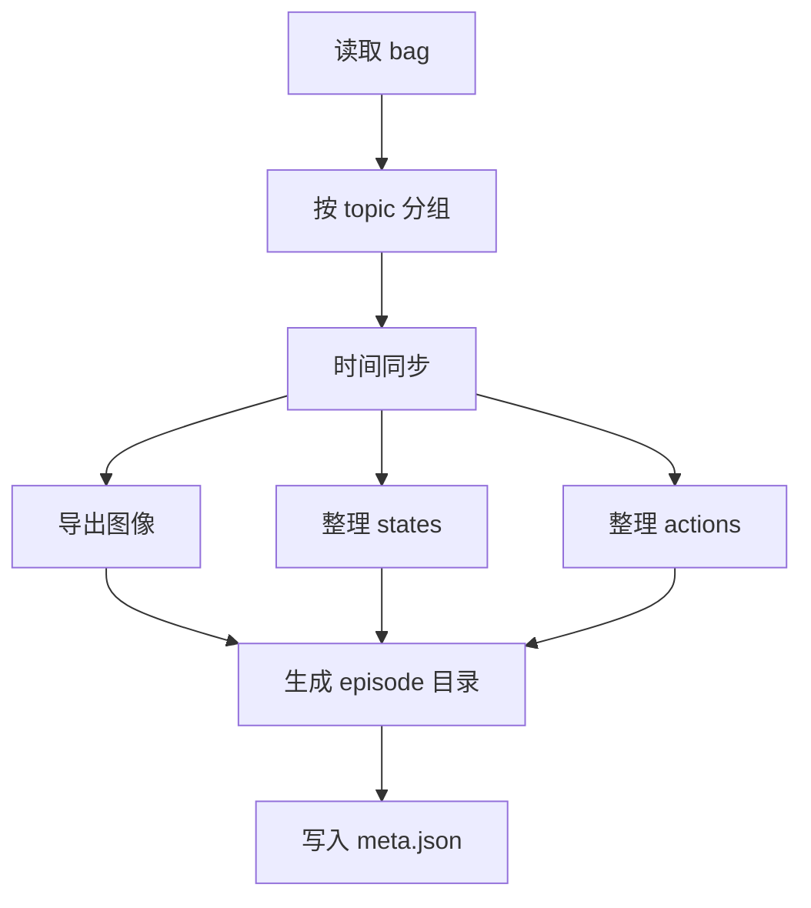

# 第 10 章：rosbag 与机器人数据记录

上一章我们已经建立了主线项目的最小 ROS2 通信骨架：相机、关节状态、动作命令、任务信息等都通过 topic 在系统里流动。接下来，问题就变得非常具体了：

> 这些在线流动的数据，如何被记录下来，并最终转成训练可用的 episode？

在自动驾驶里，我们常常会说 log；在 ROS2 世界里，一个非常核心的工具就是 **rosbag**。它可以理解为：把多个 topic 的时间序列数据完整记录下来，并支持后续回放、调试、转换与分析。也正因为如此，rosbag 是连接“在线机器人运行”与“离线数据集构建”的关键桥梁。

本章的目标，是让你建立这样一条完整理解链：

- ROS2 topics 在线发布；
- rosbag 记录这些 topic；
- 后续用转换脚本抽取并整理数据；
- 最终落成 episode 数据结构；
- 再接回前面第 8 章的数据质检链路。

这一步一旦想通，前 1–10 章的主线就会第一次形成一个较为完整的数据工程闭环。

---

## 1. 本章要解决的问题

本章重点解决以下问题：

1. rosbag 是什么，为什么它重要？
2. `rosbag record` 与 `rosbag play` 分别做什么？
3. rosbag 与自动驾驶 log 在思想上有什么相似之处？
4. 多 topic 记录时为什么时间同步是关键？
5. recorder 节点与 rosbag 的关系是什么？
6. 如何从 rosbag 转换为 episode？
7. 为什么图像、状态、动作和元信息需要分别整理？
8. 不同频率 topic 的对齐难点在哪里？
9. 在没有真实 ROS2 / rosbag 环境时，如何先做教学版转换脚本？

---

## 2. 为什么这个问题重要

### 2.1 没有记录，就没有可复现实验

如果你只是在线运行机器人，而没有把数据系统地记录下来，那么：

- 失败 case 无法复盘；
- 成功示范无法沉淀为训练数据；
- 调参与模型更新无法和历史数据对照；
- 数据质检与数据版本管理都无法成立。

也就是说，**记录能力是学习系统“可积累”的前提。**

### 2.2 rosbag 是离线分析的入口

很多看似“训练问题”的问题，其实是录制问题。例如：

- 某条 topic 没录到；
- 图像和状态时间对不上；
- 回放时发现某个关键阶段数据丢失；
- recorder 的时间基准和其他节点不一致。

rosbag 的价值就在于：它能让你重新回到当时的运行现场，进行回放、调试和转换。

### 2.3 为什么 rosbag 和自动驾驶 log 很像

如果你有自动驾驶背景，会很容易理解 rosbag 的位置：

- 都是多源时序数据记录；
- 都强调 timestamp；
- 都服务于回放、调试、评测与数据构建；
- 都是离线闭环和在线系统之间的桥梁。

差异只在于：机器人系统更贴近执行器控制和操作任务，因此动作流与操作上下文在 rosbag 转换中更重要。

---

## 3. 核心概念

### 3.1 rosbag record：记录 topic 数据流

`rosbag record` 的作用是订阅指定 topic，并把它们记录到 bag 文件中。对主线项目来说，最有价值的 topic 至少包括：

- `/camera/front/image_raw`
- `/camera/wrist/image_raw`
- `/joint_states`
- `/action_cmd`
- `/task_info`

这些 topic 被记录后，就形成了后续可分析、可回放、可转换的原始材料。

### 3.2 rosbag play：回放历史数据

`rosbag play` 可以按照时间顺序把 bag 中的数据重新发布到各个 topic。它的意义在于：

- 方便调试算法；
- 方便验证 recorder / converter 的逻辑；
- 方便复现现场；
- 方便做可视化与错误分析。

也就是说，`record` 更像是“冻结现场”，而 `play` 更像是“重放现场”。

### 3.3 rosbag 到 episode 的转换

原始 rosbag 不是最终训练数据。因为 bag 文件更像系统级日志，而训练阶段通常更需要结构化 episode。转换过程至少包括：

1. 读取 bag 中相关 topic；
2. 按时间同步 / 对齐；
3. 导出图像帧；
4. 整理状态与动作序列；
5. 生成 `meta.json`；
6. 输出 episode 目录结构。

### 3.4 多 topic 对齐为什么难

在真实系统中，不同 topic 常常频率不一致：

- 图像 30Hz；
- joint state 50Hz；
- action command 10Hz；
- task_info 只有任务切换时才发一次。

因此，rosbag 转 episode 的关键挑战之一，就是如何定义统一时间基准，并决定：

- 以哪个流为主时间轴；
- 哪些流做最近邻采样；
- 哪些流只在元信息中保留；
- 缺帧时如何处理。

### 3.5 为什么要引入 session_id

一旦系统开始反复录制，数据管理会迅速变复杂。比如：

- 今天上午录了 10 次；
- 下午又录了 12 次；
- 其中一半是调试，一半是正式采集。

如果没有 `session_id` 或类似标识，后续数据追溯会很混乱。因此，本章会在讨论中强调 session 级管理的重要性。

---

## 4. 概念图 / 流程图 / 架构图

### 4.1 图 10-1 rosbag 记录与回放流程



这张图展示了 rosbag 的两个核心动作：

- `record`：订阅并记录多 topic；
- `play`：按时间顺序回放到各 topic。

它强调了 rosbag 和自动驾驶 log 的类比关系：它们都不是最终训练数据本身，而是用于回放和构建数据集的原始记录材料。

### 4.2 图 10-2 rosbag 到 episode 的转换流程



这张图把转换过程拆得非常清楚：

- 时间同步；
- topic 解析；
- 图像导出；
- state / action 整理；
- meta 生成；
- 最后输出 episode dataset，并接上 validate dataset。

### 4.3 Mermaid 图：record → play → convert



### 4.4 Mermaid 图：转换脚本内部流程



---

## 5. 工程化理解

### 5.1 recorder 与 rosbag 的关系

有些初学者会把 recorder 与 rosbag 混为一谈。更准确地说：

- rosbag 是系统级的多 topic 录制工具；
- recorder node 更像系统里的一个业务节点，它可以辅助记录、筛选、标注或触发 episode 切分。

在很多项目中，这两者会协同工作：用 rosbag 保存原始现场，用 recorder 提供结构化上下文。

### 5.2 教学阶段为什么先用 mock rosbag

本章主线项目新增了一个教学版的“mock rosbag”输入文件：

```text
data/mock_rosbag/session_0001_mock_rosbag.jsonl
```

它并不是真实 `.db3` 文件，而是用 JSONL 模拟 rosbag 中按 topic 写入的消息流。这样做的好处是：

- 便于读者直接看懂输入；
- 便于用纯 Python 实现 converter；
- 先理解转换流程，再迁移到真实 rosbag 环境。

### 5.3 为什么转换脚本值得单独写

很多项目会直接在 recorder 里“边录边转”。这种做法不是不行，但在教学和工程上都不够清晰。把转换脚本单独拿出来有几个好处：

- 逻辑可复用；
- 便于离线调试；
- 便于对不同 session 重复转换；
- 便于版本管理和数据修复。

---

## 6. 主线项目中的位置

本章为主线项目新增：

```text
robot-learning-shelf-demo/
  data/mock_rosbag/
    session_0001_mock_rosbag.jsonl
  scripts/
    03_convert_rosbag_to_dataset.py
  datasets/
    dataset_from_mock_rosbag/
      episode_9001/
  reports/
    ch10_rosbag_conversion_summary.md
    ch10_dataset_from_mock_rosbag_report.json
    ch10_dataset_from_mock_rosbag_report.md
    ch10_dataset_from_mock_rosbag_action_distribution.png
```

这意味着主线项目现在第一次具备：

- 从“模拟 bag”到 episode 的完整转换能力；
- 一条新的 episode 数据来源通路；
- 以及与第 8 章数据验证脚本的衔接能力。

---

## 7. 示例

### 7.1 示例 1：记录哪些 topic

主线项目中最值得优先记录的 topic 是：

- 前视图像；
- 腕视图像；
- joint states；
- action command；
- task info。

这些 topic 基本覆盖了 episode 构建所需的 observation、state、action 和 meta。

### 7.2 示例 2：不同频率流如何处理

如果 `/joint_states` 更新频率高于 `/action_cmd`，一种常见做法是：

- 以图像或主控制周期为主时间轴；
- 对低频或高频 topic 做最近邻对齐；
- 将原始 timestamp 仍然保留下来，便于复查。

### 7.3 示例 3：从 mock rosbag 转换到 episode

本章新增的转换脚本会读取 `session_0001_mock_rosbag.jsonl`，并输出：

```text
datasets/dataset_from_mock_rosbag/episode_9001/
  images/front/
  images/wrist/
  states.jsonl
  actions.jsonl
  meta.json
```

这让你第一次完整走通：topic → bag → episode 的链路。

### 7.4 示例 4：转换后接入验证

转换只是第一步。更完整的工程闭环是：

```text
rosbag / mock bag
  -> convert
  -> episode
  -> validate_dataset
```

也就是说，任何新录制来源的数据，都应该在进入训练前先通过第 8 章的质检。

---

## 8. 练习代码

### 8.1 转换脚本

运行方式：

```bash
cd robot-learning-shelf-demo
python scripts/03_convert_rosbag_to_dataset.py   --bag_jsonl data/mock_rosbag/session_0001_mock_rosbag.jsonl   --output_episode_dir datasets/dataset_from_mock_rosbag/episode_9001   --summary_md reports/ch10_rosbag_conversion_summary.md
```

### 8.2 转换后验证

```bash
python scripts/04_validate_dataset.py   --dataset_dir datasets/dataset_from_mock_rosbag   --output_json reports/ch10_dataset_from_mock_rosbag_report.json   --output_md reports/ch10_dataset_from_mock_rosbag_report.md   --plot_path reports/ch10_dataset_from_mock_rosbag_action_distribution.png
```

这样，你就能验证转换出来的新数据是否合格。

---

## 9. 代码解释

### 9.1 `03_convert_rosbag_to_dataset.py` 的核心思路

这个脚本的输入是按 topic 写入的 JSONL，输出是标准 episode 目录。它主要做了四件事：

1. 按 topic 分组；
2. 以主时间轴重采样对齐；
3. 分别生成 states / actions / meta；
4. 导出图像占位帧。

其中“导出图像占位帧”并不是为了模拟真实视觉复杂度，而是为了让 episode 结构保持完整。

### 9.2 为什么先生成 placeholder 图像

在真实系统中，图像当然来自真实相机数据；但在教学阶段，如果为了等真实图像链路而停住，会大大拖慢学习节奏。因此，这里先生成 placeholder 图像，目的是让你优先理解：

- episode 的目录结构；
- 图像帧与时间步对应；
- conversion script 应该产出什么。

### 9.3 为什么 summary 报告仍然重要

转换脚本不仅要“生成文件”，还要输出一份 summary，说明：

- 转换了多少步；
- 包含哪些 topic；
- 导出了多少 front / wrist 帧；
- 输出目录在哪里。

这能帮助你快速判断转换有没有按预期完成。

---

## 10. 常见错误

### 错误 1：把 bag 当训练数据直接用

bag 更像原始记录，不是最终训练样本。

### 错误 2：忽略多 topic 频率差异

不做时间对齐就直接拼接，很容易得到错位数据。

### 错误 3：图像导出后不校验数量

导出图像数量与 state 数不一致，是非常常见的问题。

### 错误 4：转换后不接质检

没有经过验证的新数据，不应直接进入训练环节。

### 错误 5：没有 session 级命名规范

录制次数多起来后，没有 session_id 会让数据管理迅速失控。

---

## 11. 本章练习

1. 设计 rosbag 录制命名规范，包含日期、任务名、operator_id、session_id；
2. 扩展 `03_convert_rosbag_to_dataset.py`，让它支持读取不同 topic 频率；
3. 在 `meta.json` 中增加 `session_id` 字段；
4. 思考：如果 wrist 图像频率只有 front 图像的一半，应如何对齐？
5. 思考：自动驾驶 log 回放和机器人 rosbag 回放有什么相同与不同？

---

## 12. 本章产出

本章应当产出：

1. 一份教学版 mock rosbag 数据；
2. 一条从 mock rosbag 到 episode 的转换脚本；
3. 转换后的 episode 数据目录；
4. 一份转换 summary；
5. 与第 8 章质检链路相衔接的完整流程。

---

## 13. 小结

这一章最重要的结论可以概括成一句话：

> **rosbag 的真正价值，不只是“把数据录下来”，而是把在线运行现场变成一个可回放、可分析、可转换、可沉淀的学习资产。**

从主线项目角度看，到这一章结束时，我们已经把前面所有内容串成了一个较为完整的工程闭环：

- 明确任务；
- 定义 episode；
- 检查数据；
- 设计 ROS2 topic；
- 记录 / 转换数据；
- 再回到验证与训练。

这意味着第 1–10 章已经不仅是概念介绍，而是在逐步搭起一个真正能继续长成完整具身智能项目的系统骨架。
