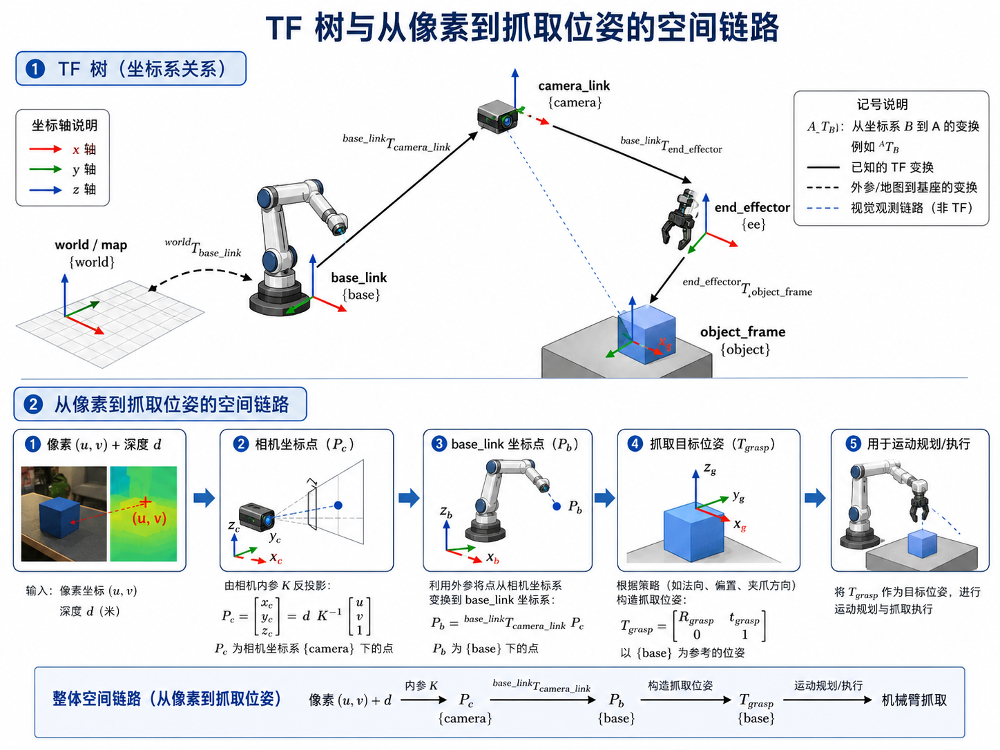
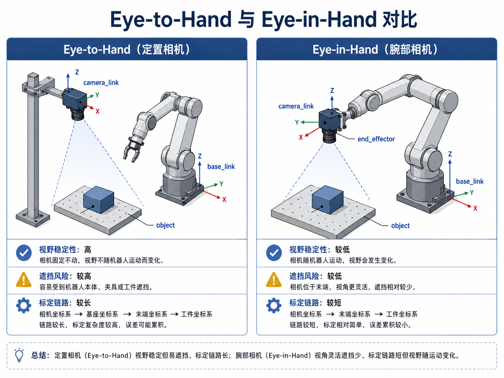
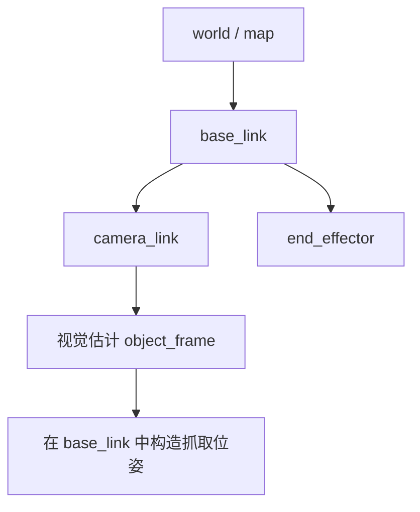

# 第 11 章：TF、机器人坐标系与相机空间理解

前两章我们已经把机器人数据流接到了主线项目里：你知道了 ROS2 topic 是怎么流动的，也知道了 rosbag / mock rosbag 怎么转成 episode。接下来，工程会立刻碰到一个自动驾驶工程师很熟悉、但在机器人里又更“直接”的问题：

> 图像里的目标，怎样变成机器人真正能执行的空间位置？

自动驾驶里，我们会讨论相机模型、外参、坐标变换、目标在车体坐标系中的位置；在具身智能里，这个问题并没有消失，只是从“车体坐标 → 世界坐标 → 规划轨迹”变成了“像素 → 相机坐标 → base_link → 抓取位姿 → 机械臂动作”。

本章就是要把这条链路彻底讲明白，并把你的自动驾驶空间理解经验迁移到机器人上。读完本章后，你应该能清楚回答：

- `world / map`、`base_link`、`camera_link`、`end_effector`、`object_frame` 各自代表什么；
- 为什么同样都是相机，**定置相机（eye-to-hand）** 和 **腕部相机（eye-in-hand）** 会带来完全不同的标定链路与误差传播；
- 给定一个像素点 `(u, v)` 和对应深度 `d`，如何求出相机坐标系下的 3D 点；
- 如何利用外参矩阵把这个点变换到 `base_link`；
- 为什么很多机器人“抓偏了”的问题，本质上不是模型没学好，而是坐标系错了。

---

## 1. 本章要解决的问题

本章重点解决以下问题：

1. 机器人里常见的坐标系有哪些，它们之间是什么关系？
2. TF tree 在工程上到底有什么用？
3. 像素点加深度是如何恢复为相机坐标系 3D 点的？
4. 相机坐标到机器人基座坐标需要哪些已知量？
5. eye-to-hand 与 eye-in-hand 有什么本质差异？
6. 坐标系错误通常会表现为哪些抓取失败现象？
7. 主线项目如何把这一章的知识落成可运行代码与配置？

---

## 2. 为什么这个问题重要

### 2.1 机器人执行和自动驾驶感知的最大共同点：都离不开空间链路

从视觉模型输出到动作执行，中间最容易被忽视的一层就是空间表达。自动驾驶里，你可能已经非常熟悉这些说法：

- 目标在相机坐标系还是车体坐标系？
- BEV 坐标和原始图像坐标如何对应？
- 标定误差会不会引入感知偏移？

机器人里同样如此。区别只在于：自动驾驶中的空间误差通常体现在轨迹规划偏差、占据误差、检测偏移上；而在机器人里，空间误差会更直接地表现为：

- 手爪明明对着盒子，却始终偏左 3 cm；
- 下降方向正确，但高度不对，抓空了；
- 转到收纳盒上方后，放置点明显跑偏；
- 腕部相机视角一变，抓取效果突然不稳定。

### 2.2 在具身智能工程里，坐标系是“系统问题”，不是单个模块问题

很多初学者会把抓取失败归因于检测模型、策略模型，甚至归因于“VLA 还不够强”。但如果你从工程闭环角度看，会发现空间问题横跨多个模块：

- 相机内参决定像素反投影；
- 外参决定相机系到机器人系的变换；
- 任务定义决定抓取位姿的构造规则；
- 运动学与规划决定末端执行器如何到达该位姿；
- 数据记录又决定这些位姿是否被正确保存进 episode。

所以，本章是连接“视觉理解”和“机械臂执行”的第一道桥。

### 2.3 这恰恰是自动驾驶/感知工程师最容易建立优势的地方

如果你来自自动驾驶感知、泊车感知、BEV、点云或标定方向，那么这章内容不是陌生知识，而是一次迁移：

- 你熟悉针孔成像和外参；
- 你知道坐标系一旦搞错，后面整个链路都会歪；
- 你知道“看起来像模型问题，实际是标定问题”在工程里有多常见。

换句话说，很多机器人学习初学者最怕的空间理解问题，恰好是你可以迅速建立信心的切入口。

---

## 3. 核心概念

### 3.1 机器人里常见的坐标系

在本书主线项目里，我们重点关心以下几个坐标系：

- `world / map`：全局参考系。对桌面任务来说，它有时只是一个教学上的全局系；
- `base_link`：机器人基座坐标系。后续很多抓取位姿都要以它作为执行参考；
- `camera_link`：相机坐标系。视觉观测直接发生在这里；
- `end_effector`：末端执行器坐标系，也就是夹爪 / 工具坐标；
- `object_frame`：目标物体坐标系。抓取点、物体朝向通常围绕它来定义。

其中最关键的一点是：**策略或者规则最终输出的目标位姿，通常必须落在机器人控制器能理解的参考坐标系中**，这个系在桌面任务里通常就是 `base_link`。

### 3.2 TF tree：把“谁相对谁”表达清楚

TF 的核心不是画一棵好看的树，而是明确每个坐标系之间的变换链。你可以把 TF tree 理解成：

- 系统里有哪些 frame；
- 每个 frame 的父节点是谁；
- 某个点或位姿想从 A 系变到 B 系，需要沿哪条链做变换。

如果这棵树不清楚，后续会出现三类典型混乱：

1. 相机系点直接拿去控制机械臂；
2. `base_link` 和 `world` 被混用；
3. `camera_link -> end_effector` 和 `camera_link -> base_link` 的链路搞反。

### 3.3 像素 + 深度为什么能恢复 3D 点

如果相机已知内参 `fx, fy, cx, cy`，并且某个像素点 `(u, v)` 对应深度 `d`，那么相机坐标系下的 3D 点 `P_c = [x, y, z]^T` 可由针孔模型恢复：

```text
x = (u - cx) * d / fx
y = (v - cy) * d / fy
z = d
```

这一步本质上就是“反投影”。

在自动驾驶里，你可能更习惯把这件事理解成“由像素射线和深度恢复空间点”；在机器人里，意义非常直接：这个 3D 点可以继续被变换到 `base_link`，从而成为抓取位姿构造的输入。

### 3.4 外参矩阵：把相机看到的点，送到机器人能执行的系里

当你有了 `P_c` 后，还需要一个 4×4 齐次变换矩阵 `T_base_camera`，才能将点变换到机器人基座坐标系：

```text
P_b = T_base_camera * P_c
```

这里的关键不在公式本身，而在于：

- `T_base_camera` 是已知的吗？
- 它是定置相机的静态外参，还是腕部相机的动态链路一部分？
- 它的旋转顺序和轴定义是否与系统一致？

机器人项目里大量“偏一点点”的问题，往往都藏在这里。

### 3.5 Eye-to-Hand 与 Eye-in-Hand

这两个安装方式几乎决定了你后面的系统风格：

- **Eye-to-Hand（定置相机）**：相机固定在环境中，观察机器人和桌面；
- **Eye-in-Hand（腕部相机）**：相机装在末端，视角跟随机械臂运动。

它们的工程差异可以简化理解为：

| 维度 | Eye-to-Hand | Eye-in-Hand |
|---|---|---|
| 视野 | 稳定 | 随运动变化 |
| 遮挡 | 容易被机器人遮挡 | 通常更灵活 |
| 标定链路 | 相对长 | 相对短 |
| 使用场景 | 全局观察、桌面任务 | 精细操作、局部观测 |

在主线项目 `pick_box_to_bin` 中，我们先采用 **eye-to-hand**，因为它更适合教学，也更容易把空间链路讲清楚。

---

## 4. 概念图 / 流程图 / 架构图

### 4.1 图 11-1 TF 树与从像素到抓取位姿的空间链路



这张图可以作为本章总图来理解。它把两件事连到了一起：

1. 上半部分说明了 `world / base_link / camera_link / end_effector / object_frame` 之间的关系；
2. 下半部分把“像素 + 深度”到“抓取位姿”的工程链路拆成 5 步。

### 4.2 图 11-2 Eye-to-Hand 与 Eye-in-Hand 对比



这张图重点帮助你理解：相机安装方式不是部署细节，而是会直接影响标定链路、误差传播和遮挡模式的系统选择。

### 4.3 Mermaid 图：从视觉观测到抓取执行的最小链路


### 4.4 Mermaid 图：主线项目中的坐标链



---

## 5. 工程化理解

### 5.1 先把“参考坐标系”固定下来，再谈抓取策略

初学者最常见的错误之一，是一边看视觉结果，一边随手在不同坐标系里写规则。例如：

- 检测输出在图像平面；
- 抓取点在相机系；
- 放置点又直接写成了桌面系的数值；
- 最终控制指令却默认控制器接收 `base_link`。

这样做的结果是：每一步看起来都合理，但整个链路拼不起来。一个更工程化的做法是：

1. 明确视觉输出在什么系；
2. 明确控制器需要什么系；
3. 明确中间所有已知变换；
4. 统一在同一个“执行参考系”中表达抓取 / 放置位姿。

在主线项目里，这个执行参考系统一为 `base_link`。

### 5.2 机器人里的“标定问题”往往比模型问题更值得先查

如果机器人抓偏，可以按如下顺序排查：

1. 先看像素点是否选对；
2. 再看深度是否可信；
3. 再看内参是否正确；
4. 再看相机外参是否正确；
5. 最后才看抓取位姿构造与运动规划。

这和自动驾驶里“先查数据、再查标定、最后查模型”的思路是高度一致的。

### 5.3 坐标系调试不要只看数字，要看现象模式

很多空间错误是有“症状”的：

- **整体固定偏移**：通常怀疑外参平移；
- **方向反了**：通常怀疑坐标轴定义或旋转顺序；
- **离中心正常，边缘很差**：通常怀疑内参与深度误差；
- **腕部相机到处跳**：通常怀疑动态链路、末端姿态或时间同步。

学会从现象反推链路位置，是从“会写公式”走向“会调系统”的关键。

---

## 6. 主线项目中的位置

本章为主线项目新增了以下文件：

```text
robot-learning-shelf-demo/
  configs/
    camera_config.yaml
    robot_config.yaml
  ros2_ws/src/
    shelf_demo_tf_tools/
      README.md
  scripts/
    geometry_utils.py
  reports/
    ch11_transform_demo.json
```

这些新增内容的作用分别是：

- `camera_config.yaml`：定义相机内参与静态外参；
- `robot_config.yaml`：定义主线任务的基座、末端与工作空间参数；
- `geometry_utils.py`：把本章最关键的空间计算真正跑起来；
- `ch11_transform_demo.json`：保存一次从像素到 `base_link` 的计算结果，便于后续复查和教学展示。

---

## 7. 示例

### 7.1 示例 1：给定像素和深度，求相机坐标点

假设：

- `u = 356`
- `v = 242`
- `d = 0.58`
- `fx = fy = 615`
- `cx = 320`
- `cy = 240`

则相机坐标为：

```text
x = (356 - 320) * 0.58 / 615 ≈ 0.0339
y = (242 - 240) * 0.58 / 615 ≈ 0.0019
z = 0.58
```

这说明该点在相机系中，位于镜头前方约 58 cm、略偏右上方。

### 7.2 示例 2：用 `geometry_utils.py` 计算 `base_link` 坐标

```bash
cd robot-learning-shelf-demo
python scripts/geometry_utils.py \
  --camera_config configs/camera_config.yaml \
  --u 356 --v 242 --depth 0.58 \
  --output reports/ch11_transform_demo.json
```

输出文件中会包含：

- 输入像素与深度；
- 相机内参；
- `T_base_camera` 4×4 矩阵；
- 点在相机系下的位置；
- 点在 `base_link` 下的位置。

### 7.3 示例 3：固定偏移型抓偏

假设你发现抓取总是比目标偏左约 2–3 cm，且在所有场景中偏差方向相近。此时优先怀疑：

- `T_base_camera` 的平移量有误；
- 物体点位构造时用了错误的 reference frame；
- 末端执行器抓取偏置（grasp offset）没有加对。

这类问题通常和“模型是否足够智能”关系不大。

---

## 8. 练习代码

本章的练习代码放在：

```text
scripts/geometry_utils.py
```

下面给出一个最小核心片段：

```python
from geometry_utils import CameraIntrinsics, pixel_to_camera_point, pose_to_matrix, transform_point

intr = CameraIntrinsics(fx=615.0, fy=615.0, cx=320.0, cy=240.0)
p_c = pixel_to_camera_point(u=356, v=242, depth=0.58, intr=intr)
T_base_camera = pose_to_matrix(
    translation_xyz=[0.45, -0.30, 0.72],
    rpy_rad=[-2.45, 0.0, -1.57],
)
p_b = transform_point(T_base_camera, p_c)

print('camera point =', p_c)
print('base point   =', p_b)
```

建议你做两个小实验：

1. 把 `u, v` 往四周移动，观察 `P_c` 和 `P_b` 如何变化；
2. 故意把外参平移 `x` 增大 0.03 m，再看抓取点会偏移多少。

---

## 9. 代码解释

### 9.1 `pixel_to_camera_point()`

这是最核心的反投影函数。它要求输入：

- 像素坐标；
- 深度值；
- 相机内参。

输出则是相机坐标系下的三维点。它帮助你把“2D 检测结果”提升到“3D 执行候选点”。

### 9.2 `pose_to_matrix()`

这个函数把平移 + RPY 角转成齐次变换矩阵。教学版实现故意保持简洁，让你看清：

- 旋转矩阵是怎么组合的；
- 平移是如何进入 4×4 矩阵的；
- 为什么后续所有点变换都可以统一写成一次矩阵乘法。

### 9.3 `transform_point()`

这个函数把一个 3D 点从源坐标系映射到目标坐标系。对本章来说，它就是“把相机看到的点送进机器人坐标系”的桥梁。

---

## 10. 常见错误

### 10.1 把深度值当成了 z 轴以外的量

在很多深度相机里，深度代表从相机出发沿光线方向或投影模型约定的距离；如果你对深度的定义没有统一，就可能在反投影第一步就出错。

### 10.2 旋转顺序不一致

`roll -> pitch -> yaw` 和 `yaw -> pitch -> roll` 不是一回事。如果相机外参看起来“差不多”，但结果总有奇怪偏差，首先检查旋转顺序。

### 10.3 搞混了 point 和 pose

3D 点只有位置，没有姿态；抓取位姿不仅包含位置，还包含末端执行器的方向。很多初学者把一个目标点直接当成抓取位姿，这是不完整的。

### 10.4 忘了抓取偏置

真正的抓取位姿通常不会等于目标表面中心点本身。你往往还需要考虑：

- 从哪个方向抓；
- 夹爪张开方向；
- 预抓取高度；
- 工具中心点与视觉参考点之间的偏置。

---

## 11. 本章练习

1. 解释 `base_link` 与 `camera_link` 的关系，并画出你自己的 TF tree；
2. 修改 `camera_config.yaml` 中的外参平移，观察 `reports/ch11_transform_demo.json` 的变化；
3. 自己实现 `pixel_to_camera_point()`，不要直接复制示例；
4. 思考：如果改用腕部相机，`camera_link -> base_link` 这条链路会发生什么变化？
5. 用一句话总结：为什么坐标系问题经常被误判为模型问题？

---

## 12. 本章产出

完成本章后，你的主线项目新增了：

- 相机与机器人配置：`configs/camera_config.yaml`, `configs/robot_config.yaml`
- 几何工具脚本：`scripts/geometry_utils.py`
- 一份计算示例结果：`reports/ch11_transform_demo.json`
- 第 11 章两张配图：
  - `images/ch11_tf_tree_and_pixel_to_grasp_pose.png`
  - `images/ch11_eye_to_hand_vs_eye_in_hand.png`

这意味着：主线项目第一次真正具备了“从视觉观测走向抓取空间目标”的基础能力。

---

## 13. 小结

本章可以概括成一句话：

> 视觉看到的是像素，机器人执行的是位姿，而坐标系与 TF 链路负责把两者连接起来。

对于自动驾驶/机器人算法工程师来说，这一章的真正价值不只是会写反投影公式，而是建立一套工程判断：

- 先统一坐标系；
- 再统一参考系；
- 再谈抓取策略；
- 最后再谈模型与泛化。

下一章，我们将沿着这条链继续往下走：既然目标位姿已经有了，机械臂究竟怎样才能到达它？这就进入了机械臂、夹爪、运动学与 MoveIt2 的世界。
