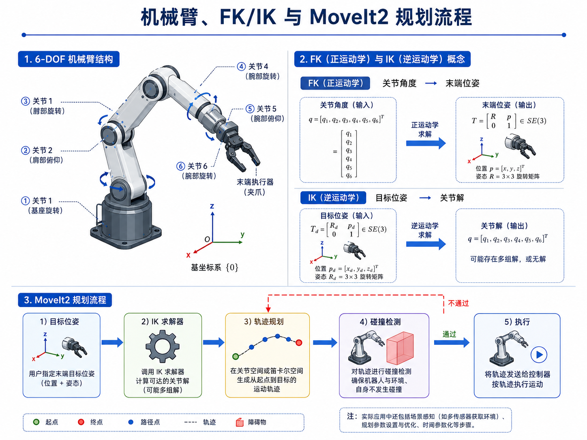
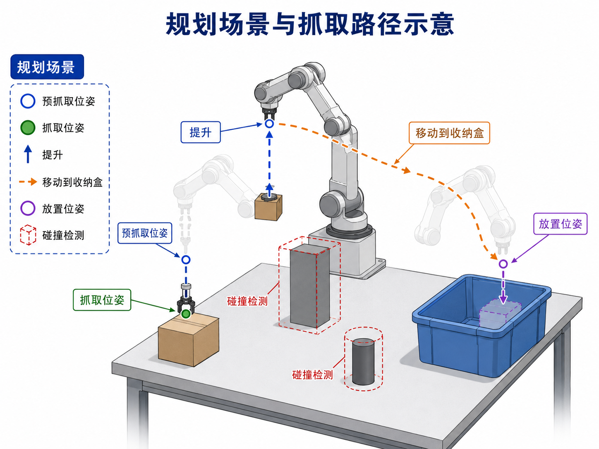
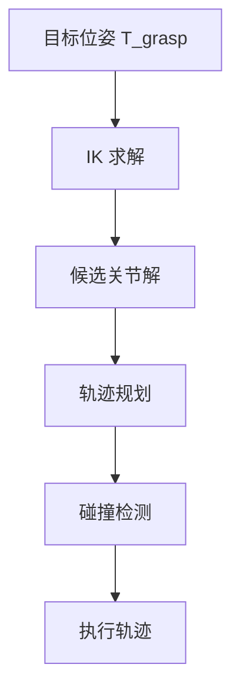
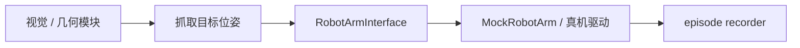

# 第 12 章：机械臂、夹爪、运动学与 MoveIt2

上一章我们已经完成了一件非常关键的事：把“视觉中的目标”转换成了机器人 `base_link` 下可以理解的空间点或目标位姿。可工程并不会自动因此完成。你接下来会立刻碰到另一个问题：

> 知道目标位姿，并不等于机械臂就能到达这个位姿。

在自动驾驶里，从目标位置到控制命令之间，还要经过规划与控制；在机器人里也一样。一个抓取系统至少还需要回答：

- 机械臂由哪些部分组成？
- 目标位姿如何转换成关节解？
- 目标可达但路径会碰撞时怎么办？
- 夹爪何时打开、何时闭合？
- 为什么在模仿学习之前，最好先理解基础控制接口？

本章的目标不是把你训练成机械臂控制理论专家，而是帮你建立一个**面向具身智能工程的机械臂最小知识体系**。我们会聚焦那些真正服务主线项目 `pick_box_to_bin` 的部分：关节、末端执行器、正逆运动学、路径规划、碰撞检测，以及 MoveIt2 在系统中的位置。

---

## 1. 本章要解决的问题

本章重点解决以下问题：

1. 机械臂和夹爪在系统中分别扮演什么角色？
2. 什么是 FK（正运动学）与 IK（逆运动学）？
3. 目标位姿为什么不能直接等同于“电机命令”？
4. 轨迹规划与碰撞检测为什么重要？
5. MoveIt2 在机器人系统里究竟做什么？
6. 为什么要先抽象一个 `RobotArmInterface`，再做后续策略？
7. 主线项目如何在没有真实硬件时先构建可运行的 mock 控制接口？

---

## 2. 为什么这个问题重要

### 2.1 机器人学习不是“跳过控制”

很多人一听到模仿学习、VLA、端到端，就误以为后面不再需要理解机械臂控制。其实恰恰相反：

- 学习策略最终还是要落到动作空间；
- 动作空间背后一定有控制接口；
- 控制接口背后一定隐含机械臂和末端执行器的约束。

如果你连机械臂能做什么、不能做什么都不清楚，那么后面无论是规则策略、人类遥操作还是策略学习，都会很容易落成“纸上动作”。

### 2.2 从“点位”到“动作”，中间必须有运动学与规划

上一章得到的是目标点或目标位姿，它还没有解决这些问题：

- 当前关节角是什么？
- 哪组关节解能到这个位姿？
- 有没有多组解？哪组更合适？
- 机械臂从当前位置走到目标位置，路径会不会撞桌面、收纳盒或自身？

这些问题一起构成了机械臂控制层最基本的能力。也正因为如此，MoveIt2 这类框架才会在机器人项目中如此常见。

### 2.3 先有规则控制接口，后面数据采集才不会漂

在本书的主线中，第 13 章会构建一个规则式 expert。这个 expert 如果没有统一的机械臂控制接口，通常会出现：

- 脚本到处写死位姿；
- 夹爪指令分散在不同文件；
- 采集 episode 时动作语义不一致；
- 日后接真机、换仿真器时难以复用。

因此，本章会先为后续所有策略层建立一层抽象：`RobotArmInterface`。

---

## 3. 核心概念

### 3.1 机械臂的最小组成

从具身智能工程角度看，一台桌面机械臂至少可以拆成三部分：

1. **机械臂本体**：由多个关节与连杆构成，负责把末端执行器移动到目标位姿；
2. **末端执行器（End Effector）**：例如夹爪、吸盘、工具头，真正与环境发生接触；
3. **控制接口**：接收目标位姿或关节目标，并将其转成低层执行命令。

在主线项目 `pick_box_to_bin` 里，我们假设使用一个 6-DOF 机械臂 + 两指夹爪。这个组合足以说明抓取、搬运、放置任务的基本逻辑。

### 3.2 FK：关节角 → 末端位姿

正运动学（Forward Kinematics, FK）要回答的问题是：

> 如果我知道每个关节角是多少，末端执行器此刻在哪里、朝向如何？

它的输入是关节角向量 `q = [q1, q2, ..., qn]`，输出则是末端位姿 `T_ee`。在工程上，FK 的用途非常广：

- 读取机器人当前状态时，推算末端位姿；
- 验证某个关节解对应的末端位置是否合理；
- 在日志、episode 或调试界面中展示当前操作状态。

### 3.3 IK：目标位姿 → 关节解

逆运动学（Inverse Kinematics, IK）要回答的问题则反过来：

> 如果我希望末端执行器到达某个位姿，需要哪些关节角？

与 FK 不同，IK 可能存在：

- 多组解；
- 无解；
- 虽然数学上有解，但不满足关节限制或机械结构约束。

这就是为什么“目标点可见”并不等于“机械臂可达”。

### 3.4 轨迹规划与碰撞检测

假设你已经求出了一个目标位姿和对应关节解，仍然不能直接执行，因为系统还要回答：

- 从当前姿态到目标姿态，走哪条路径？
- 这条路径会不会穿过桌面？
- 会不会碰到收纳盒边缘？
- 机械臂自身会不会自碰撞？

这正是轨迹规划（Trajectory Planning）与碰撞检测（Collision Checking）的职责。

### 3.5 MoveIt2 在系统中的位置

MoveIt2 可以粗略理解为一个“机器人操作任务的中间层”：

- 上层给它目标位姿或运动请求；
- 它负责调用 IK、规划器、碰撞检测；
- 最终输出可执行轨迹，交给控制器执行。

当然，真实 MoveIt2 比这复杂得多，但对本书当前阶段来说，这样的定位已经足够。

---

## 4. 概念图 / 流程图 / 架构图

### 4.1 图 12-1 机械臂、FK/IK 与 MoveIt2 规划流程



这张图把本章的知识压缩成了三个层次：

1. 左上：6-DOF 机械臂的基本结构；
2. 右上：FK 和 IK 的输入输出关系；
3. 下方：MoveIt2 从目标位姿到执行的最小流程。

### 4.2 图 12-2 规划场景与抓取路径示意



这张图特别适合与第 13 章衔接，因为它已经把 `pick_box_to_bin` 的几个关键阶段画出来了：

- 预抓取位姿；
- 抓取位姿；
- 提升；
- 移动到收纳盒；
- 放置；
- 碰撞检测。

### 4.3 Mermaid 图：目标位姿到执行轨迹



### 4.4 Mermaid 图：主线项目中的控制抽象



---

## 5. 工程化理解

### 5.1 目标位姿不是终点，而是控制层的输入

在具身智能项目里，经常会看到“我已经算出抓取点了，为何还抓不了？”这本质上是把“目标”误当成“执行”。

从系统视角，一个完整链条通常是：

1. 感知得到目标物体位置；
2. 几何层构造抓取位姿；
3. 控制层将抓取位姿转成关节轨迹；
4. 机械臂按轨迹执行；
5. 夹爪在合适时机开合。

也就是说，抓取位姿只是进入控制层的入口，不是最终动作本身。

### 5.2 为什么要把夹爪单独看待

很多学习型系统容易只关注“机械臂路径”，忽略夹爪。可对于 `pick_box_to_bin` 这类任务，真正导致成功 / 失败的经常就是夹爪时机：

- 太早闭合：可能还没对准物体；
- 太晚闭合：已经越过最佳抓取点；
- 提前打开：转运途中会掉落；
- 打开高度不对：可能碰撞收纳盒边缘。

因此，本章的接口设计中，`open_gripper()` 和 `close_gripper()` 会被作为显式动作存在，而不是隐藏在某个大函数里。

### 5.3 抽象接口比“写死真机 API”更适合教学与工程演化

本章新增的 `RobotArmInterface` 有两个目的：

1. 教学上，让读者先理解动作语义，而不是被某家机器人 SDK 绑住；
2. 工程上，让后续规则策略、遥操作、数据记录、训练评测都能复用同一套动作接口。

这和你在自动驾驶中先抽象 perception / planner / controller 边界，再逐步替换具体实现，是同一种工程思维。

---

## 6. 主线项目中的位置

本章为主线项目新增：

```text
robot-learning-shelf-demo/
  scripts/
    robot_arm_interface.py
  reports/
    ch12_mock_robot_arm_demo.json
```

其中：

- `robot_arm_interface.py` 定义了 `RobotArmInterface` 和 `MockRobotArm`；
- `ch12_mock_robot_arm_demo.json` 保存了一次从 pre-grasp 到 return-home 的 mock 执行历史。

这一步的意义在于：主线项目第一次拥有了**控制抽象层**。后面无论是规则式 expert，还是人类遥操作，都可以基于这层抽象往上搭。

---

## 7. 示例

### 7.1 示例 1：从目标位姿到动作序列

对于 `pick_box_to_bin` 来说，一次典型的抓取并不是一个动作，而是一串带语义的动作：

1. `move_to_pose(pre_grasp)`
2. `move_to_pose(grasp)`
3. `close_gripper()`
4. `move_to_pose(lift)`
5. `move_to_pose(pre_place)`
6. `move_to_pose(place)`
7. `open_gripper()`
8. `move_to_pose(home)`

这串动作恰好也是后面第 13 章状态机的雏形。

### 7.2 示例 2：运行 MockRobotArm 演示

```bash
cd robot-learning-shelf-demo
python scripts/robot_arm_interface.py \
  --output reports/ch12_mock_robot_arm_demo.json
```

该输出文件会记录：

- 每一次 `move` 的目标位姿；
- 夹爪的开闭动作；
- 最终末端状态；
- 整条 mock 控制历史。

### 7.3 示例 3：为什么规划场景不能省略

假设你有一个从盒子到收纳盒的直线路径，如果不做规划场景与碰撞检测，可能出现：

- 路径穿过收纳盒壁；
- 从盒子抬起时擦到旁边障碍物；
- 末端方向正确，但机械臂肘部与桌面自碰撞。

这也是为什么我们不能仅仅停留在“点位控制”的层面。

---

## 8. 练习代码

本章的练习代码位于：

```text
scripts/robot_arm_interface.py
```

核心片段如下：

```python
from robot_arm_interface import MockRobotArm

arm = MockRobotArm(home_pose_xyzrpy=[0.30, -0.10, 0.25, 3.14, 0.0, 0.0])
arm.move_to_pose([0.42, 0.05, 0.18, 3.14, 0.0, 0.0], label='pre_grasp')
arm.move_to_pose([0.42, 0.05, 0.05, 3.14, 0.0, 0.0], label='grasp')
arm.close_gripper()
arm.move_to_pose([0.42, 0.05, 0.22, 3.14, 0.0, 0.0], label='lift')
arm.move_to_pose([0.62, -0.08, 0.18, 3.14, 0.0, 0.0], label='pre_place')
arm.open_gripper()
print(arm.get_state())
```

建议你在此基础上做两个练习：

1. 增加 `move_to_joint_positions()` 接口，思考它与 `move_to_pose()` 的区别；
2. 给 `MockRobotArm` 增加“不可达位姿”判断，让它在越界时返回失败信息。

---

## 9. 代码解释

### 9.1 `RobotArmInterface`

这是一个抽象层，目的是明确“动作语义”而不是绑定具体实现。它定义了四类关键能力：

- `move_to_pose()`：移动末端执行器到某目标位姿；
- `open_gripper()`：打开夹爪；
- `close_gripper()`：关闭夹爪；
- `get_state()`：获取当前状态。

### 9.2 `MockRobotArm`

教学版的 `MockRobotArm` 并不做真实运动学求解，它的职责是：

- 维护一个简化状态；
- 接收动作请求；
- 记录动作历史；
- 为第 13 章的脚本 expert 提供一个可运行目标。

这和我们在自动驾驶算法教学里常常先写一个 fake planner / fake controller，是一样的策略：先让信息流跑通，再逐步替换为更真实的实现。

### 9.3 `run_demo()`

该函数提供了一个标准抓取流程的演示，对后面的状态机编排非常重要。你可以把它看成：

- 一次手工编排的抓取剧本；
- 一条规则策略的雏形；
- 一条可被记录为 episode 的动作序列。

---

## 10. 常见错误

### 10.1 把 FK 和 IK 混为一谈

很多人知道这两个名词，但在工程里分不清用法。一个很简单的判断是：

- 已知关节，求末端：FK；
- 已知末端，求关节：IK。

### 10.2 只关注末端点，不关注路径

即使目标位姿本身可达，路径也可能不可执行。忽略路径规划和碰撞检测，会让系统在 demo 视频里看起来“像能抓”，但一上真实环境就不稳定。

### 10.3 把夹爪动作藏在 move 函数里

如果夹爪开闭动作没有显式暴露出来，后续数据采集时会很难定义 action 语义，也不利于策略学习。

### 10.4 过早绑定某个具体机器人 SDK

教学早期如果就把所有逻辑写死到某个品牌 API 里，会让读者把注意力放在库用法，而不是系统抽象上。先抽象接口，再接真机，是更可迁移的路线。

---

## 11. 本章练习

1. 用自己的话解释 FK 和 IK 的区别；
2. 修改 `MockRobotArm`，让它在 `x/y/z` 超过工作空间时返回失败；
3. 给夹爪增加一个 `gripper_width` 状态；
4. 画出 `pick_box_to_bin` 的预抓取、抓取、提升、放置路径；
5. 思考：为什么模仿学习也离不开底层控制接口？

---

## 12. 本章产出

完成本章后，项目新增：

- 控制抽象脚本：`scripts/robot_arm_interface.py`
- 控制演示报告：`reports/ch12_mock_robot_arm_demo.json`
- 第 12 章配图：
  - `images/ch12_robot_arm_fk_ik_moveit2.png`
  - `images/ch12_planning_scene_and_grasp_path.png`

这意味着：主线项目已经从“会计算目标位姿”进一步发展到“会组织基本控制动作”。

---

## 13. 小结

本章最重要的结论可以概括为：

> 机器人学习不是替代控制，而是建立在控制抽象之上的更高层能力。

在 `pick_box_to_bin` 这样的任务里，视觉与几何告诉你“去哪儿”，机械臂与规划告诉你“怎么去”，夹爪时序决定你“是否真正抓住”。

下一章我们就会把这些能力真正串起来：基于本章的控制抽象，写出一个规则式 Pick-and-Place expert，并把它执行出来的数据保存为 episode。这将是主线项目第一次拥有“可自动生成初始训练数据”的能力。
