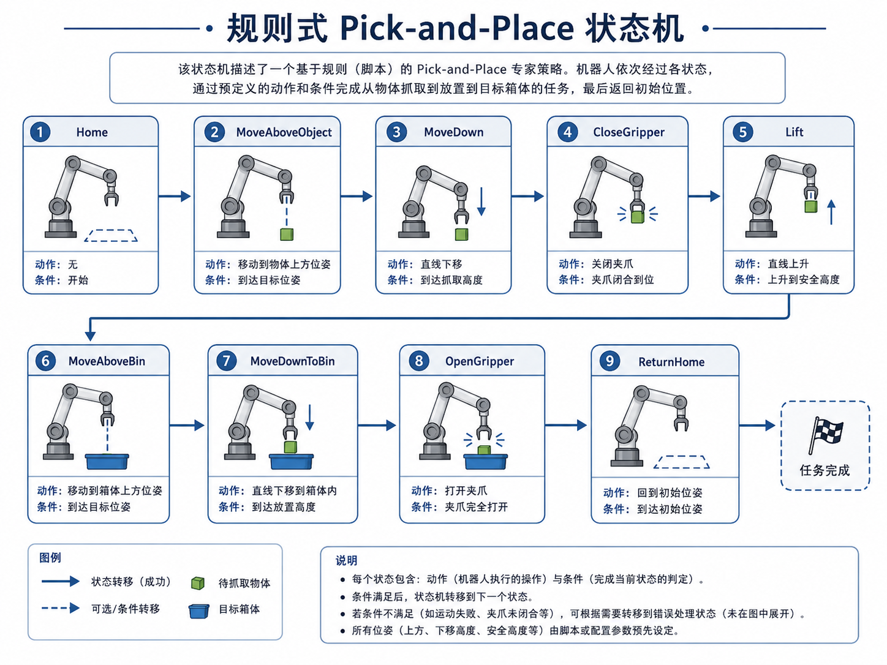
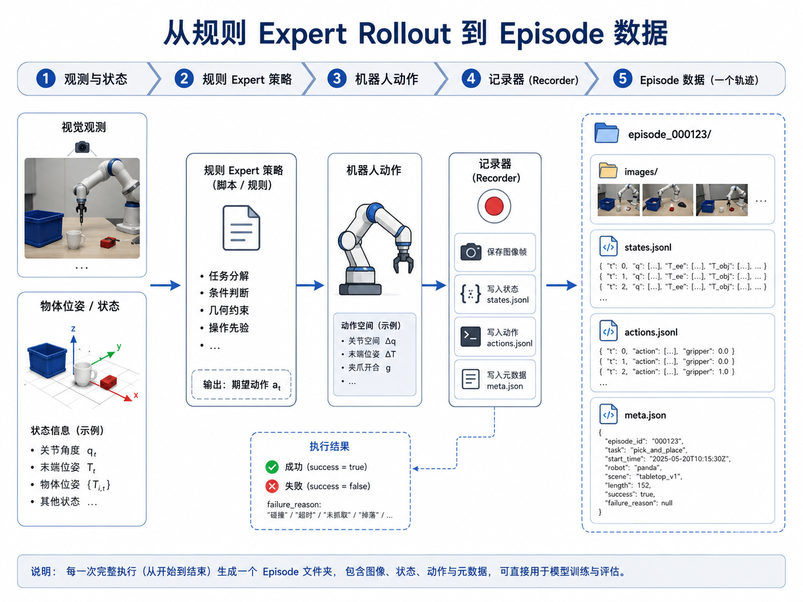
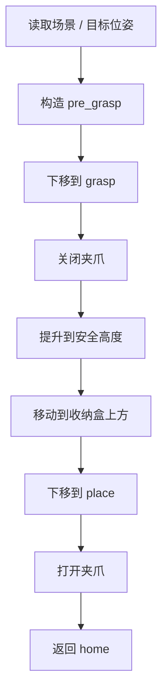
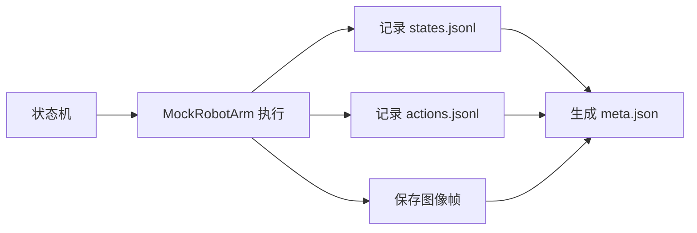
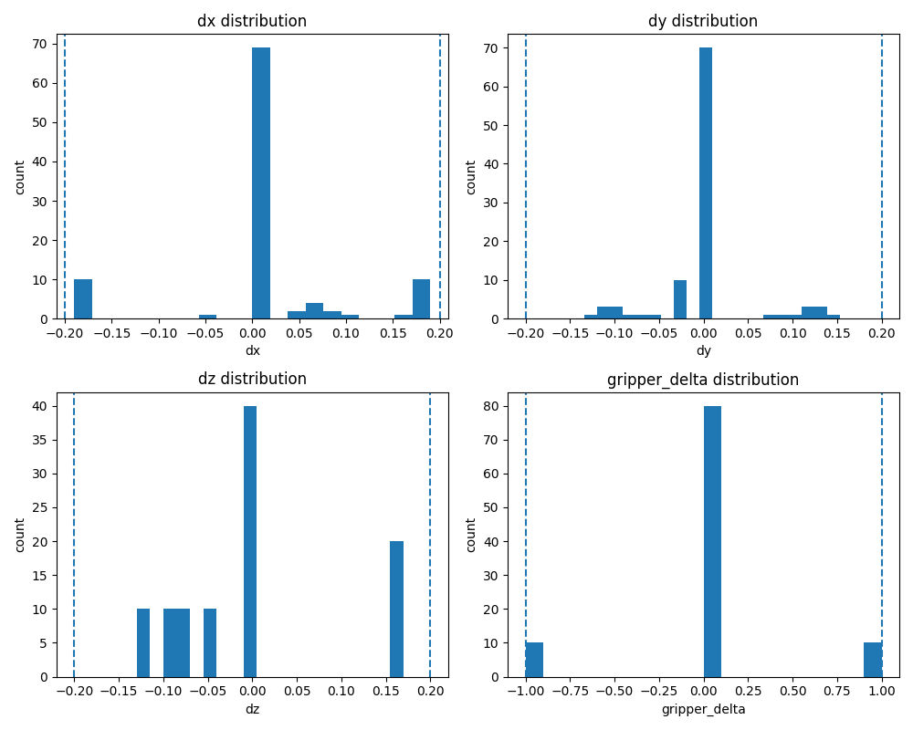

# 第 13 章：规则式 Pick-and-Place 专家策略

前面几章，我们已经一点点把主线任务的底座搭了起来：

- 第 6–8 章明确了任务、episode 数据结构与质检方法；
- 第 9–10 章把数据记录与转换链路接了起来；
- 第 11 章解决了从视觉观测到抓取空间目标的变换问题；
- 第 12 章又把机械臂、夹爪、控制抽象和规划流程理顺了。

到这里，整个系统终于来到一个非常关键的节点：

> 我们能不能先不用学习策略，而是写一个**规则式 expert**，把第一个 pick-and-place 任务真正跑起来？

答案是：必须先做，而且非常值得做。

因为对具身智能初学者而言，规则式 expert 不只是过渡方案，它有四个非常现实的价值：

1. 它能帮你验证任务定义、空间链路和控制接口是否连得通；
2. 它能生成第一批可用 episode，为后续模仿学习提供数据；
3. 它能让你看清一个抓取任务到底被拆成哪些阶段；
4. 它能把“策略”从抽象概念变成具体可执行的状态机。

所以，本章不是在讲“传统方法过时了”，恰恰是在说明：**没有规则 expert，很多人根本走不到学习策略那一步。**

---

## 1. 本章要解决的问题

本章重点解决以下问题：

1. 为什么在模仿学习之前，应该先写一个规则式 expert？
2. `pick_box_to_bin` 这种任务应该拆成哪些阶段？
3. 如何把这些阶段组织成状态机？
4. 规则动作怎样保存为 episode？
5. 规则 expert 的数据和后续人类遥操作数据有什么关系？
6. 规则 expert 的局限在哪里？
7. 主线项目如何用脚本生成 10 条可验证的 scripted episodes？

---

## 2. 为什么这个问题重要

### 2.1 规则 expert 是工程闭环的“冒烟测试”

自动驾驶里，我们常常会先写一个简单的基线，先验证模块间接口是否通；机器人学习同样需要这种基线。规则 expert 的意义在于：

- 不用等遥操作系统完善；
- 不用等大模型策略训练完成；
- 先让感知、空间、控制、记录四条链路真正串一次。

如果连规则 expert 都跑不通，那么大多数情况下不是“模型能力不够”，而是系统工程还没打透。

### 2.2 它能把任务结构暴露出来

很多人说“做个 pick-and-place”，听起来像一句话，但真正写脚本时会发现，至少要拆成这些阶段：

- 回到初始位姿；
- 观察 / 估计目标；
- 移动到目标上方；
- 向下接近；
- 关闭夹爪；
- 抬升；
- 平移到容器上方；
- 放下；
- 打开夹爪；
- 回 home。

也就是说，规则 expert 迫使你把任务从口头描述压缩成**状态机 + 条件切换**。

### 2.3 它能生成第一个“像样”的数据集

第 7 章我们已经知道 episode 的格式；第 8 章也已经知道如何做质检。但如果没有真实 episode，前面的数据格式设计就还是停留在“教学样例”层面。

规则 expert 的一个重要贡献，是让我们第一次拥有：

- 一组连续动作；
- 一组随动作变化的状态；
- 一组图像帧；
- success / failure 标签；
- 失败原因（`failure_reason`）。

这正是后续模仿学习最需要的基本材料。

---

## 3. 核心概念

### 3.1 规则式 expert 是什么

本章所说的规则式 expert，本质上是一段带有任务先验的程序。它不靠学习得到策略，而是手工把任务拆成阶段，并为每个阶段写出：

- 进入条件；
- 执行动作；
- 完成条件；
- 异常处理。

你可以把它理解为：一个**可执行的任务剧本**。

### 3.2 为什么状态机是最自然的表达方式

对于 pick-and-place 这类操作任务，状态机非常适合，因为：

- 阶段边界清晰；
- 每个阶段有明显的动作语义；
- 容易加入条件判断；
- 易于记录和调试。

在本章主线项目中，我们采用的最小状态机大致包含：

1. `Home`
2. `MoveAboveObject`
3. `MoveDown`
4. `CloseGripper`
5. `Lift`
6. `MoveAboveBin`
7. `MoveDownToBin`
8. `OpenGripper`
9. `ReturnHome`

### 3.3 什么是 pre-grasp / grasp / place

这些名字在具身智能任务里非常常见：

- **pre-grasp**：位于目标上方的安全准备位姿；
- **grasp**：真正接触并闭合夹爪的位姿；
- **lift**：抓住后抬升到安全高度；
- **pre-place**：位于放置容器上方的准备位姿；
- **place**：把物体放到目标区域的位姿。

把这些术语先标准化，后面你做人类遥操作数据采集或学习策略分析时就会轻松很多。

### 3.4 规则 expert 的数据为什么有价值

它的价值不一定在于“足够强”，而在于“足够干净、足够可解释”：

- 每一步动作来源清楚；
- 每一阶段语义清楚；
- 失败原因容易标；
- 非常适合作为第一批教学数据。

当然，它也有明显局限：

- 泛化能力弱；
- 很依赖场景先验；
- 一旦目标位置变化复杂、遮挡严重或任务分支变多，脚本会迅速膨胀。

但这不影响它在系统早期阶段的重要性。

---

## 4. 概念图 / 流程图 / 架构图

### 4.1 图 13-1 规则式 Pick-and-Place 状态机



这张图就是本章最核心的“任务剧本”。它把脚本策略从一堆 if/else 逻辑，变成了可视化的阶段流。

### 4.2 图 13-2 从规则 Expert Rollout 到 Episode 数据



这张图把本章与前面所有章节连接起来：

- 输入端：观测与状态；
- 中间：规则策略与机器人动作；
- 记录端：图像、状态、动作、元数据；
- 输出端：一个 episode 文件夹。

### 4.3 Mermaid 图：脚本策略执行流程



### 4.4 Mermaid 图：规则策略到数据记录



---

## 5. 工程化理解

### 5.1 规则 expert 不是为了“替代学习”，而是为了“清场”

系统一开始最怕的，不是策略不够强，而是所有问题混在一起：

- 是视觉错了？
- 是空间变换错了？
- 是夹爪时序错了？
- 是记录脚本错了？

规则 expert 的作用，就是先用最可控的方式把这些问题拆开。只要规则 expert 能稳定跑出一批合格数据，你就知道：

- 基本动作链是通的；
- episode 记录是通的；
- success/failure 标注逻辑是通的；
- 第 14 章进入遥操作采集时，你已经有对照基线了。

### 5.2 状态命名应该服务调试与数据分析

如果你把每一步都写成 `step1, step2, step3`，后面分析数据会非常难。更好的方式是使用有语义的阶段名：

- `pre_grasp`
- `approach`
- `grasp`
- `lift`
- `transfer`
- `place`
- `release`
- `return_home`

这样一来，你在查看 `states.jsonl` 或画时间线时，一眼就知道当前动作处在哪个阶段。

### 5.3 失败样本同样值得保留

本章生成的数据集中，除了成功轨迹，也保留了少量失败 episode，并为其标注 `failure_reason`。这很重要，因为真实机器人学习并不只依赖成功样本。失败样本可以帮助你：

- 分析哪一步最容易出错；
- 后续训练成功判别器或 reward model；
- 对比规则 expert 与人类遥操作之间的差异。

---

## 6. 主线项目中的位置

本章为主线项目新增：

```text
robot-learning-shelf-demo/
  scripts/
    scripted_pick_and_place.py
  datasets/
    dataset_v1_scripted/
      episode_1001/
      ...
      episode_1010/
  reports/
    ch13_scripted_rollout_summary.md
    ch13_dataset_v1_scripted_report.json
    ch13_dataset_v1_scripted_report.md
    ch13_dataset_v1_scripted_action_distribution.png
```

这些产出意味着：

- 项目第一次拥有一个真正可执行的脚本 expert；
- 项目第一次拥有一个以规则策略生成的批量 episode 数据集；
- 数据集已经通过第 8 章的通用质检脚本验证。

---

## 7. 示例

### 7.1 示例 1：运行脚本 expert 生成 10 条 episode

```bash
cd robot-learning-shelf-demo
python scripts/scripted_pick_and_place.py \
  --output_dir datasets/dataset_v1_scripted \
  --num_episodes 10 \
  --seed 42 \
  --fail_mode mixed \
  --summary_md reports/ch13_scripted_rollout_summary.md
```

该命令会生成：

- `episode_1001` 到 `episode_1010`；
- 每条 episode 的 `images/front` 与 `images/wrist`；
- `states.jsonl`、`actions.jsonl`、`meta.json`；
- 一份执行汇总 `ch13_scripted_rollout_summary.md`。

### 7.2 示例 2：验证规则数据集

```bash
python scripts/04_validate_dataset.py \
  --dataset_dir datasets/dataset_v1_scripted \
  --output_json reports/ch13_dataset_v1_scripted_report.json \
  --output_md reports/ch13_dataset_v1_scripted_report.md \
  --plot_path reports/ch13_dataset_v1_scripted_action_distribution.png
```

当前整合包中的验证结果为：

- `total_episodes = 10`
- `ok_episodes = 10`
- `bad_episodes = 0`

这说明数据格式、时间戳、图像数量与动作范围都满足当前教学版的质检约束。

### 7.3 示例 3：失败样本 `grasp_offset_too_large`

在 `mixed` 模式下，脚本会保留少量失败 episode。比如一个抓取偏移失败，其典型表现是：

- `pre_grasp` 与 `grasp` 在 x 方向存在固定偏差；
- 夹爪闭合后，物体并未随末端移动；
- `meta.json` 中 `success = false`；
- `failure_reason = grasp_offset_too_large`。

这类样本非常适合作为后续误差分析材料。

---

## 8. 练习代码

本章练习代码位于：

```text
scripts/scripted_pick_and_place.py
```

其中状态机主干非常值得反复阅读：

```python
plan = [
    ('reset', HOME_POSE, 0.0, 'Episode start'),
    ('observe', HOME_POSE, 0.0, 'Observe scene'),
    ('pre_grasp', pose_from_xyz(pre_grasp_xyz), 0.0, 'Move above object'),
    ('approach', pose_from_xyz(grasp_xyz), 0.0, 'Move down'),
    ('grasp', pose_from_xyz(grasp_xyz), -1.0, 'Close gripper'),
    ('lift', pose_from_xyz(lift_xyz), 0.0, 'Lift object'),
    ('transfer', pose_from_xyz(pre_place_xyz), 0.0, 'Move above bin'),
    ('place', pose_from_xyz(place_xyz), 0.0, 'Move down to bin'),
    ('release', pose_from_xyz(place_xyz), 1.0, 'Open gripper'),
    ('return_home', HOME_POSE, 0.0, 'Return home'),
]
```

建议你做三个小练习：

1. 增加一个 `pause_observe` 状态，让系统在接近前多停留一帧；
2. 增加 `collision_risk_detected` 的分支处理，不只是记录失败，而是提前中止；
3. 增加一个 `retract_after_release` 状态，使放下后先抬高再回 home。

---

## 9. 代码解释

### 9.1 `generate_episode()`

这是整章最关键的函数。它做了四件事：

1. 随机生成一个简化场景中的目标位置；
2. 根据场景位置构造一条抓取计划；
3. 逐步执行计划，并记录状态与动作；
4. 将结果落盘成 episode 目录。

### 9.2 `render_frame()`

为了降低依赖，这个函数使用非常简化的方式绘制教学图像帧。它不是为了逼真渲染，而是为了让读者看到：

- episode 里图像是如何随阶段变化的；
- 即使没有真实相机，我们也能先把数据闭环跑起来。

### 9.3 `failure_reason`

本章脚本不仅记录 `success`，还尽量让失败原因结构化，例如：

- `object_dropped_during_transfer`
- `grasp_offset_too_large`
- `collision_risk_detected`

这对后面做失败分析、构建奖励模型或人机对比很有帮助。

---

## 10. 常见错误

### 10.1 把规则 expert 写成一串不可读的硬编码

如果所有数值都散落在代码里、所有阶段都没有名字，后面你很难调试，也很难把动作序列解释给别人。状态机的价值，正在于把结构显式化。

### 10.2 只保留成功样本

这会让你失去很多有价值的系统信号。即使是教学数据，也建议保留少量带失败原因的轨迹。

### 10.3 episode 记录与控制动作不同步

如果图像帧、状态和动作没有同步保存，后面模仿学习阶段会出现“看着像对的，训练却不稳定”的问题。规则 expert 早期就应该养成同步记录的习惯。

### 10.4 误以为规则数据可以直接替代真实示教数据

规则数据适合做起步和基线，但它无法覆盖更复杂的变化场景，也难以体现人类操作的柔性与修正行为。所以它更像“第一层脚手架”，而不是最终答案。

---

## 11. 本章练习

1. 画出 `pick_box_to_bin` 的状态机，并解释每个状态的进入 / 退出条件；
2. 给 `scripted_pick_and_place.py` 增加一个失败恢复分支；
3. 手动打开某条 episode，观察 `states.jsonl` 中 `phase` 字段如何变化；
4. 比较成功 episode 与失败 episode 的 `meta.json`；
5. 思考：规则 expert 数据与人类遥操作数据相比，各自更适合解决什么问题？

---

## 12. 本章产出

完成本章后，项目新增：

- 规则策略脚本：`scripts/scripted_pick_and_place.py`
- 规则数据集：`datasets/dataset_v1_scripted/`
- 规则执行汇总：`reports/ch13_scripted_rollout_summary.md`
- 数据集验证报告：
  - `reports/ch13_dataset_v1_scripted_report.json`
  - `reports/ch13_dataset_v1_scripted_report.md`
  - `reports/ch13_dataset_v1_scripted_action_distribution.png`
- 第 13 章配图：
  - `images/ch13_scripted_pick_and_place_state_machine.png`
  - `images/ch13_expert_rollout_to_episode.png`

到此为止，主线项目已经真正拥有了“自动生成初始训练数据”的能力。

---

## 13. 小结

本章最重要的结论是：

> 规则式 expert 不是落后的替代品，而是具身智能工程早期最重要的系统验证器与数据生成器之一。

通过它，我们第一次把前面 1–12 章的内容真正串成了一条可执行链：

- 有任务；
- 有空间目标；
- 有控制动作；
- 有状态机；
- 有 episode；
- 有 success / failure；
- 有数据质检。

下一章开始，我们会继续往“真实数据”方向推进，进入遥操作数据采集。这时你会发现：有了规则 expert 作为对照基线，后续所有示教与学习过程都会更容易理解，也更容易诊断问题。

### 补充结果图：scripted dataset 动作分布



