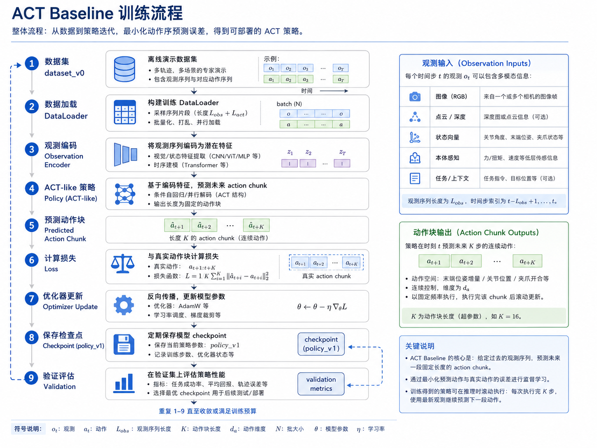
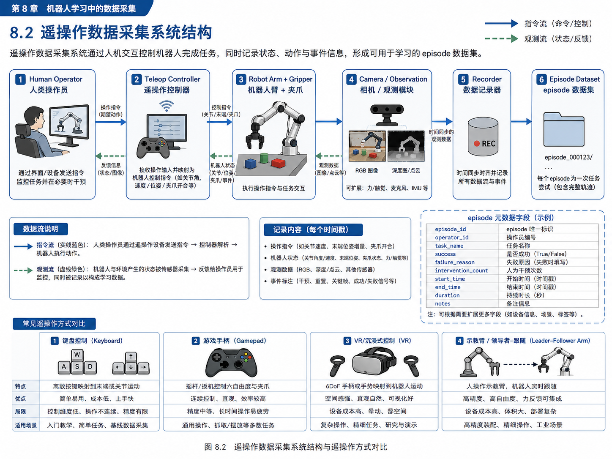
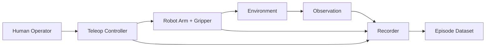
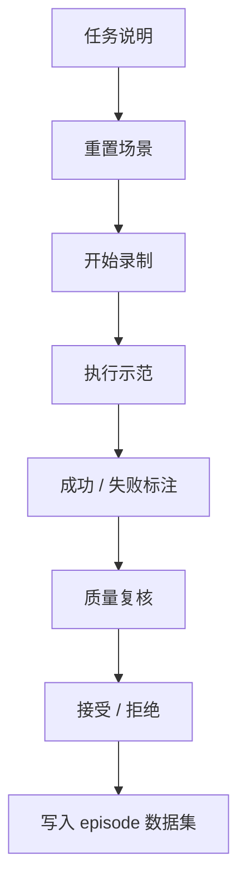

# 第 14 章：遥操作数据采集：机器人学习的数据来源

第 13 章我们用规则式 expert 跑通了第一个可执行的 pick-and-place 闭环，也生成了第一批 scripted episode。这个阶段非常关键，因为它让系统第一次真正“动了起来”。

但如果你想继续往模仿学习、行为克隆、ACT、Diffusion Policy、VLA 方向走，很快就会遇到一个现实问题：

> 机器人学习真正稀缺的，并不是模型代码，而是高质量动作数据。

在自动驾驶里，很多人会把注意力放在模型结构上；可一旦真正进入工程落地，你会发现最昂贵、最难持续积累的，往往是数据系统本身。具身智能更是如此，因为它不仅需要：

- 观测；
- 动作；
- 状态；
- 成功/失败标签；
- 任务上下文；
- 甚至还需要把“人是怎么做这件事的”记录下来。

这就是遥操作（teleoperation）的意义。

本章开始，我们从“脚本生成数据”继续往前推进，进入**人类示范数据采集**。你会看到：

- 为什么很多机器人学习系统都离不开遥操作；
- 为什么采集系统不是“加一个手柄”这么简单；
- 为什么失败样本、干预信息、操作员信息都应该进入 episode；
- 为什么即使是低成本键盘遥操作，也依然有很高的教学价值。

本章会在主线项目中新增一个**键盘遥操作模拟采集器**，让你在没有真机、没有 VR、没有主从机械臂的情况下，依旧能够理解一条 teleop episode 是如何被构造出来的。

---

## 1. 本章要解决的问题

本章重点解决以下问题：

1. 为什么遥操作是机器人学习的重要数据来源？
2. 遥操作系统由哪些部分组成？
3. 为什么 episode 里不仅要记录动作，还要记录 `operator_id`、`intervention_count`、`failure_reason`？
4. 键盘、手柄、VR、主从机械臂有什么差异？
5. 一条遥操作示范为什么不能“采完就用”，而必须做 SOP 与质检？
6. 如何在主线项目中实现一个低成本的键盘遥操作模拟采集器？

---

## 2. 为什么这个问题重要

### 2.1 规则数据能起步，但遥操作数据决定上限

第 13 章的规则 expert 非常适合：

- 做系统联调；
- 验证空间变换；
- 生成干净基线数据；
- 快速覆盖标准成功轨迹。

但它也有明显局限：

- 轨迹往往太“标准”；
- 对异常和边界情况覆盖不足；
- 缺少人类操作中的修正、犹豫与恢复行为；
- 很难体现更高层的任务策略。

而遥操作数据恰好能补上这些空白。

### 2.2 机器人学习需要“人是怎么做的”

在许多操作任务里，最有价值的不是“任务完成了”，而是“人是以什么方式完成的”。比如：

- 接近目标时是否先停一下观察；
- 抓取前是否会微调对齐；
- 放置前是否会避开边缘碰撞；
- 出现偏差时是否会中途纠正。

这些都属于人类示范中的“隐性策略”。它们未必会直接写进规则 expert，却会自然地体现在遥操作轨迹中。

### 2.3 采集系统本身就是具身智能工程能力的一部分

很多读者从自动驾驶转向具身智能时，会习惯性地先盯住网络结构和训练框架。但在具身智能里，数据链路往往更先决定项目能不能跑通。

如果你没有：

- 稳定的采集方式；
- 明确的操作规范；
- 可追溯的 episode 结构；
- 对失败样本的处理原则；

那么模型阶段几乎必然会陷入混乱。

所以，**遥操作数据采集不是“辅助工作”，而是机器人学习系统的主干工程之一。**

---

## 3. 核心概念

### 3.1 遥操作的本质：人通过控制平面间接驱动机器人

遥操作并不等于“远程控制”，更准确地说，它是：

> 人通过某种输入设备，把自己的意图映射为机器人动作，并通过观测反馈闭环修正的过程。

这个输入设备可以是：

- 键盘；
- 游戏手柄；
- VR 控制器；
- 触觉设备；
- 主从机械臂；
- 甚至网页控制台。

关键不在于设备有多高级，而在于它是否能够形成稳定的人机闭环。

### 3.2 遥操作系统的基本组成

一个完整的遥操作采集系统，最少包含以下模块：

1. **Human Operator**：操作员；
2. **Teleop Controller**：输入映射与控制器；
3. **Robot Arm + Gripper**：被控执行体；
4. **Camera / Observation**：观测模块；
5. **Recorder**：数据记录器；
6. **Episode Dataset**：数据输出。

### 3.3 为什么 `operator_id` 很重要

很多初学者会忽略这个字段，觉得“谁操作不都一样吗？”

其实不一样。不同操作者会带来显著差异：

- 有的人动作更稳；
- 有的人更激进；
- 有的人失败后更会恢复；
- 有的人习惯先对齐、后接近；
- 有的人会产生更多犹豫与抖动。

因此，在 episode 里保留 `operator_id`，后续你可以：

- 分析操作员差异；
- 找出高质量示范来源；
- 做 teacher filtering；
- 训练时剔除低质量操作者数据。

### 3.4 `intervention_count` 为什么重要

遥操作看上去像是“人一直在操作”，但在很多半自动系统里，人其实是：

- 只在关键阶段接管；
- 在系统偏离后纠偏；
- 在异常时暂停或重置；
- 在失败边缘进行抢救性干预。

这些干预次数本身就是非常有价值的元数据，因为它能告诉你：

- 某条示范是否顺畅；
- 某个阶段是否难；
- 某个系统是否稳定；
- 某类任务是否对人负担过高。

### 3.5 `failure_reason` 不只是为了统计失败率

`failure_reason` 至少有三个作用：

1. 帮助你区分“示范不好”与“任务确实难”；
2. 后续构建 reward model / success classifier 时提供标签；
3. 帮助你决定哪些失败样本值得保留，哪些应该丢弃。

比如：

- `bad_alignment`
- `drop_during_transfer`
- `timeout`
- `collision_risk_detected`
- `sensor_lost`

这些失败原因，对后续分析非常有帮助。

---

## 4. 概念图 / 流程图 / 架构图

### 4.1 图 14-1 遥操作数据采集系统结构



这张图建议你反复看。它不是在讲某个具体产品，而是在讲一个通用的机器人学习采集结构：

- 命令流从人到机器人；
- 观测流从机器人和环境回到人；
- 所有流都应该被 recorder 按时间同步记录；
- 最终以 episode 形式落盘。

### 4.2 图 14-2 从人类示范到 Episode 数据



这张图把“演示”与“训练数据”之间的转换过程画得很直观。它提醒我们：

- 演示本身不是数据集；
- 只有当观测、动作、状态、元数据被同步记录后，才变成可训练 episode；
- SOP 与示范质量标注是必须环节，而不是可选项。

### 4.3 Mermaid 图：遥操作系统主流程



### 4.4 Mermaid 图：采集 SOP



---

## 5. 工程化理解

### 5.1 采集系统的首要目标不是“先进”，而是“稳定”

如果你是从自动驾驶转过来的，很容易被各种高大上的遥操作设备吸引，比如：

- VR；
- 触觉手套；
- 主从机械臂；
- 远程双臂系统。

这些当然重要，但教学项目的第一目标应该是：

- 先把采集链路跑通；
- 先让 episode 格式一致；
- 先让标注规范可执行；
- 先有一套最小可用 SOP。

因此，本章主线项目 deliberately 选择了一个**低成本键盘遥操作模拟器**。目的不是为了说明“键盘最好”，而是为了强调：

> 你可以先用最低门槛方式理解完整数据链路，再逐步替换成更真实的硬件采集方案。

### 5.2 键盘遥操作为什么仍然值得学

它有三个优势：

1. 它足够简单，容易理解动作映射；
2. 它能迫使你明确 action 定义；
3. 它天然暴露“操作不连续”和“输入离散”的问题，这反而有助于你理解更高级设备的价值。

在本章实现中，我们采用的最小映射大致如下：

- `W/S`：沿 y 轴移动；
- `A/D`：沿 x 轴移动；
- `Q/E`：沿 z 轴移动；
- `C`：关闭夹爪；
- `O`：打开夹爪；
- `H`：回 home。

### 5.3 低质量示范不能直接进入训练

这是遥操作采集最容易踩坑的地方。常见低质量示范包括：

- 画面严重遮挡；
- 关键帧缺失；
- 操作过程抖动极大；
- 明明失败，却被标为成功；
- 完整度不足，抓取过程被截断；
- 操作员为了赶时间，行为非常不自然。

所以，遥操作采集的标准流程一定要包含：

- 采集；
- 审核；
- 接受 / 拒绝。

### 5.4 成功样本不是唯一有价值的数据

本章演示里，我们不仅生成了 5 条成功示范，还保留了 3 条失败示范。原因是：

- 失败样本能帮助你理解任务边界；
- 失败原因可以用于后续训练成功判别器；
- 在开放场景里，机器人系统不可能只遇到成功轨迹。

---

## 6. 主线项目中的位置

本章为主线项目新增：

```text
robot-learning-shelf-demo/
  scripts/
    keyboard_teleop_sim.py
  ros2_ws/src/
    shelf_demo_teleop/
      README.md
  datasets/
    dataset_teleop_demo/
      episode_2001/
      ...
      episode_2008/
  reports/
    ch14_keyboard_teleop_summary.md
    ch14_keyboard_teleop_summary.json
```

这意味着项目第一次具备了：

- 人类示范（教学模拟）数据来源；
- `operator_id` / `intervention_count` / `failure_reason` 等关键元数据；
- 成功与失败示范并存的数据采集能力。

---

## 7. 示例

### 7.1 示例 1：运行键盘遥操作模拟采集

```bash
cd robot-learning-shelf-demo
python scripts/keyboard_teleop_sim.py \
  --output_dir datasets/dataset_teleop_demo \
  --num_success 5 \
  --num_failure 3 \
  --operator_id_prefix teacher \
  --seed 42 \
  --summary_md reports/ch14_keyboard_teleop_summary.md \
  --summary_json reports/ch14_keyboard_teleop_summary.json \
  --reset
```

当前整合包中，这条命令已经被执行，生成结果为：

- 总 episode 数：8
- 成功 episode：5
- 失败 episode：3

其中失败原因分别覆盖：

- `bad_alignment`
- `drop_during_transfer`
- `timeout`

### 7.2 示例 2：查看一条成功示范的元数据

示教 episode 的 `meta.json` 中，除了 `success` 以外，还会保存：

```json
{
  "task_name": "pick_box_to_bin_teleop_keyboard",
  "source": "teleop_keyboard_sim",
  "teleop_device": "keyboard",
  "operator_id": "teacher_01",
  "success": true,
  "failure_reason": null,
  "intervention_count": 0
}
```

这说明：

- 数据来源是遥操作模拟；
- 输入设备是键盘；
- 该条轨迹来自 `teacher_01`；
- 任务顺利完成；
- 没有额外干预。

### 7.3 示例 3：失败示范为什么值得保留

比如 `episode_2007` 对应的失败原因为 `drop_during_transfer`。这类轨迹有几个分析价值：

- 它表明夹持稳定性是风险点；
- 它能帮助你定位“是接近阶段错，还是搬运阶段掉落”；
- 它能作为后续 reward learning 的负样本。

---

## 8. 练习代码

本章练习代码位于：

```text
scripts/keyboard_teleop_sim.py
```

其中最值得关注的是动作输入与末端位姿的映射逻辑：

```python
KEY_MAP = {
    'w': [0.00, 0.02, 0.00],
    's': [0.00, -0.02, 0.00],
    'a': [-0.02, 0.00, 0.00],
    'd': [0.02, 0.00, 0.00],
    'q': [0.00, 0.00, 0.02],
    'e': [0.00, 0.00, -0.02],
    'o': [0.00, 0.00, 0.00],
    'c': [0.00, 0.00, 0.00],
    'h': [0.00, 0.00, 0.00],
}
```

这段代码看似简单，但它背后体现的是一个关键思想：

> 遥操作系统必须先明确“人的输入”如何被映射成“机器人动作空间”。

建议你尝试修改：

1. 为 `j/l` 增加 yaw 控制；
2. 把键盘输入改成游戏手柄风格的连续值；
3. 为 `bad_alignment` 增加自动暂停和人工恢复逻辑。

---

## 9. 代码解释

### 9.1 `create_episode()`

这是本章的核心函数。它做了以下事情：

1. 生成一个目标物体位置；
2. 构造抓取与放置过程；
3. 把每一步操作记录成状态与动作；
4. 将前视角和腕部视角保存为图像帧；
5. 最终把整条示范写成一个 episode 目录。

### 9.2 `record_step()`

它负责把一次时刻写成：

- `states.jsonl`
- `actions.jsonl`
- 图像帧

也就是把“操作过程”变成“训练样本”。

### 9.3 为什么要保存 `pressed_key`

在真实项目里，你未必会把所有原始输入都保存下来，但在教学项目里保留 `pressed_key` 很有帮助，因为它能直接让读者看到：

- 人的输入是什么；
- 机器人动作又是什么；
- 输入映射是否直观；
- 某些失败是否来自操作不熟练。

---

## 10. 常见错误

### 10.1 只关注成功率，不关注示范质量

高成功率不代表高质量数据。如果轨迹全程抖动、遮挡严重、动作不自然，训练效果照样可能很差。

### 10.2 不记录操作员信息

后面当你发现某些数据质量特别差时，如果没有 `operator_id`，你就很难追踪问题来源。

### 10.3 把失败样本全部删除

这会导致你失去大量关于任务边界的信息。正确做法是：区分“有分析价值的失败”与“纯噪声失败”。

### 10.4 遥操作链路和数据链路分离

如果人在操作，但 recorder 没有同步记录动作、状态和图像，最后你得到的只是“视频”，而不是可训练 episode。

---

## 11. 本章练习

1. 画出你自己的遥操作采集系统结构图；
2. 修改 `keyboard_teleop_sim.py`，增加一个 `gamepad_mode`；
3. 采集 5 条成功示范与 3 条失败示范；
4. 给失败示范补充更细粒度的 `failure_reason`；
5. 思考：什么样的遥操作示范不应该进入训练集？

---

## 12. 本章产出

完成本章后，项目新增：

- 键盘遥操作模拟器：`scripts/keyboard_teleop_sim.py`
- 遥操作模块说明：`ros2_ws/src/shelf_demo_teleop/README.md`
- 遥操作数据集：`datasets/dataset_teleop_demo/`
- 统计报告：
  - `reports/ch14_keyboard_teleop_summary.md`
  - `reports/ch14_keyboard_teleop_summary.json`
- 第 14 章配图：
  - `images/ch14_teleoperation_system_structure.png`
  - `images/ch14_human_demo_to_episode_data_flow.png`

---

## 13. 小结

本章最重要的结论是：

> 遥操作数据采集，不是“给模型喂点人类数据”这么简单，而是一套完整的数据工程与操作规范系统。

通过本章，你应该已经建立以下认识：

- 机器人学习的高质量动作数据，大量来自遥操作；
- 遥操作系统至少要包含输入、控制、观测、记录与 episode 输出；
- `operator_id`、`intervention_count`、`failure_reason` 都是重要元数据；
- 低成本键盘遥操作也能帮助我们理解完整的数据链路；
- 示范采集必须配合 SOP 与质检，不能“录了就训”。

下一章，我们会把第 13 章的 scripted 数据与第 14 章的 teleop 数据真正整合起来，构建第一版可训练数据集 `dataset_v0`。
