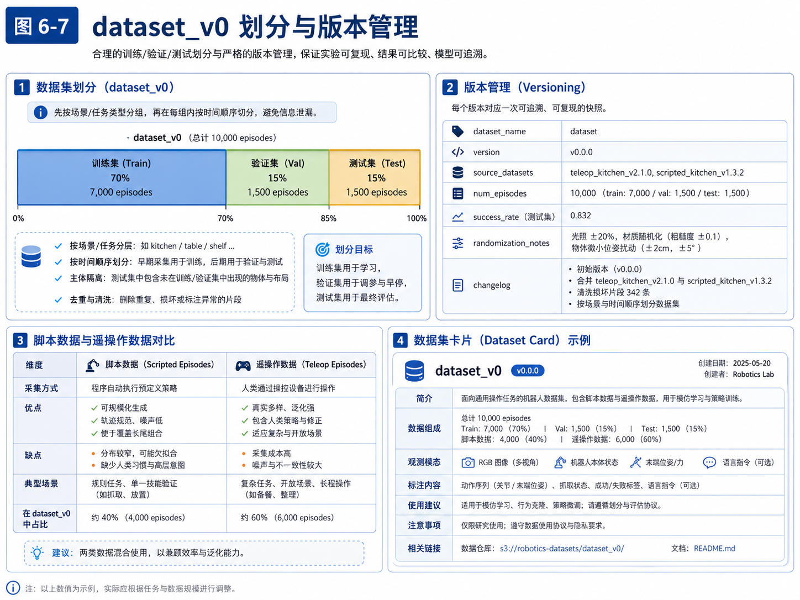
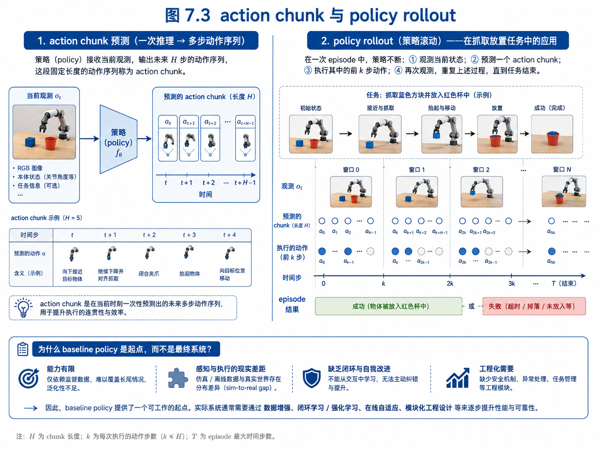
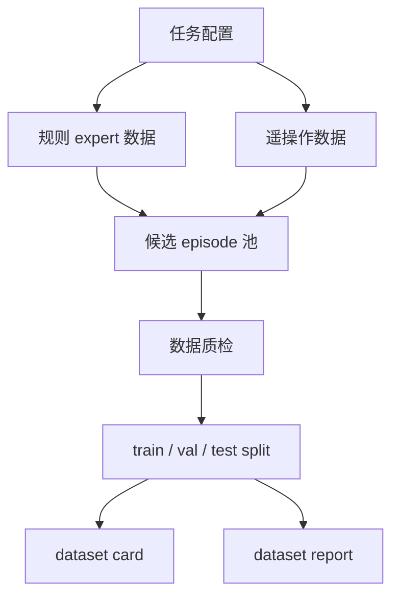
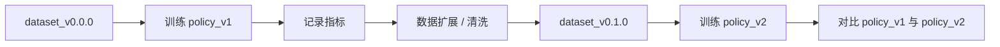

# 第 15 章：构建第一版数据集 dataset_v0

到了这一章，我们终于来到一个非常关键的节点：

- 第 13 章，我们得到了规则式 expert 数据；
- 第 14 章，我们得到了遥操作示范数据；
- 现在，我们要把这些“分散的数据来源”整合成**第一版可训练数据集**。

对很多刚接触具身智能的工程师来说，容易产生一个误解：

> 只要目录里堆满 episode，就叫数据集。

事实上并不是。

一个真正可训练、可评测、可迭代的数据集，至少应该回答以下问题：

- 这批数据包含哪些任务？
- 数据来自哪里？
- 成功与失败比例是否合理？
- train / val / test 怎么划分？
- 是否避免了数据泄漏？
- 这个数据集的版本号是什么？
- 下次更新以后，如何比较新旧结果？

这也是为什么本章的关键词不只是“收集数据”，而是：

- 组织；
- 划分；
- 版本化；
- 报告化；
- 可追溯。

从自动驾驶经验迁移过来，这一步可以理解为：我们要把“零散采集片段”，升级成“可稳定支撑训练与评估的数据资产”。

---

## 1. 本章要解决的问题

本章重点解决以下问题：

1. `dataset_v0` 的设计目标是什么？
2. 为什么要把 scripted episode 和 teleop episode 混合起来？
3. 如何做 train / val / test 划分？
4. 为什么要避免 train 和 test 之间的信息泄漏？
5. 为什么数据集必须版本化？
6. 如何生成一份 dataset report？

---

## 2. 从“有数据”到“有数据集”

### 2.1 规则数据和遥操作数据不是竞争关系，而是互补关系

规则式 expert 数据的优点是：

- 生成快；
- 一致性强；
- 便于扩展；
- 特别适合做系统联调和早期 baseline。

遥操作数据的优点是：

- 轨迹更接近人类策略；
- 覆盖边界情况更自然；
- 含有修正与恢复行为；
- 对开放场景适应更强。

因此，`dataset_v0` 的目标不是“选一边”，而是组合两边：

- 用 scripted 数据提供规范基线；
- 用 teleop 数据补充真实多样性；
- 用统一的数据结构把它们放在一个可训练集合里。

### 2.2 数据集构建的本质是设计“学习分布”

模型最终学到什么，不完全取决于模型结构，更取决于你给它看了什么数据。

如果数据集：

- 全是成功样本；
- 全是规则直线轨迹；
- 场景永远不变；
- 测试集和训练集几乎一模一样；

那么你训练出来的模型大概率只会对“教学演示环境”表现得很好，一旦换场景，就会暴露问题。

所以，构建数据集其实是在设计一个学习分布：

- 覆盖哪些任务；
- 包含哪些难度层级；
- 引入哪些扰动和随机化；
- 保留多少失败样本；
- 如何让 val/test 保持评测价值。

---

## 3. dataset_v0 的设计目标

### 3.1 最小可训练，而不是最终完美

本书里的 `dataset_v0` 是一个教学型第一版数据集，它不追求规模最大，而追求：

- 能支撑第一个 baseline 训练；
- 能支撑 train / val / test 评估；
- 能让读者看懂数据组织方式；
- 能为后续扩展到更大规模做好结构准备。

### 3.2 必须具备的五个属性

一个合格的 `dataset_v0` 至少具备：

1. **任务覆盖明确**：知道它在训练什么任务；
2. **成功/失败平衡合理**：不是清一色成功；
3. **来源可追溯**：知道 episode 来自 scripted 还是 teleop；
4. **版本可管理**：知道这个数据集是哪一版；
5. **划分可复现**：知道 train / val / test 是怎么来的。

---

## 4. 概念图 / 流程图 / 架构图

### 4.1 图 15-1 dataset_v0 构建流程



这张图把本章的主线讲清楚了：

- 任务配置决定采什么；
- scripted 数据和 teleop 数据共同进入候选池；
- 通过数据质检筛出可用 episode；
- 再做 train / val / test 划分；
- 最后生成 dataset report。

### 4.2 图 15-2 dataset_v0 划分与版本管理



这张图的重点在于强调：

- 划分不是简单随机打乱；
- 数据集必须伴随版本信息、数据卡片、来源记录与 changelog；
- 这样才能支撑真正的实验对比和后续闭环迭代。

### 4.3 Mermaid 图：dataset_v0 构建管线



### 4.4 Mermaid 图：版本化与评测关系



---

## 5. 数据集设计的工程原则

### 5.1 train / val / test 的角色必须清楚

- **train**：用于学习参数；
- **val**：用于调参与选择 checkpoint；
- **test**：用于最终评估。

最常见的错误是把 val 当成 test，或者不断在 test 上反复调参，最终让 test 失去“真正未知数据”的意义。

### 5.2 为什么不能完全随机切分

如果只是把所有 episode 打乱后随机切分，你很容易出现：

- 同一场景的极相似轨迹同时出现在 train 和 test；
- 同一个物体布局在 train 和 val 中高度重复；
- 同一来源的重复 episode 被分到不同集合。

这样会导致评测过于乐观。

本书主线项目中，我们对教学数据做了轻量的**按 `source × success` 分层**，这是一个简化但合理的起点。真实项目中，你应该进一步考虑：

- 场景分层；
- 物体分层；
- 难度分层；
- 时间顺序分层；
- 甚至操作者分层。

### 5.3 成功/失败比例为什么重要

如果数据集里只有成功样本，模型会天然低估失败边界。

如果失败样本过多，又可能：

- 拉低行为克隆学习质量；
- 让模型学到过多保守动作；
- 或者在 reward / success 建模上产生偏移。

因此，数据集不是“失败越多越好”或“失败越少越好”，而是要：

- 失败样本有明确用途；
- 失败原因可区分；
- 训练目标与数据比例相匹配。

### 5.4 为什么一定要写 dataset card

很多团队到最后都能把模型训起来，但一旦过几周回头看，会发现自己根本说不清：

- 那次结果最好的是哪版数据？
- 那一版数据比上一版多了什么？
- train 和 val 的比例是多少？
- 是否做过清洗？

dataset card 的意义，就是把这些信息显式化。它是数据工程的“最小文档化单元”。

---

## 6. 主线项目中的位置

本章新增/完善：

```text
robot-learning-shelf-demo/
  scripts/
    build_dataset_v0.py
  datasets/
    dataset_v0/
      train/
      val/
      test/
      splits/
      dataset_card.json
      manifest.json
      README.md
  reports/
    ch15_dataset_v0_report.json
    ch15_dataset_v0_report.md
```

### 6.1 当前整合包里的 dataset_v0 是一个紧凑教学版

按照原始练习规划，你完全可以继续扩展为：

- 50 条成功 episode；
- 20 条失败 episode；
- 更多 scene / object randomization。

但为了让整合包保持轻量、便于 mdBook 和 GitHub 管理，当前集成版提供的是一个**可运行、可训练的紧凑版 `dataset_v0`**：

- 总 episode：18
- success rate：0.7778
- source：
  - `scripted_state_machine`：10
  - `teleop_keyboard_sim`：8

---

## 7. 示例

### 7.1 示例 1：构建 dataset_v0

```bash
cd robot-learning-shelf-demo
python scripts/build_dataset_v0.py \
  --source_dirs datasets/dataset_v1_scripted datasets/dataset_teleop_demo \
  --output_dir datasets/dataset_v0 \
  --seed 2026 \
  --dataset_name dataset_v0 \
  --version v0.0.0 \
  --report_json reports/ch15_dataset_v0_report.json \
  --report_md reports/ch15_dataset_v0_report.md
```

该命令已经在整合包中执行完成。

### 7.2 示例 2：当前 dataset_v0 的统计结果

当前教学版 `dataset_v0` 的统计如下：

| split | episodes | success | failure | success_rate | source |
|---|---:|---:|---:|---:|---|
| train | 11 | 9 | 2 | 0.8182 | scripted + teleop |
| val | 3 | 2 | 1 | 0.6667 | scripted + teleop |
| test | 4 | 3 | 1 | 0.75 | scripted + teleop |

整体：

- total_episodes = 18
- success_count = 14
- failure_count = 4
- success_rate = 0.7778

### 7.3 示例 3：dataset card 的最小内容

本章产出的 `dataset_card.json` 至少包含：

- `dataset_name`
- `version`
- `num_episodes`
- `success_rate`
- `splits`
- `source_counter`
- `task_name`
- `modalities`

这已经足以支撑第一版教学实验。

---

## 8. 练习代码

本章练习代码位于：

```text
scripts/build_dataset_v0.py
```

其中最关键的流程是：

1. 扫描输入数据源目录；
2. 读取各 episode 的 `meta.json`；
3. 按 `source × success` 分组；
4. 做 train / val / test 划分；
5. 拷贝 episode 到目标数据集；
6. 生成 manifest、dataset card 和报告。

下面这段代码体现了“按来源与成功率轻量分层”的思路：

```python
groups: dict[tuple[str, bool], list[dict[str, Any]]] = defaultdict(list)
for item in items:
    key = (item['meta'].get('source', 'unknown'), bool(item['meta'].get('success', False)))
    groups[key].append(item)
```

对于教学项目，这已经足够清晰；对于真实项目，你可以把分层条件扩展成：

- `task_name`
- `scene_id`
- `difficulty`
- `operator_id`
- `object_category`

---

## 9. 代码解释

### 9.1 `scan_episode_dirs()`

这个函数负责在数据源目录下扫描所有包含 `meta.json` 的 episode 目录。它体现了一个好习惯：

> 所有数据集处理脚本，最好都围绕统一的 episode 目录约定工作。

这样后续你替换数据源时，不需要重写整个处理逻辑。

### 9.2 `stratified_split()`

本函数做的是轻量分层切分。它的目标不是做最复杂的统计最优切分，而是先满足：

- scripted / teleop 都能进入 train / val / test；
- success / failure 都能被保留；
- 划分可以复现。

### 9.3 `copy_episode()`

它会把源 episode 拷贝到目标数据集中，同时：

- 重新编号；
- 更新 `episode_id`；
- 记录 `original_episode_id`。

这一步能保证新的数据集具有统一编号体系，同时保留溯源能力。

### 9.4 为什么要输出 `manifest.json`

因为你迟早会需要回答：

- 这版数据集中到底有哪些 episode？
- 它们被分到了哪个 split？
- 来自哪个源数据集？

`manifest.json` 正是为这个问题服务的。

---

## 10. 常见错误

### 10.1 把所有数据都丢进 train

这样做短期看方便，长期看几乎一定会让你失去评测基准。

### 10.2 划分过程不可复现

如果你没有固定随机种子，或者没有保存 split manifest，那么下次重新构建数据集时，train / val / test 可能完全不同，实验结果也就无法比较。

### 10.3 没有版本号

“最新数据集”这种说法在工程里几乎没有意义。你必须明确：

- `v0.0.0`
- `v0.1.0`
- `v1.0.0`

每一版都应该对应可复现快照。

### 10.4 只写数据，不写报告

数据集报告不是形式主义。它能逼着你把：

- 数据规模；
- 成功率；
- 来源分布；
- 划分策略；
- 版本信息；

全部显式写出来。

---

## 11. 本章练习

1. 把 `dataset_v0` 扩展成 50 条成功 + 20 条失败 episode；
2. 为 `build_dataset_v0.py` 增加 `scene_id` 分层切分；
3. 新增 `difficulty` 字段，并在 split 时保持难度比例；
4. 把 `dataset_card.json` 扩展成更完整的 dataset card；
5. 思考：为什么 val / test 不能和 train 完全同分布？

---

## 12. 本章产出

完成本章后，主线项目新增：

- 数据集构建脚本：`scripts/build_dataset_v0.py`
- 第一版教学数据集：`datasets/dataset_v0/`
- 数据集卡片：`datasets/dataset_v0/dataset_card.json`
- 数据集 manifest：`datasets/dataset_v0/manifest.json`
- 数据集报告：
  - `reports/ch15_dataset_v0_report.json`
  - `reports/ch15_dataset_v0_report.md`
- 第 15 章配图：
  - `images/ch15_dataset_v0_build_pipeline.png`
  - `images/ch15_dataset_split_and_versioning.png`

---

## 13. 小结

本章最重要的结论是：

> 数据集不是 episode 的堆积，而是对学习分布、评测协议与数据可追溯性的工程化设计。

通过本章，你应该掌握：

- `dataset_v0` 的目标是“第一版可训练数据集”；
- scripted 与 teleop 数据应该互补使用；
- train / val / test 必须职责清晰；
- split 必须尽量避免信息泄漏；
- 数据集必须版本化、报告化、可追溯。

下一章，我们会使用本章生成的 `dataset_v0`，训练第一个 ACT baseline，让整个“数据 -> 模型 -> 评测”的主线第一次真正闭合起来。
