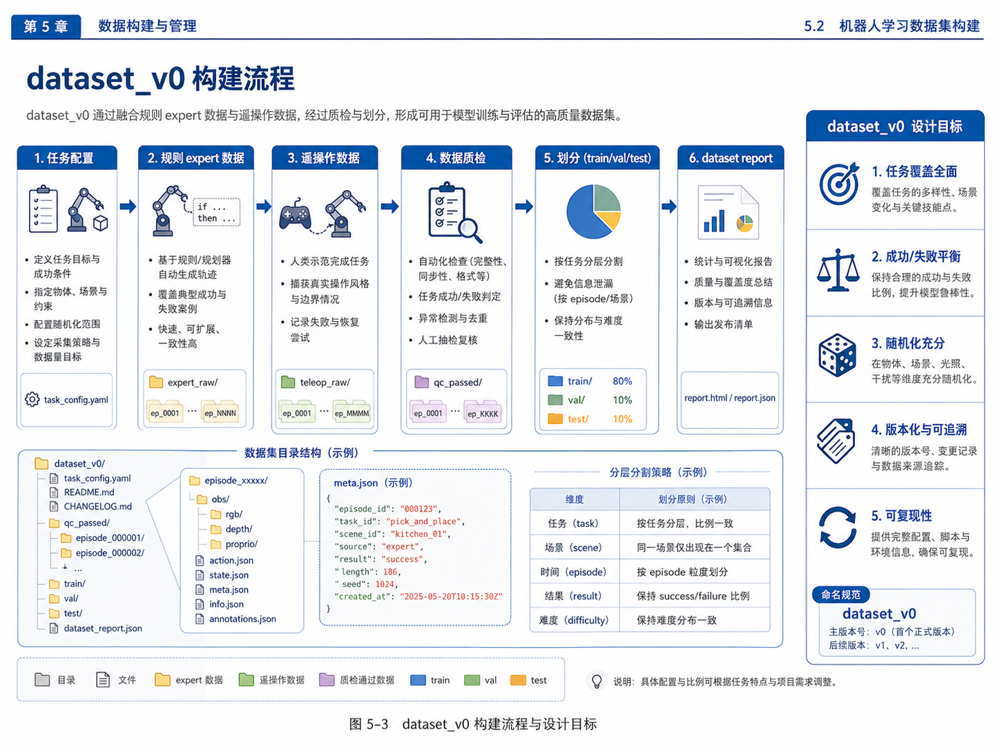
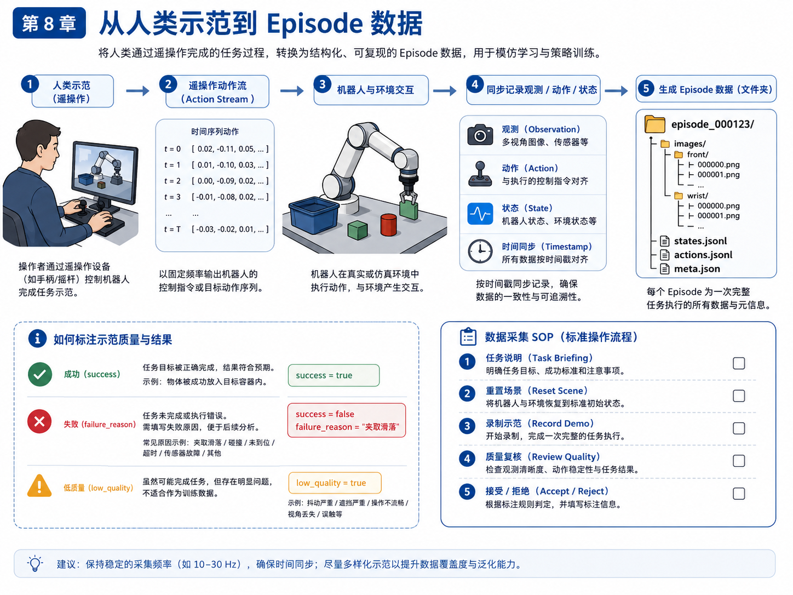
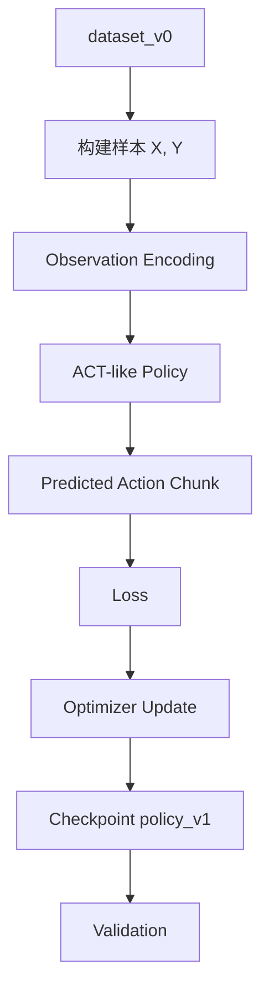
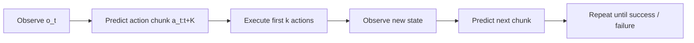

# 第 16 章：训练第一个 ACT Baseline

到这里，我们终于走到了一个非常有成就感的位置：

- 前面十几章，我们一直在补系统地基；
- 我们定义了任务；
- 明确了 observation / action / state / episode；
- 理解了 imitation learning 和 VLA 的基本概念；
- 建了数据格式；
- 做了数据质检；
- 采了 teleop 数据；
- 组装出了第一版 `dataset_v0`。

现在，终于可以问那个大家最关心的问题了：

> 如何用这些数据，训练第一个会输出动作序列的策略 baseline？

这一章，我们选择的对象是 **ACT（Action Chunking Transformer）路线的教学化 baseline**。

请注意：

- 本章不是要复现论文级别完整 ACT；
- 也不是要做最强策略；
- 而是要让你真正理解：**一个 action chunk 策略是如何从数据集走向训练、再走向 rollout 评测的。**

因此，本章会采用一个**ACT-like 教学实现**：

- 输入：当前观测特征；
- 输出：固定长度的 action chunk；
- 训练：监督学习最小化预测动作与真实动作之间的误差；
- 评测：查看 val loss 和 rollout preview。

它不追求最强性能，但非常适合用来建立“第一条训练主线”。

---

## 1. 本章要解决的问题

本章重点解决以下问题：

1. ACT baseline 的训练输入输出是什么？
2. 什么是 action chunk，为什么它有用？
3. 为什么 policy rollout 不是只预测一步？
4. 如何从 `dataset_v0` 构造训练样本？
5. 如何记录 loss、checkpoint 和训练报告？
6. 为什么 baseline 是起点，而不是最终系统？

---

## 2. 为什么选 ACT 路线做第一版 baseline

### 2.1 从单步动作预测到动作块预测

最朴素的行为克隆，会做这样的事情：

- 输入当前观测；
- 预测当前动作。

这当然可以，但它有一个明显问题：

- 连续控制时，单步策略容易抖；
- 动作之间缺少连贯性；
- 每一步都重新决策，可能导致局部不稳定。

ACT 路线的一个关键改进是：

> 在时刻 `t`，不是只预测一步动作，而是预测未来 `K` 步动作，形成一个 `action chunk`。

这会带来几个好处：

- 轨迹更连贯；
- 推理频率可以降低；
- 多步目标更容易编码进输出；
- 对抓取、搬运、放置这类局部连续动作更友好。

### 2.2 为什么这很适合 pick-and-place 主线

pick-and-place 任务中，很多阶段本来就天然是一个局部动作片段：

- 向目标接近；
- 下降并对齐；
- 闭合夹爪；
- 抬起；
- 移动到容器；
- 放置。

因此，用 action chunk 的方式理解策略，会比“只预测下一步”更符合操作任务直觉。

---

## 3. ACT 基础概念

### 3.1 Observation、Action Chunk、Loss

本章的 ACT-like baseline 可以抽象成：

- **输入 observation**：当前时刻的观测特征；
- **输出 action chunk**：未来 `K` 步动作向量拼接结果；
- **loss**：预测动作块与真实动作块之间的均方误差。

### 3.2 本章的教学简化

真实 ACT 往往涉及：

- 更复杂的时序编码；
- transformer 结构；
- 更规范的多模态编码器；
- 更完善的 rollout 与 deployment 逻辑。

为了让全书主线能在本地教学环境里直接跑起来，本章采取的简化是：

1. 用 episode 中的状态字段构造一个 16 维特征；
2. 用线性模型学习 observation -> action chunk；
3. 用 numpy 做训练与 checkpoint；
4. 用 matplotlib 画 loss curve。

这里的目标不是“比论文更强”，而是让你**真正看懂训练链路**。

### 3.3 什么是 policy rollout

训练阶段你看到的是：

- 输入样本；
- 输出预测；
- 计算 loss。

但部署阶段真正发生的是：

1. 观察当前状态；
2. 预测一个 action chunk；
3. 执行其中前若干步；
4. 再次观测；
5. 重复以上过程，直到任务结束。

这就是 policy rollout。

---

## 4. 概念图 / 流程图 / 架构图

### 4.1 图 16-1 ACT Baseline 训练流程



这张图展示了从 `dataset_v0` 到 `policy_v1` 的主流程：

- dataset_v0 -> DataLoader
- Observation Encoder
- ACT-like Policy
- Predicted Action Chunk
- Loss
- Optimizer Update
- Checkpoint
- Validation

### 4.2 图 16-2 action chunk 与 policy rollout



这张图非常重要，因为它把两个概念清晰分开了：

- 左边是“单次推理预测一个 chunk”；
- 右边是“整个 episode 中不断滚动执行 chunk”。

### 4.3 Mermaid 图：ACT-like 训练流程



### 4.4 Mermaid 图：policy rollout



---

## 5. 从 dataset_v0 到训练样本

### 5.1 样本是如何构造的

在本章的教学实现中，我们把每一个训练样本定义为：

- 输入 `x`：当前时刻的状态特征；
- 输出 `y`：未来 `K=4` 步动作拼接向量。

输入特征由以下部分组成：

- 末端位姿 xyz；
- 夹爪开合状态；
- 物体位置 xyz；
- bin 位置 xyz；
- 物体相对末端位姿；
- bin 相对末端位姿。

总计得到 16 维输入特征。

### 5.2 输出动作定义

本章使用的动作向量为：

- `dx`
- `dy`
- `dz`
- `gripper_delta`

也就是说，一个 4 步 chunk 的输出维度为：

```text
4 steps × 4 dims = 16 dims
```

### 5.3 为什么这是合理的简化

因为本书当前的主线任务是一个相对简单的 pick-and-place 教学场景：

- 主要关注末端三维移动；
- 不强行引入复杂姿态旋转；
- 夹爪开合作为关键离散/连续控制量保留。

这样做可以让读者把注意力集中在：

- chunk prediction 的核心机制；
- 数据到训练样本的转换；
- loss / checkpoint / rollout 的工程逻辑。

---

## 6. 主线项目中的位置

本章新增：

```text
robot-learning-shelf-demo/
  scripts/
    06_train_act_on_dataset_v0.py
  reports/
    ch16_act_dataset_v0_report.json
    ch16_act_dataset_v0_report.md
    ch16_act_dataset_v0_loss_curve.png
    ch16_policy_v1_linear_chunk.npz
```

这意味着主线项目第一次具备了：

- 从数据集构建训练样本；
- 训练一个 ACT-like baseline；
- 保存 checkpoint；
- 输出训练曲线与验证报告。

到这里，“数据 -> 模型 -> 评测”的第一条闭环才真正成立。

---

## 7. 示例

### 7.1 示例 1：运行训练

```bash
cd robot-learning-shelf-demo
python scripts/06_train_act_on_dataset_v0.py \
  --dataset_root datasets/dataset_v0 \
  --chunk_size 4 \
  --epochs 80 \
  --lr 0.06 \
  --weight_decay 0.0001 \
  --checkpoint_path reports/ch16_policy_v1_linear_chunk.npz \
  --report_json reports/ch16_act_dataset_v0_report.json \
  --curve_path reports/ch16_act_dataset_v0_loss_curve.png
```

该命令已在当前整合包中执行。

### 7.2 示例 2：本章训练结果

当前教学版 baseline 的报告如下：

- `feature_dim = 16`
- `output_dim = 16`
- `chunk_size = 4`
- `num_train_samples = 618`
- `num_val_samples = 259`
- `epochs = 80`
- `final_train_loss = 0.004891`
- `final_val_loss = 0.003368`
- `first_step_val_loss = 0.002745`

这里需要注意两点：

1. 这个结果说明“主线训练流程跑通了”；
2. 它不代表系统已经具备真实部署性能。

### 7.3 示例 3：rollout preview 如何看

训练报告还给出了一个验证 episode 的 rollout preview。例如在 `episode_00012` 上：

| t | pred_first_action | gt_first_action |
|---:|---|---|
| 0 | [0.0063, 0.0083, -0.0045, -0.0467] | [0.0, 0.0, 0.0, 0.0] |
| 2 | [0.0280, 0.0289, -0.0089, -0.1482] | [0.0681, 0.1216, -0.0700, 0.0] |
| 4 | [-0.0142, 0.0041, 0.0100, -0.3482] | [0.0, 0.0, 0.0, -1.0] |

这类结果说明：

- 策略已经学到了一定的动作趋势；
- 但与真实动作仍有偏差；
- 尤其在抓取/开合这类离散切换动作上，误差更明显。

这正是 baseline 的价值：它为后续改进指出方向。

---

## 8. 练习代码

本章练习代码位于：

```text
scripts/06_train_act_on_dataset_v0.py
```

这份代码的核心逻辑可以概括为：

1. 从 `dataset_v0/train` 和 `dataset_v0/val` 加载 episode；
2. 把每个时刻转换成 `(observation, action_chunk)` 样本；
3. 对输入特征做归一化；
4. 用一个轻量线性模型做 chunk 预测；
5. 记录 train / val loss；
6. 保存 checkpoint 与训练曲线。

最关键的样本构造代码如下：

```python
for t in range(T - chunk_size):
    x = feature_from_state(states[t])
    chunk = [action_vec(actions[t + k]) for k in range(chunk_size)]
    y = np.concatenate(chunk, axis=0)
    samples.append(Sample(x=x, y=y))
```

这段代码很值得反复体会，因为它把“连续控制轨迹”转换成了“监督学习样本”。

---

## 9. 代码解释

### 9.1 `feature_from_state()`

这个函数从单步状态里提取训练输入特征。它把：

- 绝对位姿；
- 相对位姿；
- 夹爪状态；

组合成一个更适合学习的输入向量。

这跟自动驾驶里做 feature engineering 的思路是一致的：

> 即使最终你会走向更强的端到端模型，先把可解释的中间表征做清楚，仍然非常有价值。

### 9.2 `load_split()`

它负责把 episode 目录转成训练样本集合。这一步其实就相当于在构建一个最小 DataLoader。

### 9.3 `train_linear_chunk_model()`

这里使用的是一个非常轻量的线性模型加梯度下降训练。为什么不直接上 Transformer？

因为本章目标是建立以下因果链：

- 数据样本长什么样；
- action chunk 是什么；
- loss 怎么计算；
- checkpoint 怎么保存；
- rollout preview 怎么生成。

等你把这条因果链看懂，再替换成更强的模型就会容易得多。

### 9.4 `rollout_preview()`

它并不是一个完整物理 rollout，而是一个教学型预览工具。它告诉你：

- 在某个时刻，模型认为下一步最应该做什么；
- 这个预测与真实动作差多少；
- 误差主要发生在什么阶段。

---

## 10. 为什么 baseline 只是起点

### 10.1 baseline 的任务是“搭闭环”，不是“赢 benchmark”

第一版 baseline 最重要的价值，不是把分数刷到最高，而是：

- 证明数据链路可用；
- 证明训练脚本可跑；
- 证明 loss 能下降；
- 证明 checkpoint 可以保存；
- 证明 rollout 逻辑可以建立。

### 10.2 真实系统还差什么

从当前 baseline 到真实机器人系统，中间至少还差：

- 更强的观测编码；
- 多视角图像输入；
- 更长时序建模；
- 更复杂动作空间；
- 更真实 rollout 环境；
- 安全与恢复机制；
- 在线闭环学习。

### 10.3 为什么要尽早训练一个 baseline

因为没有 baseline，你的系统问题几乎无法被分层定位。你会不知道问题到底出在：

- 数据；
- 模型；
- 特征；
- split；
- 还是 rollout。

而一旦有了 baseline，就可以逐步问：

- 数据增强能不能提升？
- teleop 数据比例要不要调？
- chunk 长度变大有没有帮助？
- 线性模型换成 MLP / Transformer 是否收益明显？

---

## 11. 常见错误

### 11.1 还没理解样本构造，就急着换大模型

如果你连 `(observation, action_chunk)` 是如何从 episode 里构造出来的都没吃透，那即使换成更大的模型，也很难真正理解结果。

### 11.2 loss 很低就误以为系统可部署

loss 低只说明离线拟合还可以，不代表真实 rollout 成功率一定高。

### 11.3 忽略 val 集

很多人训练时只看 train loss，这样会让你很难区分模型是真的学到了规律，还是只是记住了训练样本。

### 11.4 checkpoint 不带数据版本信息

如果你只保存 `policy_best.pt` 之类的名字，却不记录它对应的 dataset 版本，后面实验对比几乎一定混乱。

---

## 12. 本章练习

1. 把线性模型替换成两层 MLP；
2. 把 `chunk_size` 从 4 改为 8，观察 loss 变化；
3. 将 `feature_from_state()` 改成更丰富的输入特征；
4. 为训练脚本增加 test 集评测；
5. 思考：为什么 action chunk 常常比单步动作预测更适合操作任务？

---

## 13. 本章产出

完成本章后，项目新增：

- 训练脚本：`scripts/06_train_act_on_dataset_v0.py`
- 训练报告：
  - `reports/ch16_act_dataset_v0_report.json`
  - `reports/ch16_act_dataset_v0_report.md`
- 训练曲线：`reports/ch16_act_dataset_v0_loss_curve.png`
- 第一版 checkpoint：`reports/ch16_policy_v1_linear_chunk.npz`
- 第 16 章配图：
  - `images/ch16_act_training_flow.png`
  - `images/ch16_action_chunk_and_policy_rollout.png`

---

## 14. 小结

本章最重要的结论是：

> baseline 的意义，不是一步到位，而是让“数据 -> 训练 -> rollout -> 分析”第一次形成闭环。

通过本章，你应该掌握：

- ACT-like baseline 的训练输入输出；
- action chunk 的核心思想；
- 如何从 `dataset_v0` 构造监督学习样本；
- 如何记录 loss、checkpoint 和训练报告；
- 为什么 baseline 是系统演进的起点，而不是终点。

到第 16 章为止，本书主线项目已经完成了一条极其关键的基础闭环：

- 定义任务；
- 建立数据格式；
- 采集 scripted / teleop 数据；
- 构建第一版数据集；
- 训练第一个可工作的策略 baseline。

后续章节，我们将继续进入评测、失败回收、闭环迭代与更高阶系统设计，让这个基础闭环真正走向“工程化可持续演进”。
