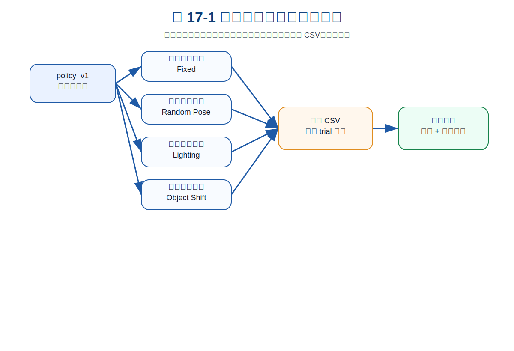
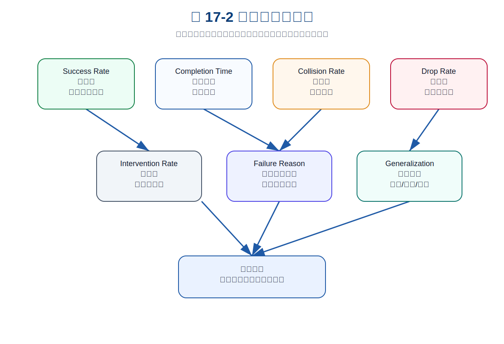
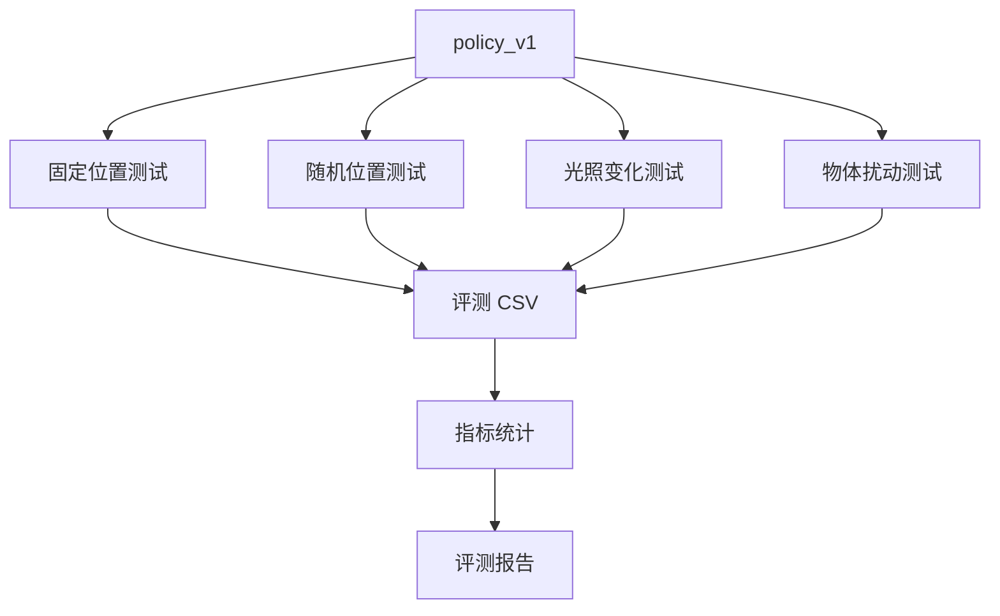

# 第 17 章：评测协议：不要只看成功视频

到第 16 章为止，我们已经训练出了第一版 `policy_v1`。这意味着主线项目第一次具备了从数据到策略的完整流程：采集数据、构建 `dataset_v0`、训练 ACT-like baseline、保存 checkpoint、输出训练报告。

但这并不意味着系统已经可用。真正的机器人项目里，最危险的误判之一就是：

> 机器人成功完成了一次 demo，所以系统已经可以用了。

这在具身智能里尤其常见。因为机器人视频非常有欺骗性：一次流畅的抓取、一次漂亮的放置、一个剪辑好的演示，很容易让人产生“系统已经跑通”的错觉。可是从工程角度看，一次成功几乎不能说明任何问题。它可能只是：

- 初始位置刚好合适；
- 物体姿态刚好简单；
- 光照刚好稳定；
- 夹爪没有遇到边界；
- 随机种子刚好幸运；
- 失败片段没有被展示出来。

自动驾驶工程师应该很熟悉这个问题。一次路测成功不能说明自动驾驶系统可靠；一个 corner case 失败也可能暴露重大系统缺陷。机器人学习同样如此。你不能只看“成功视频”，而要建立一套可复现、可统计、可比较的评测协议。

本章的目标，就是把 `policy_v1` 从“看起来能动”推进到“能够被量化评测”。

---

## 1. 本章要解决的问题

本章重点解决以下问题：

1. 为什么单次 demo 不可信？
2. 机器人策略应该评测哪些指标？
3. success rate、completion time、collision rate、drop rate、intervention rate 分别代表什么？
4. 如何设计 30 / 50 / 100 次评测？
5. 为什么要把每次评测写入 CSV？
6. 如何从评测结果生成报告？
7. 如何对 `policy_v1` 做第一轮量化评测？

---

## 2. 为什么单次成功视频不可信

### 2.1 视频展示的是样例，不是分布

机器人视频通常展示的是一次或几次成功行为，但工程评测关心的是分布：

- 在多少种初始位置下能成功？
- 在多少种光照变化下能成功？
- 换一个物体尺寸还能不能成功？
- 失败时是抓空、掉落、碰撞还是超时？
- 需要多少人工干预？

单个视频不能回答这些问题。它只能说明“在某个条件下，系统曾经成功过一次”。

### 2.2 机器人任务的随机性比看起来更强

即便是简单的 `pick_box_to_bin`，也会受到很多因素影响：

- 物体位置；
- 物体姿态；
- 夹爪接近角度；
- 夹持摩擦；
- 深度误差；
- 台面材质；
- 图像噪声；
- 控制延迟；
- 策略输出抖动。

这些因素组合起来，会让“看似简单”的任务出现大量边界情况。

### 2.3 评测协议是工程可信度的入口

如果没有评测协议，你很难判断：

- 新数据是否真的改善了系统；
- `policy_v2` 是否比 `policy_v1` 更好；
- 失败主要来自数据、模型、感知还是控制；
- 系统是否值得进入下一阶段真机实验。

所以从这一章开始，我们不再只看训练 loss，而是进入量化评测。

---

## 3. 核心评测指标

### 3.1 Success Rate：成功率

成功率是最直观的指标：

```text
success_rate = success_trials / total_trials
```

但它不是唯一指标。一个策略成功率高，却可能：

- 完成很慢；
- 经常擦碰；
- 需要频繁人工干预；
- 只在固定位置成功，换位置就失败。

所以成功率必须与其他指标一起看。

### 3.2 Completion Time：完成时间

完成时间衡量任务效率。如果两个策略成功率都差不多，那么更短、更稳定的完成时间通常更好。

但也要注意：过度追求速度可能带来风险，比如：

- 路径更激进；
- 夹持不稳定；
- 碰撞风险增加。

因此完成时间要和安全指标一起看。

### 3.3 Collision Rate：碰撞率

碰撞率是安全指标。哪怕成功率较高，只要碰撞率高，就不能认为系统可靠。

对于桌面抓取任务，碰撞可能包括：

- 末端碰桌面；
- 夹爪撞物体边缘；
- 手臂擦到收纳盒；
- 路径穿过障碍区域。

### 3.4 Drop Rate：掉落率

掉落率衡量夹持与搬运稳定性。掉落通常发生在：

- 夹爪闭合不充分；
- 抓取点偏；
- 搬运速度过快；
- 物体形状与夹爪不匹配。

掉落问题经常不是单纯策略问题，而是策略、控制和接触建模共同作用的结果。

### 3.5 Intervention Rate：干预率

干预率衡量自主性。一个策略即使最终成功，但如果需要人多次接管，也不能称为稳定自主。

```text
intervention_rate = trials_with_intervention / total_trials
```

它尤其适合衡量“系统是否能独立完成任务”。

### 3.6 Failure Reason Distribution：失败原因分布

失败原因分布是第 18 章失败闭环的入口。它回答的是：

> 系统主要输在哪里？

常见失败原因包括：

- `perception_miss`
- `grasp_offset`
- `drop_during_transfer`
- `collision_risk`
- `timeout`

这些标签会直接影响下一轮补采数据计划。

---

## 4. 概念图 / 流程图 / 架构图

### 4.1 图 17-1 机器人策略评测协议流程



这张图说明了一个最小评测协议：同一个 `policy_v1` 不能只跑一个固定场景，而要分别经过固定位置、随机位置、光照变化和物体扰动测试。所有 trial 都写入评测 CSV，最后统一生成报告。

### 4.2 图 17-2 评测指标关系图



这张图强调：success rate 只是入口，completion time、collision rate、drop rate、intervention rate 和 failure reason distribution 共同决定策略是否真的可用。

### 4.3 Mermaid 图：评测流程



### 4.4 Mermaid 图：从评测到数据闭环


---

## 5. 如何设计评测协议

### 5.1 固定位置评测

固定位置评测用于确认系统基础链路是否稳定。它的问题最少，适合回答：

- 策略是否能完成基本任务？
- 控制链路是否正常？
- episode 数据和训练结果是否基本匹配？

但固定位置评测不能证明泛化能力。

### 5.2 随机位置评测

随机位置评测用于测试策略对目标位置变化的适应能力。例如让物体在桌面范围内随机出现：

```text
x ∈ [0.33, 0.48]
y ∈ [-0.05, 0.10]
```

如果固定位置成功率很高，但随机位置成功率明显下降，说明策略可能过拟合了轨迹模板。

### 5.3 光照变化评测

光照变化主要考验感知鲁棒性。对于视觉输入策略而言，这类测试很重要。

如果光照变化下失败原因集中在 `perception_miss`，下一轮数据应该补采不同光照、反光、阴影、曝光变化样本。

### 5.4 物体扰动评测

物体扰动包括：

- 物体位置变化；
- 物体姿态变化；
- 物体尺寸变化；
- 物体颜色变化；
- 物体材质变化。

它是评估泛化能力的重要入口。

### 5.5 30 / 50 / 100 次评测如何选择

对于教学项目：

- 30 次：足够做初步判断；
- 50 次：适合比较两个策略版本；
- 100 次：更适合形成稳定结论。

真实机器人项目里，trial 数量还要结合时间成本、硬件磨损、安全风险和任务复杂度决定。

---

## 6. 主线项目中的位置

本章为主线项目新增：

```text
robot-learning-shelf-demo/
  scripts/
    07_eval_policy.py
  reports/
    ch17_policy_v1_eval.csv
    ch17_policy_v1_eval_summary.json
    experiment_v1.md
```

其中：

- `07_eval_policy.py`：模拟多场景评测；
- `ch17_policy_v1_eval.csv`：每次 trial 的结构化记录；
- `ch17_policy_v1_eval_summary.json`：汇总指标；
- `experiment_v1.md`：可读评测报告。

---

## 7. 示例

### 7.1 示例 1：运行 policy_v1 评测

```bash
cd robot-learning-shelf-demo

python scripts/07_eval_policy.py \
  --policy_name policy_v1 \
  --num_trials 40 \
  --seed 2026 \
  --output_csv reports/ch17_policy_v1_eval.csv \
  --summary_json reports/ch17_policy_v1_eval_summary.json \
  --report_md reports/experiment_v1.md
```

### 7.2 示例 2：评测 CSV 长什么样

评测 CSV 每一行代表一次 trial，包含：

```text
trial_id
policy_name
scenario_type
object_x
object_y
lighting_scale
success
completion_time_sec
collision
dropped
intervention_count
failure_reason
```

这比“视频成功一次”可靠得多，因为它允许后续统计和复盘。

### 7.3 示例 3：当前 policy_v1 的首次评测结果

当前整合包中的 `policy_v1` 教学评测结果为：

- trials：40
- success_rate：0.70
- collision_rate：0.05
- drop_rate：0.025
- intervention_rate：0.10
- mean_completion_time_sec：10.555

失败原因分布包括：

- `grasp_offset`: 5
- `timeout`: 2
- `collision_risk`: 2
- `perception_miss`: 2
- `drop_during_transfer`: 1

这说明 `policy_v1` 已经不是“完全不可用”，但远远没有到稳定可靠的程度。

---

## 8. 练习代码

本章练习代码位于：

```text
scripts/07_eval_policy.py
```

核心逻辑是：

```python
for i in range(num_trials):
    scenario_type = SCENARIO_TYPES[i % len(SCENARIO_TYPES)]
    scenario = scenario_config(i + 1, scenario_type, rng)
    row = simulate_policy_trial(policy_name, scenario, rng)
    rows.append(row)
```

这段代码体现了评测协议的关键思想：同一个策略要在不同场景类型下重复评测，并把每次结果写成结构化记录。

---

## 9. 代码解释

### 9.1 `scenario_config()`

这个函数负责生成评测场景。它把评测拆成：

- fixed；
- random_position；
- lighting_shift；
- object_shift。

不同场景有不同难度，模拟真实系统中“固定场景容易、泛化场景困难”的现象。

### 9.2 `simulate_policy_trial()`

这个函数模拟策略执行一次任务，并输出：

- 是否成功；
- 是否碰撞；
- 是否掉落；
- 是否人工干预；
- 失败原因；
- 完成时间。

真实机器人项目里，这一部分会被替换成真机 rollout 或仿真 rollout。

### 9.3 `aggregate()`

它负责把多次 trial 聚合成指标：

- success rate；
- collision rate；
- drop rate；
- intervention rate；
- completion time；
- failure reason distribution。

这些指标才是评估策略质量的核心材料。

---

## 10. 常见错误

### 10.1 只看成功率

成功率高但碰撞率也高，不是好策略。成功率高但只在固定位置成功，也不是好策略。

### 10.2 评测集和训练集太像

如果评测场景几乎复制训练集，评测结果会过于乐观。

### 10.3 每次评测协议不一致

如果 `policy_v1` 和 `policy_v2` 用不同场景、不同 trial 数、不同成功判定标准评测，就无法公平比较。

### 10.4 没有保存原始 CSV

只保存最终成功率，会丢失大量信息。原始 CSV 是后续失败分析的基础。

---

## 11. 本章练习

1. 设计一个 30 次评测协议，包含固定位置、随机位置和光照变化；
2. 修改 `07_eval_policy.py`，增加 `object_rotation` 场景；
3. 统计 success rate、collision rate、drop rate；
4. 画出 failure reason distribution；
5. 思考：为什么真实机器人评测比离线验证更重要？

---

## 12. 本章产出

完成本章后，项目新增：

- 评测脚本：`scripts/07_eval_policy.py`
- 评测 CSV：`reports/ch17_policy_v1_eval.csv`
- 评测汇总：`reports/ch17_policy_v1_eval_summary.json`
- 实验报告：`reports/experiment_v1.md`
- 第 17 章配图：
  - `images/ch17_eval_protocol_flow.svg`
  - `images/ch17_metric_dashboard.svg`

---

## 13. 小结

本章最重要的结论是：

> 成功视频不是评测，重复 trial、统一协议、结构化 CSV 和失败原因统计才是评测。

通过本章，主线项目已经具备了 `policy_v1` 的量化评测能力。下一章，我们会继续向前：把评测中的失败样本变成下一轮数据闭环的入口。
