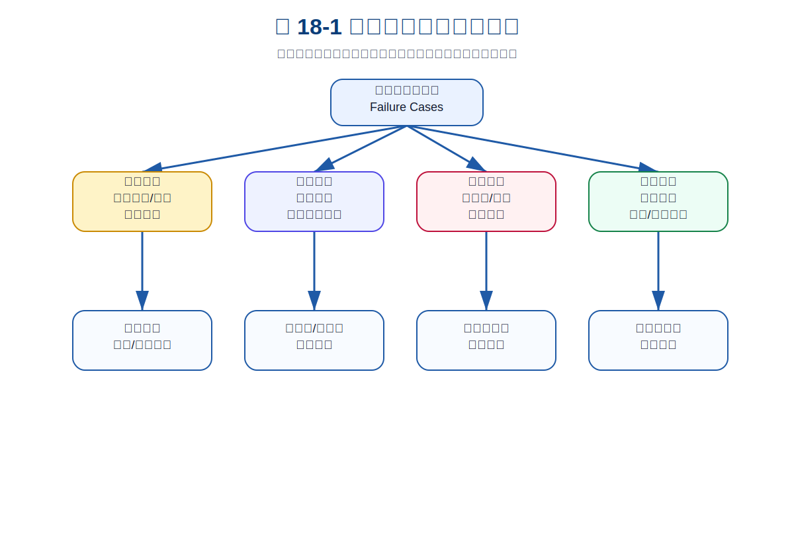
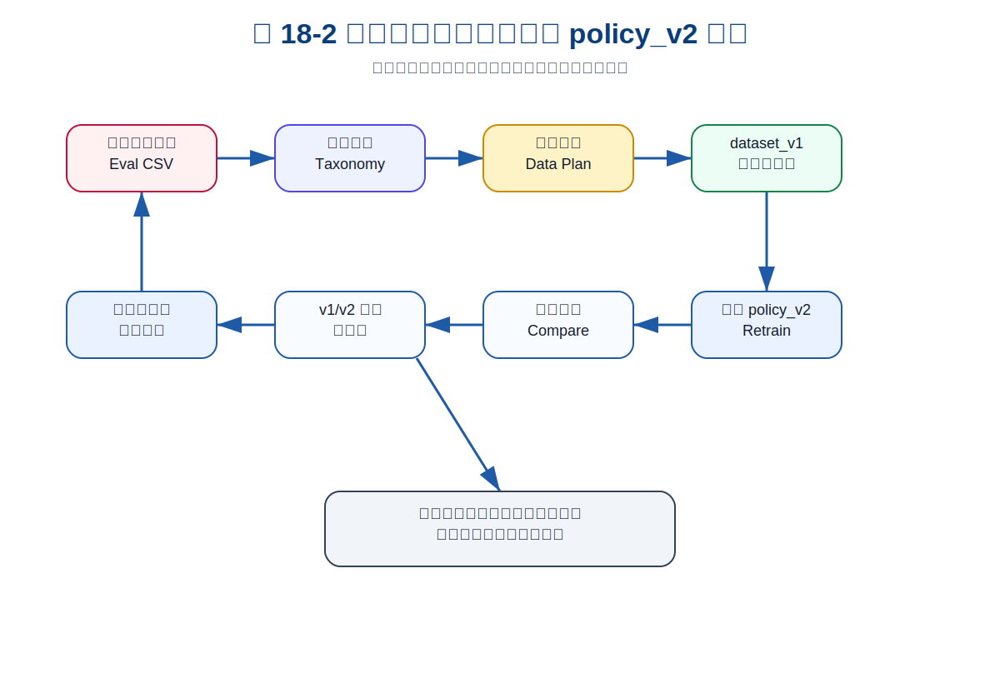
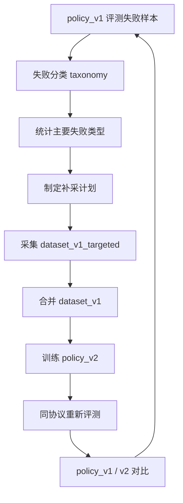
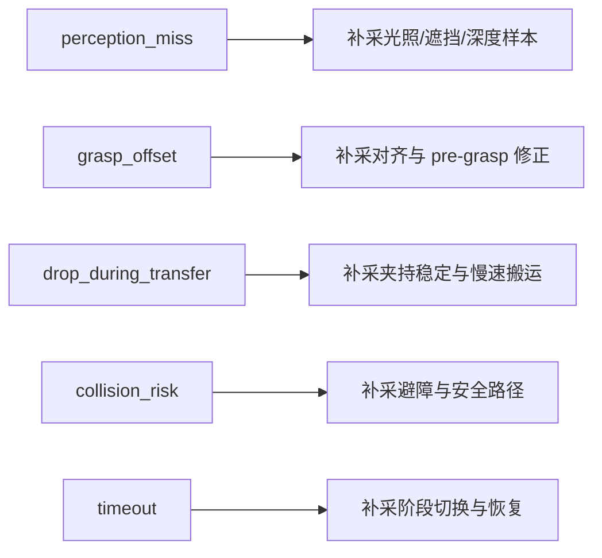

# 第 18 章：失败分析与第二轮数据闭环

第 17 章，我们对 `policy_v1` 做了第一轮评测。结果并不完美：成功率不是 100%，不同场景下表现不同，失败原因也不止一种。

这正是机器人学习真正开始变得有价值的地方。

很多人把失败看作坏消息：模型不行、系统不稳、demo 不好看。但从工程闭环角度看，失败不是负面资产，而是最重要的数据入口。原因很简单：

> 成功样本告诉你系统会什么，失败样本告诉你系统还缺什么。

自动驾驶工程师对此应该非常熟悉。真正推动系统迭代的，往往不是常规路况数据，而是 corner cases：鬼探头、遮挡、极端光照、施工区域、异常车道、非标准交通参与者。具身智能也一样。机器人策略真正变强，靠的不是盲目增加更多相似成功样本，而是系统化识别失败、分类失败、补采针对性数据，再训练下一版策略。

本章是全书主线闭环中最重要的一环：从 `policy_v1` 的评测失败，进入 `dataset_v1` 的补采计划，并为 `policy_v2` 的训练与对比做准备。

---

## 1. 本章要解决的问题

本章重点解决以下问题：

1. 为什么失败是机器人学习的核心资产？
2. 如何区分感知失败、策略失败、控制失败和环境失败？
3. 如何建立 failure taxonomy？
4. 如何从 eval CSV 自动统计失败原因？
5. 如何根据失败类型制定补采数据计划？
6. 如何比较 `policy_v1` 和 `policy_v2`？
7. 为什么“针对失败补数据”比“盲目加数据”更有效？

---

## 2. 为什么失败不是坏消息

### 2.1 没有失败，就没有方向

如果你只知道系统成功率是 70%，这其实还不够。你还需要知道：

- 剩下 30% 为什么失败？
- 是抓空更多，还是掉落更多？
- 是光照变化导致失败，还是随机位置导致失败？
- 是策略动作不对，还是控制路径不安全？
- 是需要补数据，还是需要改规则？

失败分析的意义，就是把一个模糊的“系统不够好”，拆成可执行的改进项。

### 2.2 失败样本比随机样本更有信息密度

假设你盲目再采 100 条数据，其中大部分仍然是系统已经会的标准成功轨迹，那么模型提升可能很有限。

但如果你发现主要失败集中在 `grasp_offset`，然后专门补采：

- 抓取点偏移；
- pre-grasp 对齐；
- 接近阶段微调；
- 抓空后重试；

那么每条新增数据的信息密度都会更高。

这就是“失败驱动数据闭环”的价值。

### 2.3 失败分析让团队对问题达成共识

机器人项目常见争论包括：

- 感知同学说策略不行；
- 策略同学说标定不准；
- 控制同学说上层目标不合理；
- 产品同学说 demo 不稳定；
- 采集同学说数据已经够多了。

结构化失败分析可以让讨论从主观判断变成数据事实。

---

## 3. 建立 Failure Taxonomy

### 3.1 感知失败

感知失败指的是系统对环境理解错误，例如：

- 物体检测不到；
- 目标位置偏移；
- 深度估计错误；
- 光照变化导致识别不稳定；
- 遮挡导致物体状态丢失。

对应的失败标签可能是：

- `perception_miss`
- `depth_error`
- `object_lost`
- `occlusion_failure`

### 3.2 策略失败

策略失败指的是观测基本正确，但策略输出动作不合理，例如：

- 抓取点偏；
- 阶段切换错误；
- 该抬升时继续下降；
- 该释放时没有释放；
- 长时间犹豫导致 timeout。

对应标签可能是：

- `grasp_offset`
- `wrong_action_phase`
- `timeout`
- `bad_recovery`

### 3.3 控制失败

控制失败指的是策略目标合理，但底层执行出现问题，例如：

- 目标不可达；
- 路径碰撞；
- 夹爪闭合不充分；
- 速度过快导致掉落；
- 机械臂执行偏差较大。

对应标签可能是：

- `collision_risk`
- `drop_during_transfer`
- `unreachable_pose`
- `gripper_failure`

### 3.4 环境失败

环境失败来自外部条件变化，例如：

- 物体太滑；
- 台面反光；
- 容器位置变化；
- 光照变化极端；
- 物体形状不在训练分布内。

环境失败并不意味着系统不用负责。对学习系统来说，环境变化通常意味着数据覆盖不足。

---

## 4. 概念图 / 流程图 / 架构图

### 4.1 图 18-1 失败分类树与改进方向



这张图把失败分成四类：感知失败、策略失败、控制失败、环境失败。每一类失败都对应不同的改进动作：补采视觉数据、改策略阶段、调整控制参数或扩大场景随机化。

### 4.2 图 18-2 失败回收、补采数据与 policy_v2 闭环



这张图展示了本章的主线闭环：从 eval CSV 中筛出失败样本，做失败分类，生成补采计划，构建下一版数据集，训练 `policy_v2`，再用同一评测协议对比。

### 4.3 Mermaid 图：失败驱动数据闭环



### 4.4 Mermaid 图：失败类型到行动



---

## 5. 从 Eval CSV 到 Failure Database

第 17 章输出了：

```text
reports/ch17_policy_v1_eval.csv
```

这一文件每行代表一次 trial。第 18 章要做的第一件事，就是筛选失败行：

```text
success == 0
```

然后根据 `failure_reason` 建立 failure database。

### 5.1 Failure Database 应该包含什么

一条失败记录至少应该包含：

- trial_id；
- scenario_type；
- failure_reason；
- category；
- object_x / object_y；
- lighting_scale；
- recommended_action。

真实项目里，还可以继续扩展：

- 图像快照；
- 轨迹回放链接；
- rosbag 路径；
- 操作者备注；
- 自动诊断结果；
- 是否已补采。

### 5.2 Failure Snapshot 的价值

失败快照不是为了“截图留念”，而是为了帮助工程师快速判断失败原因。例如：

- 抓空失败：看 pre-grasp 是否偏移；
- 掉落失败：看夹爪闭合和搬运阶段；
- 碰撞失败：看路径是否经过障碍；
- timeout：看阶段机是否卡住。

在真实系统里，failure snapshot 往往比单纯的数字指标更容易推动问题定位。

---

## 6. 根据失败制定补采计划

### 6.1 不同失败对应不同补采策略

失败分析的关键不是“统计完就结束”，而是把统计结果转成下一轮数据计划。

比如：

| 失败类型 | 可能原因 | 补采方向 |
|---|---|---|
| perception_miss | 光照、遮挡、深度错误 | 补采视觉困难场景 |
| grasp_offset | 抓取点偏移 | 补采对齐与微调轨迹 |
| drop_during_transfer | 夹持不稳 | 补采慢速提升与夹爪确认 |
| collision_risk | 路径不安全 | 补采避障和容器边缘轨迹 |
| timeout | 阶段切换失败 | 补采重试、回退、恢复动作 |

### 6.2 针对性补采比盲目扩数据更有效

如果主要失败是 `grasp_offset`，那么继续采大量标准成功轨迹并不能解决问题。你真正需要的是：

- 目标点略偏的情况；
- 抓取前微调；
- 抓空后的恢复；
- 夹爪对齐修正。

这就是 targeted data collection。

### 6.3 dataset_v1 的设计

本章不真正训练完整 `policy_v2`，而是生成下一轮数据计划。真实项目中的 `dataset_v1` 可以这样构建：

```text
dataset_v1 = dataset_v0 + dataset_v1_targeted
```

其中 `dataset_v1_targeted` 应该围绕主要失败类型补采。

---

## 7. 主线项目中的位置

本章新增：

```text
robot-learning-shelf-demo/
  scripts/
    08_analyze_failures.py
    09_plan_next_data_collection.py
  reports/
    ch18_failure_analysis.json
    ch18_failure_analysis.md
    ch18_next_data_collection_plan.json
    ch18_next_data_collection_plan.md
    ch18_policy_v2_eval.csv
    ch18_policy_v2_eval_summary.json
    experiment_v2.md
    ch18_policy_v1_v2_comparison.md
```

这些文件让项目具备了：

- 从 eval CSV 自动统计失败；
- 生成 failure taxonomy 报告；
- 输出下一轮补采数据计划；
- 用相同协议比较 `policy_v1` 与 `policy_v2`。

---

## 8. 示例

### 8.1 示例 1：运行失败分析

```bash
cd robot-learning-shelf-demo

python scripts/08_analyze_failures.py \
  --eval_csv reports/ch17_policy_v1_eval.csv \
  --output_json reports/ch18_failure_analysis.json \
  --output_md reports/ch18_failure_analysis.md
```

当前 `policy_v1` 的失败分析结果为：

- num_trials：40
- num_failures：12
- failure_rate：0.30

失败原因分布：

- `grasp_offset`: 5
- `timeout`: 2
- `collision_risk`: 2
- `perception_miss`: 2
- `drop_during_transfer`: 1

### 8.2 示例 2：生成补采数据计划

```bash
python scripts/09_plan_next_data_collection.py \
  --failure_report reports/ch18_failure_analysis.json \
  --output_md reports/ch18_next_data_collection_plan.md \
  --output_json reports/ch18_next_data_collection_plan.json
```

该脚本会根据失败类别生成 targeted collection plan。例如，当前最大失败类别是策略失败，对应的补采建议是：

- pre-grasp 微调；
- 抓取点偏移恢复；
- 多角度接近；
- 抓空后重试。

### 8.3 示例 3：比较 policy_v1 和 policy_v2

当前整合包里提供了一个教学型 `policy_v2` 对照评测，用于展示比较方式：

| metric | policy_v1 | policy_v2 |
|---|---:|---:|
| success_rate | 0.70 | 0.80 |
| collision_rate | 0.05 | 0.025 |
| drop_rate | 0.025 | 0.025 |
| intervention_rate | 0.10 | 0.05 |

注意：这里的 `policy_v2` 是教学模拟结果，用来说明实验对比流程。真实项目中，`policy_v2` 应该由 `dataset_v1` 重新训练得到。

---

## 9. 练习代码

本章练习代码包括：

```text
scripts/08_analyze_failures.py
scripts/09_plan_next_data_collection.py
```

### 9.1 失败分析核心代码

```python
failures = [r for r in rows if int(r.get("success", "0")) == 0]
reason_counter = Counter(r.get("failure_reason", "unknown") for r in failures)
```

这段代码看似简单，但它完成了从“评测数据”到“失败资产”的第一步。

### 9.2 失败类型到补采计划

```python
CATEGORY_TO_PLAN = {
    "perception_failure": {
        "target": "补采复杂视觉条件",
        "episodes": 20,
    },
    "strategy_failure": {
        "target": "补采对齐与抓取修正",
        "episodes": 18,
    },
}
```

真实项目中，这张映射表会不断演化，最终成为团队的数据闭环经验库。

---

## 10. 工程案例：抓空失败如何闭环

假设 `policy_v1` 中最主要的失败是 `grasp_offset`，我们可以按以下方式闭环：

1. 在 eval CSV 中筛出所有 `grasp_offset` trial；
2. 回放对应轨迹，确认是 pre-grasp 偏移还是下降阶段偏移；
3. 设计补采任务：目标点随机偏移、接近阶段人工微调、抓空后重试；
4. 采集 `dataset_v1_targeted/grasp_offset_recovery`；
5. 合并 `dataset_v1`；
6. 训练 `policy_v2`；
7. 用完全相同评测协议测试；
8. 对比 `grasp_offset` 失败是否下降。

这个流程比“再采 1000 条随机数据”更工程化，也更容易形成可解释提升。

---

## 11. 常见错误

### 11.1 把失败样本全部删掉

失败样本如果是纯噪声，当然可以删除。但如果它暴露了真实边界，就应该保留并分析。

### 11.2 只统计失败原因，不转成行动

失败统计只是中间结果，最终必须转成补采计划、策略修改或控制约束。

### 11.3 不保持评测协议一致

如果 `policy_v1` 和 `policy_v2` 的评测场景不同，那么对比就没有意义。

### 11.4 盲目扩数据

更多数据不一定更好。更关键的是：新增数据是否覆盖了当前主要失败模式。

---

## 12. 本章练习

1. 为主线项目扩展 failure taxonomy，加入 `depth_error` 和 `object_lost`；
2. 修改 `08_analyze_failures.py`，按 `scenario_type` 输出失败热力表；
3. 修改 `09_plan_next_data_collection.py`，为每类失败自动生成 episode 数量建议；
4. 设计一个真实 `dataset_v1_targeted` 目录结构；
5. 思考：为什么“针对失败补数据”比“盲目加数据”更有效？

---

## 13. 本章产出

完成本章后，项目新增：

- 失败分析脚本：`scripts/08_analyze_failures.py`
- 补采计划脚本：`scripts/09_plan_next_data_collection.py`
- 失败分析报告：
  - `reports/ch18_failure_analysis.json`
  - `reports/ch18_failure_analysis.md`
- 下一轮数据计划：
  - `reports/ch18_next_data_collection_plan.json`
  - `reports/ch18_next_data_collection_plan.md`
- policy v2 对照评测：
  - `reports/ch18_policy_v2_eval.csv`
  - `reports/ch18_policy_v2_eval_summary.json`
  - `reports/experiment_v2.md`
  - `reports/ch18_policy_v1_v2_comparison.md`
- 第 18 章配图：
  - `images/ch18_failure_taxonomy.svg`
  - `images/ch18_failure_loop_policy_compare.svg`

---

## 14. 小结

本章最重要的结论是：

> 失败不是训练之外的坏结果，而是机器人学习闭环中最有价值的数据入口。

到此为止，主线项目已经完成第一轮完整机器人学习数据闭环：

1. 定义任务；
2. 采集 scripted / teleop 数据；
3. 构建 dataset_v0；
4. 训练 policy_v1；
5. 评测 policy_v1；
6. 分析失败；
7. 生成下一轮补采计划；
8. 设计 policy_v2 对比实验。

这就是具身智能项目真正可持续演进的核心方法论。
