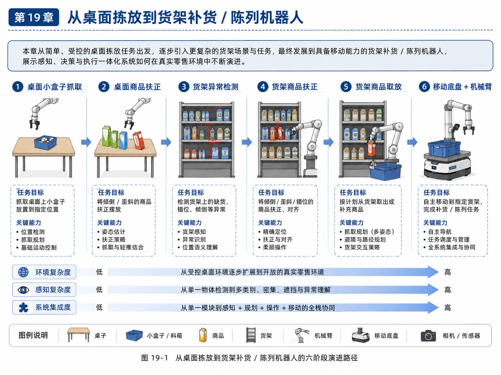
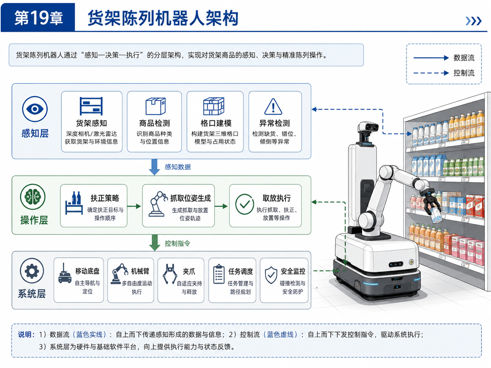
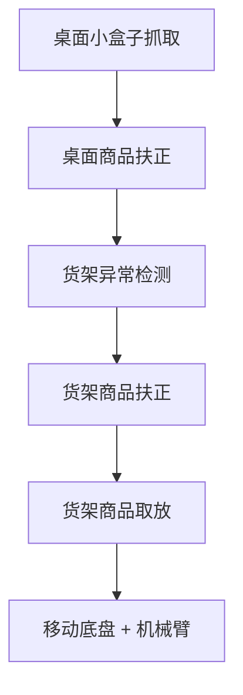
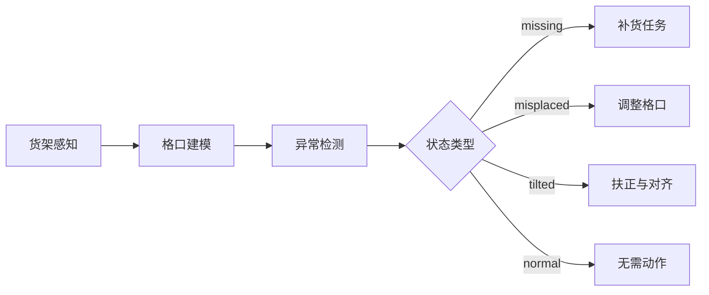
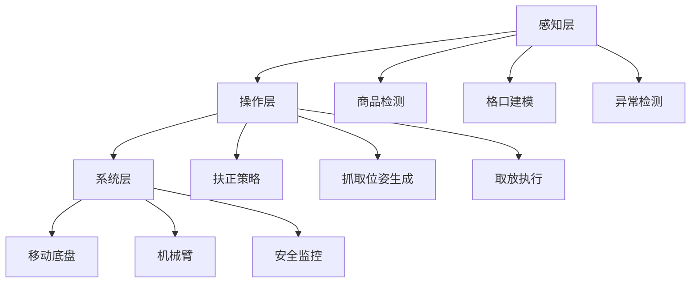

# 第 19 章：从桌面抓取扩展到货架理货机器人

到第 18 章为止，我们已经把主线项目推进到了一个非常关键的位置：

- 有了任务定义；
- 有了 episode 数据结构；
- 有了 scripted 数据与 teleop 数据；
- 有了第一版 `dataset_v0`；
- 有了 `policy_v1`、评测协议、失败分析与第二轮闭环。

如果你只把这些内容当成“桌面小实验”，那本书就停留在了入门层。

但如果你进一步追问：

> 这条主线如何走向更接近真实商业价值与职业机会的场景？

那么一个非常自然的下一步，就是从**桌面抓取任务**走向**货架理货 / 补货 / 陈列机器人**。

这一步非常重要。因为它代表了从“单个小技能”到“复杂系统任务”的跃迁：

- 从单物体，到多商品；
- 从稀疏桌面，到密集货架；
- 从单次抓放，到持续理货；
- 从机械臂独立执行，到移动底盘 + 机械臂协同；
- 从受控环境，到更接近真实零售与仓储现场。

对于自动驾驶 / 机器人算法工程师来说，这个章节还有一层更现实的意义：

> 货架理货任务，是把你已有的感知、空间理解、数据闭环能力，迁移到具身智能应用方向的一个典型桥梁。

本章不会假装一步到位做出完整商用理货机器人，而是从工程视角告诉你：**为什么桌面任务是合理起点、为什么理货场景应该先做感知层、以及如何从 v1 项目扩展到更大的任务族。**

---

## 1. 本章要解决的问题

本章重点回答以下问题：

1. 桌面抓取任务为什么不足以代表真实机器人能力？
2. 货架理货任务与桌面任务的核心差异是什么？
3. 为什么理货机器人通常先做“看懂货架”，再做“操作货架”？
4. 缺货检测、错放检测、倾倒检测、商品扶正、货架取放之间是什么关系？
5. 移动底盘 + 机械臂系统的最小架构应该如何理解？
6. 如何把当前主线项目扩展到货架场景，而不是推倒重来？

---

## 2. 为什么要从桌面任务走向货架任务

### 2.1 桌面任务是教学起点，不是业务终点

前面的桌面 pick-and-place 任务非常有价值，因为它帮助我们理解：

- action / observation / state 的定义；
- 数据集是如何构造出来的；
- 模型是如何训练和评测的；
- 失败如何被记录与回收。

但桌面任务也有明显局限：

- 物体数量少；
- 遮挡少；
- 目标选择简单；
- 场景变化少；
- 任务语义浅。

你可以把它理解为具身智能里的“Hello World”。

### 2.2 货架理货更接近真实职业机会

相比桌面小任务，货架理货更接近真实落地场景，因为它天然包含：

- **感知问题**：商品检测、格口建模、缺货识别、错位识别；
- **操作问题**：商品扶正、抓取、补货、放置；
- **系统问题**：机械臂、移动底盘、任务调度、安全监控；
- **业务问题**：缺货率、陈列规范、执行效率、持续巡检。

这类问题在：

- 零售；
- 仓储；
- 理货；
- 商品陈列；
- 医药 / 便利店 / 小型仓配场景；

都有明显的现实需求。

### 2.3 为什么它对转型者很重要

如果你来自自动驾驶感知、泊车感知、空间理解或数据闭环方向，那么货架机器人场景非常适合作为转型桥梁，因为你已有的很多能力都能复用：

- 相机 / 激光雷达 / 多模态感知经验；
- 目标检测、分割、跟踪与分类能力；
- 空间理解与场景表示能力；
- 评测协议与数据闭环思维。

不同的是，在机器人场景里，你不仅要“看懂”，还要“动手”。

---

## 3. 从桌面任务到货架任务的六阶段演进

### 3.1 图 19-1：从桌面拣放到货架补货 / 陈列机器人的六阶段路径



这张图是本章的主线图，它非常重要，因为它告诉你：

- 不是一上来就做“全功能理货机器人”；
- 而是从简单、受控、可重复的小任务逐步扩展；
- 每扩展一步，都对应新的感知复杂度、系统复杂度和环境复杂度。

六个阶段可以概括为：

1. 桌面小盒子抓取；
2. 桌面商品扶正；
3. 货架异常检测；
4. 货架商品扶正；
5. 货架商品取放；
6. 移动底盘 + 机械臂的理货系统。

### 3.2 这六个阶段为什么合理

因为它遵循了一个工程上非常稳妥的原则：

> 先做纯感知可评测，再做局部操作，再做系统协同。

换句话说，理货机器人不应该一开始就追求“边移动边看边抓边补货”，而应该按层推进：

- 先判断货架状态；
- 再决定该不该操作；
- 再确定怎么操作；
- 再决定是否需要移动；
- 最后再做全链路协同。

---

## 4. 货架任务与桌面任务的核心差异

### 4.1 目标密度更高

桌面任务里，目标通常只有 1–3 个；而货架场景里，商品会：

- 密集摆放；
- 外观相似；
- 大量重复；
- 相互遮挡；
- 存在层级结构（格口、层板、区域）。

### 4.2 任务语义更强

桌面任务更多是“抓住这个物体并放到那里”。

而货架任务中，系统不仅要做动作，还要理解：

- 哪个格口缺货；
- 哪个商品放错位置；
- 哪个商品倾倒；
- 哪个商品朝向异常；
- 哪些问题优先级更高。

这意味着系统需要的不只是几何理解，还包括**位置语义与业务语义**。

### 4.3 操作约束更多

在货架场景中，机械臂操作往往会受到更多约束：

- 货架空间狭窄；
- 邻近商品容易碰撞；
- 抓取空间被遮挡；
- 放置动作对精度要求更高；
- 商品类型更丰富。

### 4.4 系统边界更大

桌面任务可以只看机械臂；而货架任务常常必须引入：

- 移动底盘；
- 巡检策略；
- 任务调度；
- 安全监控；
- 与库存或上层任务系统的接口。

---

## 5. 为什么理货机器人应先做感知层，再做操作层

很多刚转向具身智能的工程师会忍不住先想“怎么抓”。

但在理货场景里，真正的第一步其实是：

> 先知道“哪里有问题”，再讨论“如何处理问题”。

### 5.1 感知是动作的前提

如果系统连这些都不知道：

- 缺的是哪个商品；
- 错的是哪个格口；
- 倾倒的是哪一件商品；
- 商品离目标位姿差多少；

那么任何操作规划都无从谈起。

### 5.2 感知层可以先独立形成业务价值

这点非常现实。即使你还没有做出成熟的机械臂操作系统，仅仅是：

- 缺货检测；
- 错放检测；
- 倾倒检测；
- 格口占用检测；

也已经可以形成一个有价值的“巡检 / 货架状态感知”模块。

这也是很多理货机器人项目实际的推进顺序：

1. 先做感知与状态理解；
2. 再做局部可控操作；
3. 最后做全链路自动化。

### 5.3 对工程落地来说，分层能大幅降低风险

如果你把“感知是否正确”和“操作是否正确”混在一起，调试会非常困难。分层之后，你可以分别回答：

- 是看错了，还是抓错了？
- 是格口建模错了，还是动作规划错了？
- 是商品状态判断错了，还是执行阶段碰撞了？

---

## 6. 理货机器人的最小分层架构

### 6.1 图 19-2：货架陈列机器人架构



这张图把理货机器人的最小系统结构分成了三层：

1. **感知层**：货架感知、商品检测、格口建模、异常检测；
2. **操作层**：扶正策略、抓取位姿生成、取放执行；
3. **系统层**：移动底盘、机械臂、夹爪、任务调度、安全监控。

这三个层级是理解真实机器人系统最有效的心智模型之一。

### 6.2 感知层：先回答“发生了什么”

感知层的目标不是直接输出动作，而是输出结构化场景理解。例如：

```json
{
  "shelf_id": "shelf_A",
  "slots": [
    {"slot_id": "A1", "expected_sku": "tea_01", "observed_sku": "tea_01", "status": "normal"},
    {"slot_id": "A2", "expected_sku": "tea_02", "observed_sku": null, "status": "missing"},
    {"slot_id": "A3", "expected_sku": "juice_01", "observed_sku": "juice_02", "status": "misplaced"}
  ]
}
```

这个结构就是“操作层”的输入基础。

### 6.3 操作层：决定“怎么处理问题”

操作层并不一定是一套大模型。它可以是：

- 规则策略；
- 任务树；
- 小型 policy；
- 局部抓取 / 扶正技能组合。

例如，当感知层输出 `missing`、`misplaced`、`tilted` 时：

- `missing` -> 补货；
- `misplaced` -> 调整到正确格口；
- `tilted` -> 扶正并对齐。

### 6.4 系统层：把任务真正执行出来

系统层负责把操作层决策转化为真实系统动作，包括：

- 移动到底盘目标位姿；
- 机械臂运动规划；
- 夹爪动作；
- 安全约束；
- 执行状态监控。

---

## 7. 货架场景里的典型子任务拆解

### 7.1 缺货检测（missing）

这是最容易形成独立价值的子任务之一。它关注：

- 某个格口是否为空；
- 占用率是否低于阈值；
- 是否需要触发补货任务。

### 7.2 错放检测（misplaced）

这个任务不仅要检测“有货”，还要检测“货对不对”。

在实际系统里，它通常需要：

- SKU 分类；
- 格口定义；
- 目标 SKU 与观测 SKU 的对比。

### 7.3 倾倒 / 歪斜检测（tilted）

这个任务跟本书前面的 `straighten_box` 很自然地衔接起来。桌面任务中的“把歪掉的盒子摆正”，在货架环境里，就变成了：

- 检测商品姿态是否异常；
- 输出扶正目标；
- 规划扶正动作。

### 7.4 商品扶正

相比简单抓取，扶正任务更强调：

- 接触式操作；
- 轻推与抓取的组合；
- 对齐目标位姿；
- 避免扰动相邻商品。

### 7.5 商品取放 / 补货

这是货架任务里的操作核心之一。它比桌面 pick-and-place 更复杂，因为：

- 取放目标更密集；
- 可抓取方向更受限制；
- 路径规划与避障要求更高；
- 任务常常与库存系统和移动路径联动。

---

## 8. 主线项目如何扩展到货架方向

这一章不是另起炉灶，而是继续在 `robot-learning-shelf-demo` 上演进。

### 8.1 本章新增文件

```text
robot-learning-shelf-demo/
  scripts/
    shelf_anomaly_detection_demo.py
  reports/
    ch19_shelf_anomaly_report.json
    ch19_shelf_anomaly_report.md
  configs/
    task_straighten_box.yaml
```

### 8.2 为什么 `task_straighten_box.yaml` 仍然重要

很多人看到“货架理货”就会觉得前面那个桌面扶正配置没用了。其实恰恰相反：

> 桌面扶正任务是货架扶正任务的技能前身。

你可以把它理解为：

- v1：桌面环境中的单物体扶正；
- v2：货架环境中的单商品扶正；
- v3：货架中的异常检测 + 局部操作；
- v4：货架中的多任务调度与移动操作。

### 8.3 新增的 `shelf_anomaly_detection_demo.py`

本章新增脚本并不试图做真实视觉算法，而是先建立一个**任务结构化表达**：

- 给定格口期望；
- 给定观测结果；
- 输出 `normal / missing / misplaced / tilted`；
- 生成一个异常检测报告。

这个教学化脚本的价值在于：

- 帮你先把任务边界和数据结构说清楚；
- 帮你为后续接入视觉模型预留接口；
- 帮你把“感知层 -> 操作层”的中间结构显式化。

---

## 9. 示例

### 9.1 示例 1：运行货架异常检测 demo

```bash
cd robot-learning-shelf-demo
python scripts/shelf_anomaly_detection_demo.py \
  --output_json reports/ch19_shelf_anomaly_report.json \
  --output_md reports/ch19_shelf_anomaly_report.md
```

当前整合包里，这个脚本已经执行过，并生成了报告。

### 9.2 示例 2：本章 demo 的异常统计结果

当前演示数据中共有 6 个格口，统计结果如下：

- `normal = 3`
- `missing = 1`
- `misplaced = 1`
- `tilted = 1`

因此系统给出的优先动作是：

```text
priority_action = restock_missing_items
```

这很合理，因为缺货往往是理货任务中优先级最高的问题之一。

### 9.3 示例 3：格口数据结构

本章一个非常关键的设计是：把货架理解为一组格口（slot）。

下面是简化的格口表达：

```json
{
  "slot_id": "A2",
  "expected_sku": "tea_02",
  "observed_sku": null,
  "tilt_deg": 0.0,
  "occupancy": 0.0,
  "status": "missing"
}
```

这个表达很重要，因为它把“视觉输出”转化成了“任务结构输入”。

---

## 10. 练习代码

本章练习代码位于：

```text
scripts/shelf_anomaly_detection_demo.py
```

它的核心函数很值得注意：

```python
def classify_slot(slot: ShelfSlot, tilt_threshold_deg: float = 10.0) -> SlotResult:
    if slot.occupancy < 0.2 or slot.observed_sku is None:
        return SlotResult(..., 'missing', ...)
    if slot.observed_sku != slot.expected_sku:
        return SlotResult(..., 'misplaced', ...)
    if slot.tilt_deg > tilt_threshold_deg:
        return SlotResult(..., 'tilted', ...)
    return SlotResult(..., 'normal', ...)
```

这段代码虽然简单，但它完整体现了“货架异常检测”的最小结构：

- 有格口；
- 有期望；
- 有观测；
- 有规则输出；
- 有报告。

接下来你完全可以把这里的规则逻辑替换成：

- 视觉检测模型；
- 位姿估计模型；
- 多模态感知结果；
- 或更复杂的异常识别器。

---

## 11. Mermaid 图

### 11.1 从桌面任务到理货机器人



### 11.2 感知层到操作层的映射



### 11.3 理货机器人分层系统



---

## 12. 常见错误

### 12.1 一上来就做“全自动理货机器人”

这样通常会把感知、操作、导航、调度、安全混在一起，导致系统难以拆解、难以评测、难以迭代。

### 12.2 不做格口建模

如果没有明确的格口结构，系统就很难回答“这个商品到底算不算错位、缺货、倾倒”。

### 12.3 直接把检测结果输出成动作

感知输出和动作之间最好有一层中间结构，例如：

- shelf state；
- anomaly state；
- task list。

这样后续调试和扩展会容易得多。

### 12.4 忽略任务优先级

真实理货任务里，不同异常的处理优先级不同。通常：

- 缺货 > 错放 > 倾倒 > 轻微对齐偏差。

如果没有优先级，系统就很难进行合理调度。

---

## 13. 本章练习

1. 将 `shelf_anomaly_detection_demo.py` 扩展成支持更多格口与更多 SKU；
2. 为每个格口增加 `confidence` 字段；
3. 增加 `priority_score`，把缺货、错放、倾倒排序；
4. 把桌面 `straighten_box` 任务改写成“货架商品扶正任务”；
5. 思考：为什么理货机器人更适合先做感知层，再做操作层？

---

## 14. 本章产出

完成本章后，项目新增：

- 第 19 章配图：
  - `images/ch19_desktop_to_shelf_robot_evolution.png`
  - `images/ch19_shelf_merchandising_robot_architecture.png`
- 练习脚本：`scripts/shelf_anomaly_detection_demo.py`
- 报告：
  - `reports/ch19_shelf_anomaly_report.json`
  - `reports/ch19_shelf_anomaly_report.md`

---

## 15. 小结

本章最重要的结论是：

> 从桌面抓取走向货架理货，不是简单把场景换大，而是把机器人系统从单技能演示，推进到感知、决策、执行、移动协同的复杂工程问题。

通过本章，你应该已经理解：

- 桌面任务是起点，不是终点；
- 货架任务更接近真实业务与职业机会；
- 理货机器人应先做感知层，再做操作层；
- 格口建模与异常检测是整个系统的关键中间表示；
- 当前主线项目可以自然扩展到货架理货方向，而不需要推倒重来。

下一章，我们将收束全书，把这套项目沉淀为 GitHub 作品集、简历项目、面试讲解材料和后续学习路线，让“学习 demo”真正变成“职业资产”。
