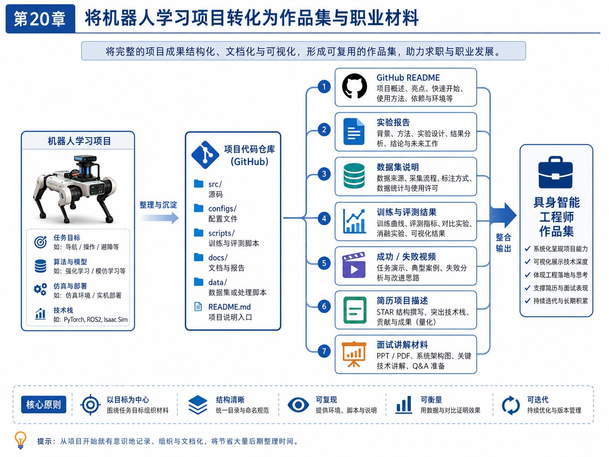
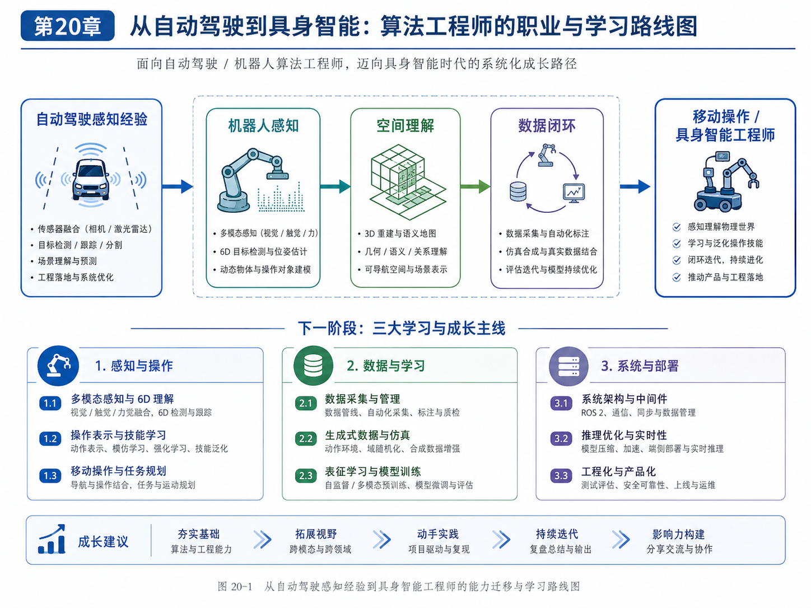
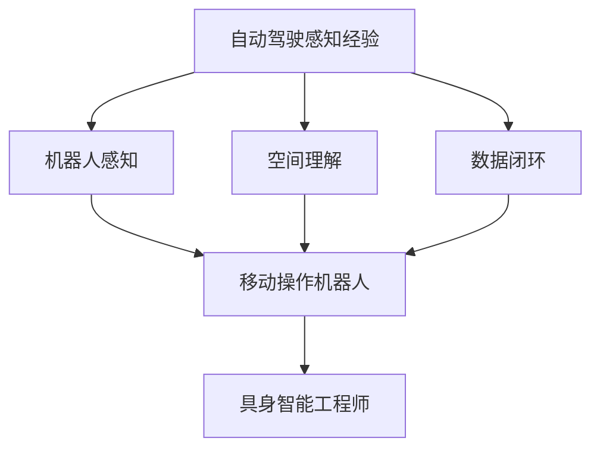
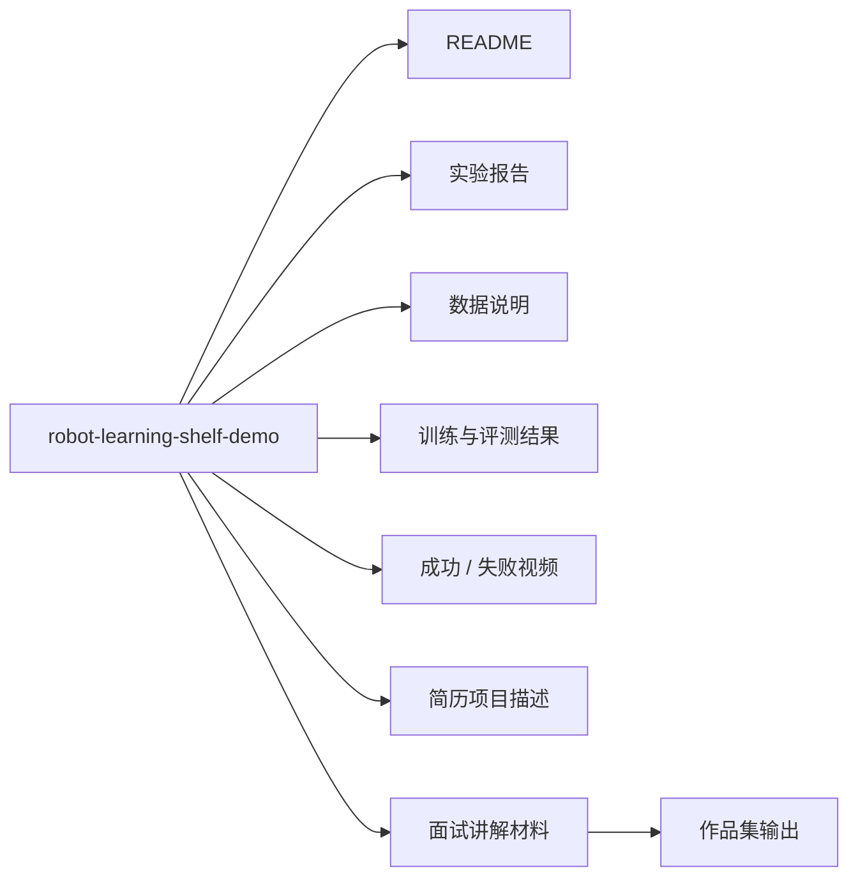
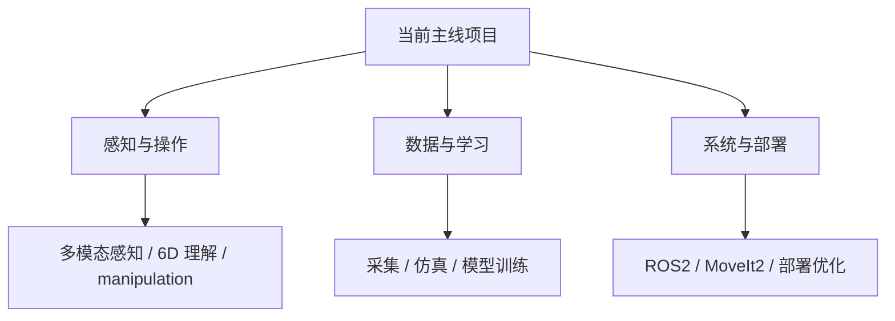

# 第 20 章：作品集、职业机会与后续学习路线

终于到了全书的收束章。

如果前面 19 章解决的是：

- 什么是具身智能；
- 为什么要做数据闭环；
- 机器人学习项目应该如何搭建；
- 如何从任务、数据、训练、评测、失败分析一步步推进；

那么本章要解决的是另一个同样现实的问题：

> 你做完这些内容之后，如何把它真正转化成你的作品集、简历项目、面试表达与下一阶段学习路线？

很多工程师在转型时会遇到一个共同困境：

- 学了很多概念；
- 复现过一些 demo；
- 也写过一些代码；
- 但最终拿不出一个能够清晰说明“我真正掌握了什么”的项目成果。

原因通常不是能力不够，而是**没有把学习过程沉淀成可展示的工程资产**。

所以，本章不再继续扩展新的算法模块，而是帮助你做更重要的收束工作：

- 如何整理 GitHub 项目；
- 如何写 README；
- 如何整理实验报告；
- 如何展示成功 / 失败视频；
- 如何写简历项目描述；
- 如何准备面试问答；
- 自动驾驶工程师应如何讲清楚自己的迁移优势；
- 接下来 90 天应该如何继续深入。

这不是“附带建议”，而是项目真正完成的最后一步。

---

## 1. 本章要解决的问题

本章重点回答以下问题：

1. 一个具身智能项目，怎样才算“能拿出去展示”？
2. GitHub README 应该怎么组织？
3. 实验报告应该突出什么？
4. 成功视频和失败视频分别应该如何展示？
5. 简历项目描述该怎么写，才能既技术化又不过度空泛？
6. 面试时应该如何讲这条主线？
7. 自动驾驶 / 机器人算法工程师转向具身智能时，优势在哪里？
8. 后续应该沿哪几条路线继续深入？

---

## 2. 为什么“项目收束”与“项目开发”同样重要

### 2.1 没有收束，项目就只是私人草稿

很多学习型项目之所以最后没有形成真正价值，并不是因为内容不够，而是因为：

- 文件散乱；
- 没有文档；
- 没有结果说明；
- 没有可复现入口；
- 没有清楚讲明项目主线。

结果就是：

- 自己过几周也看不懂；
- 别人更看不懂；
- 面试时只能零碎讲一些点；
- 很难形成系统印象。

### 2.2 好的作品集，本质上是在讲一个完整工程故事

真正有说服力的项目展示，不是堆砌“我学过哪些模型”，而是讲清楚：

1. 我解决了什么问题；
2. 我如何定义任务；
3. 我如何设计数据结构；
4. 我如何训练和评测；
5. 我如何分析失败并迭代；
6. 我最后把系统推进到了什么程度。

也就是说，作品集不是代码仓库的副产品，而是**工程叙事的载体**。

---

## 3. 如何把主线项目转化成作品集

### 3.1 图 20-1：将机器人学习项目转化为作品集与职业材料



这张图把本章最重要的收束逻辑画了出来：

- 左边是机器人学习项目本身；
- 中间是代码仓库与项目目录；
- 右边是作品集输出物：README、实验报告、数据说明、结果可视化、视频、简历项目描述、面试材料；
- 最后汇总为“具身智能工程师作品集”。

这张图想强调的是：

> 一个好项目的终点，不是“代码写完了”，而是“能够被别人理解、复现、评价与信任”。

### 3.2 作品集最少应该包含什么

一个具身智能学习项目，最低限度应包含以下几类材料：

1. **README**：项目入口；
2. **实验报告**：方法与结果；
3. **数据说明**：数据集与评测协议；
4. **成功 / 失败视频**：效果展示；
5. **简历项目描述**：求职入口；
6. **面试讲解材料**：深入交流材料。

### 3.3 为什么失败视频也要展示

这一点非常关键。很多人只想展示成功视频，但对机器人项目来说，失败视频同样有价值，因为它能证明：

- 你不是只会挑最好的结果展示；
- 你理解系统边界；
- 你做过 failure analysis；
- 你知道下一步怎么改。

这反而比单纯展示一个成功片段更有说服力。

---

## 4. GitHub README 应该怎么写

### 4.1 README 的目标不是“详细”，而是“让人快速理解”

README 的首要任务是让陌生读者在 1–3 分钟内回答这些问题：

- 这个项目是干什么的？
- 为什么值得看？
- 我能运行到哪一步？
- 项目目前做到了什么程度？
- 有哪些关键结果？

### 4.2 推荐结构

建议 README 至少包含以下章节：

1. 项目简介；
2. 项目主线；
3. 项目结构；
4. 运行顺序；
5. 关键结果；
6. 数据与评测说明；
7. 失败分析与改进；
8. 后续路线图。

### 4.3 本章项目中的自动化辅助脚本

为了让“作品集收束”这件事不只是文案建议，本章新增了：

```text
scripts/10_generate_portfolio_manifest.py
```

它的功能是：

- 扫描项目中的 scripts / datasets / reports / docs；
- 生成一个 `portfolio_manifest.json`；
- 生成一份 `README_portfolio_template.md` 模板。

这非常适合作为你整理 GitHub 项目的起点。

---

## 5. 实验报告应该怎么写

### 5.1 实验报告要解决什么问题

实验报告不是把结果截图贴一堆，而是要讲清楚：

- 做了什么实验；
- 为什么做；
- 用了什么数据；
- 采用什么评测协议；
- 得到了什么结果；
- 为什么会得到这个结果；
- 下一步应该怎么做。

### 5.2 我们这个主线项目中的代表性报告

当前整合包里，已经有两份非常适合作品集展示的实验报告：

- `reports/experiment_v1.md`
- `reports/experiment_v2.md`

它们对应：

- `policy_v1` 的首次评测；
- `policy_v2` 的第二轮闭环后评测。

你在展示时，重点应该强调的是：

- 指标是结构化的；
- 失败原因是可追踪的；
- 改进是基于失败驱动而不是拍脑袋；
- 结果是可比较的。

---

## 6. 简历项目描述怎么写

### 6.1 简历不是 README 的缩写版

简历项目描述要做两件事：

1. 快速说明你做了什么；
2. 让面试官愿意进一步追问。

因此它必须：

- 具体；
- 可量化；
- 强调你的贡献；
- 强调系统闭环，而不是只写“参与了某某模型训练”。

### 6.2 推荐写法

在当前项目中，一个合格的简历项目描述可以强调：

- 设计了机器人学习主线项目，覆盖任务、数据、训练、评测、失败闭环；
- 构建了 scripted / teleop 数据，并组织成 `dataset_v0`；
- 训练了 ACT-like baseline，并建立结构化评测协议；
- 基于失败分析推动第二轮数据补采和策略迭代；
- 将场景从桌面任务扩展到货架异常检测与理货方向。

本章已经补充：

```text
docs/resume_project_description.md
```

你可以直接在此基础上调整为适合自己背景的版本。

---

## 7. 面试时应该怎么讲这个项目

### 7.1 最常见的错误：按时间顺序流水账式讲述

比如：

- 我先学了什么；
- 然后写了什么脚本；
- 然后又加了什么模块……

这种讲法的问题是：

- 信息很多；
- 没有中心；
- 面试官抓不住重点。

### 7.2 推荐的 4 段式讲法

1. **一句话介绍项目**；
2. **讲主线闭环**；
3. **讲最有代表性的失败分析案例**；
4. **讲如何扩展到更真实场景**。

例如：

> 我做了一个机器人学习教学项目，不是只停留在抓取 demo，而是把任务定义、episode 结构、数据采集、ACT-like baseline、评测协议、failure analysis 和第二轮数据闭环完整串了起来。之后又把任务扩展到货架异常检测和理货机器人方向，最终把这套内容整理成 GitHub 作品集与面试材料。

### 7.3 为什么“失败案例”反而是亮点

因为失败案例最能体现：

- 你是否真正理解系统；
- 你是否具备工程分析能力；
- 你是否会做闭环迭代。

本章提供了：

```text
docs/interview_qa.md
```

其中包含 10 个代表性问答，可直接作为面试准备素材。

---

## 8. 自动驾驶 / 机器人算法工程师的迁移优势

### 8.1 图 20-2：从自动驾驶到具身智能的职业与学习路线图



这张图把一个很重要的现实问题讲清楚了：

- 你不是从零开始；
- 你已经有一部分非常宝贵的能力积累；
- 真正要做的是：找出哪些能力可迁移，哪些能力要补齐。

### 8.2 三类可迁移能力

#### （1）机器人感知

自动驾驶背景中的：

- 视觉感知；
- 激光雷达；
- 多传感器融合；
- 目标检测 / 分割 / 跟踪；

都可以迁移到机器人感知场景，只不过目标从“车、人、路”变成了“商品、货架、操作对象”。

#### （2）空间理解

自动驾驶里对：

- 3D 结构；
- 场景表示；
- 几何关系；
- 可通行空间；

的理解，完全可以迁移到：

- 操作空间；
- 货架结构；
- 物体位姿；
- 可抓取区域。

#### （3）数据闭环

这是很多转型者最容易忽视、却最值钱的一点。你如果已经熟悉：

- 数据采集；
- 标注与质检；
- 训练 / 验证 / 测试；
- 指标与失败分析；
- 版本管理与迭代；

那么你在机器人学习项目里会比很多只会“复现模型”的人更有优势。

### 8.3 三类需要补齐的能力

1. 操作任务与控制抽象；
2. 机械臂、夹爪、MoveIt2、执行系统；
3. 感知与操作耦合的系统设计。

---

## 9. 后续学习路线：90 天之后怎么继续

### 9.1 三条主线

你可以把后续学习分成三条线：

1. **感知与操作**：多模态感知、6D 理解、grasp / manipulation；
2. **数据与学习**：采集、仿真、模仿学习、策略训练；
3. **系统与部署**：ROS2、MoveIt2、推理优化、上线与运维。

### 9.2 当前整合包中补充的文件

本章新增：

```text
docs/portfolio_notes.md
docs/interview_qa.md
docs/resume_project_description.md
docs/next_90_days_plan.md
docs/portfolio_manifest.json
docs/README_portfolio_template.md
```

这些内容的目的，就是帮助你把项目变成一个真正可持续迭代的职业资产，而不是一次性练习。

---

## 10. 示例

### 10.1 示例 1：生成作品集清单与 README 模板

```bash
cd robot-learning-shelf-demo
python scripts/10_generate_portfolio_manifest.py \
  --project_root . \
  --manifest_json docs/portfolio_manifest.json \
  --readme_template_md docs/README_portfolio_template.md
```

这个脚本会扫描项目结构，并自动生成：

- `docs/portfolio_manifest.json`
- `docs/README_portfolio_template.md`

### 10.2 示例 2：推荐展示文件

本章脚本当前扫描出的推荐展示文件包括：

- `reports/ch16_act_dataset_v0_report.md`
- `reports/experiment_v1.md`
- `reports/experiment_v2.md`
- `reports/ch19_shelf_anomaly_report.md`
- `docs/portfolio_notes.md`
- `docs/interview_qa.md`
- `docs/resume_project_description.md`

这是一组非常适合用于 GitHub 与面试展示的“最小作品集资产”。

### 10.3 示例 3：一句话项目介绍模板

你可以参考下面这句：

> 我构建了一套面向具身智能入门的机器人学习项目主线，从任务定义、episode 数据结构、scripted / teleop 数据采集、ACT-like baseline 训练、结构化评测、failure taxonomy 和第二轮数据闭环完整跑通，并进一步扩展到货架异常检测和理货机器人方向，最终沉淀为可展示的 GitHub 作品集与面试材料。

---

## 11. 练习代码

本章练习代码位于：

```text
scripts/10_generate_portfolio_manifest.py
```

核心逻辑并不复杂，但非常实用。它会扫描项目结构，生成一个可展示的作品集索引。以下代码体现了“从项目目录到作品集材料”的转换：

```python
manifest = {
    'project_name': project_root.name,
    'scripts': scripts,
    'datasets': datasets,
    'reports': reports,
    'docs': docs,
    'recommended_showcase_files': [k for k in KEY_FILES if (project_root / k).exists()],
}
```

这段代码的意义在于：

- 让你从“文件很多”转向“哪些文件真正值得展示”；
- 让作品集构建变成一个可重复的工程动作；
- 让整理项目的过程本身也具备自动化能力。

---

## 12. Mermaid 图

### 12.1 职业能力迁移图



### 12.2 项目作品集结构图



### 12.3 后续学习路线图



---

## 13. 常见错误

### 13.1 作品集只放代码，不放结果

这样别人很难快速判断项目价值。README、报告、图示、视频缺一不可。

### 13.2 简历只写“参与模型训练”

这种表述太弱，无法体现你的系统能力。更好的写法是强调：

- 你定义了什么问题；
- 你做了什么闭环；
- 你产出了什么结果。

### 13.3 面试只讲成功，不讲失败

这会让人觉得你对系统理解不深。失败分析往往更能体现你的真实能力。

### 13.4 学习路线没有主线

如果今天学一点模型，明天看一点论文，后天又学一点 ROS2，而没有围绕主线项目不断推进，成长速度会慢很多。

---

## 14. 本章练习

1. 完成一版面向 GitHub 的 README；
2. 完成 `experiment_v1` / `experiment_v2` 报告的整理；
3. 把 `docs/resume_project_description.md` 调整为你的真实简历版本；
4. 按 `docs/interview_qa.md` 准备 10 个面试问答；
5. 根据 `docs/next_90_days_plan.md` 制定自己的下一阶段学习计划。

---

## 15. 本章产出

完成本章后，项目新增：

- 第 20 章配图：
  - `images/ch20_project_to_portfolio_map.png`
  - `images/ch20_career_learning_roadmap.png`
- 练习脚本：`scripts/10_generate_portfolio_manifest.py`
- 文档：
  - `docs/portfolio_notes.md`
  - `docs/interview_qa.md`
  - `docs/resume_project_description.md`
  - `docs/next_90_days_plan.md`
  - `docs/portfolio_manifest.json`
  - `docs/README_portfolio_template.md`

---

## 16. 小结

本章最重要的结论是：

> 一个学习项目只有在被整理、文档化、可视化并能够被清晰讲述之后，才真正转化成你的职业资产。

通过本章，你应该掌握：

- 如何把具身智能项目整理成 GitHub 作品集；
- README、实验报告、视频、简历与面试材料应如何协同；
- 自动驾驶 / 机器人算法工程师向具身智能迁移时，哪些能力可以直接复用；
- 90 天之后应该如何继续沿着感知、数据、系统三条线深入。

到这里，本书的主线已经完成了一个非常完整的闭环：

- 从为什么学具身智能开始；
- 到如何搭建机器人学习项目；
- 到如何建立数据闭环；
- 到如何扩展到更真实的应用方向；
- 再到如何把整个过程沉淀成职业作品集。

这并不意味着学习结束，而意味着：

> 你已经拥有了一条可以不断扩展、不断复用、不断沉淀的工程主线。
